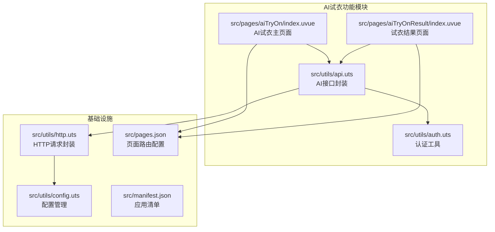
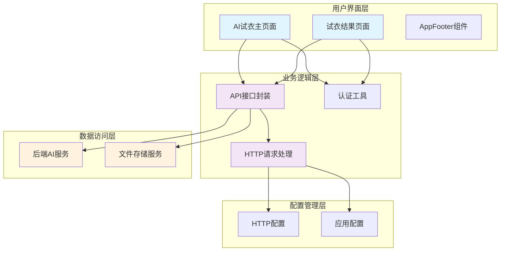
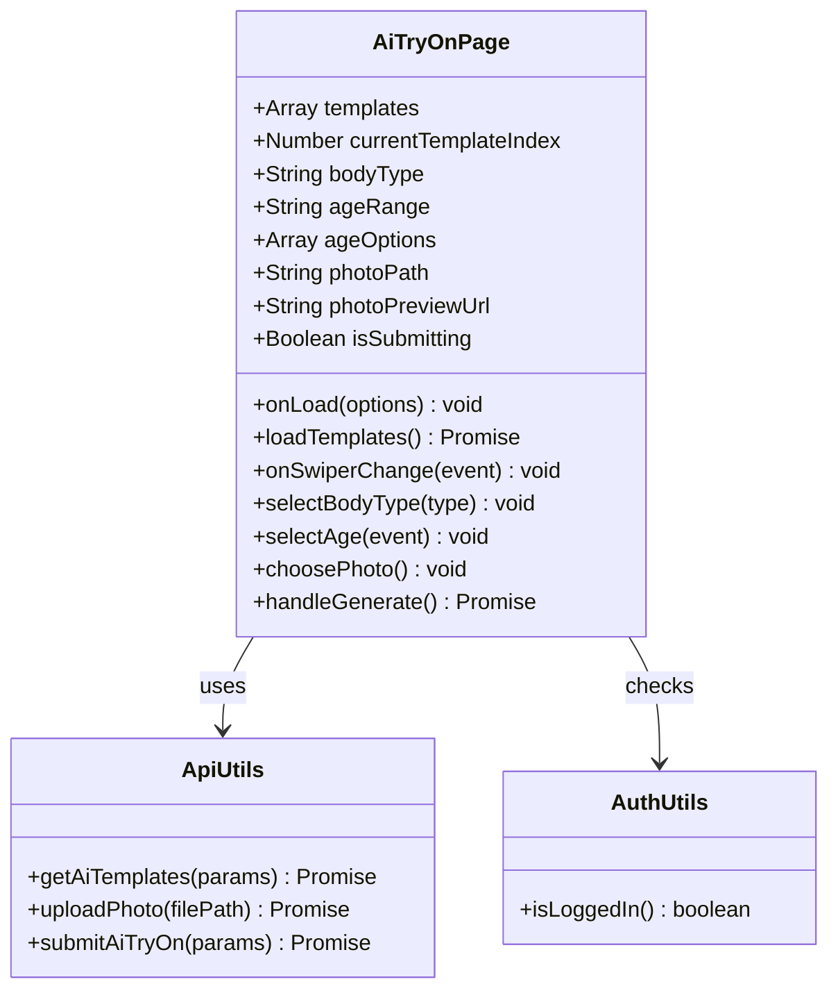
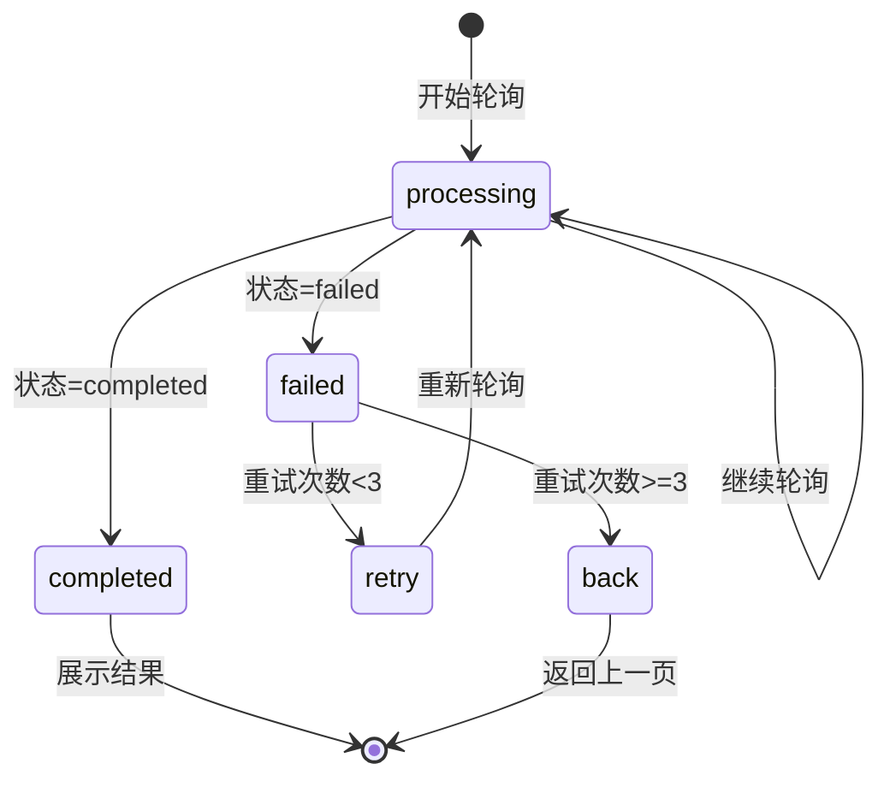
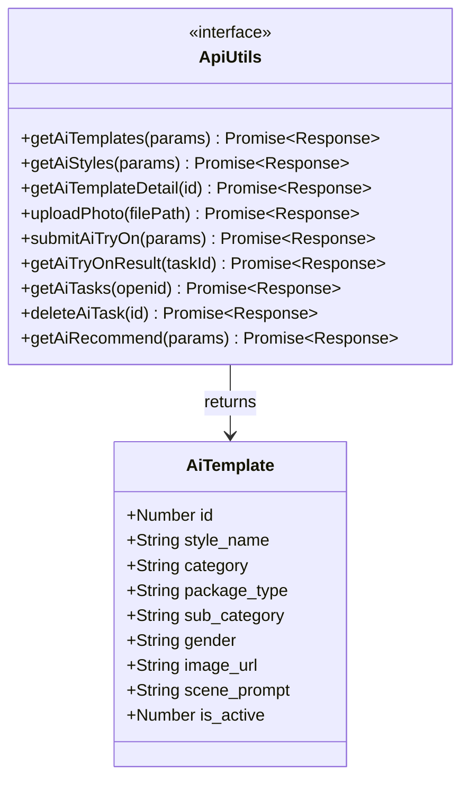
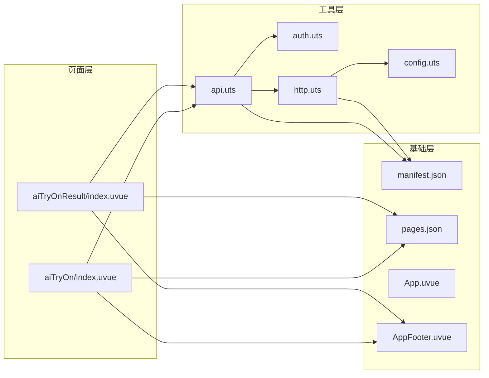

# AI试衣功能

<cite>
**本文档引用的文件**
- [src/pages/aiTryOn/index.uvue](file://src/pages/aiTryOn/index.uvue)
- [src/pages/aiTryOnResult/index.uvue](file://src/pages/aiTryOnResult/index.uvue)
- [src/utils/api.uts](file://src/utils/api.uts)
- [src/utils/auth.uts](file://src/utils/auth.uts)
- [src/utils/http.uts](file://src/utils/http.uts)
- [src/utils/config.uts](file://src/utils/config.uts)
- [src/pages.json](file://src/pages.json)
- [src/manifest.json](file://src/manifest.json)
- [src/App.uvue](file://src/App.uvue)
- [src/components/AppFooter/AppFooter.uvue](file://src/components/AppFooter/AppFooter.uvue)
- [package.json](file://package.json)
</cite>

## 目录
1. [简介](#简介)
2. [项目结构](#项目结构)
3. [核心组件](#核心组件)
4. [架构概览](#架构概览)
5. [详细组件分析](#详细组件分析)
6. [依赖关系分析](#依赖关系分析)
7. [性能考虑](#性能考虑)
8. [故障排除指南](#故障排除指南)
9. [结论](#结论)

## 简介

AI试衣功能是基于uni-app x框架开发的微信小程序特色功能，允许用户上传自己的照片，选择不同的服饰模板进行虚拟试穿，生成AI生成的试穿效果图片。该功能集成了完整的用户认证系统、图片上传处理、AI任务调度和结果轮询机制。

## 项目结构

该项目采用uni-app x架构，使用Vue 3 + TypeScript/UTS混合开发模式。AI试衣功能主要涉及以下核心文件：



**图表来源**
- [src/pages/aiTryOn/index.uvue:1-442](file://src/pages/aiTryOn/index.uvue#L1-L442)
- [src/pages/aiTryOnResult/index.uvue:1-386](file://src/pages/aiTryOnResult/index.uvue#L1-L386)
- [src/utils/api.uts:1-503](file://src/utils/api.uts#L1-L503)

**章节来源**
- [src/pages/aiTryOn/index.uvue:1-442](file://src/pages/aiTryOn/index.uvue#L1-L442)
- [src/pages/aiTryOnResult/index.uvue:1-386](file://src/pages/aiTryOnResult/index.uvue#L1-L386)
- [src/utils/api.uts:1-503](file://src/utils/api.uts#L1-L503)

## 核心组件

AI试衣功能由两个主要页面和一系列工具模块组成：

### 主要页面组件

1. **AI试衣主页面** (`src/pages/aiTryOn/index.uvue`)
   - 模板轮播展示
   - 用户参数选择（体型、年龄）
   - 照片上传功能
   - 生成按钮控制

2. **试衣结果页面** (`src/pages/aiTryOnResult/index.uvue`)
   - 任务状态轮询
   - 结果图片展示
   - 保存到相册功能
   - 错误处理机制

### 工具模块

1. **API封装** (`src/utils/api.uts`)
   - AI模板获取
   - 照片上传处理
   - 任务提交和查询
   - 历史记录管理

2. **认证管理** (`src/utils/auth.uts`)
   - Token管理
   - 用户信息存储
   - 登录状态检查

3. **HTTP请求** (`src/utils/http.uts`)
   - 统一请求处理
   - 自动认证头添加
   - 错误处理机制

**章节来源**
- [src/pages/aiTryOn/index.uvue:93-242](file://src/pages/aiTryOn/index.uvue#L93-L242)
- [src/pages/aiTryOnResult/index.uvue:57-231](file://src/pages/aiTryOnResult/index.uvue#L57-L231)
- [src/utils/api.uts:314-503](file://src/utils/api.uts#L314-L503)

## 架构概览

AI试衣功能采用分层架构设计，确保功能模块的清晰分离和可维护性：



**图表来源**
- [src/pages/aiTryOn/index.uvue:94-95](file://src/pages/aiTryOn/index.uvue#L94-L95)
- [src/pages/aiTryOnResult/index.uvue:58](file://src/pages/aiTryOnResult/index.uvue#L58)
- [src/utils/api.uts:1-5](file://src/utils/api.uts#L1-L5)

## 详细组件分析

### AI试衣主页面组件分析

AI试衣主页面实现了完整的用户交互流程，包括模板选择、参数配置和任务提交。



**图表来源**
- [src/pages/aiTryOn/index.uvue:97-241](file://src/pages/aiTryOn/index.uvue#L97-L241)
- [src/utils/api.uts:332-428](file://src/utils/api.uts#L332-L428)
- [src/utils/auth.uts:125-128](file://src/utils/auth.uts#L125-L128)

#### 核心功能流程

1. **模板加载流程**
   ```mermaid
sequenceDiagram
participant User as 用户
participant Page as AI试衣页面
participant API as API封装
participant Server as 后端服务器
User->>Page : 打开页面
Page->>API : getAiTemplates(params)
API->>Server : GET /api/aiface/templates
Server-->>API : 模板列表数据
API-->>Page : 返回模板数组
Page->>Page : 渲染模板轮播
```

2. **任务提交流程**
   ```mermaid
sequenceDiagram
participant User as 用户
participant Page as AI试衣页面
participant Auth as 认证工具
participant Upload as 照片上传
participant Task as 任务提交
participant Server as 后端服务器
participant Result as 结果页面
User->>Page : 点击生成按钮
Page->>Auth : 检查登录状态
Auth-->>Page : 已登录
Page->>Upload : 上传照片
Upload->>Server : POST /api/aiface/upload
Server-->>Upload : 返回文件名
Upload-->>Page : 文件名
Page->>Task : 提交AI试衣任务
Task->>Server : POST /api/aiface/tasks
Server-->>Task : 返回任务ID
Task-->>Page : 任务ID
Page->>Result : 跳转到结果页面
```

**章节来源**
- [src/pages/aiTryOn/index.uvue:128-239](file://src/pages/aiTryOn/index.uvue#L128-L239)
- [src/utils/api.uts:387-428](file://src/utils/api.uts#L387-L428)

### 试衣结果页面组件分析

试衣结果页面负责处理AI生成任务的状态轮询和结果展示。



**图表来源**
- [src/pages/aiTryOnResult/index.uvue:60-141](file://src/pages/aiTryOnResult/index.uvue#L60-L141)

#### 轮询机制分析

试衣结果页面实现了智能的任务状态轮询机制：

1. **定时器管理**
   - 3秒间隔轮询任务状态
   - 60秒超时保护机制
   - 页面卸载时自动清理定时器

2. **状态处理逻辑**
   - `pending`/`processing`: 继续轮询
   - `completed`: 显示结果图片
   - `failed`: 显示错误状态

3. **图片处理流程**
   ```mermaid
flowchart TD
Start([开始保存]) --> CheckURL{"结果URL是否为HTTP?"}
CheckURL --> |是| Download[下载网络图片]
CheckURL --> |否| SaveDirect[直接保存]
Download --> Save[保存到相册]
SaveDirect --> Save
Save --> Success[保存成功]
Save --> Permission{权限检查}
Permission --> |需要授权| OpenSetting[打开设置]
Permission --> |权限拒绝| ShowError[显示错误]
OpenSetting --> End([结束])
ShowError --> End
Success --> End
```

**章节来源**
- [src/pages/aiTryOnResult/index.uvue:84-229](file://src/pages/aiTryOnResult/index.uvue#L84-L229)

### API接口封装分析

AI试衣功能的API封装提供了完整的后端接口调用能力：



**图表来源**
- [src/utils/api.uts:316-326](file://src/utils/api.uts#L316-L326)
- [src/utils/api.uts:332-458](file://src/utils/api.uts#L332-L458)

#### 接口类型定义

AI试衣功能使用了专门的数据模型定义：

1. **AI模板接口** (`AiTemplate`)
   - 模板基本信息（ID、名称、分类）
   - 图片URL和场景描述
   - 性别和激活状态

2. **任务状态接口**
   - 任务ID和用户信息
   - 状态枚举（pending/processing/completed/failed）
   - 结果图片URL和错误信息

**章节来源**
- [src/utils/api.uts:316-458](file://src/utils/api.uts#L316-L458)

## 依赖关系分析

AI试衣功能的依赖关系体现了清晰的分层架构：



**图表来源**
- [src/pages/aiTryOn/index.uvue:94-95](file://src/pages/aiTryOn/index.uvue#L94-L95)
- [src/pages/aiTryOnResult/index.uvue:58](file://src/pages/aiTryOnResult/index.uvue#L58)
- [src/utils/api.uts:1-5](file://src/utils/api.uts#L1-L5)

### 关键依赖关系

1. **页面到工具的依赖**
   - AI试衣页面依赖API封装进行数据操作
   - 结果页面依赖API封装进行状态查询
   - 两者都依赖认证工具进行用户状态检查

2. **工具层内部依赖**
   - API封装依赖HTTP请求处理和认证工具
   - HTTP请求处理依赖配置管理和认证工具
   - 配置管理提供统一的环境配置

3. **配置依赖**
   - 页面路由配置定义页面访问路径
   - 应用清单配置应用基本信息
   - 组件依赖全局页脚组件

**章节来源**
- [src/pages.json:56-66](file://src/pages.json#L56-L66)
- [src/manifest.json:1-73](file://src/manifest.json#L1-L73)

## 性能考虑

AI试衣功能在性能方面采用了多项优化策略：

### 1. 图片处理优化
- 照片上传前进行大小限制（10MB）
- 使用压缩格式减少传输体积
- 结果图片懒加载，提升首屏性能

### 2. 网络请求优化
- 统一的请求头管理，包含认证信息
- 自动超时处理和错误重试机制
- 轮询间隔合理设置（3秒），避免过度请求

### 3. 内存管理
- 页面卸载时自动清理定时器
- 及时释放图片资源
- 避免内存泄漏

### 4. 用户体验优化
- 加载状态反馈
- 错误处理和重试机制
- 本地缓存用户选择的参数

## 故障排除指南

### 常见问题及解决方案

#### 1. 登录状态问题
**症状**: 无法提交AI试衣任务
**原因**: 用户未登录或Token过期
**解决方法**: 
- 检查登录状态：`isLoggedIn()`
- 重新登录获取新的Token
- 检查Token存储是否正常

#### 2. 照片上传失败
**症状**: 照片上传后无法继续
**原因**: 文件大小超限或格式不支持
**解决方法**:
- 检查文件大小是否超过10MB限制
- 确认图片格式为支持的格式
- 重新选择照片进行上传

#### 3. 任务状态轮询失败
**症状**: 结果页面长时间显示加载状态
**原因**: 网络连接问题或服务器异常
**解决方法**:
- 检查网络连接状态
- 等待一段时间后重试
- 查看服务器状态和API响应

#### 4. 图片保存失败
**症状**: 保存到相册时出现权限错误
**解决方法**:
- 引导用户授权相册访问权限
- 打开系统设置手动开启权限
- 检查iOS/Android系统版本兼容性

**章节来源**
- [src/pages/aiTryOn/index.uvue:176-239](file://src/pages/aiTryOn/index.uvue#L176-L239)
- [src/pages/aiTryOnResult/index.uvue:159-223](file://src/pages/aiTryOnResult/index.uvue#L159-L223)

## 结论

AI试衣功能展现了现代小程序开发的最佳实践，具有以下特点：

### 技术优势
1. **架构清晰**: 分层设计确保了代码的可维护性和可扩展性
2. **用户体验**: 完整的加载状态反馈和错误处理机制
3. **性能优化**: 合理的资源管理和网络请求策略
4. **安全性**: 完善的认证和授权机制

### 功能完整性
- 支持多种服饰模板选择
- 用户友好的参数配置界面
- 实时的任务状态轮询
- 结果图片的便捷保存功能

### 可扩展性
该架构为未来的功能扩展提供了良好的基础，可以轻松添加新的AI服务、改进用户界面或增加更多个性化功能。

通过合理的组件划分和清晰的依赖关系，AI试衣功能不仅满足了当前的业务需求，也为后续的功能演进奠定了坚实的技术基础。