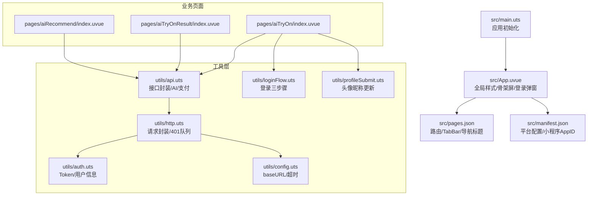
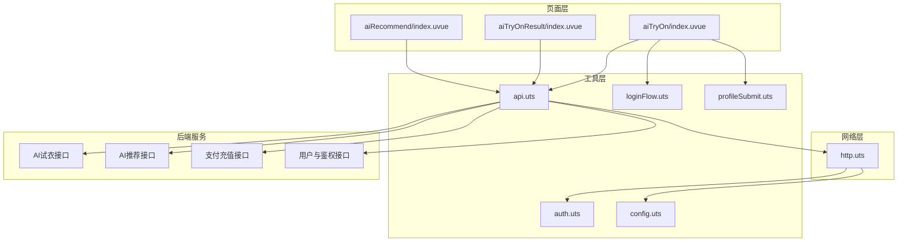
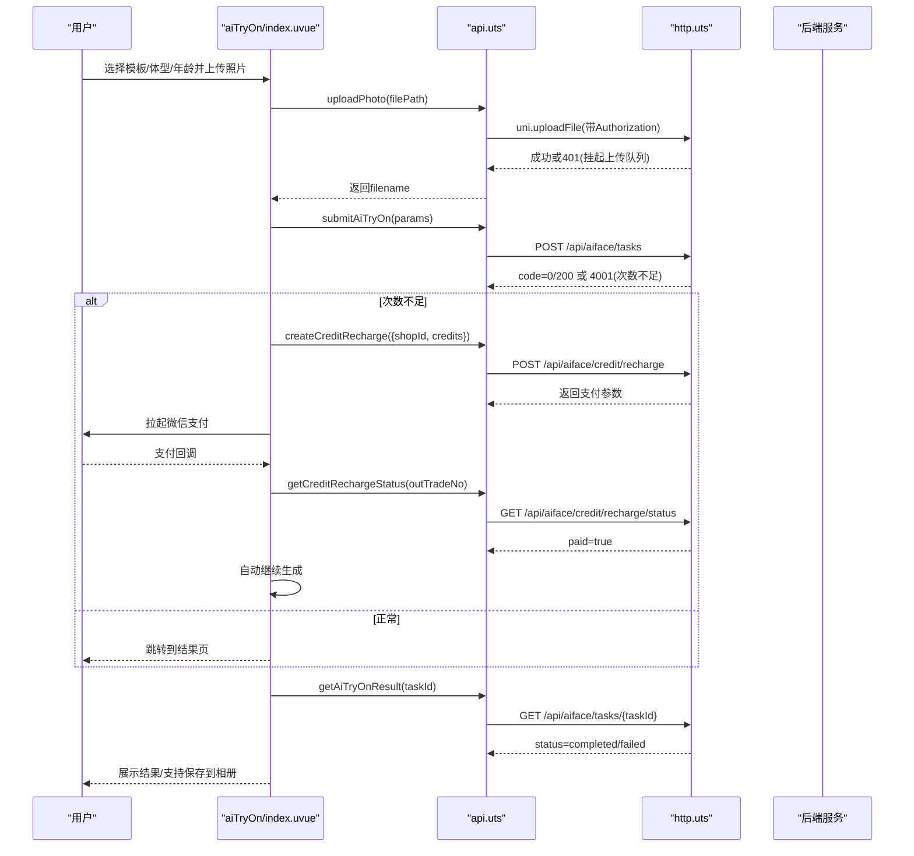
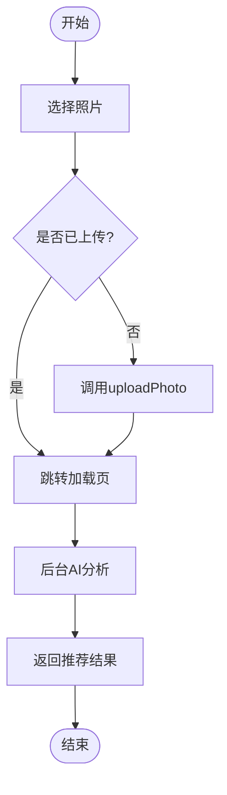
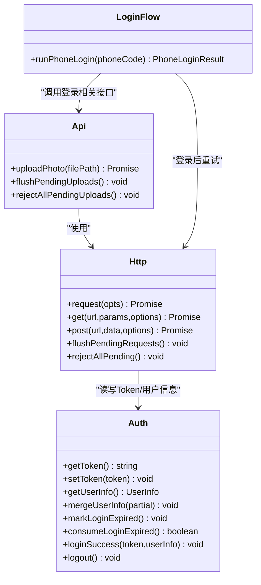
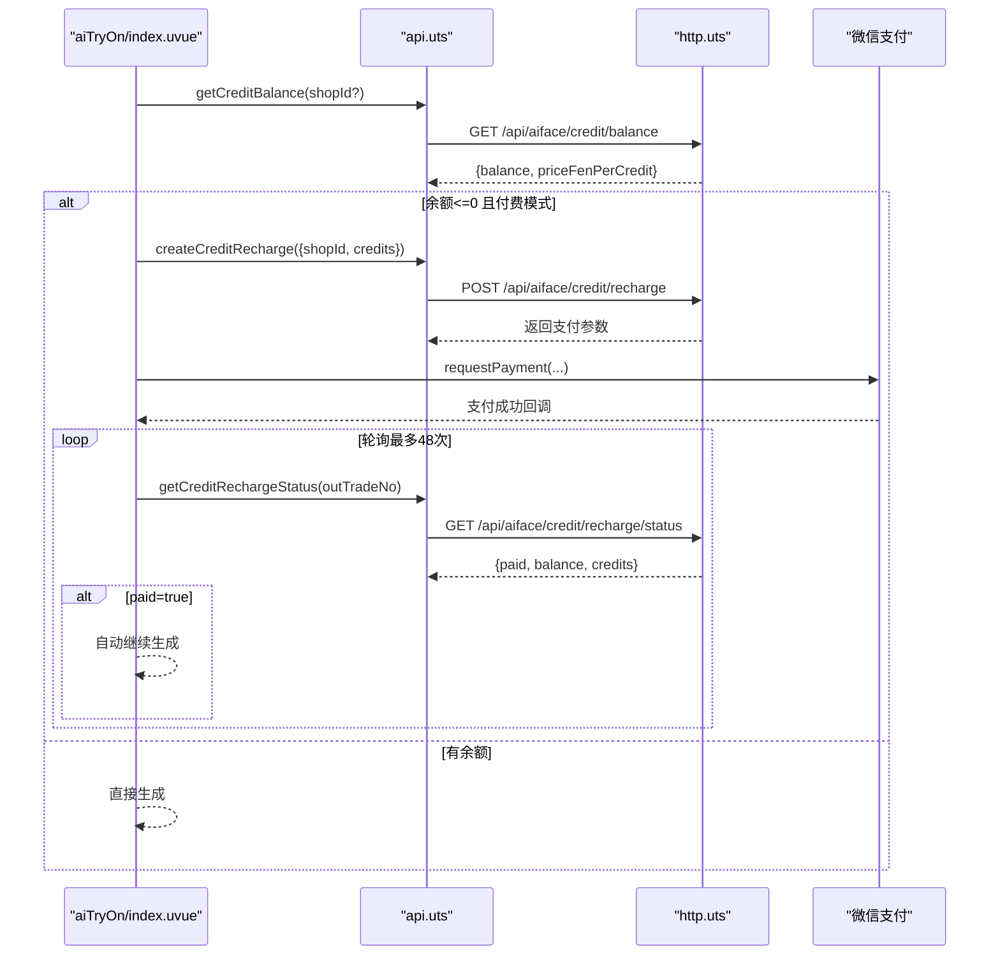
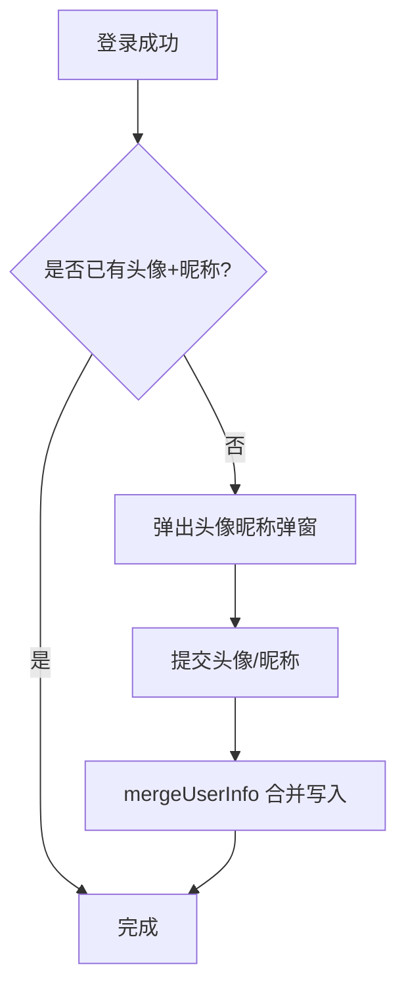
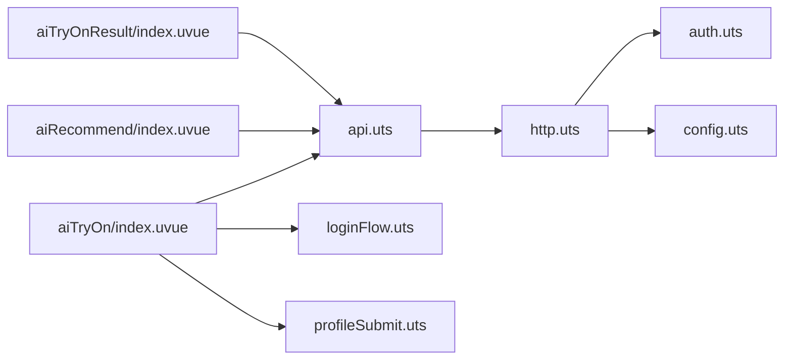

# AI试衣支付系统

<cite>
**本文引用的文件**   
- [README.md](file://README.md)
- [package.json](file://package.json)
- [src/main.uts](file://src/main.uts)
- [src/App.uvue](file://src/App.uvue)
- [src/pages.json](file://src/pages.json)
- [src/manifest.json](file://src/manifest.json)
- [src/utils/api.uts](file://src/utils/api.uts)
- [src/utils/auth.uts](file://src/utils/auth.uts)
- [src/utils/config.uts](file://src/utils/config.uts)
- [src/utils/http.uts](file://src/utils/http.uts)
- [src/utils/loginFlow.uts](file://src/utils/loginFlow.uts)
- [src/utils/profileSubmit.uts](file://src/utils/profileSubmit.uts)
- [src/pages/aiTryOn/index.uvue](file://src/pages/aiTryOn/index.uvue)
- [src/pages/aiTryOnResult/index.uvue](file://src/pages/aiTryOnResult/index.uvue)
- [src/pages/aiRecommend/index.uvue](file://src/pages/aiRecommend/index.uvue)
- [profiles/blueberry/project.env](file://profiles/blueberry/project.env)
</cite>

## 目录
1. [简介](#简介)
2. [项目结构](#项目结构)
3. [核心组件](#核心组件)
4. [架构总览](#架构总览)
5. [详细组件分析](#详细组件分析)
6. [依赖关系分析](#依赖关系分析)
7. [性能与可靠性](#性能与可靠性)
8. [故障排查指南](#故障排查指南)
9. [结论](#结论)
10. [附录](#附录)

## 简介
本系统为基于 uni-app x（Vue 3 + UTS/TypeScript）的微信小程序模板，聚焦“AI试衣”与“AI智能推荐”，并内置完整的微信登录、授权、合规页面以及多项目 Profile 机制。核心能力包括：
- AI试衣：上传照片 → 选择模板/体型/年龄 → 创建任务 → 轮询结果 → 保存相册
- AI推荐：上传照片 → 提交分析 → 返回风格建议与模板
- 支付充值：查询余额 → 下单拉起微信支付 → 轮询到账 → 自动继续生成
- 统一鉴权：401 挂起请求队列、登录后重试、弹窗引导登录与完善资料

## 项目结构
- 源码位于 src/，包含应用入口、页面、组件与工具模块
- 构建产物由 Vite + uni-cli 生成到 dist/，小程序目标平台为 mp-weixin
- 多项目通过 profiles/<project-key>/project.env 管理差异化配置（AppID、域名、文案等）
- 脚本提供一键孵化、同步模板、应用配置、构建与校验

**图表来源** 
- [src/main.uts:1-9](file://src/main.uts#L1-L9)
- [src/App.uvue:1-335](file://src/App.uvue#L1-L335)
- [src/pages.json:1-126](file://src/pages.json#L1-L126)
- [src/manifest.json:1-73](file://src/manifest.json#L1-L73)
- [src/utils/api.uts:1-700](file://src/utils/api.uts#L1-L700)
- [src/utils/http.uts:1-172](file://src/utils/http.uts#L1-L172)
- [src/utils/auth.uts:1-171](file://src/utils/auth.uts#L1-L171)
- [src/utils/config.uts:1-13](file://src/utils/config.uts#L1-L13)
- [src/utils/loginFlow.uts:1-75](file://src/utils/loginFlow.uts#L1-L75)
- [src/utils/profileSubmit.uts:1-37](file://src/utils/profileSubmit.uts#L1-L37)

**章节来源**
- [README.md:85-130](file://README.md#L85-L130)
- [package.json:1-48](file://package.json#L1-L48)

## 核心组件
- 应用入口与全局
  - main.uts：创建 Vue SSR 应用实例
  - App.uvue：生命周期、骨架屏样式、登录弹窗样式
- 路由与清单
  - pages.json：页面路由、TabBar、导航栏标题
  - manifest.json：平台配置、小程序 AppID
- 工具层
  - api.uts：所有后端接口封装（客片、AI试衣、AI推荐、支付充值、收藏点赞等）
  - http.uts：统一 request/get/post，自动注入 Authorization/X-App-Code，401 挂起队列与重试
  - auth.uts：Token/用户信息管理、登录过期标志、登录成功/登出
  - config.uts：API baseURL 与超时
  - loginFlow.uts：手机号登录三步骤封装
  - profileSubmit.uts：头像昵称更新封装

**章节来源**
- [src/main.uts:1-9](file://src/main.uts#L1-L9)
- [src/App.uvue:1-335](file://src/App.uvue#L1-L335)
- [src/pages.json:1-126](file://src/pages.json#L1-L126)
- [src/manifest.json:1-73](file://src/manifest.json#L1-L73)
- [src/utils/api.uts:1-700](file://src/utils/api.uts#L1-L700)
- [src/utils/http.uts:1-172](file://src/utils/http.uts#L1-L172)
- [src/utils/auth.uts:1-171](file://src/utils/auth.uts#L1-L171)
- [src/utils/config.uts:1-13](file://src/utils/config.uts#L1-L13)
- [src/utils/loginFlow.uts:1-75](file://src/utils/loginFlow.uts#L1-L75)
- [src/utils/profileSubmit.uts:1-37](file://src/utils/profileSubmit.uts#L1-L37)

## 架构总览
系统采用“页面层 + 工具层 + 网络层 + 后端服务”的分层架构。页面负责交互与状态；工具层封装业务接口；网络层处理鉴权、错误与重试；后端提供 AI 试衣、推荐与支付能力。

**图表来源** 
- [src/pages/aiTryOn/index.uvue:1-935](file://src/pages/aiTryOn/index.uvue#L1-L935)
- [src/pages/aiTryOnResult/index.uvue:1-383](file://src/pages/aiTryOnResult/index.uvue#L1-L383)
- [src/pages/aiRecommend/index.uvue:1-452](file://src/pages/aiRecommend/index.uvue#L1-L452)
- [src/utils/api.uts:1-700](file://src/utils/api.uts#L1-L700)
- [src/utils/http.uts:1-172](file://src/utils/http.uts#L1-L172)
- [src/utils/auth.uts:1-171](file://src/utils/auth.uts#L1-L171)
- [src/utils/config.uts:1-13](file://src/utils/config.uts#L1-L13)
- [src/utils/loginFlow.uts:1-75](file://src/utils/loginFlow.uts#L1-L75)
- [src/utils/profileSubmit.uts:1-37](file://src/utils/profileSubmit.uts#L1-L37)

## 详细组件分析

### 组件A：AI试衣流程（上传→创建任务→轮询→保存）
- 关键交互
  - 选择模板、体型、年龄，上传照片
  - 调用 uploadPhoto 上传图片，失败则提示重试
  - 提交 submitAiTryOn 创建任务，成功后跳转结果页
  - 结果页轮询 getAiTryOnResult，完成后可保存到相册
- 支付联动
  - 若付费模式且余额不足，直接拉起 createCreditRecharge 下单
  - 支付成功后轮询 getCreditRechargeStatus，确认到账后自动继续生成

**图表来源** 
- [src/pages/aiTryOn/index.uvue:1-935](file://src/pages/aiTryOn/index.uvue#L1-L935)
- [src/pages/aiTryOnResult/index.uvue:1-383](file://src/pages/aiTryOnResult/index.uvue#L1-L383)
- [src/utils/api.uts:370-700](file://src/utils/api.uts#L370-L700)
- [src/utils/http.uts:1-172](file://src/utils/http.uts#L1-L172)

**章节来源**
- [src/pages/aiTryOn/index.uvue:1-935](file://src/pages/aiTryOn/index.uvue#L1-L935)
- [src/pages/aiTryOnResult/index.uvue:1-383](file://src/pages/aiTryOnResult/index.uvue#L1-L383)
- [src/utils/api.uts:370-700](file://src/utils/api.uts#L370-L700)

### 组件B：AI智能推荐（上传→分析→结果）
- 上传照片后进入加载页，后台进行AI分析
- 完成后返回推荐风格、理由、评分与模板列表

**图表来源** 
- [src/pages/aiRecommend/index.uvue:1-452](file://src/pages/aiRecommend/index.uvue#L1-L452)
- [src/utils/api.uts:653-700](file://src/utils/api.uts#L653-L700)

**章节来源**
- [src/pages/aiRecommend/index.uvue:1-452](file://src/pages/aiRecommend/index.uvue#L1-L452)
- [src/utils/api.uts:653-700](file://src/utils/api.uts#L653-L700)

### 组件C：鉴权与401处理（登录弹窗+挂起队列）
- http.uts 在 401 时清空本地态、标记过期、将请求入队，触发登录弹窗
- loginFlow.uts 执行三步登录：wx.login → wxLogin → wxBindPhone，成功后 flushPendingRequests/flushPendingUploads
- 页面 onShow 消费 consumeLoginExpired，兜底再次弹出登录弹窗

**图表来源** 
- [src/utils/http.uts:1-172](file://src/utils/http.uts#L1-L172)
- [src/utils/auth.uts:1-171](file://src/utils/auth.uts#L1-L171)
- [src/utils/api.uts:1-120](file://src/utils/api.uts#L1-L120)
- [src/utils/loginFlow.uts:1-75](file://src/utils/loginFlow.uts#L1-L75)

**章节来源**
- [src/utils/http.uts:1-172](file://src/utils/http.uts#L1-L172)
- [src/utils/auth.uts:1-171](file://src/utils/auth.uts#L1-L171)
- [src/utils/api.uts:1-120](file://src/utils/api.uts#L1-L120)
- [src/utils/loginFlow.uts:1-75](file://src/utils/loginFlow.uts#L1-L75)

### 组件D：支付充值流程（下单→支付→轮询到账）
- 查询余额 getCreditBalance，若 priceFenPerCredit > 0 则为付费模式
- 创建订单 createCreditRecharge，拉起微信支付
- 轮询 getCreditRechargeStatus，paid=true 即到账，自动恢复生成

**图表来源** 
- [src/pages/aiTryOn/index.uvue:438-543](file://src/pages/aiTryOn/index.uvue#L438-L543)
- [src/utils/api.uts:563-651](file://src/utils/api.uts#L563-L651)

**章节来源**
- [src/pages/aiTryOn/index.uvue:438-543](file://src/pages/aiTryOn/index.uvue#L438-L543)
- [src/utils/api.uts:563-651](file://src/utils/api.uts#L563-L651)

### 组件E：个人资料完善（头像/昵称）
- 登录后若缺少头像或昵称，弹出授权弹窗
- 用户选择头像/输入昵称后，调用 profileSubmit.uts 提交并合并写入本地

**图表来源** 
- [src/pages/aiTryOn/index.uvue:633-693](file://src/pages/aiTryOn/index.uvue#L633-L693)
- [src/utils/profileSubmit.uts:1-37](file://src/utils/profileSubmit.uts#L1-L37)
- [src/utils/auth.uts:92-106](file://src/utils/auth.uts#L92-L106)

**章节来源**
- [src/pages/aiTryOn/index.uvue:633-693](file://src/pages/aiTryOn/index.uvue#L633-L693)
- [src/utils/profileSubmit.uts:1-37](file://src/utils/profileSubmit.uts#L1-L37)
- [src/utils/auth.uts:92-106](file://src/utils/auth.uts#L92-L106)

## 依赖关系分析
- 页面依赖工具层：aiTryOn/aiTryOnResult/aiRecommend 均依赖 api.uts
- 工具层依赖网络层：api.uts 通过 http.uts 发起请求
- 网络层依赖认证与配置：http.uts 读取 auth.uts 的 Token 与 config.uts 的 baseURL
- 登录流程串联：loginFlow.uts 调用 api.uts 的登录接口，并在成功后刷新挂起队列

**图表来源** 
- [src/pages/aiTryOn/index.uvue:1-935](file://src/pages/aiTryOn/index.uvue#L1-L935)
- [src/pages/aiTryOnResult/index.uvue:1-383](file://src/pages/aiTryOnResult/index.uvue#L1-L383)
- [src/pages/aiRecommend/index.uvue:1-452](file://src/pages/aiRecommend/index.uvue#L1-L452)
- [src/utils/api.uts:1-700](file://src/utils/api.uts#L1-L700)
- [src/utils/http.uts:1-172](file://src/utils/http.uts#L1-L172)
- [src/utils/auth.uts:1-171](file://src/utils/auth.uts#L1-L171)
- [src/utils/config.uts:1-13](file://src/utils/config.uts#L1-L13)
- [src/utils/loginFlow.uts:1-75](file://src/utils/loginFlow.uts#L1-L75)
- [src/utils/profileSubmit.uts:1-37](file://src/utils/profileSubmit.uts#L1-L37)

**章节来源**
- [src/utils/api.uts:1-700](file://src/utils/api.uts#L1-L700)
- [src/utils/http.uts:1-172](file://src/utils/http.uts#L1-L172)
- [src/utils/auth.uts:1-171](file://src/utils/auth.uts#L1-L171)
- [src/utils/config.uts:1-13](file://src/utils/config.uts#L1-L13)
- [src/utils/loginFlow.uts:1-75](file://src/utils/loginFlow.uts#L1-L75)
- [src/utils/profileSubmit.uts:1-37](file://src/utils/profileSubmit.uts#L1-L37)

## 性能与可靠性
- 请求与上传挂起队列：避免并发 401 导致的重复弹窗与死循环，提升用户体验
- 轮询策略：AI结果每20秒轮询一次，最长等待约3分钟；支付到账轮询每2.5秒一次，最多48次
- 资源限制：图片上传限制10MB，减少大文件传输开销
- 骨架屏与动画：统一骨架屏样式，提升首屏感知速度
- 超时配置：默认15秒，可根据网络环境调整

[本节为通用指导，不直接分析具体文件]

## 故障排查指南
- 401 未授权
  - 现象：请求被挂起，弹出登录弹窗
  - 处理：检查 token 是否存在、是否过期；确认 flushPendingRequests/flushPendingUploads 是否被调用
- 上传失败
  - 现象：上传中提示失败
  - 处理：检查文件大小、网络、Authorization 头是否正确
- 支付到账延迟
  - 现象：支付成功但余额未增加
  - 处理：查看轮询状态接口返回，确认 paid 字段；必要时稍后再查
- 登录弹窗重复出现
  - 现象：onShow 多次触发登录弹窗
  - 处理：确保 consumeLoginExpired 正确消费标志位

**章节来源**
- [src/utils/http.uts:12-91](file://src/utils/http.uts#L12-L91)
- [src/utils/api.uts:12-57](file://src/utils/api.uts#L12-L57)
- [src/pages/aiTryOn/index.uvue:248-267](file://src/pages/aiTryOn/index.uvue#L248-L267)
- [src/pages/aiTryOnResult/index.uvue:104-136](file://src/pages/aiTryOnResult/index.uvue#L104-L136)

## 结论
本系统以清晰的模块化设计实现了“AI试衣+AI推荐+支付充值”的完整闭环，结合统一的鉴权与错误处理机制，具备良好的可维护性与可扩展性。通过 Profile 机制，可在同一套源码下快速孵化多个小程序项目，满足产品矩阵化需求。

[本节为总结性内容，不直接分析具体文件]

## 附录
- 多项目配置示例
  - profiles/blueberry/project.env：包含 PROJECT_KEY、PACKAGE_NAME、MANIFEST_NAME、MP_WEIXIN_APPID、NAVIGATION_TITLE、API_BASE_URL、APP_CODE、MINI_APP_NAME 等字段
- 构建与发布
  - npm scripts 提供 dev/build/profile 系列命令
  - 脚本支持同步模板、应用配置、构建与校验

**章节来源**
- [profiles/blueberry/project.env:1-23](file://profiles/blueberry/project.env#L1-L23)
- [package.json:1-48](file://package.json#L1-L48)
- [README.md:242-286](file://README.md#L242-L286)