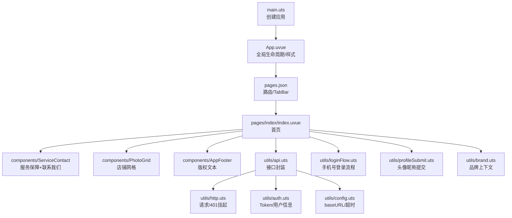
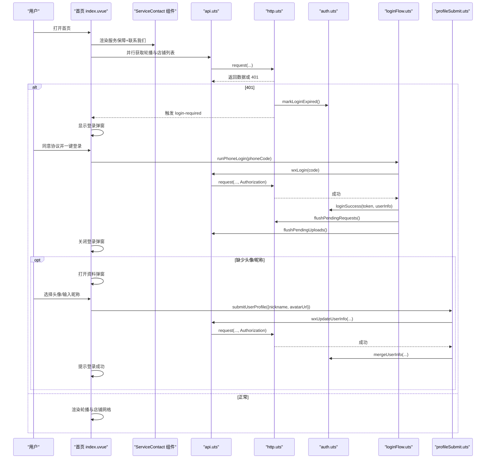
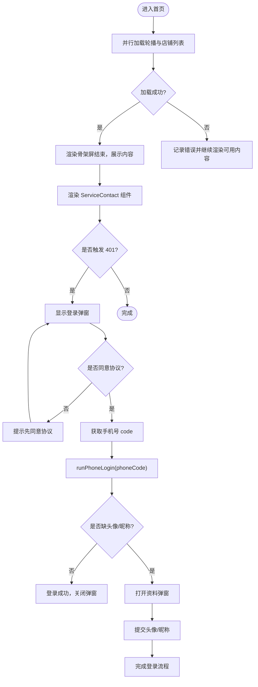
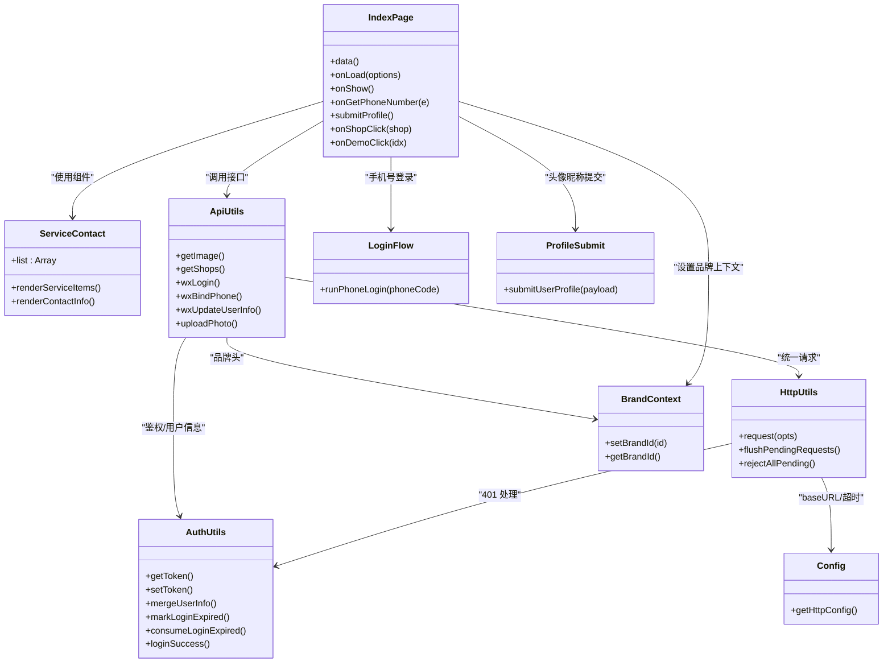

# 主页入口增强

<cite>
**本文引用的文件**   
- [src/pages/index/index.uvue](file://src/pages/index/index.uvue)
- [src/components/ServiceContact/ServiceContact.uvue](file://src/components/ServiceContact/ServiceContact.uvue)
- [src/App.uvue](file://src/App.uvue)
- [src/main.uts](file://src/main.uts)
- [src/pages.json](file://src/pages.json)
- [src/components/PhotoGrid/PhotoGrid.uvue](file://src/components/PhotoGrid/PhotoGrid.uvue)
- [src/components/AppFooter/AppFooter.uvue](file://src/components/AppFooter/AppFooter.uvue)
- [src/utils/api.uts](file://src/utils/api.uts)
- [src/utils/http.uts](file://src/utils/http.uts)
- [src/utils/auth.uts](file://src/utils/auth.uts)
- [src/utils/loginFlow.uts](file://src/utils/loginFlow.uts)
- [src/utils/profileSubmit.uts](file://src/utils/profileSubmit.uts)
- [src/utils/config.uts](file://src/utils/config.uts)
- [src/utils/brand.uts](file://src/utils/brand.uts)
- [README.md](file://README.md)
</cite>

## 更新摘要
**变更内容**   
- 新增 ServiceContact 组件章节，详细说明服务保障和联系我们区块的组件化重构
- 更新首页架构总览图，反映 ServiceContact 组件的集成
- 修改详细组件分析部分，说明内联代码的移除和组件化的优势
- 更新依赖关系分析，体现新组件的引入

## 目录
1. [引言](#引言)
2. [项目结构](#项目结构)
3. [核心组件](#核心组件)
4. [架构总览](#架构总览)
5. [详细组件分析](#详细组件分析)
6. [依赖关系分析](#依赖关系分析)
7. [性能与体验优化建议](#性能与体验优化建议)
8. [故障排查指南](#故障排查指南)
9. [结论](#结论)

## 引言
本文件聚焦"主页入口增强"，围绕小程序首页（pages/index/index）的加载、轮播展示、店铺网格、登录授权弹窗、头像昵称补齐流程，以及与后端接口、请求拦截、品牌上下文等模块的协作进行系统化说明。**最新更新**：通过引入 ServiceContact 组件对"服务保障 + 联系我们"区块进行组件化重构，替代了约40行内联代码和34行冗余CSS样式，显著提升了代码的可维护性和复用性。文档同时给出架构图、时序图与流程图，帮助读者快速理解数据流与控制流，并提供可操作的优化与排障建议。

## 项目结构
- 应用入口：main.uts 创建 Vue 应用实例；App.uvue 定义全局生命周期与样式骨架屏、登录弹窗样式。
- 路由与导航：pages.json 定义页面路由、全局导航栏样式与 TabBar（首页、价目表、我的）。
- 首页：pages/index/index.uvue 承载轮播、客片网格、服务说明、联系方式、底部版权、登录与资料完善弹窗。
- **新增组件**：ServiceContact 统一封装"服务保障 + 联系我们"区块，提供复用的UI组件。
- 通用组件：PhotoGrid 统一店铺卡片网格渲染；AppFooter 提供版权文案。
- 工具层：api.uts 封装所有后端接口；http.uts 统一请求、自动注入鉴权头与品牌头、处理 401 挂起与重试；auth.uts 管理 token 与用户信息；loginFlow.uts 封装手机号登录三步骤；profileSubmit.uts 封装头像昵称更新；config.uts 配置 baseURL 与超时；brand.uts 运行时品牌上下文。

**图表来源**
- [src/main.uts:1-9](file://src/main.uts#L1-L9)
- [src/App.uvue:1-335](file://src/App.uvue#L1-L335)
- [src/pages.json:1-126](file://src/pages.json#L1-L126)
- [src/pages/index/index.uvue:1-522](file://src/pages/index/index.uvue#L1-L522)
- [src/components/ServiceContact/ServiceContact.uvue:1-213](file://src/components/ServiceContact/ServiceContact.uvue#L1-L213)
- [src/components/PhotoGrid/PhotoGrid.uvue:1-119](file://src/components/PhotoGrid/PhotoGrid.uvue#L1-L119)
- [src/components/AppFooter/AppFooter.uvue:1-25](file://src/components/AppFooter/AppFooter.uvue#L1-L25)
- [src/utils/api.uts:1-710](file://src/utils/api.uts#L1-L710)
- [src/utils/http.uts:1-184](file://src/utils/http.uts#L1-L184)
- [src/utils/auth.uts:1-171](file://src/utils/auth.uts#L1-L171)
- [src/utils/loginFlow.uts:1-75](file://src/utils/loginFlow.uts#L1-L75)
- [src/utils/profileSubmit.uts:1-37](file://src/utils/profileSubmit.uts#L1-L37)
- [src/utils/config.uts:1-13](file://src/utils/config.uts#L1-L13)
- [src/utils/brand.uts:1-22](file://src/utils/brand.uts#L1-L22)

章节来源
- [README.md:85-131](file://README.md#L85-L131)
- [src/pages.json:1-126](file://src/pages.json#L1-L126)

## 核心组件
- 首页 index.uvue
  - 骨架屏与主内容切换，提升首屏感知速度。
  - 并行加载轮播与店铺列表，缩短等待时间。
  - 登录弹窗与协议勾选，合规且友好。
  - 头像昵称弹窗，支持选择头像与输入昵称，乐观写入后提交更新。
  - **组件化重构**：使用 ServiceContact 组件替代内联代码，简化模板结构。
  - 转发与分享配置，便于传播。
- **ServiceContact 组件**
  - 统一封装"服务保障 + 联系我们"区块，包含服务保障列表和联系方式展示。
  - 支持二维码长按保存、联系电话显示等功能。
  - 样式完全独立，便于维护和复用。
- PhotoGrid 组件
  - 统一店铺卡片网格布局，单店全宽、多店双列，空数据回退到 demo 图。
  - 通过事件向父组件透传点击行为，解耦跳转逻辑。
- AppFooter 组件
  - 集中版权文案，由 profile 注入脚本替换，避免硬编码。

章节来源
- [src/pages/index/index.uvue:1-522](file://src/pages/index/index.uvue#L1-L522)
- [src/components/ServiceContact/ServiceContact.uvue:1-213](file://src/components/ServiceContact/ServiceContact.uvue#L1-L213)
- [src/components/PhotoGrid/PhotoGrid.uvue:1-119](file://src/components/PhotoGrid/PhotoGrid.uvue#L1-L119)
- [src/components/AppFooter/AppFooter.uvue:1-25](file://src/components/AppFooter/AppFooter.uvue#L1-L25)

## 架构总览
首页作为入口，负责聚合 UI 与交互，调用工具层完成数据获取、鉴权、上传与业务操作。**更新后的架构**通过 ServiceContact 组件实现了更好的关注点分离。关键链路包括：
- 数据加载：并行请求轮播与店铺列表，失败降级并隐藏骨架屏。
- 登录态：http.uts 在 401 时清空状态、标记过期并挂起请求；首页监听 login-required 事件拉起登录弹窗；登录成功后 flush 挂起的请求与上传。
- 品牌上下文：扫码进入首页时设置 brandId，后续请求携带 X-Brand-Id 头。
- 资料完善：手机号登录后若缺头像或昵称，弹出资料弹窗，先乐观写入再提交更新。
- **组件化架构**：ServiceContact 组件提供标准化的服务保障和联系方式展示，支持跨页面复用。

**图表来源**
- [src/pages/index/index.uvue:154-178](file://src/pages/index/index.uvue#L154-L178)
- [src/components/ServiceContact/ServiceContact.uvue:11-63](file://src/components/ServiceContact/ServiceContact.uvue#L11-L63)
- [src/utils/http.uts:135-162](file://src/utils/http.uts#L135-L162)
- [src/utils/auth.uts:121-141](file://src/utils/auth.uts#L121-L141)
- [src/utils/loginFlow.uts:28-74](file://src/utils/loginFlow.uts#L28-L74)
- [src/utils/api.uts:198-259](file://src/utils/api.uts#L198-L259)
- [src/utils/profileSubmit.uts:18-36](file://src/utils/profileSubmit.uts#L18-L36)

## 详细组件分析

### 首页 index.uvue
- 生命周期与数据加载
  - onLoad：解析 scene/brandId 设置品牌上下文；Promise.all 并行拉取轮播与店铺列表；异常捕获并兜底 loading=false。
  - onShow：订阅 login-required 事件，消费 consumeLoginExpired 以兜底其他页面触发 401 后的弹窗。
- **组件化重构**
  - **新增**：使用 `<ServiceContact />` 组件替代原有的内联代码，大幅简化模板结构。
  - **移除**：删除了约40行的内联HTML结构和34行相关的CSS样式代码。
  - **优势**：提升了代码可读性、可维护性和复用性。
- 交互与弹窗
  - 登录弹窗：协议勾选校验；getPhoneNumber 回调走 runPhoneLogin；根据结果决定是否打开资料弹窗。
  - 资料弹窗：chooseAvatar 与 input v-model；submitProfile 先 mergeUserInfo 乐观写入，再调用 submitUserProfile 更新后端。
- 导航与分享
  - onShopClick/onDemoClick 跳转到详情页；onShareAppMessage/onShareTimeline 配置分享标题与路径。

**图表来源**
- [src/pages/index/index.uvue:154-178](file://src/pages/index/index.uvue#L154-L178)
- [src/pages/index/index.uvue:62-63](file://src/pages/index/index.uvue#L62-L63)
- [src/pages/index/index.uvue:233-285](file://src/pages/index/index.uvue#L233-L285)
- [src/pages/index/index.uvue:302-336](file://src/pages/index/index.uvue#L302-L336)
- [src/utils/loginFlow.uts:28-74](file://src/utils/loginFlow.uts#L28-L74)

章节来源
- [src/pages/index/index.uvue:1-522](file://src/pages/index/index.uvue#L1-L522)

### ServiceContact 组件
- **功能特性**
  - 服务保障列表：展示8项服务承诺，每项带有编号和图标。
  - 联系方式展示：包含客服二维码（支持长按保存）、联系电话、商务合作电话。
  - 响应式设计：适配不同屏幕尺寸，保持视觉一致性。
- **技术实现**
  - 纯展示组件：无复杂业务逻辑，专注于UI呈现。
  - 样式独立：所有样式封装在组件内部，不影响外部样式。
  - 资源管理：图片资源通过静态路径引用，便于统一管理。
- **复用价值**
  - 已在首页和价目表页面中使用，避免重复代码。
  - 支持未来扩展：可轻松添加新的服务项目或联系方式。

章节来源
- [src/components/ServiceContact/ServiceContact.uvue:1-213](file://src/components/ServiceContact/ServiceContact.uvue#L1-L213)

### 请求与鉴权 http.uts
- 统一 request：拼接 baseURL、注入 Content-Type、X-App-Code、Authorization（有 token 时）、X-Brand-Id（有品牌上下文时）。
- 401 处理：清空 token 与用户信息、标记登录过期、将当前请求入队挂起；首次 401 触发 login-required 事件，避免重复弹窗。
- 重试机制：flushPendingRequests 用新 token 重发队列中请求；rejectAllPending 用于用户取消登录时拒绝所有挂起请求。

章节来源
- [src/utils/http.uts:99-175](file://src/utils/http.uts#L99-L175)
- [src/utils/http.uts:43-97](file://src/utils/http.uts#L43-L97)

### 认证 auth.uts
- Token 管理：getToken/setToken/clearToken。
- 用户信息管理：getUserInfo/setUserInfo/mergeUserInfo/clearUserInfo。mergeUserInfo 仅覆盖非空字段，避免被 null 覆盖已有值。
- 登录状态：isLoggedIn/markLoginExpired/consumeLoginExpired/loginSuccess/logout。

章节来源
- [src/utils/auth.uts:21-171](file://src/utils/auth.uts#L21-L171)

### 登录流程 loginFlow.uts
- 三步法：uni.login 获取 code → wxLogin 换 token 并保存 → wxBindPhone 绑定手机号并合并用户信息。
- 登录成功后自动 flush 挂起的请求与上传；phone 接口失败不视为整体失败，允许进入资料补齐流程。

章节来源
- [src/utils/loginFlow.uts:28-74](file://src/utils/loginFlow.uts#L28-L74)

### 头像昵称提交 profileSubmit.uts
- 封装 wxUpdateUserInfo 调用，成功后 mergeUserInfo 本地用户信息；异常收敛为 { ok:false }。

章节来源
- [src/utils/profileSubmit.uts:18-36](file://src/utils/profileSubmit.uts#L18-L36)

### 接口封装 api.uts
- 轮播与店铺：getImage/getShops。
- 客片分类与列表：getCategories/getAlbumList。
- 点赞/收藏/搜索：toggleLike/getLikeStatus/toggleFavorite/getFavoriteStatus/searchAlbums。
- AI 试衣：模板、风格、详情、上传、任务创建与查询、历史记录、次数与支付、推荐结果。
- 上传 401 挂起：uploadPhoto 使用独立队列与 flushPendingUploads。

章节来源
- [src/utils/api.uts:96-104](file://src/utils/api.uts#L96-L104)
- [src/utils/api.uts:359-366](file://src/utils/api.uts#L359-L366)
- [src/utils/api.uts:455-492](file://src/utils/api.uts#L455-L492)

### 品牌上下文 brand.uts
- setBrandId/getBrandId：纯内存存储，冷启动即清空；首页 onLoad 解析 scene/brandId 设置品牌上下文，后续请求携带 X-Brand-Id。

章节来源
- [src/utils/brand.uts:12-21](file://src/utils/brand.uts#L12-L21)
- [src/pages/index/index.uvue:156-160](file://src/pages/index/index.uvue#L156-L160)

### 组件 PhotoGrid
- 属性 shopList；事件 shop-click/demo-click；单店全宽、多店双列、空数据回退 demo 图。

章节来源
- [src/components/PhotoGrid/PhotoGrid.uvue:1-119](file://src/components/PhotoGrid/PhotoGrid.uvue#L1-L119)

### 组件 AppFooter
- 默认版权文案可由 profile 注入替换。

章节来源
- [src/components/AppFooter/AppFooter.uvue:1-25](file://src/components/AppFooter/AppFooter.uvue#L1-L25)

## 依赖关系分析
- 首页依赖 utils 层完成数据与鉴权，组件层解耦展示与交互。
- **新增依赖**：首页现在依赖 ServiceContact 组件来展示服务保障和联系方式。
- http.uts 依赖 config.uts 与 auth.uts；api.uts 依赖 http.uts、auth.uts、brand.uts。
- loginFlow.uts 依赖 api.uts 与 auth.uts；profileSubmit.uts 依赖 api.uts 与 auth.uts。
- 品牌上下文 brand.uts 被 http.uts 与 api.uts 读取，首页 onLoad 设置。

**图表来源**
- [src/pages/index/index.uvue:1-522](file://src/pages/index/index.uvue#L1-L522)
- [src/components/ServiceContact/ServiceContact.uvue:1-213](file://src/components/ServiceContact/ServiceContact.uvue#L1-L213)
- [src/utils/api.uts:1-710](file://src/utils/api.uts#L1-L710)
- [src/utils/http.uts:1-184](file://src/utils/http.uts#L1-L184)
- [src/utils/auth.uts:1-171](file://src/utils/auth.uts#L1-L171)
- [src/utils/loginFlow.uts:1-75](file://src/utils/loginFlow.uts#L1-L75)
- [src/utils/profileSubmit.uts:1-37](file://src/utils/profileSubmit.uts#L1-L37)
- [src/utils/brand.uts:1-22](file://src/utils/brand.uts#L1-L22)
- [src/utils/config.uts:1-13](file://src/utils/config.uts#L1-L13)

## 性能与体验优化建议
- 首屏加载
  - 已实现骨架屏与并行请求，建议在图片资源上启用懒加载与 CDN，减少首屏带宽占用。
- 网络与重试
  - 401 挂起与重试机制已完善；可增加指数退避与最大重试次数限制，避免极端情况下的抖动。
- 用户体验
  - 登录弹窗与资料弹窗的交互清晰；可在协议未勾选时增加更明显的视觉反馈。
  - 上传失败时提供更明确的错误提示与重试入口。
  - **组件化优化**：ServiceContact 组件的引入减少了重复代码，提升了页面加载性能。
- 品牌上下文
  - 确保场景值正确传递；对无场景值的冷启动保持向后兼容（不携带 X-Brand-Id）。
- **代码质量**
  - 建议继续推进组件化重构，将更多重复逻辑提取为可复用组件。
  - 定期审查和清理无用代码，保持代码库的整洁性。

[本节为通用建议，不直接分析具体文件]

## 故障排查指南
- 首页数据加载失败
  - 检查 getImage/getShops 返回值与错误日志；确认 baseURL 与网络连通性。
- 登录弹窗反复出现
  - 检查 http.uts 的 401 处理与 consumeLoginExpired 消费逻辑；确认 flushPendingRequests 是否被调用。
- 上传失败或 401
  - 检查 uploadPhoto 的 401 挂起与 flushPendingUploads；确认 Authorization 头是否正确注入。
- 资料更新失败
  - 检查 submitUserProfile 的响应码与错误消息；确认 mergeUserInfo 是否按预期合并字段。
- 品牌头缺失
  - 确认首页 onLoad 是否正确解析 scene/brandId 并调用 setBrandId；检查 http.uts 与 api.uts 是否读取 getBrandId。
- **ServiceContact 组件问题**
  - 检查组件是否正确导入和使用；确认图片资源路径是否正确。
  - 验证服务保障列表数据和联系方式信息的显示是否正常。

章节来源
- [src/utils/http.uts:135-162](file://src/utils/http.uts#L135-L162)
- [src/utils/api.uts:455-492](file://src/utils/api.uts#L455-L492)
- [src/utils/profileSubmit.uts:18-36](file://src/utils/profileSubmit.uts#L18-L36)
- [src/pages/index/index.uvue:156-160](file://src/pages/index/index.uvue#L156-L160)
- [src/components/ServiceContact/ServiceContact.uvue:11-63](file://src/components/ServiceContact/ServiceContact.uvue#L11-L63)

## 结论
主页入口增强围绕首页的数据加载、登录授权与资料完善三大主线展开，借助统一的请求封装、鉴权管理与品牌上下文，实现了稳定、可扩展的入口体验。**最新重构**通过引入 ServiceContact 组件对"服务保障 + 联系我们"区块进行了组件化处理，替代了约40行内联代码和34行冗余CSS样式，显著提升了代码的可维护性和复用性。骨架屏与并行请求提升了首屏感知；401 挂起与重试保障了登录态一致性；资料弹窗与乐观写入改善了用户操作流畅度。组件化重构使得代码结构更加清晰，便于后续维护和扩展。建议持续优化网络与图片资源策略，并完善错误提示与重试机制，进一步提升稳定性与用户体验。