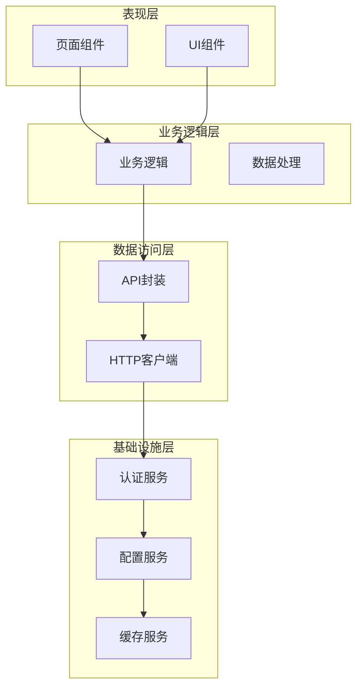
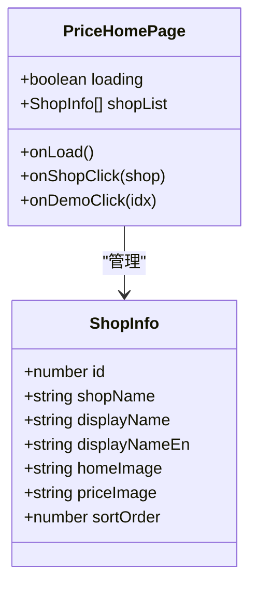
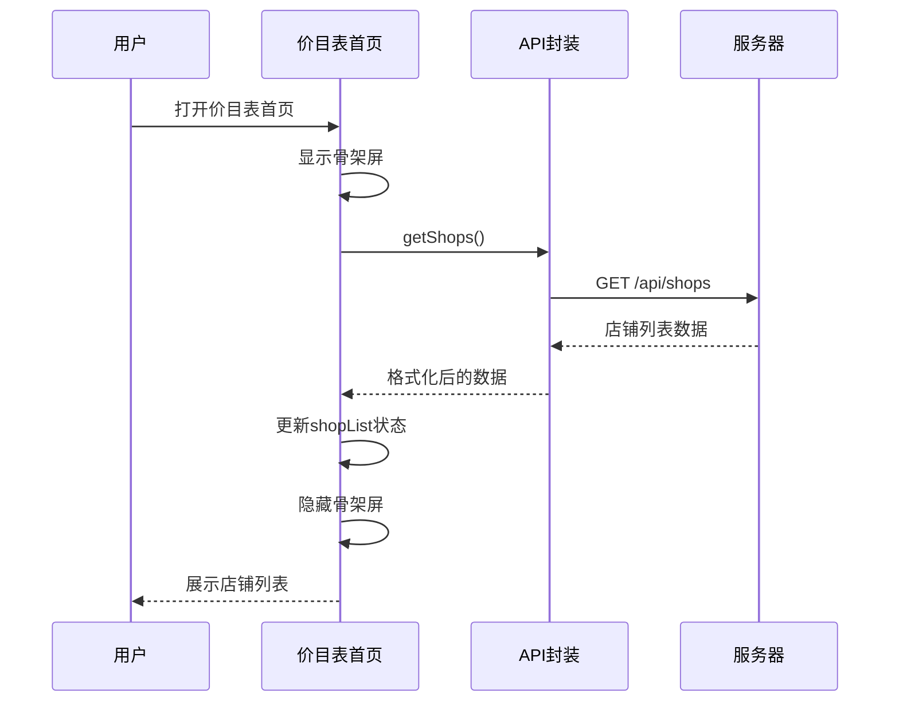
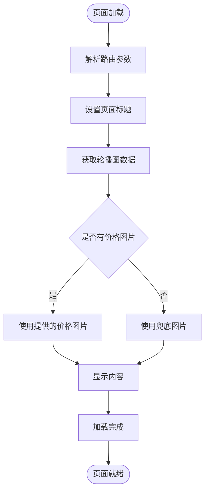
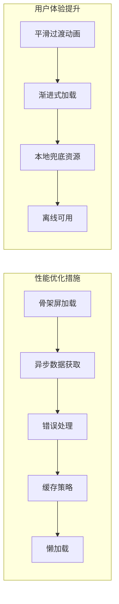
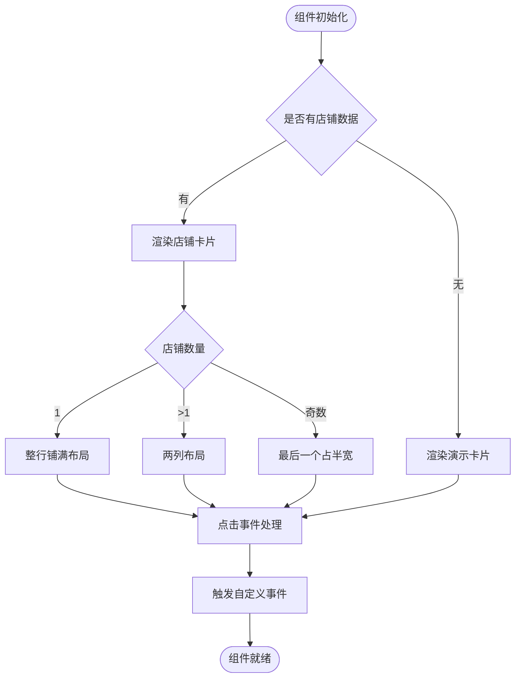
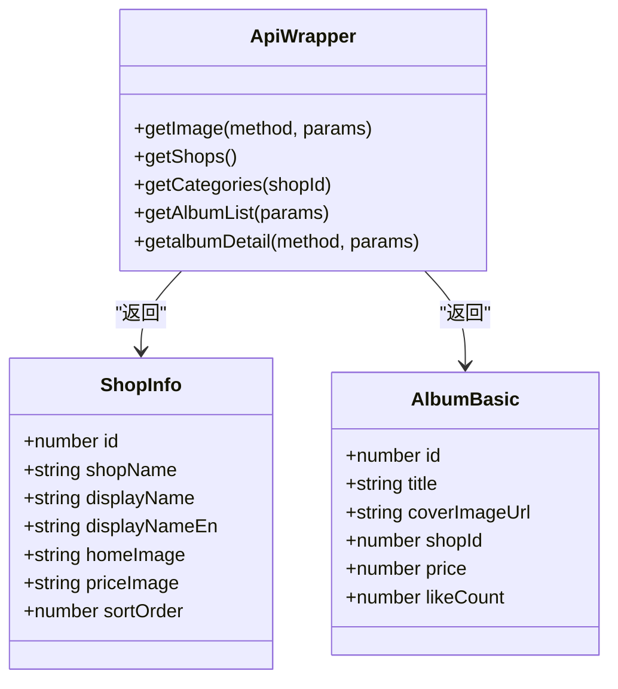
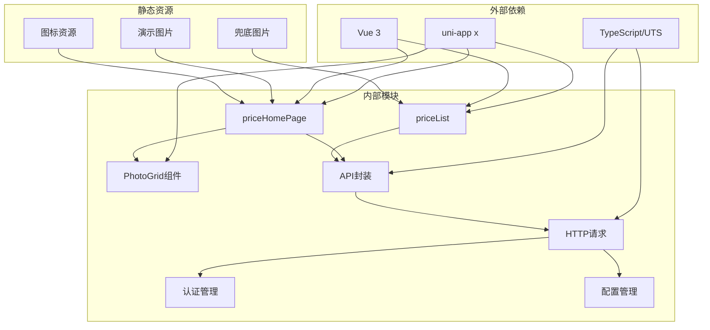
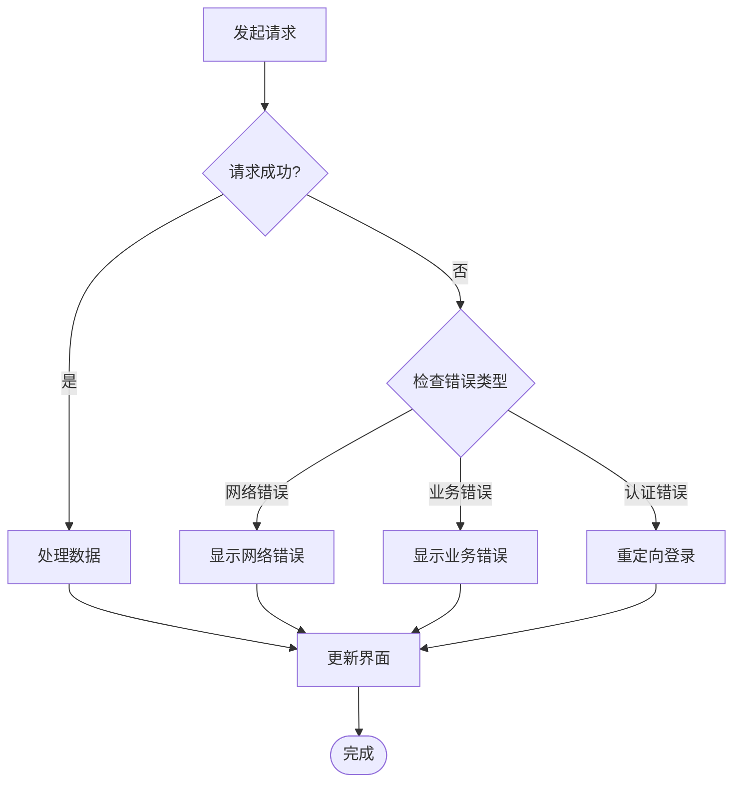

# 价格展示系统

<cite>
**本文档引用的文件**
- [src/pages/priceHomePage/index.uvue](file://src/pages/priceHomePage/index.uvue)
- [src/pages/priceList/index.uvue](file://src/pages/priceList/index.uvue)
- [src/utils/api.uts](file://src/utils/api.uts)
- [src/utils/http.uts](file://src/utils/http.uts)
- [src/utils/auth.uts](file://src/utils/auth.uts)
- [src/utils/config.uts](file://src/utils/config.uts)
- [src/components/PhotoGrid/PhotoGrid.uvue](file://src/components/PhotoGrid/PhotoGrid.uvue)
- [src/pages.json](file://src/pages.json)
- [src/App.uvue](file://src/App.uvue)
- [package.json](file://package.json)
- [README.md](file://README.md)
</cite>

## 目录
1. [简介](#简介)
2. [项目结构](#项目结构)
3. [核心组件](#核心组件)
4. [架构概览](#架构概览)
5. [详细组件分析](#详细组件分析)
6. [依赖关系分析](#依赖关系分析)
7. [性能考虑](#性能考虑)
8. [故障排除指南](#故障排除指南)
9. [结论](#结论)
10. [附录](#附录)

## 简介

蓝莓小程序的价格展示系统是一个基于 uni-app x (Vue 3 + TypeScript/UTS) 的微信小程序解决方案，专门用于展示店铺价格信息和价目表。该系统提供了完整的店铺信息获取、价目表展示、价格信息管理等核心功能，支持多店铺支持、动态更新机制和性能优化。

系统采用模块化的架构设计，通过清晰的组件分离和接口封装，实现了高内聚、低耦合的代码结构。价格展示系统主要包含两个核心页面：价目表首页（展示所有可用店铺）和价目列表页（展示特定店铺的详细价目信息）。

## 项目结构

蓝莓小程序采用标准的 uni-app 项目结构，核心目录组织如下：

```mermaid
graph TB
subgraph "项目根目录"
SRC[src/] -- 源代码目录
SCRIPTS[scripts/] -- 构建脚本
PROFILES[profiles/] -- 多项目配置
DIST[dist/] -- 构建产物
end
subgraph "src/ 源代码"
PAGES[pages/] -- 业务页面
COMPONENTS[components/] -- 可复用组件
UTILS[utils/] -- 工具模块
STATIC[static/] -- 静态资源
APP[App.uvue] -- 应用入口
MAIN[main.uts] -- 应用初始化
PAGES_JSON[pages.json] -- 页面配置
end
subgraph "核心页面"
PRICE_HOME[priceHomePage/index.uvue] -- 价目表首页
PRICE_LIST[priceList/index.uvue] -- 价目列表页
INDEX[index/index.uvue] -- 首页
MINE[mine/index.uvue] -- 个人中心
end
subgraph "工具模块"
API[api.uts] -- 接口封装
HTTP[http.uts] -- HTTP请求
AUTH[auth.uts] -- 认证管理
CONFIG[config.uts] -- 配置管理
end
PAGES --> PRICE_HOME
PAGES --> PRICE_LIST
UTILS --> API
UTILS --> HTTP
UTILS --> AUTH
UTILS --> CONFIG
```

**图表来源**
- [src/pages/priceHomePage/index.uvue:1-113](file://src/pages/priceHomePage/index.uvue#L1-L113)
- [src/pages/priceList/index.uvue:1-113](file://src/pages/priceList/index.uvue#L1-L113)
- [src/utils/api.uts:1-312](file://src/utils/api.uts#L1-L312)

**章节来源**
- [README.md:85-130](file://README.md#L85-L130)
- [package.json:1-48](file://package.json#L1-L48)

## 核心组件

价格展示系统的核心组件包括：

### 1. 价目表首页组件
负责展示所有可用的店铺信息，提供店铺选择功能和价目表浏览能力。

### 2. 价目列表组件  
负责展示特定店铺的详细价目信息，包括轮播图展示和价格图片显示。

### 3. PhotoGrid 组件
通用的网格布局组件，用于展示店铺卡片和演示图片，支持响应式布局和点击事件处理。

### 4. API 封装模块
提供统一的接口调用方法，包括店铺信息获取、轮播图获取等核心功能。

**章节来源**
- [src/pages/priceHomePage/index.uvue:35-68](file://src/pages/priceHomePage/index.uvue#L35-L68)
- [src/pages/priceList/index.uvue:27-77](file://src/pages/priceList/index.uvue#L27-L77)
- [src/components/PhotoGrid/PhotoGrid.uvue:46-64](file://src/components/PhotoGrid/PhotoGrid.uvue#L46-L64)

## 架构概览

价格展示系统采用分层架构设计，各层职责明确，耦合度低：



**图表来源**
- [src/utils/api.uts:28-36](file://src/utils/api.uts#L28-L36)
- [src/utils/http.uts:20-73](file://src/utils/http.uts#L20-L73)
- [src/utils/auth.uts:17-29](file://src/utils/auth.uts#L17-L29)

系统的核心数据流遵循以下模式：

1. **页面加载**：页面组件触发数据获取
2. **API调用**：通过封装的API方法进行网络请求
3. **数据处理**：对返回的数据进行格式化和验证
4. **状态更新**：更新页面状态并重新渲染
5. **错误处理**：统一处理网络异常和业务错误

**章节来源**
- [src/utils/api.uts:28-312](file://src/utils/api.uts#L28-L312)
- [src/utils/http.uts:20-82](file://src/utils/http.uts#L20-L82)

## 详细组件分析

### 价目表首页组件分析

价目表首页是价格展示系统的主要入口，负责展示所有可用的店铺信息。

#### 数据结构设计



**图表来源**
- [src/utils/api.uts:15-23](file://src/utils/api.uts#L15-L23)
- [src/pages/priceHomePage/index.uvue:37-67](file://src/pages/priceHomePage/index.uvue#L37-L67)

#### 核心功能实现

1. **店铺列表获取**：通过 `getShops()` API 获取所有启用的店铺信息
2. **动态路由处理**：支持从其他页面传递的参数，实现无缝跳转
3. **响应式布局**：根据店铺数量动态调整布局方式
4. **骨架屏加载**：提供良好的用户体验，避免空白加载

#### 展示逻辑分析



**图表来源**
- [src/pages/priceHomePage/index.uvue:44-55](file://src/pages/priceHomePage/index.uvue#L44-L55)
- [src/utils/api.uts:290-297](file://src/utils/api.uts#L290-L297)

**章节来源**
- [src/pages/priceHomePage/index.uvue:35-68](file://src/pages/priceHomePage/index.uvue#L35-L68)
- [src/utils/api.uts:287-297](file://src/utils/api.uts#L287-L297)

### 价目列表组件分析

价目列表组件负责展示特定店铺的详细价目信息，提供丰富的视觉展示效果。

#### 数据流处理



**图表来源**
- [src/pages/priceList/index.uvue:39-76](file://src/pages/priceList/index.uvue#L39-L76)

#### 核心功能特性

1. **轮播图展示**：支持动态获取和展示轮播图内容
2. **价格图片展示**：支持从服务器获取价格图片或使用本地兜底图片
3. **动态标题设置**：根据店铺信息动态设置页面标题
4. **解码处理**：对路由传递的参数进行安全解码

#### 性能优化策略



**章节来源**
- [src/pages/priceList/index.uvue:27-77](file://src/pages/priceList/index.uvue#L27-L77)
- [src/utils/api.uts:28-36](file://src/utils/api.uts#L28-L36)

### PhotoGrid 组件分析

PhotoGrid 是一个高度复用的网格布局组件，为多个页面提供统一的展示能力。

#### 布局算法设计



**图表来源**
- [src/components/PhotoGrid/PhotoGrid.uvue:17-44](file://src/components/PhotoGrid/PhotoGrid.uvue#L17-L44)

#### 核心设计原则

1. **响应式布局**：根据内容数量自动调整布局方式
2. **事件透传**：将用户交互事件向上层组件传递
3. **样式隔离**：通过组件作用域样式避免样式冲突
4. **性能优化**：使用 CSS calc 函数减少 JavaScript 计算

**章节来源**
- [src/components/PhotoGrid/PhotoGrid.uvue:46-119](file://src/components/PhotoGrid/PhotoGrid.uvue#L46-L119)

### API 封装模块分析

API 封装模块提供了统一的接口调用方法，是整个价格展示系统的核心数据层。

#### 接口类型定义



**图表来源**
- [src/utils/api.uts:6-23](file://src/utils/api.uts#L6-L23)
- [src/utils/api.uts:28-36](file://src/utils/api.uts#L28-L36)

#### 核心接口实现

1. **轮播图获取**：`getImage()` 方法用于获取轮播图数据
2. **店铺列表**：`getShops()` 方法获取所有启用的店铺信息
3. **分类管理**：提供分类相关的接口方法
4. **相册管理**：支持相册的增删改查操作

**章节来源**
- [src/utils/api.uts:28-312](file://src/utils/api.uts#L28-L312)

## 依赖关系分析

价格展示系统的依赖关系清晰明确，各模块之间耦合度低，便于维护和扩展。



**图表来源**
- [package.json:15-34](file://package.json#L15-L34)
- [src/pages/priceHomePage/index.uvue:36](file://src/pages/priceHomePage/index.uvue#L36)
- [src/pages/priceList/index.uvue:28](file://src/pages/priceList/index.uvue#L28)

### 模块间通信机制

系统采用事件驱动的方式实现模块间的松耦合通信：

1. **父子组件通信**：通过 props 和 emits 实现
2. **兄弟组件通信**：通过共同的父组件协调
3. **跨页面通信**：通过路由参数和全局状态管理

### 错误处理策略



**章节来源**
- [src/utils/http.uts:50-61](file://src/utils/http.uts#L50-L61)
- [src/pages/priceHomePage/index.uvue:50-54](file://src/pages/priceHomePage/index.uvue#L50-L54)

## 性能考虑

价格展示系统在设计时充分考虑了性能优化，采用了多种策略来提升用户体验：

### 1. 加载优化策略

- **骨架屏加载**：在数据加载期间显示骨架屏，提升感知速度
- **渐进式渲染**：优先渲染关键内容，次要内容延迟加载
- **图片懒加载**：对非首屏图片采用懒加载策略

### 2. 缓存策略

- **本地存储**：使用 uniStorage 进行本地数据缓存
- **请求去重**：避免相同请求的重复发送
- **失效策略**：设置合理的缓存失效时间

### 3. 网络优化

- **请求合并**：将多个小请求合并为批量请求
- **超时控制**：设置合理的请求超时时间
- **重试机制**：对临时性错误进行自动重试

### 4. 内存管理

- **组件卸载清理**：确保组件销毁时释放资源
- **事件监听器管理**：避免内存泄漏
- **大对象处理**：对大数据进行分批处理

## 故障排除指南

### 常见问题及解决方案

#### 1. 数据加载失败

**问题现象**：页面长时间显示加载状态或出现错误提示

**可能原因**：
- 网络连接异常
- 服务器响应超时
- 接口权限不足

**解决步骤**：
1. 检查网络连接状态
2. 查看控制台错误日志
3. 验证接口权限和参数
4. 重试请求或使用兜底方案

#### 2. 图片加载失败

**问题现象**：轮播图或价格图片无法正常显示

**可能原因**：
- 图片链接失效
- 图片格式不支持
- 网络权限限制

**解决步骤**：
1. 检查图片 URL 格式
2. 验证图片服务器状态
3. 使用本地兜底图片
4. 检查网络权限配置

#### 3. 页面跳转异常

**问题现象**：从价目表首页跳转到价目列表页失败

**可能原因**：
- 路由参数传递错误
- 页面路径配置问题
- 参数编码解码异常

**解决步骤**：
1. 验证路由参数格式
2. 检查页面路径配置
3. 确认参数编码解码逻辑
4. 添加参数验证和错误处理

### 调试技巧

1. **控制台调试**：使用浏览器开发者工具查看网络请求和错误信息
2. **日志记录**：在关键节点添加日志输出
3. **断点调试**：在复杂逻辑处设置断点进行逐步调试
4. **模拟数据**：使用模拟数据测试边界情况

**章节来源**
- [src/pages/priceList/index.uvue:49-56](file://src/pages/priceList/index.uvue#L49-L56)
- [src/utils/http.uts:63-67](file://src/utils/http.uts#L63-L67)

## 结论

蓝莓小程序的价格展示系统是一个设计精良、架构清晰的移动端应用。系统通过模块化的组件设计和完善的接口封装，实现了高效的价格信息展示功能。

### 主要优势

1. **架构清晰**：采用分层架构，职责分离明确
2. **组件复用**：PhotoGrid 等组件具有良好的复用性
3. **性能优化**：多层面的性能优化策略
4. **扩展性强**：支持多店铺、多主题的扩展需求
5. **维护友好**：代码结构清晰，易于维护和升级

### 技术亮点

- **响应式布局**：适应不同屏幕尺寸的展示需求
- **骨架屏体验**：提升用户感知速度
- **错误处理**：完善的错误处理和降级机制
- **多项目支持**：通过 Profile 机制支持多项目部署

### 改进建议

1. **增加缓存机制**：实现更智能的数据缓存策略
2. **性能监控**：集成性能监控和错误上报
3. **国际化支持**：扩展多语言支持能力
4. **测试覆盖**：增加单元测试和集成测试

## 附录

### 扩展功能建议

#### 1. 多店铺支持增强
- 实现店铺切换动画效果
- 支持店铺排序和筛选功能
- 增加店铺收藏和历史记录

#### 2. 价格对比功能
- 实现多店铺价格对比视图
- 支持价格趋势分析
- 提供价格预警通知

#### 3. 促销活动集成
- 支持动态促销信息展示
- 实现促销倒计时功能
- 集成优惠券和折扣计算

#### 4. 数据同步优化
- 实现增量数据更新
- 支持离线数据同步
- 增加数据一致性检查

### 最佳实践

1. **代码规范**：遵循统一的代码风格和命名约定
2. **错误处理**：为所有异步操作提供完善的错误处理
3. **性能监控**：建立性能指标监控体系
4. **安全考虑**：确保数据传输和存储的安全性
5. **用户体验**：持续优化用户交互和反馈机制