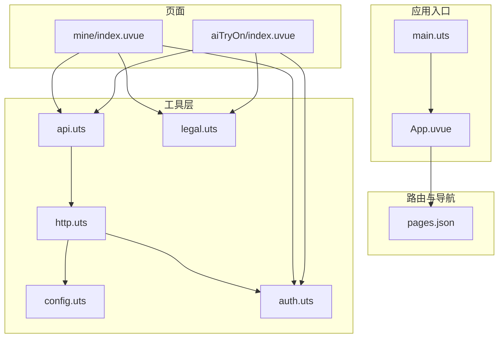
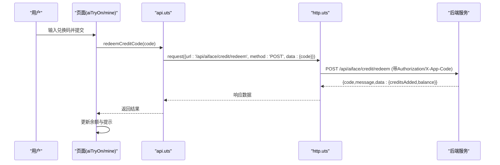
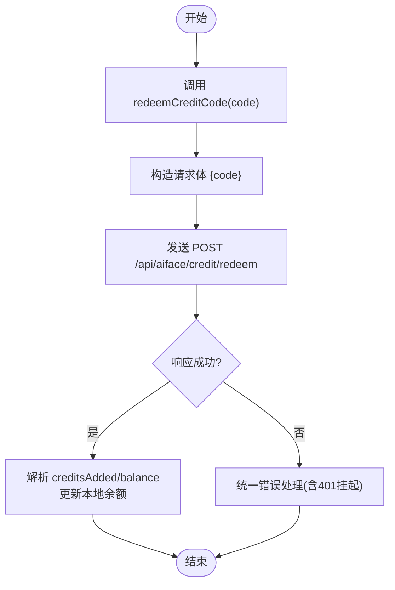
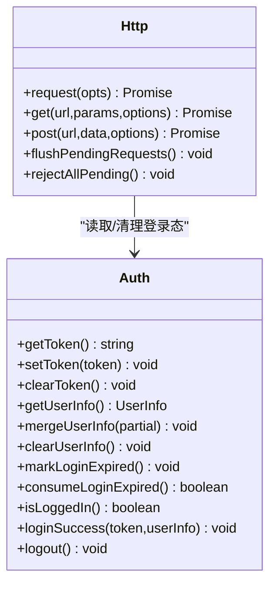
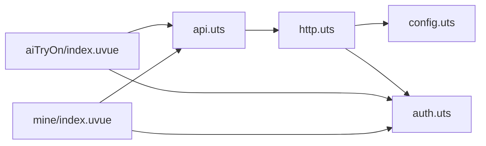

# 兑换码充值系统

<cite>
**本文引用的文件**   
- [README.md](file://README.md)
- [package.json](file://package.json)
- [src/main.uts](file://src/main.uts)
- [src/App.uvue](file://src/App.uvue)
- [src/pages.json](file://src/pages.json)
- [src/utils/config.uts](file://src/utils/config.uts)
- [src/utils/http.uts](file://src/utils/http.uts)
- [src/utils/auth.uts](file://src/utils/auth.uts)
- [src/utils/api.uts](file://src/utils/api.uts)
- [src/utils/legal.uts](file://src/utils/legal.uts)
- [src/pages/mine/index.uvue](file://src/pages/mine/index.uvue)
- [src/pages/aiTryOn/index.uvue](file://src/pages/aiTryOn/index.uvue)
</cite>

## 目录
1. [简介](#简介)
2. [项目结构](#项目结构)
3. [核心组件](#核心组件)
4. [架构总览](#架构总览)
5. [详细组件分析](#详细组件分析)
6. [依赖关系分析](#依赖关系分析)
7. [性能与可靠性](#性能与可靠性)
8. [故障排查指南](#故障排查指南)
9. [结论](#结论)
10. [附录：接口契约与数据模型](#附录接口契约与数据模型)

## 简介
本仓库为基于 uni-app x（Vue 3 + UTS/TypeScript）的微信小程序模板，内置多项目 Profile 机制、构建与校验脚本、统一登录态与 HTTP 封装。围绕“AI试衣”能力，系统提供两种次数获取方式：
- 微信支付充值：创建订单 → 拉起支付 → 轮询到账
- 兑换码充值：输入兑换码 → 立即增加次数

本文聚焦“兑换码充值”在系统中的位置、调用链路与相关交互，并给出整体架构与关键实现要点，帮助开发者快速理解与扩展。

## 项目结构
- 源码位于 src/，页面路由与全局样式由 pages.json 与 App.uvue 管理
- 工具层集中在 src/utils/，包括配置、HTTP、认证、业务 API、合规文案等
- 脚本与 Profile 机制用于多项目构建与产物校验（详见 README）

图表来源
- [src/main.uts:1-9](file://src/main.uts#L1-L9)
- [src/App.uvue:1-335](file://src/App.uvue#L1-L335)
- [src/pages.json:1-126](file://src/pages.json#L1-L126)
- [src/utils/config.uts:1-13](file://src/utils/config.uts#L1-L13)
- [src/utils/http.uts:1-184](file://src/utils/http.uts#L1-L184)
- [src/utils/auth.uts:1-171](file://src/utils/auth.uts#L1-L171)
- [src/utils/api.uts:1-710](file://src/utils/api.uts#L1-L710)
- [src/utils/legal.uts:1-16](file://src/utils/legal.uts#L1-L16)
- [src/pages/mine/index.uvue:1-630](file://src/pages/mine/index.uvue#L1-L630)
- [src/pages/aiTryOn/index.uvue:1-200](file://src/pages/aiTryOn/index.uvue#L1-L200)

章节来源
- [README.md:1-407](file://README.md#L1-L407)
- [package.json:1-48](file://package.json#L1-L48)

## 核心组件
- 配置中心（config.uts）：集中 baseURL 与超时
- HTTP 请求封装（http.uts）：统一请求头、401 挂起队列、自动重试与登出
- 认证模块（auth.uts）：token 与用户信息存取、登录过期标志
- 业务 API（api.uts）：AI 试衣、收藏点赞、搜索、店铺、中台页配置、信用额度与充值、兑换码兑换
- 合规与文案（legal.uts）：小程序名称、协议跳转
- 页面层（mine/index.uvue、aiTryOn/index.uvue）：登录态、菜单入口、支付流程、余额展示

章节来源
- [src/utils/config.uts:1-13](file://src/utils/config.uts#L1-L13)
- [src/utils/http.uts:1-184](file://src/utils/http.uts#L1-L184)
- [src/utils/auth.uts:1-171](file://src/utils/auth.uts#L1-L171)
- [src/utils/api.uts:1-710](file://src/utils/api.uts#L1-L710)
- [src/utils/legal.uts:1-16](file://src/utils/legal.uts#L1-L16)
- [src/pages/mine/index.uvue:1-630](file://src/pages/mine/index.uvue#L1-L630)
- [src/pages/aiTryOn/index.uvue:1-200](file://src/pages/aiTryOn/index.uvue#L1-L200)

## 架构总览
兑换码充值的核心链路如下：
- 用户在页面触发“兑换码充值”
- 前端调用 api.redeemCreditCode(code)
- http.request 统一附加 Authorization、X-App-Code/X-Brand-Id
- 后端返回 creditsAdded 与 balance，前端刷新余额 UI

图表来源
- [src/utils/api.uts:648-660](file://src/utils/api.uts#L648-L660)
- [src/utils/http.uts:99-175](file://src/utils/http.uts#L99-L175)

章节来源
- [src/utils/api.uts:648-660](file://src/utils/api.uts#L648-L660)
- [src/utils/http.uts:99-175](file://src/utils/http.uts#L99-L175)

## 详细组件分析

### 兑换码兑换接口（api.uts）
- 功能：提交 12 位兑换码，立即增加次数并返回最新余额
- 入参：code（字符串）
- 返回：{ code, message, data: { creditsAdded, balance } }
- 鉴权：需登录，Authorization 由 http 层注入
- 错误处理：非 2xx 状态码将抛出错误；401 会触发登录挂起与弹窗

图表来源
- [src/utils/api.uts:648-660](file://src/utils/api.uts#L648-L660)

章节来源
- [src/utils/api.uts:648-660](file://src/utils/api.uts#L648-L660)

### HTTP 层与 401 挂起队列（http.uts）
- 统一拼接 baseURL、注入 Content-Type、X-App-Code、Authorization、X-Brand-Id
- 401 时清空 token 与用户信息，标记登录过期，并将当前请求加入挂起队列
- 登录成功后 flushPendingRequests 用新 token 重试所有挂起请求
- 用户取消登录时 rejectAllPending 拒绝所有挂起请求

图表来源
- [src/utils/http.uts:1-184](file://src/utils/http.uts#L1-L184)
- [src/utils/auth.uts:1-171](file://src/utils/auth.uts#L1-L171)

章节来源
- [src/utils/http.uts:1-184](file://src/utils/http.uts#L1-L184)
- [src/utils/auth.uts:1-171](file://src/utils/auth.uts#L1-L171)

### 认证与登录态（auth.uts）
- Token 与用户信息通过 storage 持久化
- mergeUserInfo 仅覆盖非空字段，避免被部分响应覆盖已有头像/昵称
- consumeLoginExpired 供页面 onShow 消费 401 事件，自动拉起登录弹窗

章节来源
- [src/utils/auth.uts:1-171](file://src/utils/auth.uts#L1-L171)

### 页面集成与交互（aiTryOn/index.uvue、mine/index.uvue）
- aiTryOn：展示余额、免费次数角标、支付流程；可在此处接入“兑换码充值”入口
- mine：金刚区入口、登录弹窗、头像昵称授权、退出登录
- 两者均使用 legal.uts 打开用户协议/隐私政策

章节来源
- [src/pages/aiTryOn/index.uvue:1-200](file://src/pages/aiTryOn/index.uvue#L1-L200)
- [src/pages/mine/index.uvue:1-630](file://src/pages/mine/index.uvue#L1-L630)
- [src/utils/legal.uts:1-16](file://src/utils/legal.uts#L1-L16)

### 配置与环境（config.uts）
- 统一 baseURL 与超时时间
- 生产环境可通过 Profile 替换 baseURL（见 README）

章节来源
- [src/utils/config.uts:1-13](file://src/utils/config.uts#L1-L13)
- [README.md:169-240](file://README.md#L169-L240)

## 依赖关系分析
- 页面层依赖 api.uts 暴露的业务方法
- api.uts 依赖 http.uts 进行网络请求
- http.uts 依赖 config.uts（baseURL）、auth.uts（token/用户信息）
- 页面层也直接依赖 auth.uts 判断登录态与刷新 UI

图表来源
- [src/pages/aiTryOn/index.uvue:1-200](file://src/pages/aiTryOn/index.uvue#L1-L200)
- [src/pages/mine/index.uvue:1-630](file://src/pages/mine/index.uvue#L1-L630)
- [src/utils/api.uts:1-710](file://src/utils/api.uts#L1-L710)
- [src/utils/http.uts:1-184](file://src/utils/http.uts#L1-L184)
- [src/utils/config.uts:1-13](file://src/utils/config.uts#L1-L13)
- [src/utils/auth.uts:1-171](file://src/utils/auth.uts#L1-L171)

章节来源
- [src/utils/api.uts:1-710](file://src/utils/api.uts#L1-L710)
- [src/utils/http.uts:1-184](file://src/utils/http.uts#L1-L184)

## 性能与可靠性
- 401 并发安全：http.uts 使用 _isFlushing 防止重复 flush；upload 队列独立 _uploadIsFlushing
- 请求挂起与重试：401 时将请求入队，登录后批量重试，避免多次弹窗
- 轮询控制：支付到账轮询设置最大次数与 token 防重入，避免内存泄漏与无效轮询
- 资源加载：骨架屏与懒加载提升首屏体验

章节来源
- [src/utils/http.uts:1-184](file://src/utils/http.uts#L1-L184)
- [src/pages/aiTryOn/index.uvue:455-543](file://src/pages/aiTryOn/index.uvue#L455-L543)
- [src/App.uvue:58-154](file://src/App.uvue#L58-L154)

## 故障排查指南
- 兑换失败（参数或权限问题）
  - 检查是否已登录（getToken/isLoggedIn）
  - 确认 code 是否为 12 位有效兑换码
  - 查看后端返回 message 与 code
- 401 未授权
  - 确认 Authorization 是否正确注入
  - 观察是否触发 login-required 事件与登录弹窗
  - 检查 flushPendingRequests 是否被正确调用
- 兑换后余额未刷新
  - 确保页面在收到响应后更新本地余额变量
  - 若从其他页面返回，onShow 中可再次拉取余额

章节来源
- [src/utils/http.uts:135-175](file://src/utils/http.uts#L135-L175)
- [src/utils/api.uts:648-660](file://src/utils/api.uts#L648-L660)
- [src/pages/mine/index.uvue:192-217](file://src/pages/mine/index.uvue#L192-L217)

## 结论
兑换码充值以最小改动融入现有 HTTP 与认证体系，具备高内聚、低耦合特性。通过统一的 401 挂起与重试机制，保障异常场景下的用户体验与数据一致性。建议在 aiTryOn 或 mine 页面增加“兑换码充值”入口，复用 redeemCreditCode 接口完成即时到账。

## 附录：接口契约与数据模型
- 兑换码兑换
  - 接口：POST /api/aiface/credit/redeem
  - 请求体：{ code: string }
  - 响应体：{ code, message, data: { creditsAdded: number, balance: number } }
- 余额查询（参考）
  - 接口：GET /api/aiface/credit/balance
  - 响应体：{ code, message, data: { balance, inited, priceFenPerCredit } }
- 支付充值（参考）
  - 下单：POST /api/aiface/credit/recharge → { outTradeNo, ... }
  - 轮询：GET /api/aiface/credit/recharge/status?outTradeNo=... → { paid, credits, balance }

章节来源
- [src/utils/api.uts:606-660](file://src/utils/api.uts#L606-L660)
- [src/pages/aiTryOn/index.uvue:455-543](file://src/pages/aiTryOn/index.uvue#L455-L543)
