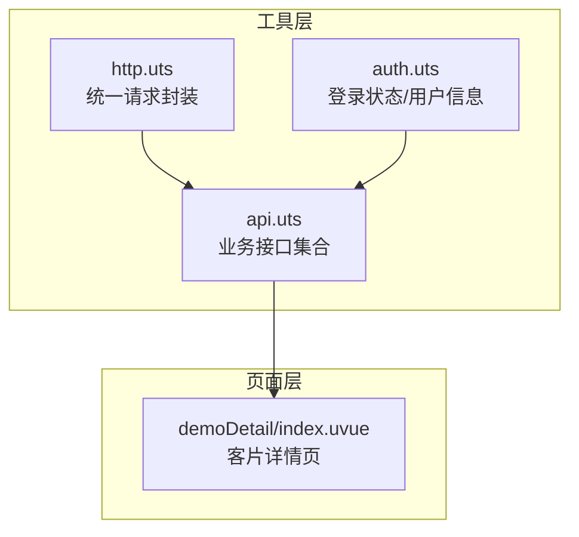
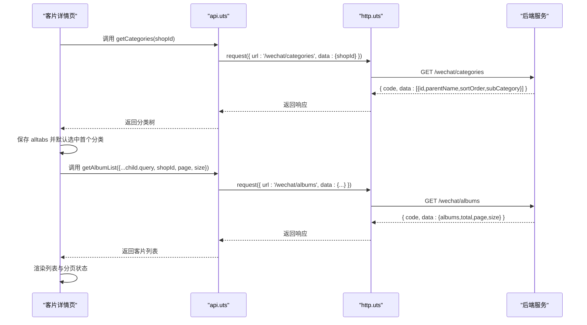
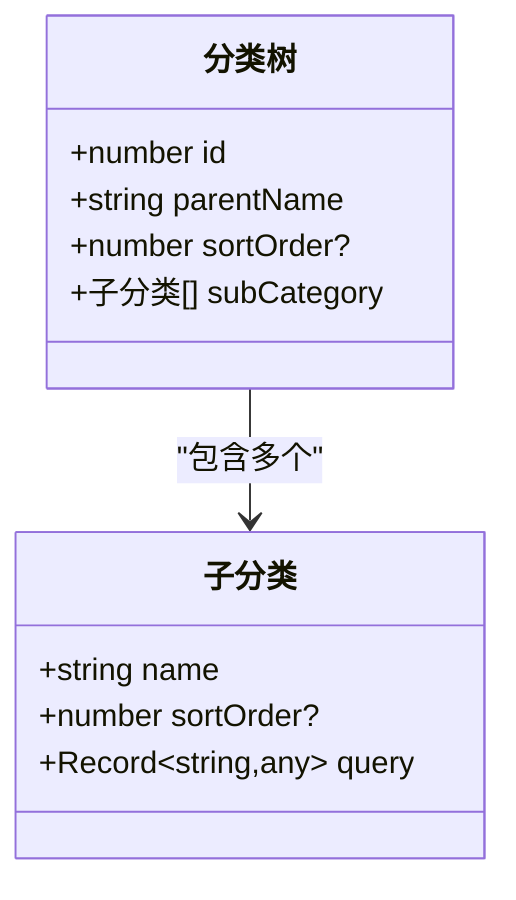
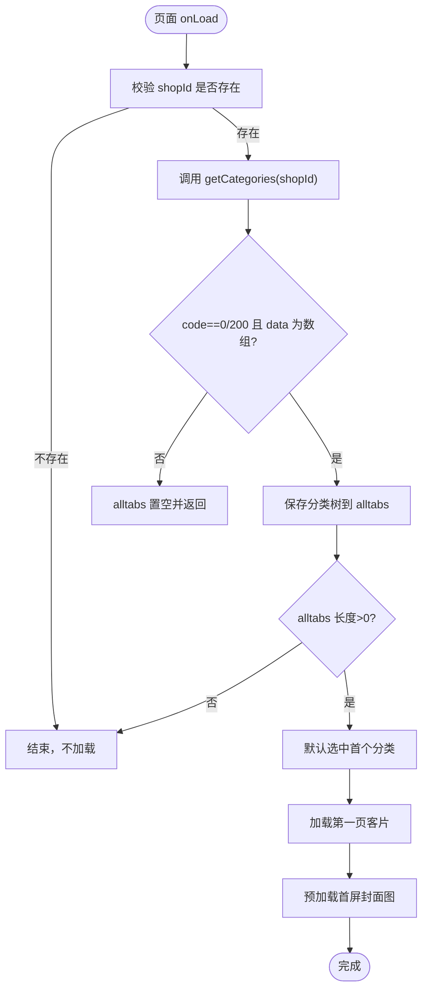
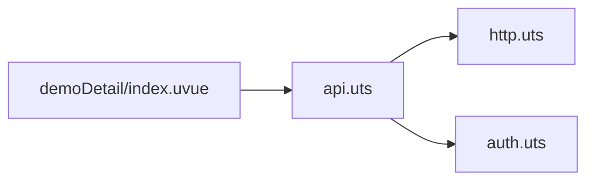

# 客片分类管理

<cite>
**本文引用的文件**
- [api.uts](file://src/utils/api.uts)
- [demoDetail/index.uvue](file://src/pages/demoDetail/index.uvue)
- [http.uts](file://src/utils/http.uts)
- [auth.uts](file://src/utils/auth.uts)
- [src-utils-api.spec.md](file://.specanchor/modules/src-utils-api.spec.md)
- [src-pages-album.spec.md](file://.specanchor/modules/src-pages-album.spec.md)
- [project-codemap.md](file://.specanchor/project-codemap.md)
</cite>

## 目录
1. [简介](#简介)
2. [项目结构](#项目结构)
3. [核心组件](#核心组件)
4. [架构总览](#架构总览)
5. [详细组件分析](#详细组件分析)
6. [依赖分析](#依赖分析)
7. [性能考虑](#性能考虑)
8. [故障排查指南](#故障排查指南)
9. [结论](#结论)
10. [附录](#附录)

## 简介
本文档围绕“客片分类管理”功能，系统性阐述 getCategories 接口的实现原理与使用方式，涵盖分类数据结构、父子分类关系、排序规则、获取流程、缓存策略、错误处理机制、UI 实现细节（分类导航渲染、点击事件、状态管理）、查询参数传递机制（shopId 作用与筛选逻辑），以及功能扩展建议（新增分类、排序调整、权限控制）。目标是帮助开发者快速理解并高效扩展该功能。

## 项目结构
客片分类管理涉及以下关键模块：
- 工具层：网络请求封装、认证状态管理、接口定义
- 页面层：客片详情页负责分类与客片列表的展示与交互
- 规范层：接口清单与页面注意事项说明



图表来源
- [http.uts:20-73](file://src/utils/http.uts#L20-L73)
- [auth.uts:15-149](file://src/utils/auth.uts#L15-L149)
- [api.uts:55-76](file://src/utils/api.uts#L55-L76)
- [demoDetail/index.uvue:190-202](file://src/pages/demoDetail/index.uvue#L190-L202)

章节来源
- [project-codemap.md:93-127](file://.specanchor/project-codemap.md#L93-L127)

## 核心组件
- getCategories 接口：用于获取两级分类树（父分类 + 子分类），公开、无需登录
- 客片详情页（demoDetail）：负责加载分类、渲染分类导航、切换分类、加载客片列表、搜索与加载更多
- HTTP 请求封装：统一注入 Authorization、X-App-Code，处理 401 自动登出
- 认证工具：登录状态判断、用户信息存储与合并写入

章节来源
- [api.uts:55-76](file://src/utils/api.uts#L55-L76)
- [demoDetail/index.uvue:303-343](file://src/pages/demoDetail/index.uvue#L303-L343)
- [http.uts:20-73](file://src/utils/http.uts#L20-L73)
- [auth.uts:125-139](file://src/utils/auth.uts#L125-L139)

## 架构总览
客片分类管理采用“接口拆分 + 页面驱动”的设计：先通过 getCategories 获取分类树，再基于子分类 query 参数调用 getAlbumList 获取客片列表。页面层负责状态管理、UI 渲染与交互，工具层负责网络与认证。



图表来源
- [api.uts:55-111](file://src/utils/api.uts#L55-L111)
- [http.uts:20-73](file://src/utils/http.uts#L20-L73)
- [demoDetail/index.uvue:311-329](file://src/pages/demoDetail/index.uvue#L311-L329)

## 详细组件分析

### getCategories 接口实现与数据模型
- 接口路径：/wechat/categories
- 方法：GET
- 入参：shopId（字符串或数字）
- 出参：包含 code、message、data 的响应对象
- 数据模型（分类树）：
  - 父分类数组元素
    - id：父分类标识
    - parentName：父分类名称
    - sortOrder：父分类排序字段（可选）
    - subCategory：子分类数组
      - name：子分类名称
      - sortOrder：子分类排序字段（可选）
      - query：查询参数对象，透传给 getAlbumList



图表来源
- [api.uts:65-75](file://src/utils/api.uts#L65-L75)

章节来源
- [api.uts:55-76](file://src/utils/api.uts#L55-L76)
- [src-utils-api.spec.md:79-84](file://.specanchor/modules/src-utils-api.spec.md#L79-L84)

### 分类获取流程与状态管理
- 页面初始化：接收 shopId，调用 getCategories 获取分类树
- 成功条件：响应 code 为 0 或 200，且 data 为数组
- 默认选中：将 selectedTab 设为 { parentIndex: 0, childIndex: 0 }
- 加载第一页客片：调用 getAlbumList，参数来自 child.query + shopId + 分页参数
- 预加载封面图：对首屏封面图进行预加载，提升首屏体验



图表来源
- [demoDetail/index.uvue:303-343](file://src/pages/demoDetail/index.uvue#L303-L343)

章节来源
- [demoDetail/index.uvue:303-343](file://src/pages/demoDetail/index.uvue#L303-L343)

### 分类导航渲染与点击事件
- 渲染两层分类标签：
  - 第一层：父分类名称列表，横向滚动容器
  - 第二层：根据父分类索引显示对应的子分类名称列表
- 点击事件：
  - 父分类点击：更新 parentIndex 为点击索引，childIndex 归零
  - 子分类点击：仅更新 childIndex
- 切换后重置分页并重新加载客片列表

```mermaid
sequenceDiagram
participant UI as "分类标签"
participant VM as "页面逻辑"
UI->>VM : 点击父分类索引 idx
VM->>VM : selectedTab.parentIndex = idx; childIndex = 0
VM->>VM : 重置分页/列表
VM->>VM : fetchAlbumList(1)
UI->>VM : 点击子分类索引 idx
VM->>VM : selectedTab.childIndex = idx
VM->>VM : 重置分页/列表
VM->>VM : fetchAlbumList(1)
```

图表来源
- [demoDetail/index.uvue:78-97](file://src/pages/demoDetail/index.uvue#L78-L97)
- [demoDetail/index.uvue:500-518](file://src/pages/demoDetail/index.uvue#L500-L518)

章节来源
- [demoDetail/index.uvue:78-97](file://src/pages/demoDetail/index.uvue#L78-L97)
- [demoDetail/index.uvue:500-518](file://src/pages/demoDetail/index.uvue#L500-L518)

### 查询参数传递机制与筛选逻辑
- getCategories 返回的子分类 query 对象包含筛选参数（如 parentId、childId、subName 等），这些参数将透传到 getAlbumList
- getAlbumList 的完整参数包括：shopId（必填）、parentId、childId、subName、keyword（可选）、page、size（可选）
- 搜索场景：doSearch 将当前子分类 query 与 keyword、分页参数组合后调用 getAlbumList
- 分类场景：fetchAlbumList 将当前子分类 query 与分页参数组合后调用 getAlbumList

章节来源
- [api.uts:86-111](file://src/utils/api.uts#L86-L111)
- [demoDetail/index.uvue:417-460](file://src/pages/demoDetail/index.uvue#L417-L460)
- [demoDetail/index.uvue:344-386](file://src/pages/demoDetail/index.uvue#L344-L386)

### 错误处理机制
- getCategories：若响应 code 非 0/200 或 data 非数组，则清空 alltabs 并提前返回
- getAlbumList：若响应失败或 data 缺失，第一页清空列表并标记 noMore
- HTTP 层：401 统一清理 token 与用户信息并提示“登录已过期”
- 页面层：捕获异常并输出日志，必要时提示用户

章节来源
- [demoDetail/index.uvue:313-317](file://src/pages/demoDetail/index.uvue#L313-L317)
- [demoDetail/index.uvue:377-385](file://src/pages/demoDetail/index.uvue#L377-L385)
- [http.uts:50-61](file://src/utils/http.uts#L50-L61)

### 缓存策略
- 分类数据：页面内存缓存（alltabs），生命周期随页面实例
- 客片列表：按页缓存（albumList），分页加载时追加
- 图片缓存：预加载首屏封面图，提升首屏渲染速度
- 说明：当前未实现持久化缓存（如 localStorage/Storage），若需跨页面/跨会话复用，可在页面层或工具层扩展

章节来源
- [demoDetail/index.uvue:214-221](file://src/pages/demoDetail/index.uvue#L214-L221)
- [demoDetail/index.uvue:331-342](file://src/pages/demoDetail/index.uvue#L331-L342)

### UI 实现细节
- 分类导航：两行横向滚动标签，父分类与子分类分别渲染
- 点击事件：父分类点击重置子分类索引；子分类点击仅更新子分类索引
- 状态管理：selectedTab、albumList、albumPage、albumNoMore、search* 等
- 加载更多：滚动触底自动加载下一页；搜索模式与分类模式分别处理
- 骨架屏：页面加载阶段显示骨架屏，图片预加载完成后隐藏

章节来源
- [demoDetail/index.uvue:75-129](file://src/pages/demoDetail/index.uvue#L75-L129)
- [demoDetail/index.uvue:266-275](file://src/pages/demoDetail/index.uvue#L266-L275)
- [src-pages-album.spec.md:176-182](file://.specanchor/modules/src-pages-album.spec.md#L176-L182)

## 依赖分析
- 页面依赖接口：getCategories、getAlbumList
- 接口依赖 HTTP：统一请求封装与认证头注入
- 认证依赖：登录状态判断、token 与用户信息存储



图表来源
- [demoDetail/index.uvue:190-202](file://src/pages/demoDetail/index.uvue#L190-L202)
- [api.uts:1-2](file://src/utils/api.uts#L1-L2)
- [http.uts:1-2](file://src/utils/http.uts#L1-L2)
- [auth.uts:1-2](file://src/utils/auth.uts#L1-L2)

章节来源
- [project-codemap.md:105-111](file://.specanchor/project-codemap.md#L105-L111)

## 性能考虑
- 骨架屏与图片预加载：减少白屏时间，提升感知性能
- 分页加载：避免一次性拉取大量数据
- 401 自动登出：避免无效请求与重复错误提示
- 横向滚动容器：减少纵向滚动压力，提升交互流畅度

## 故障排查指南
- 分类为空：检查 shopId 是否正确传递；确认 getCategories 返回 code 与 data 结构
- 切换分类无数据：确认子分类 query 是否存在；检查 getAlbumList 参数拼装
- 登录态失效：关注 401 处理与提示；确保登录流程正确执行
- 加载更多异常：检查 noMore 与 loading 状态；确认 total 与 page 计算逻辑

章节来源
- [http.uts:50-61](file://src/utils/http.uts#L50-L61)
- [demoDetail/index.uvue:377-385](file://src/pages/demoDetail/index.uvue#L377-L385)

## 结论
客片分类管理通过清晰的接口拆分与页面驱动实现，具备良好的可维护性与扩展性。getCategories 提供两级分类树，配合子分类 query 实现灵活筛选；页面层负责状态管理与 UI 交互，工具层提供统一的网络与认证能力。后续可在页面层扩展持久化缓存、排序与权限控制，在接口层扩展更多筛选维度与排序规则。

## 附录

### 分类数据模型定义（摘要）
- 父分类
  - id: number
  - parentName: string
  - sortOrder?: number
  - subCategory: 子分类[]
- 子分类
  - name: string
  - sortOrder?: number
  - query: Record<string, any>

章节来源
- [api.uts:65-75](file://src/utils/api.uts#L65-L75)

### 接口清单（与分类相关）
- getCategories(shopId)
  - 方法：GET
  - 路径：/wechat/categories
  - 入参：shopId
  - 出参：分类树
- getAlbumList(params)
  - 方法：GET
  - 路径：/wechat/albums
  - 入参：shopId（必填）、parentId/childId/subName（可选）、keyword（可选）、page/size（可选）

章节来源
- [src-utils-api.spec.md:79-84](file://.specanchor/modules/src-utils-api.spec.md#L79-L84)

### 扩展指导
- 新增分类
  - 在后端模板中新增分类条目，确保返回的 subCategory 包含对应 query
  - 前端无需改动，getAlbumList 会自动透传 query
- 分类排序调整
  - 使用 parentName.sortOrder 与子分类 sortOrder 控制展示顺序
  - 若后端支持排序字段，前端可直接使用；若需自定义排序，可在页面层二次排序
- 权限控制
  - 前端不进行权限判断，所有权限由后端接口控制
  - 如需限制某些分类可见性，可在 getCategories 返回中按需裁剪 subCategory

章节来源
- [src-pages-album.spec.md:176-182](file://.specanchor/modules/src-pages-album.spec.md#L176-L182)
- [src-prd-requirements.spec.md:307-332](file://.specanchor/modules/src-prd-requirements.spec.md#L307-L332)
