# 分页加载机制

<cite>
**本文档引用的文件**
- [api.uts](file://src/utils/api.uts)
- [http.uts](file://src/utils/http.uts)
- [demoDetail/index.uvue](file://src/pages/demoDetail/index.uvue)
- [favorites/index.uvue](file://src/pages/favorites/index.uvue)
- [imageLoader.uts](file://src/utils/imageLoader.uts)
- [config.uts](file://src/utils/config.uts)
</cite>

## 目录
1. [简介](#简介)
2. [项目结构](#项目结构)
3. [核心组件](#核心组件)
4. [架构概览](#架构概览)
5. [详细组件分析](#详细组件分析)
6. [依赖关系分析](#依赖关系分析)
7. [性能考虑](#性能考虑)
8. [故障排除指南](#故障排除指南)
9. [结论](#结论)

## 简介

本文档深入解析了蓝莓小程序项目的分页加载机制，重点围绕 `getAlbumList` 接口的分页参数设计、数据结构定义以及前端实现细节。通过对实际代码的分析，详细说明了分页参数的作用与默认值、分页数据结构的各个字段含义、前端分页组件的触发机制、状态管理最佳实践、性能优化策略以及异常处理方案。

## 项目结构

该项目采用基于页面的组织结构，分页功能主要分布在以下文件中：

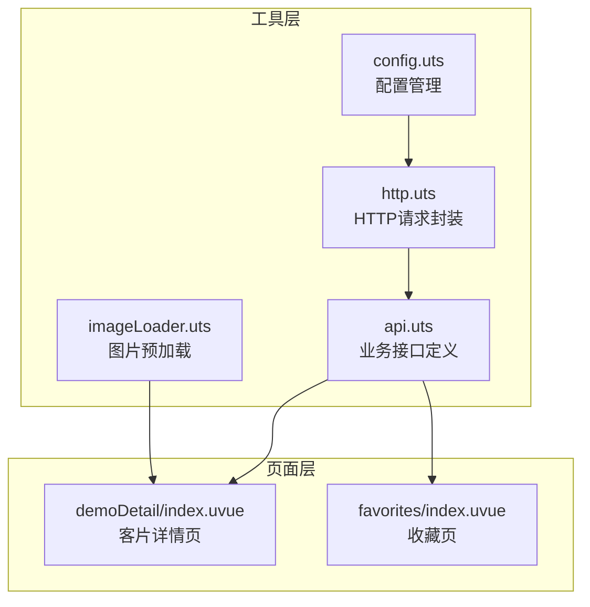

**图表来源**
- [http.uts:1-82](file://src/utils/http.uts#L1-L82)
- [api.uts:1-312](file://src/utils/api.uts#L1-L312)
- [demoDetail/index.uvue:1-897](file://src/pages/demoDetail/index.uvue#L1-L897)
- [favorites/index.uvue:1-229](file://src/pages/favorites/index.uvue#L1-L229)

**章节来源**
- [http.uts:1-82](file://src/utils/http.uts#L1-L82)
- [api.uts:1-312](file://src/utils/api.uts#L1-L312)

## 核心组件

### 分页接口定义

项目提供了两种主要的分页接口：

1. **getAlbumList** - 客片列表分页接口
2. **searchAlbums** - 搜索结果分页接口

#### getAlbumList 接口参数

| 参数名称 | 类型 | 是否必需 | 默认值 | 描述 |
|---------|------|---------|-------|------|
| shopId | string \| number | 是 | - | 店铺ID（必填） |
| page | number | 否 | 1 | 页码，默认第1页 |
| size | number | 否 | 10 | 每页大小，默认10条 |
| keyword | string | 否 | - | 搜索关键词（可选） |
| parentId | number | 否 | - | 父分类ID（可选） |
| childId | number | 否 | - | 子分类ID（可选） |
| subName | string | 否 | - | 子分类名称（可选） |

#### 分页数据结构

getAlbumList 返回的标准分页数据结构：

```typescript
{
  code: number,
  message: string,
  data: {
    albums: AlbumBasic[],  // 当前页数据数组
    total: number,         // 总记录数
    page: number,          // 当前页码
    size: number           // 每页大小
  }
}
```

**章节来源**
- [api.uts:78-111](file://src/utils/api.uts#L78-L111)

### 分页状态管理

前端页面使用以下状态变量来管理分页：

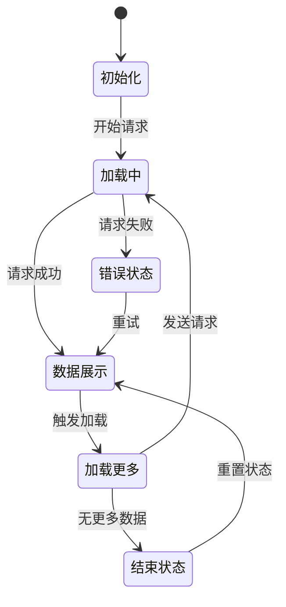

**图表来源**
- [demoDetail/index.uvue:345-386](file://src/pages/demoDetail/index.uvue#L345-L386)
- [favorites/index.uvue:157-191](file://src/pages/favorites/index.uvue#L157-L191)

## 架构概览

分页机制的整体架构如下：

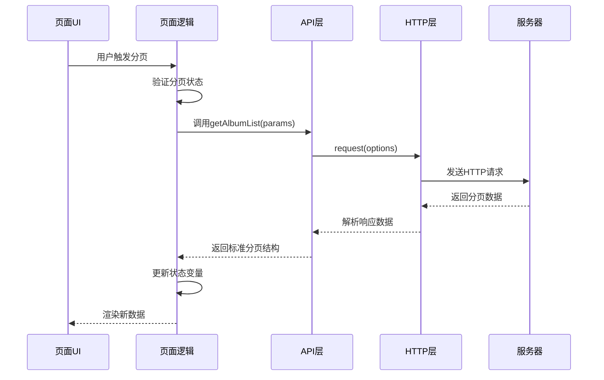

**图表来源**
- [demoDetail/index.uvue:417-456](file://src/pages/demoDetail/index.uvue#L417-L456)
- [api.uts:86-111](file://src/utils/api.uts#L86-L111)
- [http.uts:20-73](file://src/utils/http.uts#L20-L73)

## 详细组件分析

### getAlbumList 接口实现

#### 参数处理与默认值

getAlbumList 接口的参数处理逻辑：

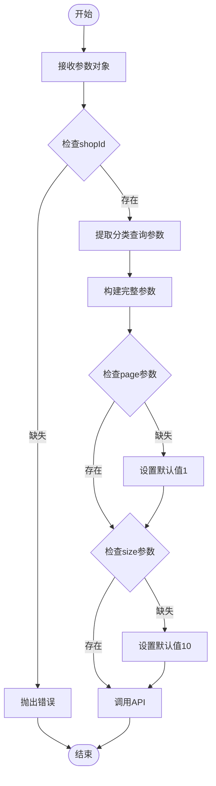

**图表来源**
- [demoDetail/index.uvue:345-359](file://src/pages/demoDetail/index.uvue#L345-L359)
- [api.uts:86-111](file://src/utils/api.uts#L86-L111)

#### 数据结构解析

分页响应的数据结构解析：

| 字段名称 | 类型 | 含义 | 使用场景 |
|---------|------|------|----------|
| code | number | 响应状态码 | 判断请求是否成功 |
| message | string | 响应消息 | 错误提示或成功消息 |
| data.albums | AlbumBasic[] | 当前页数据数组 | 渲染列表内容 |
| data.total | number | 总记录数 | 计算总页数 |
| data.page | number | 当前页码 | 更新分页状态 |
| data.size | number | 每页大小 | 计算分页边界 |

**章节来源**
- [api.uts:96-110](file://src/utils/api.uts#L96-L110)

### 前端分页组件实现

#### 触发机制

前端提供了多种分页触发机制：

1. **滚动触底加载**
2. **按钮点击加载**
3. **键盘搜索触发**

##### 滚动触底加载

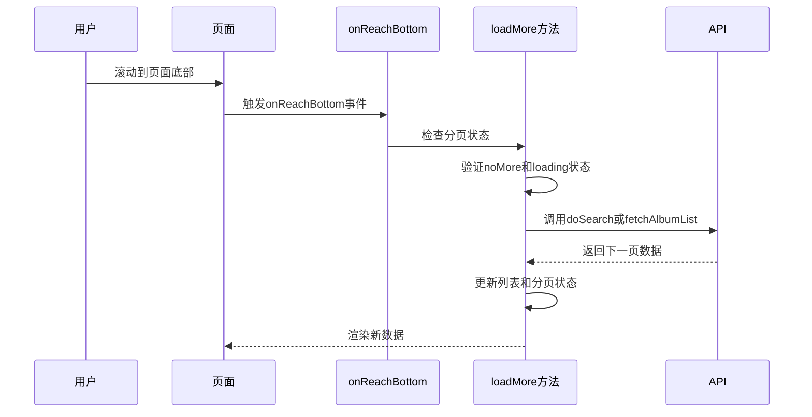

**图表来源**
- [demoDetail/index.uvue:266-275](file://src/pages/demoDetail/index.uvue#L266-L275)
- [demoDetail/index.uvue:457-460](file://src/pages/demoDetail/index.uvue#L457-L460)

##### 按钮点击加载

按钮点击加载的实现逻辑：

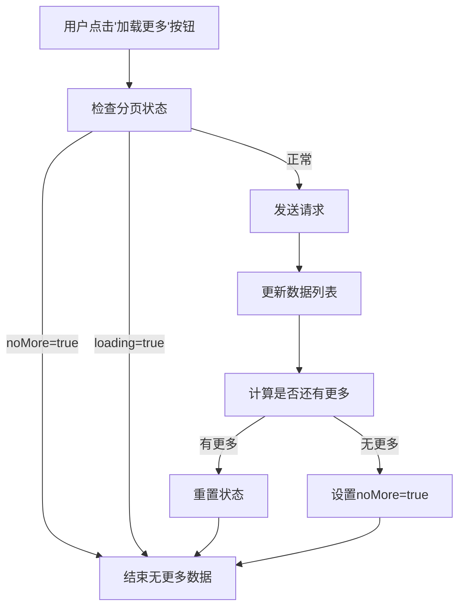

**图表来源**
- [demoDetail/index.uvue:123-128](file://src/pages/demoDetail/index.uvue#L123-L128)
- [demoDetail/index.uvue:462-476](file://src/pages/demoDetail/index.uvue#L462-L476)

**章节来源**
- [demoDetail/index.uvue:266-275](file://src/pages/demoDetail/index.uvue#L266-L275)
- [demoDetail/index.uvue:123-128](file://src/pages/demoDetail/index.uvue#L123-L128)

### 分页状态管理最佳实践

#### 状态变量设计

页面级分页状态管理的关键变量：

| 状态变量 | 类型 | 默认值 | 作用 |
|---------|------|-------|------|
| loading | boolean | false | 页面初始化加载状态 |
| albumLoading | boolean | false | 分类模式加载状态 |
| searchLoading | boolean | false | 搜索模式加载状态 |
| loadingMore | boolean | false | 加载更多状态 |
| noMore | boolean | false | 无更多数据标志 |
| albumNoMore | boolean | false | 分类模式无更多数据 |
| searchNoMore | boolean | false | 搜索模式无更多数据 |
| isEmpty | boolean | false | 空数据状态 |

#### 状态更新策略

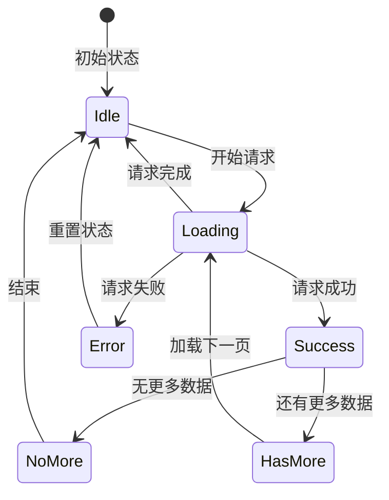

**图表来源**
- [demoDetail/index.uvue:345-386](file://src/pages/demoDetail/index.uvue#L345-L386)
- [favorites/index.uvue:157-191](file://src/pages/favorites/index.uvue#L157-L191)

**章节来源**
- [demoDetail/index.uvue:345-386](file://src/pages/demoDetail/index.uvue#L345-L386)
- [favorites/index.uvue:157-191](file://src/pages/favorites/index.uvue#L157-L191)

## 依赖关系分析

### 组件依赖图

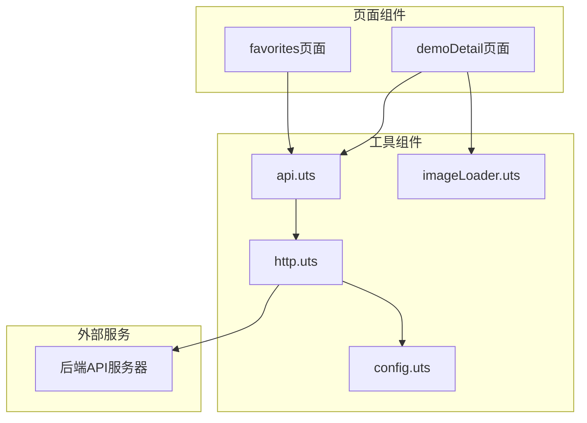

**图表来源**
- [demoDetail/index.uvue:1-897](file://src/pages/demoDetail/index.uvue#L1-L897)
- [favorites/index.uvue:1-229](file://src/pages/favorites/index.uvue#L1-L229)
- [api.uts:1-312](file://src/utils/api.uts#L1-L312)
- [http.uts:1-82](file://src/utils/http.uts#L1-L82)

### 数据流分析

分页数据的完整流转过程：

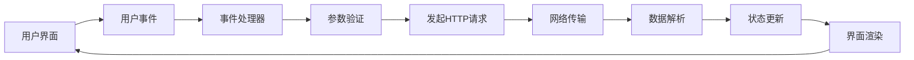

**图表来源**
- [demoDetail/index.uvue:417-456](file://src/pages/demoDetail/index.uvue#L417-L456)
- [http.uts:20-73](file://src/utils/http.uts#L20-L73)

**章节来源**
- [api.uts:1-312](file://src/utils/api.uts#L1-L312)
- [http.uts:1-82](file://src/utils/http.uts#L1-L82)

## 性能考虑

### 图片预加载优化

项目实现了智能的图片预加载机制，避免列表切换时的白屏问题：

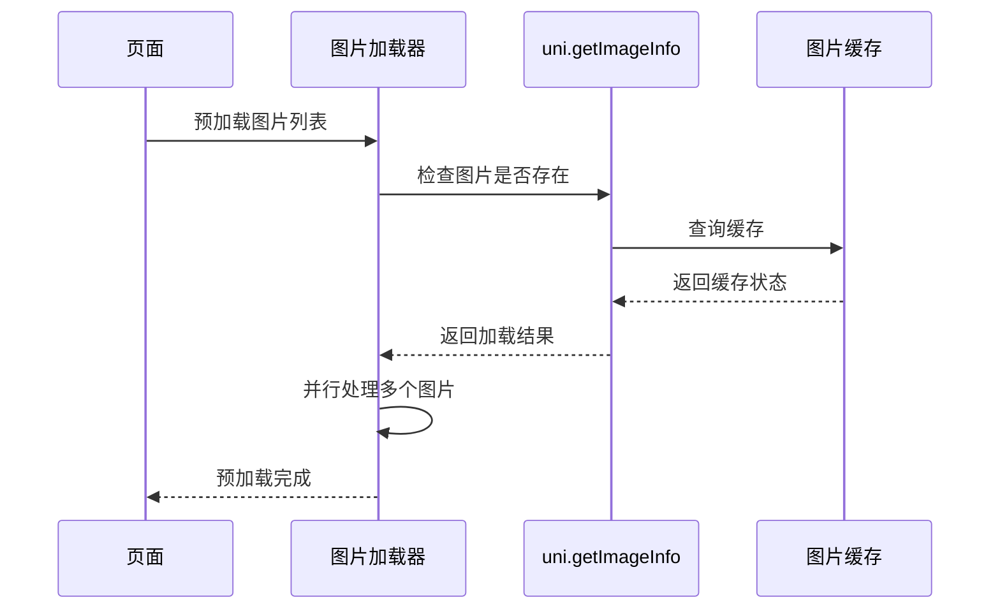

**图表来源**
- [imageLoader.uts:8-27](file://src/utils/imageLoader.uts#L8-L27)

### 首屏性能优化

页面初始化时的性能优化策略：

1. **首屏封面图预加载**：只预加载前6张封面图
2. **超时保护**：设置5秒超时，避免无限等待
3. **并行加载**：使用Promise.all并行处理多张图片
4. **失败容错**：单张图片失败不影响整体加载

**章节来源**
- [demoDetail/index.uvue:332-336](file://src/pages/demoDetail/index.uvue#L332-L336)
- [imageLoader.uts:22-27](file://src/utils/imageLoader.uts#L22-L27)

## 故障排除指南

### 常见异常处理

#### 网络错误处理

HTTP层对不同状态码的统一处理：

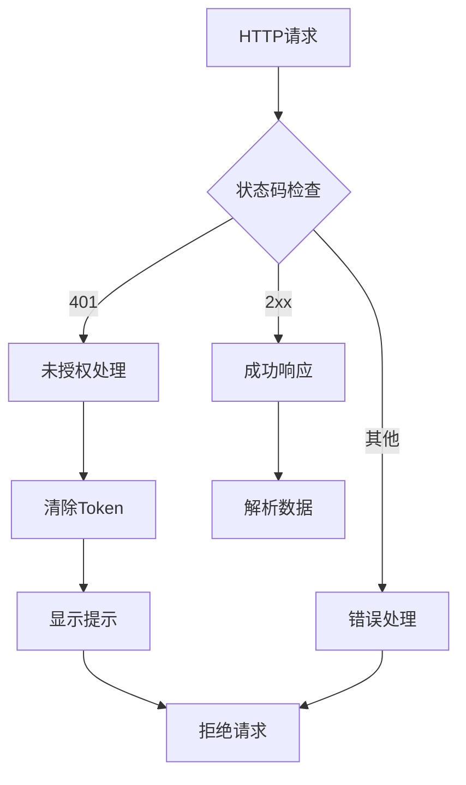

**图表来源**
- [http.uts:47-71](file://src/utils/http.uts#L47-L71)

#### 分页异常处理

页面级的分页异常处理策略：

1. **请求失败**：设置 `noMore = true` 阻止继续加载
2. **空数据**：设置 `isEmpty = true` 显示空状态
3. **状态重置**：在finally中重置loading状态
4. **用户提示**：使用uni.showToast显示错误信息

**章节来源**
- [demoDetail/index.uvue:450-455](file://src/pages/demoDetail/index.uvue#L450-L455)
- [http.uts:50-61](file://src/utils/http.uts#L50-L61)

### 调试建议

1. **检查网络请求**：确认请求URL、参数和响应格式
2. **验证分页状态**：确保 `page` 和 `size` 参数正确传递
3. **监控状态变化**：观察 `loading`、`noMore` 等状态变量的变化
4. **调试数据结构**：验证返回数据的结构是否符合预期

## 结论

该分页加载机制通过清晰的接口设计、完善的错误处理和性能优化策略，为用户提供了流畅的分页体验。主要特点包括：

1. **标准化的分页接口**：统一的参数设计和数据结构
2. **灵活的触发机制**：支持滚动触底和按钮点击两种加载方式
3. **完整的状态管理**：全面的状态变量控制和更新策略
4. **性能优化**：智能的图片预加载和超时保护机制
5. **健壮的异常处理**：统一的错误处理和用户提示机制

这套分页机制为类似的小程序项目提供了良好的参考模板，可以在保证用户体验的同时，有效提升应用的性能和稳定性。