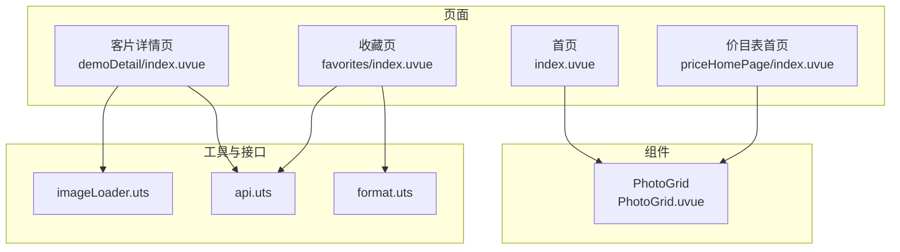
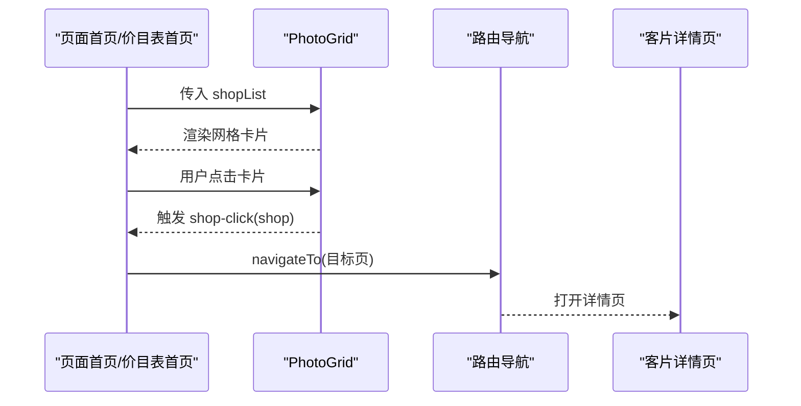
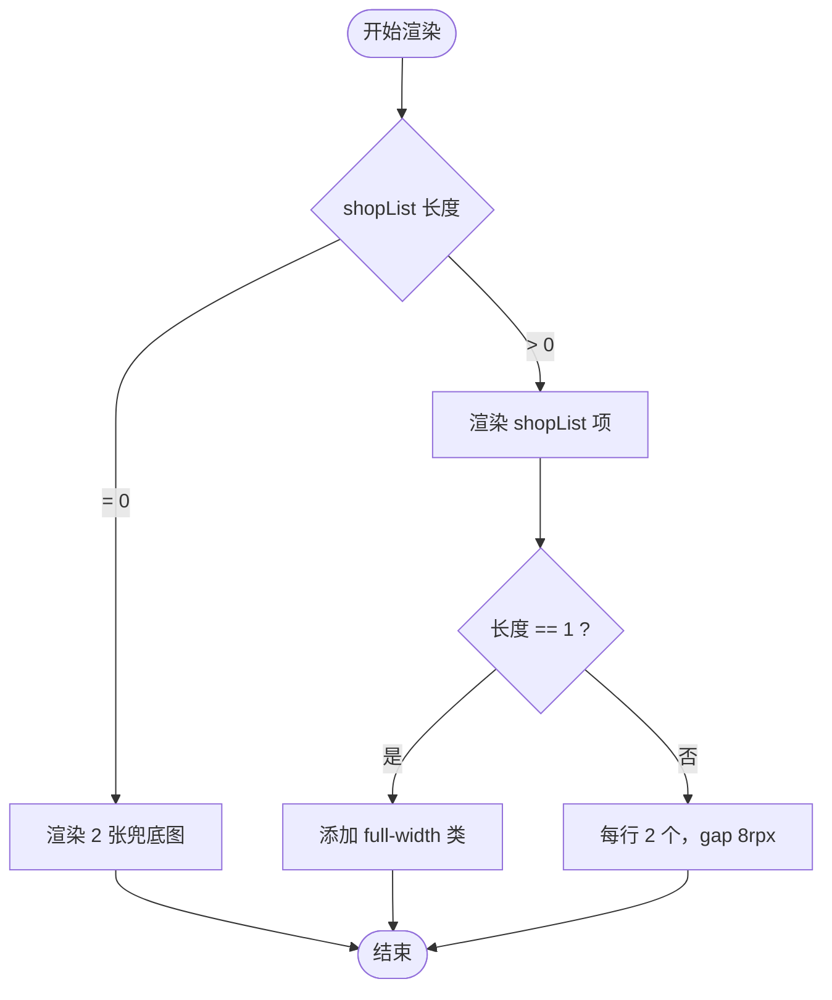
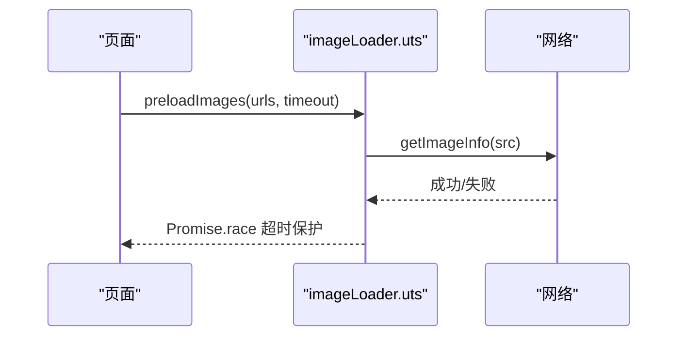
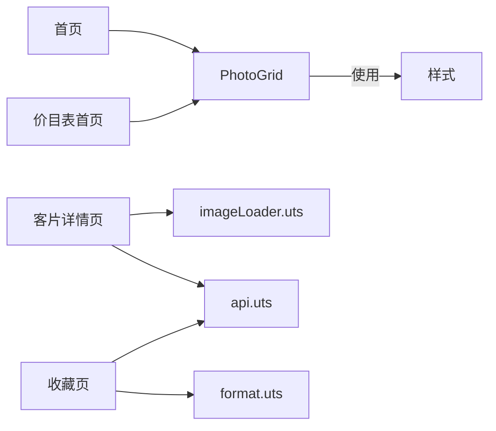

# 图片网格组件

<cite>
**本文引用的文件**
- [PhotoGrid.uvue](file://src/components/PhotoGrid/PhotoGrid.uvue)
- [index.uvue（首页）](file://src/pages/index/index.uvue)
- [index.uvue（价目表首页）](file://src/pages/priceHomePage/index.uvue)
- [demoDetail/index.uvue](file://src/pages/demoDetail/index.uvue)
- [favorites/index.uvue](file://src/pages/favorites/index.uvue)
- [imageLoader.uts](file://src/utils/imageLoader.uts)
- [api.uts](file://src/utils/api.uts)
- [format.uts](file://src/utils/format.uts)
- [README.md（静态资源说明）](file://src/static/README.md)
</cite>

## 目录
1. [简介](#简介)
2. [项目结构](#项目结构)
3. [核心组件](#核心组件)
4. [架构总览](#架构总览)
5. [详细组件分析](#详细组件分析)
6. [依赖关系分析](#依赖关系分析)
7. [性能考量](#性能考量)
8. [故障排查指南](#故障排查指南)
9. [结论](#结论)
10. [附录](#附录)

## 简介
本文件为图片网格组件 PhotoGrid 的综合技术文档，面向前端工程师与产品/运营同学，系统阐述组件的设计理念、实现原理、接口规范、渲染优化策略、扩展性与最佳实践，并提供性能监控与调试建议。该组件用于在多个页面中统一展示“店铺卡片”或“示例兜底卡片”，具备响应式网格布局、点击事件透传、占位图回退等能力。

## 项目结构
PhotoGrid 组件位于组件目录，被首页与价目表首页直接复用；同时在客片详情页与收藏页中，也存在类似的网格布局与图片加载策略，便于理解整体的图片渲染体系。

图表来源
- [PhotoGrid.uvue:1-119](file://src/components/PhotoGrid/PhotoGrid.uvue#L1-L119)
- [index.uvue（首页）:25-292](file://src/pages/index/index.uvue#L25-L292)
- [index.uvue（价目表首页）:16-66](file://src/pages/priceHomePage/index.uvue#L16-L66)
- [demoDetail/index.uvue:295-302](file://src/pages/demoDetail/index.uvue#L295-L302)
- [favorites/index.uvue:78-243](file://src/pages/favorites/index.uvue#L78-L243)
- [imageLoader.uts:1-28](file://src/utils/imageLoader.uts#L1-L28)
- [api.uts:286-297](file://src/utils/api.uts#L286-L297)
- [format.uts:1-16](file://src/utils/format.uts#L1-L16)

章节来源
- [PhotoGrid.uvue:1-119](file://src/components/PhotoGrid/PhotoGrid.uvue#L1-L119)
- [index.uvue（首页）:25-292](file://src/pages/index/index.uvue#L25-L292)
- [index.uvue（价目表首页）:16-66](file://src/pages/priceHomePage/index.uvue#L16-L66)
- [demoDetail/index.uvue:295-302](file://src/pages/demoDetail/index.uvue#L295-L302)
- [favorites/index.uvue:78-243](file://src/pages/favorites/index.uvue#L78-L243)
- [imageLoader.uts:1-28](file://src/utils/imageLoader.uts#L1-L28)
- [api.uts:286-297](file://src/utils/api.uts#L286-L297)
- [format.uts:1-16](file://src/utils/format.uts#L1-L16)

## 核心组件
PhotoGrid 是一个轻量的展示型组件，负责：
- 接收数据源 shopList（数组）
- 根据数量决定布局：单个时整行铺满，多个时两列等分布局
- 透传点击事件：店铺卡片点击与兜底示例图点击
- 内置样式：容器、卡片、图片、遮罩文字等

其 props 与事件如下：
- props
  - shopList: Array（必填）
- emits
  - shop-click(shop)
  - demo-click(idx)

章节来源
- [PhotoGrid.uvue:47-64](file://src/components/PhotoGrid/PhotoGrid.uvue#L47-L64)

## 架构总览
PhotoGrid 在多个页面中被复用，首页与价目表首页通过绑定 shopList 并透传点击事件，实现统一的网格展示与导航跳转。客片详情页与收藏页虽然未直接使用 PhotoGrid，但采用了类似的网格布局与图片加载策略（预加载、骨架屏、占位图），体现了组件化的统一设计。

图表来源
- [index.uvue（首页）:283-292](file://src/pages/index/index.uvue#L283-L292)
- [index.uvue（价目表首页）:57-66](file://src/pages/priceHomePage/index.uvue#L57-L66)
- [PhotoGrid.uvue:56-62](file://src/components/PhotoGrid/PhotoGrid.uvue#L56-L62)

章节来源
- [index.uvue（首页）:283-292](file://src/pages/index/index.uvue#L283-L292)
- [index.uvue（价目表首页）:57-66](file://src/pages/priceHomePage/index.uvue#L57-L66)
- [PhotoGrid.uvue:56-62](file://src/components/PhotoGrid/PhotoGrid.uvue#L56-L62)

## 详细组件分析

### 组件结构与布局算法
- 容器采用 flex 布局，wrap 换行，gap 为固定间距
- 单个元素时整行铺满（full-width 类控制）
- 多个元素时每行 2 个，每个占 (100% - gap) / 2
- 奇数时最后一个仍占一半宽度，自然左对齐
- 无数据时回退到 2 张示例兜底图，复用相同布局

图表来源
- [PhotoGrid.uvue:17-44](file://src/components/PhotoGrid/PhotoGrid.uvue#L17-L44)
- [PhotoGrid.uvue:67-118](file://src/components/PhotoGrid/PhotoGrid.uvue#L67-L118)

章节来源
- [PhotoGrid.uvue:17-44](file://src/components/PhotoGrid/PhotoGrid.uvue#L17-L44)
- [PhotoGrid.uvue:67-118](file://src/components/PhotoGrid/PhotoGrid.uvue#L67-L118)

### Props 接口设计
- shopList: Array（必填）
  - 数据形态：数组，元素包含展示所需字段（如 homeImage、displayName、displayNameEn 等）
  - 作用：作为网格渲染的数据源
- 事件透传
  - shop-click(shop)：点击某一个店铺卡片
  - demo-click(idx)：点击兜底示例图（idx=1 或 2）

章节来源
- [PhotoGrid.uvue:47-64](file://src/components/PhotoGrid/PhotoGrid.uvue#L47-L64)

### 样式与主题适配
- 容器：flex 容器，wrap，gap 固定
- 卡片：相对定位，宽度根据数量动态计算
- 图片：默认填满卡片，单个时全宽
- 文案遮罩：绝对定位，渐变背景，中英文名称叠加显示
- 响应式：通过百分比宽度与 gap 计算，适配不同屏幕宽度

章节来源
- [PhotoGrid.uvue:67-118](file://src/components/PhotoGrid/PhotoGrid.uvue#L67-L118)

### 交互行为与导航
- 点击事件通过 emits 透传给父组件
- 父组件根据业务场景进行路由跳转（如打开客片详情页）
- 价目表首页与首页分别绑定不同的跳转逻辑

章节来源
- [PhotoGrid.uvue:56-62](file://src/components/PhotoGrid/PhotoGrid.uvue#L56-L62)
- [index.uvue（首页）:283-292](file://src/pages/index/index.uvue#L283-L292)
- [index.uvue（价目表首页）:57-66](file://src/pages/priceHomePage/index.uvue#L57-L66)

### 图片加载优化策略
- 预加载工具：imageLoader.uts 提供单图与批量预加载能力，避免切换页面时出现白屏
- 骨架屏：在数据加载期间显示骨架屏，提升感知速度
- 占位图：当 shopList 为空时，回退到本地示例图（demo1.png、demo2.png）
- 错误处理：预加载失败不中断整体流程，Promise.race 超时保护避免阻塞

图表来源
- [imageLoader.uts:8-27](file://src/utils/imageLoader.uts#L8-L27)
- [demoDetail/index.uvue:295-302](file://src/pages/demoDetail/index.uvue#L295-L302)

章节来源
- [imageLoader.uts:1-28](file://src/utils/imageLoader.uts#L1-L28)
- [demoDetail/index.uvue:295-302](file://src/pages/demoDetail/index.uvue#L295-L302)
- [README.md（静态资源说明）](file://src/static/README.md#L18)

### 数据源与接口
- 店铺列表：通过 getShops 获取，返回 ShopInfo 数组
- 客片详情页与收藏页：通过 getAlbumList、getFavoriteList 等接口获取数据
- 数字格式化：formatCount 统一处理点赞/收藏数显示

章节来源
- [api.uts:286-297](file://src/utils/api.uts#L286-L297)
- [api.uts:86-111](file://src/utils/api.uts#L86-L111)
- [api.uts:251-259](file://src/utils/api.uts#L251-L259)
- [format.uts:1-16](file://src/utils/format.uts#L1-L16)

### 使用示例与最佳实践
- 在首页与价目表首页中，直接绑定 shopList 并监听点击事件，实现统一网格展示
- 在需要预加载首屏封面图的页面，使用 imageLoader.preloadImages 进行批量预加载
- 当数据为空时，组件会自动回退到兜底示例图，无需额外处理
- 建议在父组件中对 shopList 做空值与类型校验，确保渲染稳定

章节来源
- [index.uvue（首页）:25-292](file://src/pages/index/index.uvue#L25-L292)
- [index.uvue（价目表首页）:16-66](file://src/pages/priceHomePage/index.uvue#L16-L66)
- [demoDetail/index.uvue:331-342](file://src/pages/demoDetail/index.uvue#L331-L342)

### 扩展性设计
- 自定义布局：可通过外部样式覆盖容器与卡片宽度，实现 3 列或 4 列布局
- 主题切换：通过外部变量控制 gap、颜色、字体大小等，实现深浅主题
- 动画效果：可在父组件中为卡片添加过渡动画，提升交互体验
- 事件扩展：可增加更多透传事件（如长按、双击等），由父组件处理

章节来源
- [PhotoGrid.uvue:67-118](file://src/components/PhotoGrid/PhotoGrid.uvue#L67-L118)

## 依赖关系分析
- 组件依赖
  - 无第三方依赖，纯样式与模板逻辑
- 页面依赖
  - 首页与价目表首页直接复用 PhotoGrid
  - 客片详情页与收藏页采用类似布局与图片加载策略
- 工具依赖
  - imageLoader.uts：图片预加载与超时保护
  - api.uts：获取店铺列表与客片数据
  - format.uts：数字格式化

图表来源
- [PhotoGrid.uvue:67-118](file://src/components/PhotoGrid/PhotoGrid.uvue#L67-L118)
- [index.uvue（首页）:25-292](file://src/pages/index/index.uvue#L25-L292)
- [index.uvue（价目表首页）:16-66](file://src/pages/priceHomePage/index.uvue#L16-L66)
- [demoDetail/index.uvue:295-302](file://src/pages/demoDetail/index.uvue#L295-L302)
- [favorites/index.uvue:78-243](file://src/pages/favorites/index.uvue#L78-L243)
- [imageLoader.uts:1-28](file://src/utils/imageLoader.uts#L1-L28)
- [api.uts:1-312](file://src/utils/api.uts#L1-L312)
- [format.uts:1-16](file://src/utils/format.uts#L1-L16)

章节来源
- [PhotoGrid.uvue:67-118](file://src/components/PhotoGrid/PhotoGrid.uvue#L67-L118)
- [index.uvue（首页）:25-292](file://src/pages/index/index.uvue#L25-L292)
- [index.uvue（价目表首页）:16-66](file://src/pages/priceHomePage/index.uvue#L16-L66)
- [demoDetail/index.uvue:295-302](file://src/pages/demoDetail/index.uvue#L295-L302)
- [favorites/index.uvue:78-243](file://src/pages/favorites/index.uvue#L78-L243)
- [imageLoader.uts:1-28](file://src/utils/imageLoader.uts#L1-L28)
- [api.uts:1-312](file://src/utils/api.uts#L1-L312)
- [format.uts:1-16](file://src/utils/format.uts#L1-L16)

## 性能考量
- 渲染性能
  - 使用 flex 布局与固定 gap，减少复杂计算
  - 单个元素整行铺满，避免额外的列计算
- 图片加载
  - 预加载避免白屏，Promise.race 超时保护避免阻塞
  - 骨架屏提升感知速度，改善用户体验
- 内存占用
  - 组件无复杂状态，渲染成本低
  - 建议在父组件中对大列表做虚拟滚动或分页，降低内存压力

章节来源
- [PhotoGrid.uvue:67-118](file://src/components/PhotoGrid/PhotoGrid.uvue#L67-L118)
- [imageLoader.uts:18-27](file://src/utils/imageLoader.uts#L18-L27)
- [demoDetail/index.uvue:29-33](file://src/pages/demoDetail/index.uvue#L29-L33)

## 故障排查指南
- 图片不显示
  - 检查 shopList 是否为空，组件会在空数据时回退到兜底图
  - 确认 homeImage 字段是否存在且有效
- 白屏问题
  - 在进入页面前调用 imageLoader.preloadImages 预加载首屏封面图
  - 设置合理的超时时间，避免长时间等待
- 布局异常
  - 确认容器宽度与 gap 设置是否正确
  - 检查外部样式是否覆盖了关键属性
- 事件未触发
  - 确认父组件是否正确监听 shop-click 与 demo-click 事件
  - 检查点击区域是否被遮挡

章节来源
- [PhotoGrid.uvue:17-44](file://src/components/PhotoGrid/PhotoGrid.uvue#L17-L44)
- [PhotoGrid.uvue:56-62](file://src/components/PhotoGrid/PhotoGrid.uvue#L56-L62)
- [imageLoader.uts:18-27](file://src/utils/imageLoader.uts#L18-L27)
- [README.md（静态资源说明）](file://src/static/README.md#L18)

## 结论
PhotoGrid 组件通过简洁的 props 接口与统一的网格布局，实现了跨页面的图片展示一致性。结合预加载、骨架屏与兜底图策略，显著提升了首屏体验与稳定性。建议在实际项目中：
- 在父组件中做好数据校验与分页
- 使用 imageLoader 进行首屏预加载
- 通过外部样式与事件扩展满足定制化需求
- 持续关注渲染性能与内存占用，必要时引入虚拟滚动

## 附录
- 静态资源说明：包含示例兜底图与图标等资源清单，便于替换与扩展
- 接口文档：包含获取店铺列表、客片列表、收藏列表等接口定义

章节来源
- [README.md（静态资源说明）:1-33](file://src/static/README.md#L1-L33)
- [api.uts:286-297](file://src/utils/api.uts#L286-L297)
- [api.uts:86-111](file://src/utils/api.uts#L86-L111)
- [api.uts:251-259](file://src/utils/api.uts#L251-L259)