# 客片列表展示

<cite>
**本文档引用的文件**
- [api.uts](file://src/utils/api.uts)
- [http.uts](file://src/utils/http.uts)
- [demoDetail/index.uvue](file://src/pages/demoDetail/index.uvue)
- [favorites/index.uvue](file://src/pages/favorites/index.uvue)
- [PhotoGrid.uvue](file://src/components/PhotoGrid/PhotoGrid.uvue)
- [imageLoader.uts](file://src/utils/imageLoader.uts)
- [format.uts](file://src/utils/format.uts)
- [auth.uts](file://src/utils/auth.uts)
- [index/index.uvue](file://src/pages/index/index.uvue)
- [aiRecommend/index.uvue](file://src/pages/aiRecommend/index.uvue)
</cite>

## 更新摘要
**变更内容**
- 新增AI智能推荐横幅组件，提供AI拍照选服饰功能入口
- 优化分类区域设计，改进标题装饰和标签样式
- 调整照片卡片布局和间距，提升视觉呈现效果
- 增强用户交互体验，包括更好的加载状态和反馈机制

## 目录
1. [简介](#简介)
2. [项目结构](#项目结构)
3. [核心组件](#核心组件)
4. [架构概览](#架构概览)
5. [详细组件分析](#详细组件分析)
6. [依赖关系分析](#依赖关系分析)
7. [性能考虑](#性能考虑)
8. [故障排除指南](#故障排除指南)
9. [结论](#结论)
10. [附录](#附录)

## 简介

本项目是一个基于 Vue.js 和 uni-app 的客片展示应用，专注于为用户提供高质量的客片浏览体验。本文档深入解析客片列表展示功能的完整实现，包括 getAlbumList 接口的分页机制、搜索功能、分类筛选等核心特性，以及 PhotoGrid 组件的设计原理和实现细节。

该系统采用模块化的架构设计，通过清晰的职责分离实现了高效的数据获取、缓存策略和加载状态管理。系统支持多种交互模式，包括分类浏览、关键词搜索、收藏管理等，为用户提供了丰富的客片探索体验。**最新更新**增加了AI智能推荐功能，用户可以通过上传照片获得个性化的服饰风格推荐。

## 项目结构

项目采用基于功能模块的组织方式，主要包含以下核心目录结构：

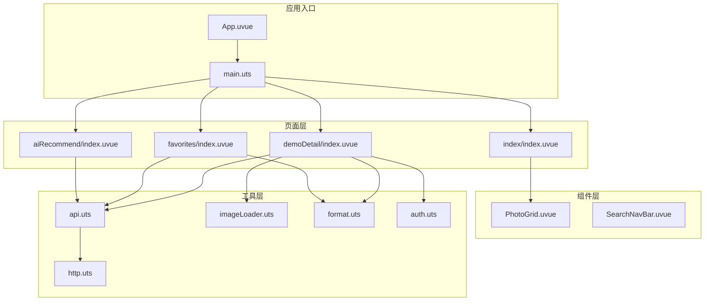

**图表来源**
- [index/index.uvue:1-359](file://src/pages/index/index.uvue#L1-L359)
- [demoDetail/index.uvue:1-1042](file://src/pages/demoDetail/index.uvue#L1-L1042)
- [favorites/index.uvue:1-406](file://src/pages/favorites/index.uvue#L1-L406)
- [aiRecommend/index.uvue:1-635](file://src/pages/aiRecommend/index.uvue#L1-L635)

**章节来源**
- [index/index.uvue:1-359](file://src/pages/index/index.uvue#L1-L359)
- [demoDetail/index.uvue:1-1042](file://src/pages/demoDetail/index.uvue#L1-L1042)
- [favorites/index.uvue:1-406](file://src/pages/favorites/index.uvue#L1-L406)

## 核心组件

### 数据模型定义

系统的核心数据结构围绕客片信息进行设计，主要包括以下接口定义：

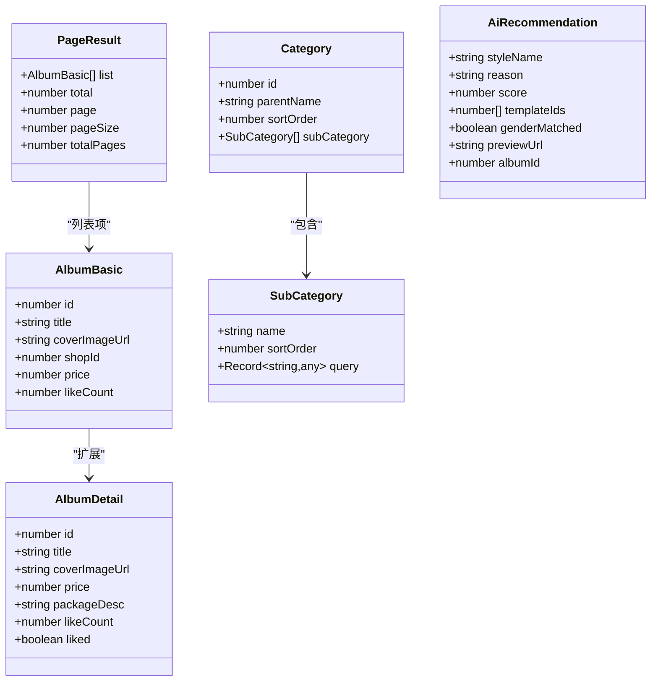

**图表来源**
- [api.uts:6-13](file://src/utils/api.uts#L6-L13)
- [api.uts:65-76](file://src/utils/api.uts#L65-L76)
- [api.uts:267-273](file://src/utils/api.uts#L267-L273)
- [api.uts:686-705](file://src/utils/api.uts#L686-L705)

### 接口设计

系统提供了一系列标准化的 API 接口，用于处理客片相关的各种操作：

| 接口名称 | 方法 | 参数 | 功能描述 |
|---------|------|------|----------|
| getCategories | GET | shopId | 获取客片分类信息 |
| getAlbumList | GET | shopId, query, keyword, page, size | 获取客片列表（支持分页和搜索） |
| getAlbumDetail | GET | albumId | 获取客片详情 |
| searchAlbums | GET | keyword, page, size | 模糊搜索客片 |
| toggleLike | POST | albumId | 点赞/取消点赞 |
| getLikeStatus | GET | albumIds | 批量查询点赞状态 |
| uploadPhoto | POST | photoPath | AI推荐照片上传 |
| getCreditBalance | GET | shopId, feature | 查询推荐次数余额 |

**章节来源**
- [api.uts:55-76](file://src/utils/api.uts#L55-L76)
- [api.uts:86-111](file://src/utils/api.uts#L86-L111)
- [api.uts:275-283](file://src/utils/api.uts#L275-L283)
- [api.uts:656-683](file://src/utils/api.uts#L656-L683)

## 架构概览

系统采用分层架构设计，通过清晰的职责分离实现了高效的客片展示功能：

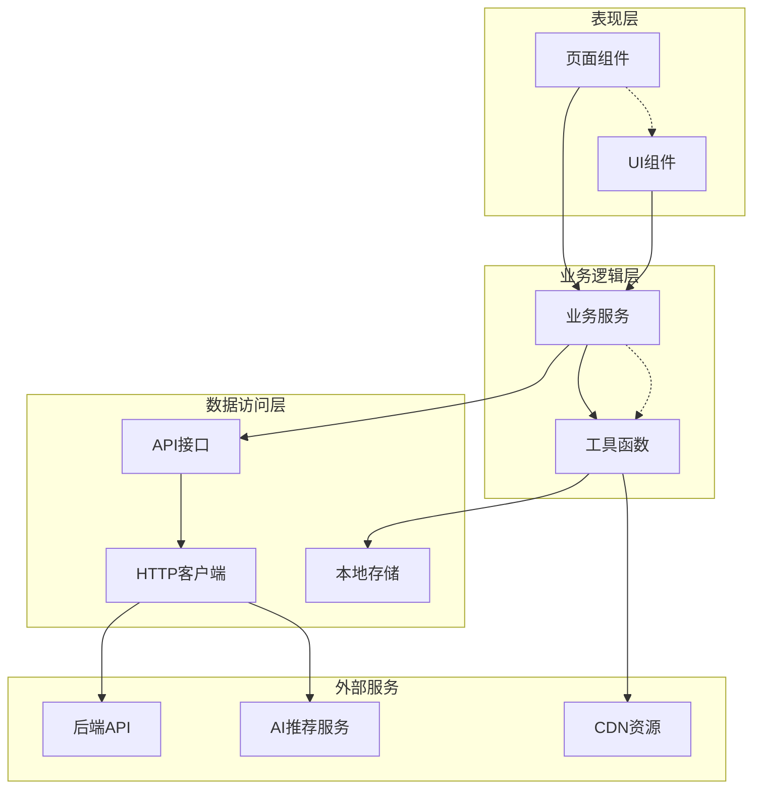

**图表来源**
- [demoDetail/index.uvue:189-708](file://src/pages/demoDetail/index.uvue#L189-L708)
- [api.uts:1-312](file://src/utils/api.uts#L1-L312)
- [http.uts:20-73](file://src/utils/http.uts#L20-L73)

### 控制流分析

系统的核心控制流程遵循标准的 MVVM 模式，通过数据绑定和事件驱动实现响应式更新：

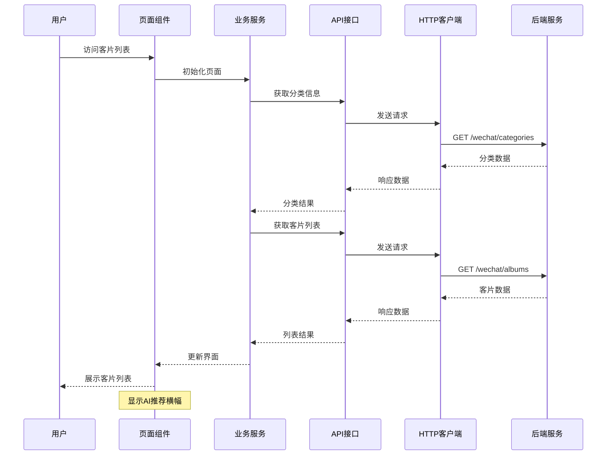

**图表来源**
- [demoDetail/index.uvue:304-343](file://src/pages/demoDetail/index.uvue#L304-L343)
- [api.uts:55-76](file://src/utils/api.uts#L55-L76)
- [api.uts:86-111](file://src/utils/api.uts#L86-L111)

**章节来源**
- [demoDetail/index.uvue:189-708](file://src/pages/demoDetail/index.uvue#L189-L708)
- [api.uts:1-312](file://src/utils/api.uts#L1-L312)

## 详细组件分析

### AI智能推荐横幅组件

**新增功能** 客片详情页新增了AI智能推荐横幅组件，为用户提供AI拍照选服饰功能入口：

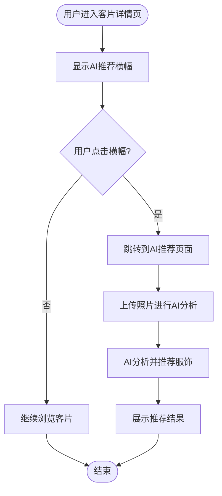

**图表来源**
- [demoDetail/index.uvue:80-87](file://src/pages/demoDetail/index.uvue#L80-L87)
- [aiRecommend/index.uvue:1-635](file://src/pages/aiRecommend/index.uvue#L1-L635)

#### 横幅组件特性

1. **视觉设计**：采用渐变背景和精美边框设计，突出AI推荐功能
2. **交互体验**：点击后直接跳转到AI推荐页面，提供无缝的用户体验
3. **响应式布局**：适配不同屏幕尺寸，确保良好的视觉效果

**章节来源**
- [demoDetail/index.uvue:80-87](file://src/pages/demoDetail/index.uvue#L80-L87)
- [demoDetail/index.uvue:1004-1039](file://src/pages/demoDetail/index.uvue#L1004-L1039)

### PhotoGrid 组件分析

PhotoGrid 组件是客片网格展示的核心组件，负责统一管理客片卡片的布局和交互：

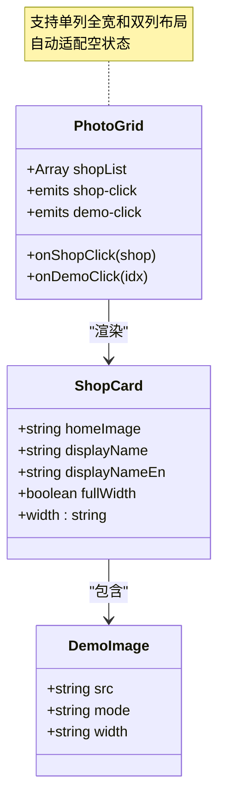

**图表来源**
- [PhotoGrid.uvue:47-64](file://src/components/PhotoGrid/PhotoGrid.uvue#L47-L64)
- [PhotoGrid.uvue:17-43](file://src/components/PhotoGrid/PhotoGrid.uvue#L17-L43)

#### 组件特性

1. **智能布局算法**：根据列表长度自动调整布局模式
   - 单个元素时使用全宽布局
   - 多个元素时使用双列网格布局
   - 奇数情况下最后一个元素保持半宽

2. **事件处理机制**：通过事件透传实现灵活的交互
   - `shop-click`：处理客片点击事件
   - `demo-click`：处理演示图片点击事件

3. **样式系统**：采用响应式设计确保在不同设备上的良好表现

**章节来源**
- [PhotoGrid.uvue:1-119](file://src/components/PhotoGrid/PhotoGrid.uvue#L1-L119)

### 客片列表页面分析

客片列表页面是系统的核心交互界面，实现了完整的客片浏览体验：

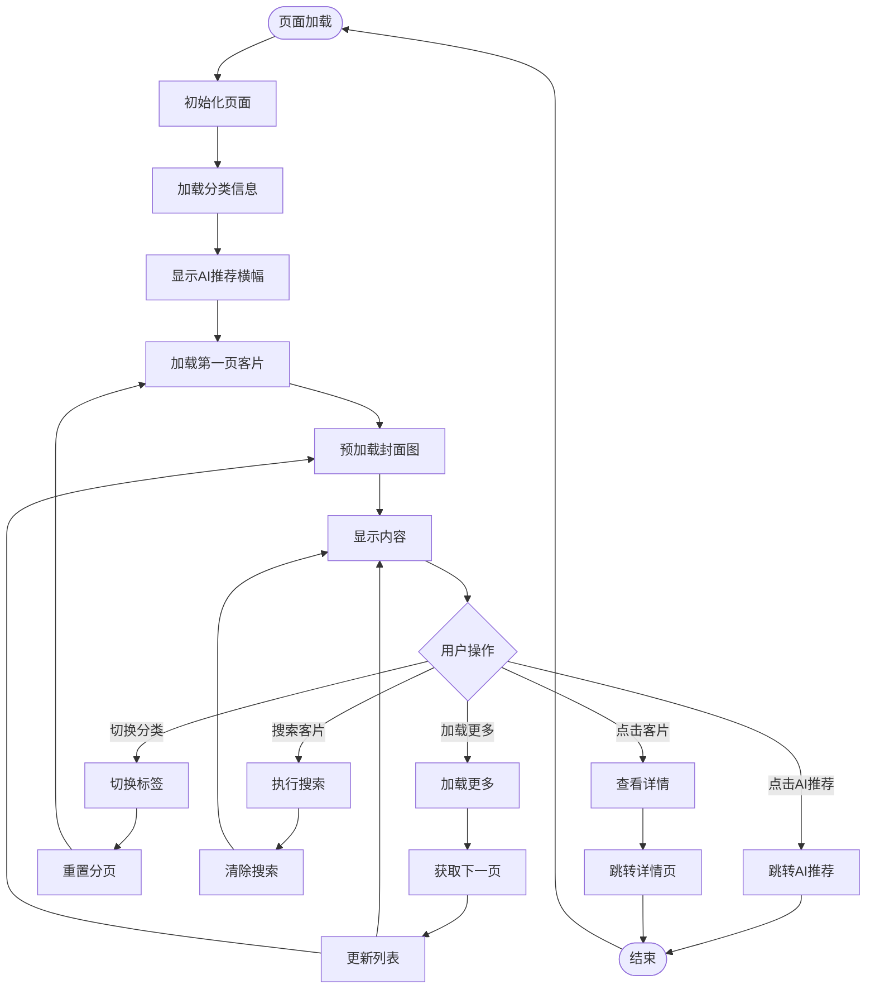

**图表来源**
- [demoDetail/index.uvue:304-343](file://src/pages/demoDetail/index.uvue#L304-L343)
- [demoDetail/index.uvue:345-386](file://src/pages/demoDetail/index.uvue#L345-L386)

#### 分页机制实现

系统实现了完整的分页机制，支持两种模式：

1. **分类模式分页**：基于分类筛选的分页加载
2. **搜索模式分页**：基于关键词搜索的分页加载

分页参数定义：
- `page`：当前页码，默认为 1
- `size`：每页大小，默认为 10
- `total`：总记录数
- `noMore`：是否还有更多数据

**章节来源**
- [demoDetail/index.uvue:215-231](file://src/pages/demoDetail/index.uvue#L215-L231)
- [demoDetail/index.uvue:345-386](file://src/pages/demoDetail/index.uvue#L345-L386)

### 搜索功能实现

系统提供了双重搜索机制，满足不同的搜索需求：

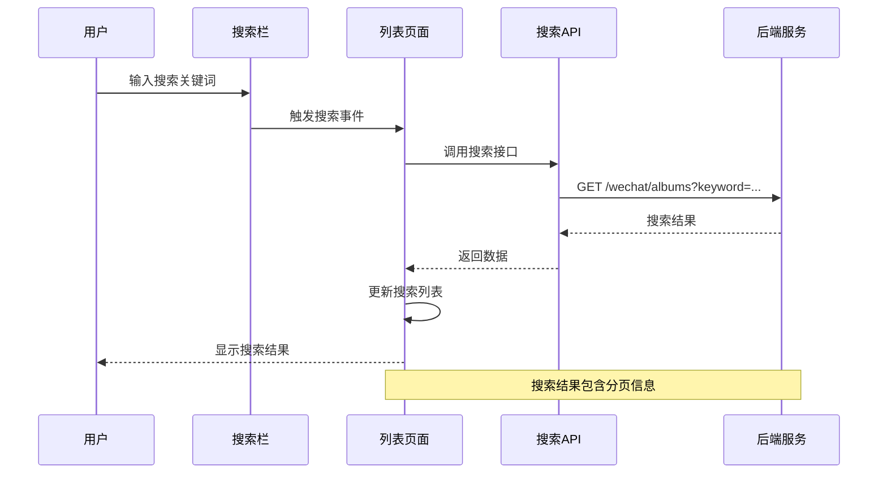

**图表来源**
- [demoDetail/index.uvue:388-460](file://src/pages/demoDetail/index.uvue#L388-L460)
- [api.uts:275-283](file://src/utils/api.uts#L275-L283)

#### 搜索参数处理

搜索功能支持以下参数：
- `keyword`：搜索关键词
- `page`：页码
- `size`：每页大小
- `shopId`：店铺ID（必需）

**章节来源**
- [demoDetail/index.uvue:388-460](file://src/pages/demoDetail/index.uvue#L388-L460)

### 分类筛选系统

系统实现了多级分类筛选机制，提供灵活的客片分类浏览：

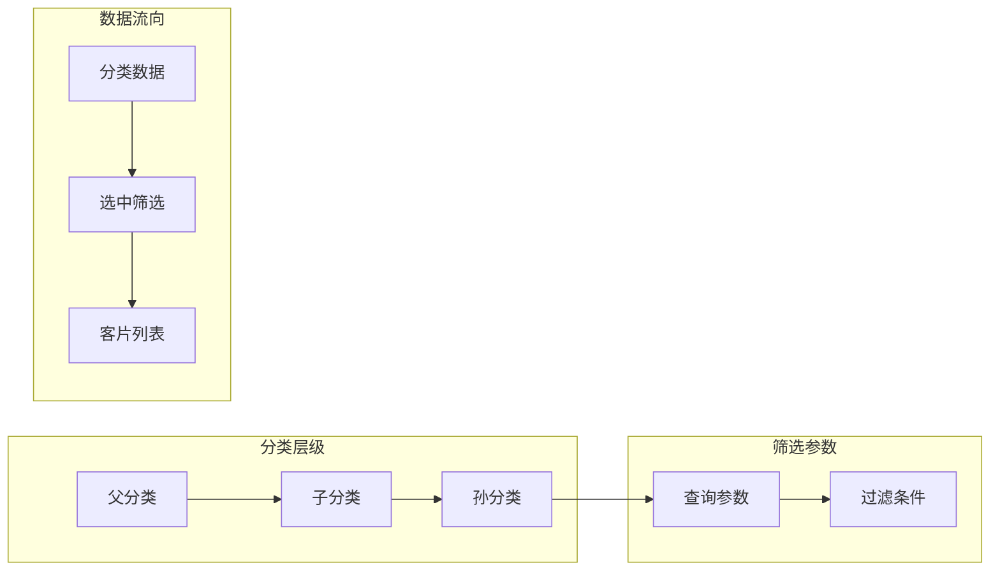

**图表来源**
- [demoDetail/index.uvue:500-518](file://src/pages/demoDetail/index.uvue#L500-L518)
- [api.uts:55-76](file://src/utils/api.uts#L55-L76)

#### 分类数据结构

分类系统采用嵌套结构设计：
- 父分类包含多个子分类
- 子分类包含具体的查询参数
- 查询参数通过 `query` 对象传递给 API

**章节来源**
- [demoDetail/index.uvue:500-518](file://src/pages/demoDetail/index.uvue#L500-L518)

## 依赖关系分析

系统采用模块化设计，各组件之间的依赖关系清晰明确：

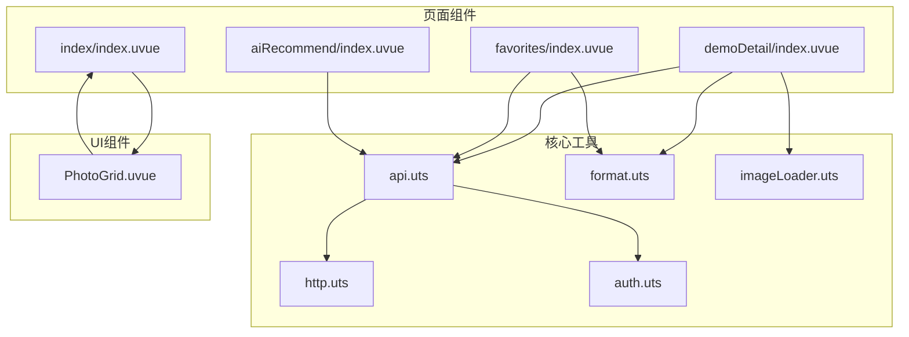

**图表来源**
- [demoDetail/index.uvue:189-201](file://src/pages/demoDetail/index.uvue#L189-L201)
- [favorites/index.uvue:78-81](file://src/pages/favorites/index.uvue#L78-L81)
- [index/index.uvue:97-101](file://src/pages/index/index.uvue#L97-L101)
- [aiRecommend/index.uvue:104-115](file://src/pages/aiRecommend/index.uvue#L104-L115)

### 数据流分析

系统实现了完整的数据流管理，确保数据在各个组件间的正确传递：

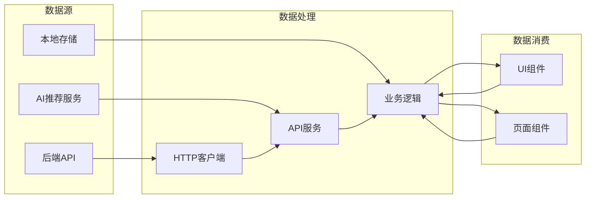

**图表来源**
- [http.uts:20-73](file://src/utils/http.uts#L20-L73)
- [api.uts:1-312](file://src/utils/api.uts#L1-L312)

**章节来源**
- [http.uts:1-82](file://src/utils/http.uts#L1-L82)
- [api.uts:1-312](file://src/utils/api.uts#L1-L312)

## 性能考虑

系统在设计时充分考虑了性能优化，采用了多种策略提升用户体验：

### 图片加载优化

1. **预加载机制**：在页面初始化时预加载首屏图片，避免白屏现象
2. **懒加载策略**：使用 uni-app 的图片懒加载能力
3. **缓存策略**：利用 uni-app 的图片缓存机制

### 数据加载优化

1. **并发请求**：使用 Promise.all 并行加载多个数据源
2. **分页加载**：实现无限滚动的分页加载机制
3. **防抖处理**：对频繁的搜索操作进行防抖处理

### 内存管理

1. **组件卸载清理**：在组件销毁时清理定时器和事件监听器
2. **数据清理**：及时清理不再使用的数据引用
3. **内存监控**：定期检查内存使用情况

**章节来源**
- [demoDetail/index.uvue:331-342](file://src/pages/demoDetail/index.uvue#L331-L342)
- [imageLoader.uts:8-27](file://src/utils/imageLoader.uts#L8-L27)

## 故障排除指南

### 常见问题及解决方案

#### 1. 网络请求失败

**问题症状**：页面加载空白或出现错误提示

**解决步骤**：
1. 检查网络连接状态
2. 验证 API 端点可用性
3. 查看控制台错误日志
4. 确认 token 有效性

#### 2. 图片加载失败

**问题症状**：客片图片显示为占位符

**解决步骤**：
1. 检查图片 URL 是否有效
2. 验证 CDN 服务状态
3. 确认图片权限设置
4. 实施图片降级策略

#### 3. 分页加载异常

**问题症状**：加载更多按钮无效或重复加载

**解决步骤**：
1. 检查分页参数传递
2. 验证服务器响应格式
3. 确认 noMore 标志位更新
4. 实施加载状态防重复机制

#### 4. AI推荐功能异常

**问题症状**：AI推荐横幅无法点击或推荐功能失效

**解决步骤**：
1. 检查网络连接状态
2. 验证AI服务接口可用性
3. 确认用户登录状态
4. 检查推荐次数余额

**章节来源**
- [demoDetail/index.uvue:377-385](file://src/pages/demoDetail/index.uvue#L377-L385)
- [http.uts:50-61](file://src/utils/http.uts#L50-L61)

### 调试工具使用

系统提供了完善的调试工具支持：

1. **网络请求监控**：使用浏览器开发者工具查看 API 调用
2. **状态管理检查**：通过控制台检查全局状态变化
3. **性能分析**：使用性能面板分析页面加载时间
4. **内存泄漏检测**：定期检查内存使用情况

## 结论

本项目的客片列表展示功能实现了完整的客片浏览体验，具有以下特点：

1. **模块化设计**：清晰的职责分离和组件化架构
2. **性能优化**：多层缓存和预加载机制
3. **用户体验**：流畅的交互和响应式设计
4. **扩展性强**：支持自定义筛选和批量操作
5. **AI集成**：新增AI智能推荐功能，提供个性化服饰推荐

**最新更新**增强了用户体验，通过AI智能推荐横幅组件，用户可以上传照片获得专业的服饰风格建议。系统通过合理的架构设计和优化策略，为用户提供了高质量的客片展示服务。未来可以在以下方面进一步改进：
- 增加虚拟滚动支持大列表性能优化
- 实现更丰富的筛选条件
- 添加批量操作功能
- 优化离线缓存策略
- 扩展AI推荐功能范围

## 附录

### API 接口规范

#### getAlbumList 接口参数

| 参数名 | 类型 | 必填 | 描述 | 默认值 |
|--------|------|------|------|--------|
| shopId | number/string | 是 | 店铺ID | - |
| page | number | 否 | 页码 | 1 |
| size | number | 否 | 每页数量 | 10 |
| keyword | string | 否 | 搜索关键词 | - |
| parentId | number | 否 | 父分类ID | - |
| childId | number | 否 | 子分类ID | - |
| subName | string | 否 | 子分类名称 | - |

#### 返回数据结构

```typescript
interface AlbumListResponse {
  code: number;
  message: string;
  data: {
    albums: AlbumDetail[];
    total: number;
    page: number;
    size: number;
  };
}
```

### 组件属性配置

#### PhotoGrid 组件属性

| 属性名 | 类型 | 必填 | 描述 | 默认值 |
|--------|------|------|------|--------|
| shopList | Array | 是 | 客片数据列表 | - |
| onItemClick | Function | 否 | 点击事件处理器 | - |

### 开发最佳实践

1. **错误处理**：为所有异步操作提供适当的错误处理
2. **状态管理**：合理使用响应式数据管理页面状态
3. **性能监控**：定期检查页面性能指标
4. **代码规范**：遵循统一的代码风格和命名约定
5. **测试覆盖**：为关键功能编写单元测试和集成测试