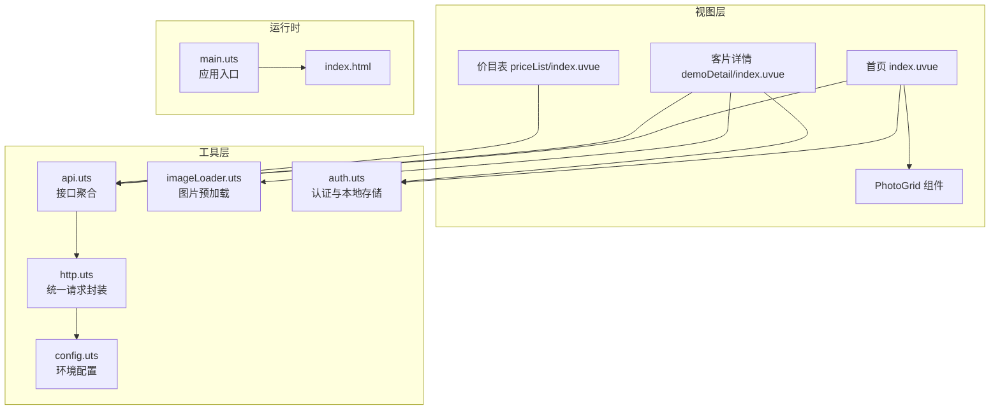
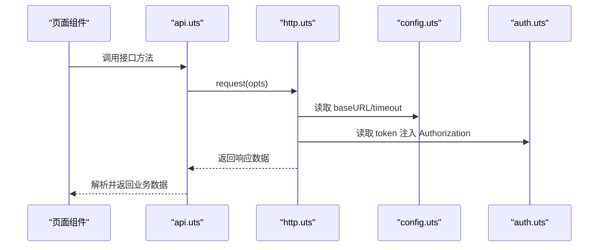
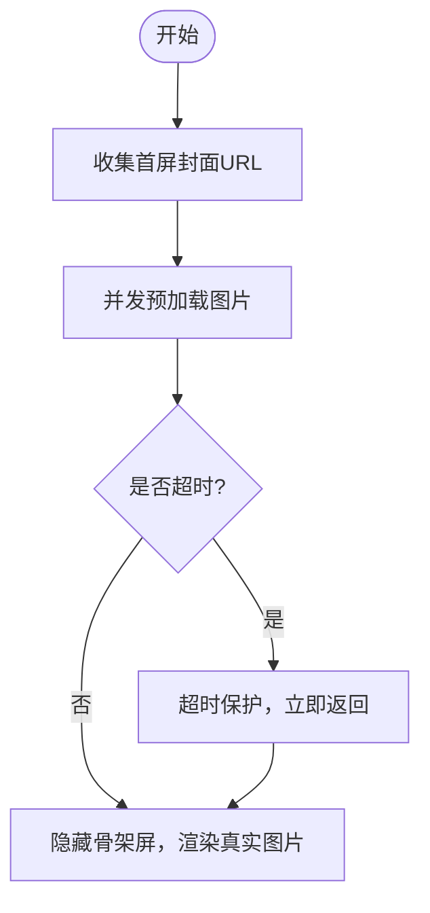
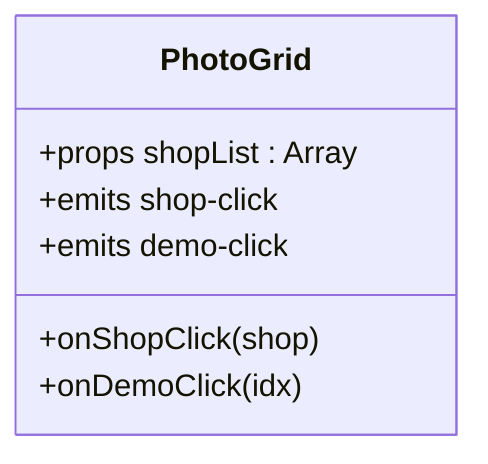
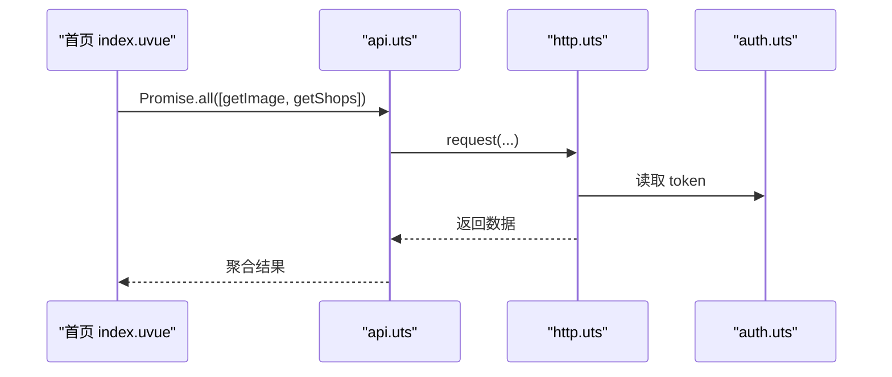
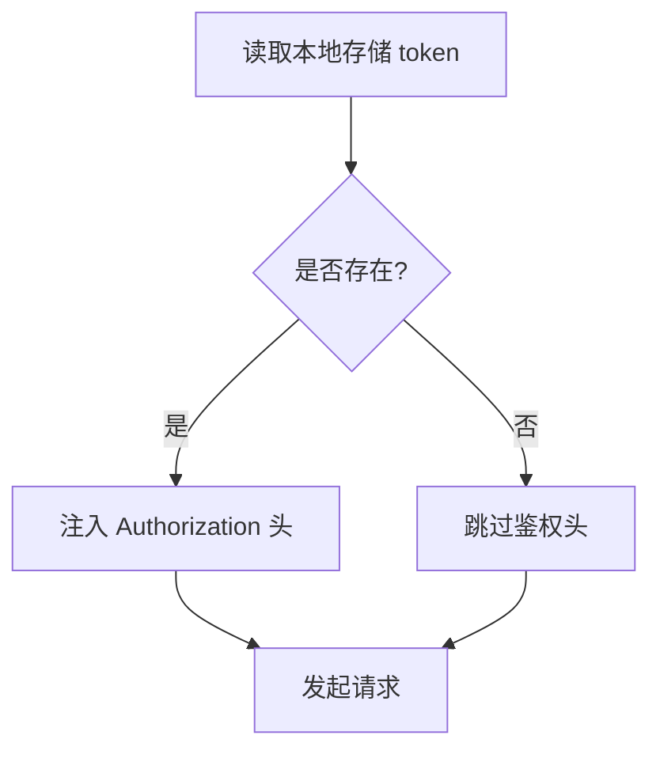
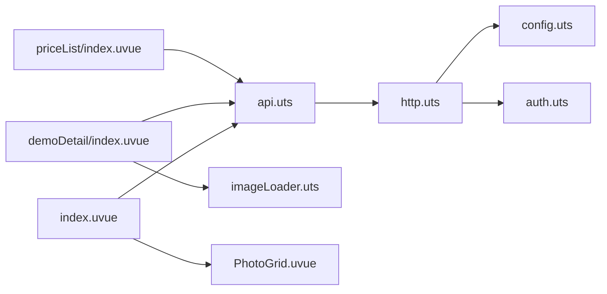

# 性能优化策略

<cite>
**本文引用的文件**
- [src/utils/imageLoader.uts](file://src/utils/imageLoader.uts)
- [src/utils/http.uts](file://src/utils/http.uts)
- [src/utils/api.uts](file://src/utils/api.uts)
- [src/utils/config.uts](file://src/utils/config.uts)
- [src/utils/auth.uts](file://src/utils/auth.uts)
- [src/components/PhotoGrid/PhotoGrid.uvue](file://src/components/PhotoGrid/PhotoGrid.uvue)
- [src/pages/index/index.uvue](file://src/pages/index/index.uvue)
- [src/pages/demoDetail/index.uvue](file://src/pages/demoDetail/index.uvue)
- [src/pages/priceList/index.uvue](file://src/pages/priceList/index.uvue)
- [src/App.uvue](file://src/App.uvue)
- [src/main.uts](file://src/main.uts)
- [index.html](file://index.html)
- [src/index.html](file://src/index.html)
</cite>

## 目录
1. [简介](#简介)
2. [项目结构](#项目结构)
3. [核心组件](#核心组件)
4. [架构总览](#架构总览)
5. [详细组件分析](#详细组件分析)
6. [依赖关系分析](#依赖关系分析)
7. [性能考量](#性能考量)
8. [故障排查指南](#故障排查指南)
9. [结论](#结论)
10. [附录](#附录)

## 简介
本文件围绕“列表展示性能优化”主题，系统梳理并总结本仓库在虚拟滚动、图片加载、数据缓存、列表渲染、网络请求以及性能监控等方面的现有实现与可优化点。文档以实际代码为依据，结合可视化图表，帮助开发者快速定位问题、制定优化策略。

## 项目结构
项目采用基于页面与组件的组织方式，核心性能相关能力集中在以下模块：
- 网络层：统一请求封装、鉴权注入、超时控制
- 数据层：接口聚合、分页与搜索、状态管理
- 视图层：骨架屏、图片懒加载、列表布局与交互
- 工具层：图片预加载、格式化、认证与本地存储

**图表来源**
- [src/pages/index/index.uvue:124-142](file://src/pages/index/index.uvue#L124-L142)
- [src/pages/demoDetail/index.uvue:253-275](file://src/pages/demoDetail/index.uvue#L253-L275)
- [src/pages/priceList/index.uvue:39-76](file://src/pages/priceList/index.uvue#L39-L76)
- [src/components/PhotoGrid/PhotoGrid.uvue:17-44](file://src/components/PhotoGrid/PhotoGrid.uvue#L17-L44)
- [src/utils/api.uts:27-36](file://src/utils/api.uts#L27-L36)
- [src/utils/http.uts:20-73](file://src/utils/http.uts#L20-L73)
- [src/utils/imageLoader.uts:8-27](file://src/utils/imageLoader.uts#L8-L27)
- [src/utils/auth.uts:21-117](file://src/utils/auth.uts#L21-L117)
- [src/utils/config.uts:7-11](file://src/utils/config.uts#L7-L11)
- [src/main.uts:1-9](file://src/main.uts#L1-L9)
- [index.html:1-20](file://index.html#L1-L20)
- [src/index.html:1-20](file://src/index.html#L1-L20)

**章节来源**
- [src/pages/index/index.uvue:124-142](file://src/pages/index/index.uvue#L124-L142)
- [src/pages/demoDetail/index.uvue:253-275](file://src/pages/demoDetail/index.uvue#L253-L275)
- [src/pages/priceList/index.uvue:39-76](file://src/pages/priceList/index.uvue#L39-L76)
- [src/components/PhotoGrid/PhotoGrid.uvue:17-44](file://src/components/PhotoGrid/PhotoGrid.uvue#L17-L44)
- [src/utils/api.uts:27-36](file://src/utils/api.uts#L27-L36)
- [src/utils/http.uts:20-73](file://src/utils/http.uts#L20-L73)
- [src/utils/imageLoader.uts:8-27](file://src/utils/imageLoader.uts#L8-L27)
- [src/utils/auth.uts:21-117](file://src/utils/auth.uts#L21-L117)
- [src/utils/config.uts:7-11](file://src/utils/config.uts#L7-L11)
- [src/main.uts:1-9](file://src/main.uts#L1-L9)
- [index.html:1-20](file://index.html#L1-L20)
- [src/index.html:1-20](file://src/index.html#L1-L20)

## 核心组件
- 网络请求层：统一注入鉴权头、超时控制、错误处理，支持 GET/POST 等方法
- 图片加载层：提供单图/多图预加载，带超时保护，避免白屏与无限等待
- 接口聚合层：封装轮播图、客片分类与列表、搜索、点赞/收藏等业务接口
- 认证与本地存储：token 与用户信息的持久化与合并写入
- 视图骨架屏：在数据加载期间提供占位动画，改善感知性能
- 列表组件：PhotoGrid 统一网格布局与点击事件透传

**章节来源**
- [src/utils/http.uts:20-73](file://src/utils/http.uts#L20-L73)
- [src/utils/imageLoader.uts:8-27](file://src/utils/imageLoader.uts#L8-L27)
- [src/utils/api.uts:27-36](file://src/utils/api.uts#L27-L36)
- [src/utils/auth.uts:21-117](file://src/utils/auth.uts#L21-L117)
- [src/App.uvue:58-154](file://src/App.uvue#L58-L154)
- [src/components/PhotoGrid/PhotoGrid.uvue:17-44](file://src/components/PhotoGrid/PhotoGrid.uvue#L17-L44)

## 架构总览
下图展示了从页面到网络层的关键调用路径与职责边界：

**图表来源**
- [src/pages/index/index.uvue:124-142](file://src/pages/index/index.uvue#L124-L142)
- [src/utils/api.uts:27-36](file://src/utils/api.uts#L27-L36)
- [src/utils/http.uts:20-73](file://src/utils/http.uts#L20-L73)
- [src/utils/config.uts:7-11](file://src/utils/config.uts#L7-L11)
- [src/utils/auth.uts:21-29](file://src/utils/auth.uts#L21-L29)

## 详细组件分析

### 图片加载与预渲染优化
- 单图预加载：对单张图片进行预加载，成功/失败均视为完成，避免 Promise.all 因个别失败而阻塞
- 多图预加载：并发预加载一组图片，并设置超时保护，防止长时间等待
- 首屏封面预加载：在客片详情页初始化阶段，预加载首屏封面图，确保骨架屏结束后图片可见
- 骨架屏：在图片加载期间显示骨架屏，减少感知延迟

**图表来源**
- [src/pages/demoDetail/index.uvue:331-342](file://src/pages/demoDetail/index.uvue#L331-L342)
- [src/utils/imageLoader.uts:8-27](file://src/utils/imageLoader.uts#L8-L27)
- [src/App.uvue:58-154](file://src/App.uvue#L58-L154)

**章节来源**
- [src/utils/imageLoader.uts:8-27](file://src/utils/imageLoader.uts#L8-L27)
- [src/pages/demoDetail/index.uvue:331-342](file://src/pages/demoDetail/index.uvue#L331-L342)
- [src/App.uvue:58-154](file://src/App.uvue#L58-L154)

### 列表渲染与布局
- PhotoGrid 组件：统一网格布局，支持单列全宽与双列自适应，点击事件透传给父组件
- 骨架屏：在首页与客片详情页均提供骨架屏，提升首屏感知性能
- 事件与交互：点击事件通过 emit 传递，避免在组件内部耦合页面跳转逻辑

**图表来源**
- [src/components/PhotoGrid/PhotoGrid.uvue:47-64](file://src/components/PhotoGrid/PhotoGrid.uvue#L47-L64)

**章节来源**
- [src/components/PhotoGrid/PhotoGrid.uvue:17-44](file://src/components/PhotoGrid/PhotoGrid.uvue#L17-L44)

### 网络请求与鉴权
- 统一请求封装：自动拼接 base URL、注入 Content-Type 与 X-App-Code、按需注入 Authorization
- 超时控制：从配置读取超时时间，避免请求悬挂
- 错误处理：401 未授权时清理 token 与用户信息并提示
- 并发加载：首页并行请求轮播图与店铺列表，缩短首屏等待

**图表来源**
- [src/pages/index/index.uvue:124-142](file://src/pages/index/index.uvue#L124-L142)
- [src/utils/api.uts:27-36](file://src/utils/api.uts#L27-L36)
- [src/utils/http.uts:20-73](file://src/utils/http.uts#L20-L73)
- [src/utils/auth.uts:21-29](file://src/utils/auth.uts#L21-L29)

**章节来源**
- [src/utils/http.uts:20-73](file://src/utils/http.uts#L20-L73)
- [src/utils/config.uts:7-11](file://src/utils/config.uts#L7-L11)
- [src/utils/auth.uts:21-29](file://src/utils/auth.uts#L21-L29)
- [src/pages/index/index.uvue:124-142](file://src/pages/index/index.uvue#L124-L142)

### 数据缓存与状态管理
- 本地存储：token 与用户信息通过本地存储持久化，支持合并写入避免字段丢失
- 页面级状态：列表页维护分页参数、搜索状态、加载状态等，避免重复请求
- 依赖关系：页面状态与接口调用解耦，便于后续引入内存缓存与去重策略

**图表来源**
- [src/utils/auth.uts:21-29](file://src/utils/auth.uts#L21-L29)
- [src/utils/http.uts:24-36](file://src/utils/http.uts#L24-L36)

**章节来源**
- [src/utils/auth.uts:21-117](file://src/utils/auth.uts#L21-L117)
- [src/utils/http.uts:24-36](file://src/utils/http.uts#L24-L36)

### 加载与骨架屏策略
- 骨架屏：首页、客片详情、我的页面均提供骨架屏，减少白屏与闪烁
- 隐藏时机：在数据加载完成后隐藏骨架屏，避免提前渲染导致闪烁
- 动画效果：骨架屏使用脉冲动画，提升感知性能

**章节来源**
- [src/App.uvue:58-154](file://src/App.uvue#L58-L154)
- [src/pages/index/index.uvue:3-12](file://src/pages/index/index.uvue#L3-L12)
- [src/pages/demoDetail/index.uvue:25-33](file://src/pages/demoDetail/index.uvue#L25-L33)
- [src/pages/mine/index.uvue:3-11](file://src/pages/mine/index.uvue#L3-L11)

## 依赖关系分析
- 页面依赖接口聚合层，接口聚合层依赖网络层
- 网络层依赖配置与认证模块
- 图片预加载独立于业务接口，但与页面生命周期结合使用
- 组件与页面通过事件通信，降低耦合度

**图表来源**
- [src/pages/index/index.uvue:124-142](file://src/pages/index/index.uvue#L124-L142)
- [src/pages/demoDetail/index.uvue:253-275](file://src/pages/demoDetail/index.uvue#L253-L275)
- [src/pages/priceList/index.uvue:39-76](file://src/pages/priceList/index.uvue#L39-L76)
- [src/utils/api.uts:27-36](file://src/utils/api.uts#L27-L36)
- [src/utils/http.uts:20-73](file://src/utils/http.uts#L20-L73)
- [src/utils/config.uts:7-11](file://src/utils/config.uts#L7-L11)
- [src/utils/auth.uts:21-117](file://src/utils/auth.uts#L21-L117)
- [src/utils/imageLoader.uts:8-27](file://src/utils/imageLoader.uts#L8-L27)
- [src/components/PhotoGrid/PhotoGrid.uvue:17-44](file://src/components/PhotoGrid/PhotoGrid.uvue#L17-L44)

**章节来源**
- [src/pages/index/index.uvue:124-142](file://src/pages/index/index.uvue#L124-L142)
- [src/pages/demoDetail/index.uvue:253-275](file://src/pages/demoDetail/index.uvue#L253-L275)
- [src/pages/priceList/index.uvue:39-76](file://src/pages/priceList/index.uvue#L39-L76)
- [src/utils/api.uts:27-36](file://src/utils/api.uts#L27-L36)
- [src/utils/http.uts:20-73](file://src/utils/http.uts#L20-L73)
- [src/utils/config.uts:7-11](file://src/utils/config.uts#L7-L11)
- [src/utils/auth.uts:21-117](file://src/utils/auth.uts#L21-L117)
- [src/utils/imageLoader.uts:8-27](file://src/utils/imageLoader.uts#L8-L27)
- [src/components/PhotoGrid/PhotoGrid.uvue:17-44](file://src/components/PhotoGrid/PhotoGrid.uvue#L17-L44)

## 性能考量
- 虚拟滚动
  - 现状：当前列表组件采用常规 v-for 渲染，未见虚拟滚动实现
  - 建议：针对长列表（如客片列表）引入虚拟滚动，仅渲染可视区域元素，显著降低 DOM 数量与重排开销
  - 参考实现要点：可视区域计算、固定行高/动态高度、滚动事件监听、元素回收与复用
- 图片加载优化
  - 已有：单/多图预加载与超时保护，首屏封面预加载
  - 进一步：懒加载（IntersectionObserver）、WebP/JPEG2000 等现代格式、CDN 边缘缓存、缩略图与按需加载
- 数据缓存机制
  - 已有：本地存储 token 与用户信息，页面级分页与搜索状态
  - 进一步：内存缓存（LRU/容量限制）、请求去重（Key 去重）、缓存失效策略（TTL/版本号）
- 列表渲染优化
  - 已有：骨架屏、事件透传、组件化布局
  - 进一步：key 设计、diff 优化、组件拆分、状态提升、事件委托
- 网络请求优化
  - 已有：统一超时、鉴权注入、并发加载
  - 进一步：请求合并、并发控制、指数退避重试、离线缓存、弱网降级
- 性能监控与分析
  - 建议：埋点统计首屏时间、骨架屏停留时长、图片首字节时间、接口耗时分布、滚动卡顿率

[本节为通用指导，不直接分析具体文件，故不附“章节来源”]

## 故障排查指南
- 图片加载白屏或闪烁
  - 检查预加载是否生效、超时时间是否合理、骨架屏隐藏时机
  - 参考：[src/pages/demoDetail/index.uvue:331-342](file://src/pages/demoDetail/index.uvue#L331-L342)、[src/utils/imageLoader.uts:8-27](file://src/utils/imageLoader.uts#L8-L27)
- 请求超时或失败
  - 检查超时配置、baseURL 拼接、鉴权头是否正确
  - 参考：[src/utils/http.uts:20-73](file://src/utils/http.uts#L20-L73)、[src/utils/config.uts:7-11](file://src/utils/config.uts#L7-L11)
- 401 未授权频繁出现
  - 检查 token 是否被清理、本地存储是否异常
  - 参考：[src/utils/http.uts:50-61](file://src/utils/http.uts#L50-L61)、[src/utils/auth.uts:46-52](file://src/utils/auth.uts#L46-L52)
- 首屏加载慢
  - 检查是否启用骨架屏、是否并行加载关键资源
  - 参考：[src/pages/index/index.uvue:124-142](file://src/pages/index/index.uvue#L124-L142)、[src/App.uvue:58-154](file://src/App.uvue#L58-L154)

**章节来源**
- [src/pages/demoDetail/index.uvue:331-342](file://src/pages/demoDetail/index.uvue#L331-L342)
- [src/utils/imageLoader.uts:8-27](file://src/utils/imageLoader.uts#L8-L27)
- [src/utils/http.uts:20-73](file://src/utils/http.uts#L20-L73)
- [src/utils/config.uts:7-11](file://src/utils/config.uts#L7-L11)
- [src/utils/auth.uts:46-52](file://src/utils/auth.uts#L46-L52)
- [src/pages/index/index.uvue:124-142](file://src/pages/index/index.uvue#L124-L142)
- [src/App.uvue:58-154](file://src/App.uvue#L58-L154)

## 结论
本项目在骨架屏、图片预加载与网络层封装方面已具备良好的基础。建议在现有基础上引入虚拟滚动、内存缓存与请求去重、CDN 与图片格式优化、性能监控埋点等策略，以进一步提升长列表与弱网场景下的用户体验。

[本节为总结性内容，不直接分析具体文件，故不附“章节来源”]

## 附录
- 入口与运行时
  - 应用入口与 HTML 模板：[src/main.uts:1-9](file://src/main.uts#L1-L9)、[index.html:1-20](file://index.html#L1-L20)、[src/index.html:1-20](file://src/index.html#L1-L20)

**章节来源**
- [src/main.uts:1-9](file://src/main.uts#L1-L9)
- [index.html:1-20](file://index.html#L1-L20)
- [src/index.html:1-20](file://src/index.html#L1-L20)