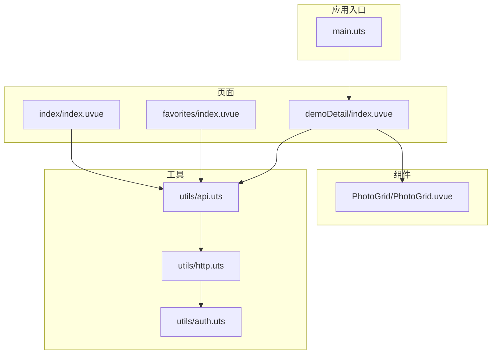
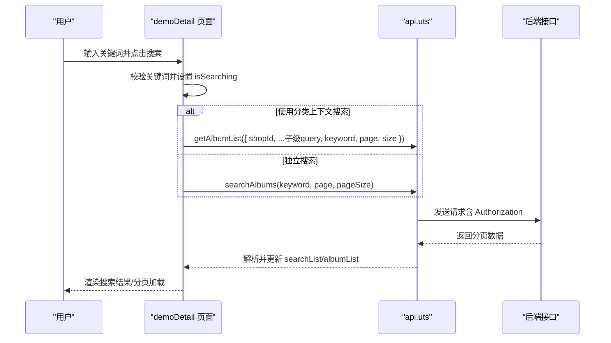
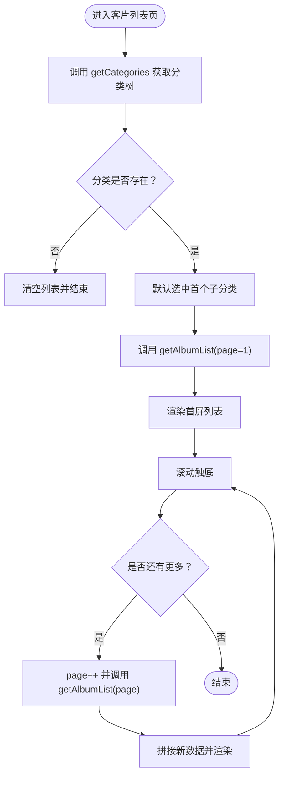
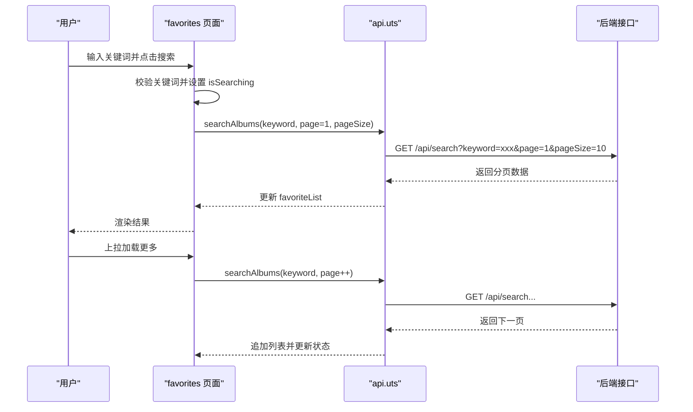
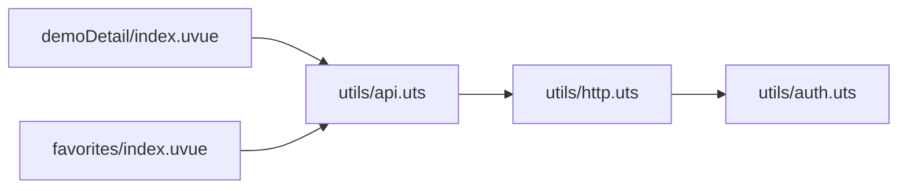

# 搜索与筛选功能

<cite>
**本文引用的文件**
- [api.uts](file://src/utils/api.uts)
- [http.uts](file://src/utils/http.uts)
- [auth.uts](file://src/utils/auth.uts)
- [demoDetail/index.uvue](file://src/pages/demoDetail/index.uvue)
- [favorites/index.uvue](file://src/pages/favorites/index.uvue)
- [index/index.uvue](file://src/pages/index/index.uvue)
- [PhotoGrid.uvue](file://src/components/PhotoGrid/PhotoGrid.uvue)
- [main.uts](file://src/main.uts)
</cite>

## 目录
1. [简介](#简介)
2. [项目结构](#项目结构)
3. [核心组件](#核心组件)
4. [架构总览](#架构总览)
5. [详细组件分析](#详细组件分析)
6. [依赖关系分析](#依赖关系分析)
7. [性能考虑](#性能考虑)
8. [故障排查指南](#故障排查指南)
9. [结论](#结论)
10. [附录](#附录)

## 简介
本文件系统性阐述本项目的搜索与筛选功能，重点围绕两类核心接口协作机制展开：
- getCategories 与 getAlbumList 的协同工作：分类数据获取、筛选条件透传、搜索关键词处理与分页加载。
- 独立搜索接口 searchAlbums 的实现：模糊匹配、分页、与收藏页联动。

同时，文档涵盖搜索功能的实现原理（模糊匹配、关键词解析、搜索历史管理）、筛选系统架构（多级分类、动态条件生成、状态持久化）、性能优化策略（防抖、缓存、智能提示）、结果展示优化（高亮、排序、统计）以及扩展性设计（自定义条件、高级筛选、搜索分析）。

## 项目结构
本项目采用“页面 + 组件 + 工具模块”的分层组织：
- 页面层：demoDetail（客片列表与搜索）、favorites（收藏页搜索）、index（首页入口）等。
- 组件层：PhotoGrid（通用网格展示）。
- 工具层：api（接口封装）、http（HTTP请求与鉴权）、auth（登录与用户信息）等。

图表来源
- [demoDetail/index.uvue](file://src/pages/demoDetail/index.uvue)
- [favorites/index.uvue](file://src/pages/favorites/index.uvue)
- [index/index.uvue](file://src/pages/index/index.uvue)
- [PhotoGrid.uvue](file://src/components/PhotoGrid/PhotoGrid.uvue)
- [api.uts](file://src/utils/api.uts)
- [http.uts](file://src/utils/http.uts)
- [auth.uts](file://src/utils/auth.uts)
- [main.uts](file://src/main.uts)

章节来源
- [main.uts](file://src/main.uts)
- [index/index.uvue](file://src/pages/index/index.uvue)
- [PhotoGrid.uvue](file://src/components/PhotoGrid/PhotoGrid.uvue)

## 核心组件
- 接口层（api.uts）
  - getCategories：获取分类树，包含父级与子级筛选条件，子级包含 query 透传对象。
  - getAlbumList：获取客片列表，支持 shopId、子级 query 透传、keyword、page、size。
  - searchAlbums：独立搜索接口，支持 keyword、page、pageSize。
- 请求层（http.uts）
  - request 封装 uni.request，统一注入 Authorization（Bearer token）、超时控制、401 处理。
- 认证层（auth.uts）
  - token 与用户信息的读取、设置、合并与清理，为接口层提供鉴权支持。

章节来源
- [api.uts](file://src/utils/api.uts)
- [http.uts](file://src/utils/http.uts)
- [auth.uts](file://src/utils/auth.uts)

## 架构总览
搜索与筛选的整体流程如下：
- 分类模式：页面加载时调用 getCategories 获取分类树；根据选中的父子分类，将子级 query 透传给 getAlbumList，实现“多级分类筛选 + 分页”。
- 搜索模式：用户在导航栏输入关键词并确认后，调用 getAlbumList（携带 keyword）或 searchAlbums（独立搜索），实现“关键词模糊匹配 + 分页”。
- 状态管理：页面内部维护 isSearching、searchKeyword、searchList、albumList 等状态，实现两种模式的切换与数据拼接。
- 鉴权与缓存：接口层通过 http.uts 注入 Authorization；页面通过预加载首屏图片提升体验。

图表来源
- [demoDetail/index.uvue](file://src/pages/demoDetail/index.uvue)
- [api.uts](file://src/utils/api.uts)

## 详细组件分析

### 分类与筛选系统（getCategories + getAlbumList）
- 分类数据获取
  - 页面加载时调用 getCategories(shopId)，解析返回的分类树，设置 alltabs 与默认选中项。
- 筛选条件透传
  - 选中子分类后，将 child.query 完整透传给 getAlbumList，作为筛选条件。
- 分页与加载更多
  - albumPage/albumSize 控制分页；上拉触底触发 loadMoreAlbum，拼接新数据。
- 状态持久化
  - selectedTab（parentIndex、childIndex）记录当前选中，切换时重置分页并重新加载。

图表来源
- [demoDetail/index.uvue](file://src/pages/demoDetail/index.uvue)
- [api.uts](file://src/utils/api.uts)

章节来源
- [demoDetail/index.uvue](file://src/pages/demoDetail/index.uvue)
- [api.uts](file://src/utils/api.uts)

### 搜索系统（getAlbumList + searchAlbums）
- 模式切换
  - isSearching 控制是否进入搜索模式；清空关键词则回到分类模式。
- 关键词处理
  - handleSearch 在用户点击键盘“搜索”时触发；doSearch 调用 getAlbumList 传入 keyword，并拼接分页数据。
  - 独立搜索：favorites 页面使用 searchAlbums，支持分页加载。
- 模糊匹配与分页
  - 模糊匹配由后端实现；前端负责 page/size 与 total 判断，控制“加载更多”与“已到底”。

图表来源
- [favorites/index.uvue](file://src/pages/favorites/index.uvue)
- [api.uts](file://src/utils/api.uts)

章节来源
- [demoDetail/index.uvue](file://src/pages/demoDetail/index.uvue)
- [favorites/index.uvue](file://src/pages/favorites/index.uvue)
- [api.uts](file://src/utils/api.uts)

### 点赞与状态刷新（与搜索/筛选的集成）
- 登录态检测：未登录时拦截点赞操作，弹出登录弹窗。
- 状态刷新：onShow 时对当前列表调用 getLikeStatus 批量刷新点赞状态，确保搜索/筛选结果中的点赞态一致。

章节来源
- [demoDetail/index.uvue](file://src/pages/demoDetail/index.uvue)

### 首页入口与网格组件（PhotoGrid）
- 首页 index 页面通过 PhotoGrid 统一渲染店铺卡片，点击事件透传至父组件，用于跳转 demoDetail。
- PhotoGrid 作为通用组件，承担布局与交互职责，减少页面重复逻辑。

章节来源
- [index/index.uvue](file://src/pages/index/index.uvue)
- [PhotoGrid.uvue](file://src/components/PhotoGrid/PhotoGrid.uvue)

## 依赖关系分析
- 页面依赖接口层：demoDetail 与 favorites 通过 api.uts 调用 getCategories、getAlbumList、searchAlbums。
- 接口层依赖请求层：api.uts 内部使用 http.uts 的 request 封装，统一处理鉴权与错误。
- 请求层依赖认证层：http.uts 从 auth.uts 读取 token 并注入 Authorization。

图表来源
- [demoDetail/index.uvue](file://src/pages/demoDetail/index.uvue)
- [favorites/index.uvue](file://src/pages/favorites/index.uvue)
- [api.uts](file://src/utils/api.uts)
- [http.uts](file://src/utils/http.uts)
- [auth.uts](file://src/utils/auth.uts)

章节来源
- [api.uts](file://src/utils/api.uts)
- [http.uts](file://src/utils/http.uts)
- [auth.uts](file://src/utils/auth.uts)

## 性能考虑
- 防抖与去抖
  - 搜索输入建议在输入侧增加防抖（例如 300ms），避免频繁触发请求；当前键盘 confirm 触发已具备一定节流效果。
- 预加载与缓存
  - 首屏图片预加载：demoDetail 在初始化时对前 N 张封面图进行预加载，缩短骨架屏停留时间。
  - 图片缓存：预加载函数内部具备超时保护，避免长时间阻塞。
- 分页与增量渲染
  - 分页参数 page/size 控制每次请求的数据量；上拉加载更多时仅追加数据，避免全量重绘。
- 缓存策略
  - 建议：分类树与热门搜索词可在内存中短期缓存；搜索结果按关键词+页码维度做 LRU 缓存，命中则直接渲染。
- 智能提示
  - 建议：在输入框提供热门关键词与历史搜索建议，减少用户输入成本；结合防抖与本地缓存提升响应速度。
- 错误与降级
  - 401 统一清理 token 并提示重新登录；网络异常时提供重试与占位提示。

章节来源
- [demoDetail/index.uvue](file://src/pages/demoDetail/index.uvue)
- [http.uts](file://src/utils/http.uts)

## 故障排查指南
- 401 未授权
  - 现象：出现未授权提示并清理本地 token。
  - 处理：引导用户重新登录，登录成功后自动恢复请求。
- 搜索无结果
  - 现象：搜索结果为空且提示“暂无搜索结果”。
  - 处理：建议更换关键词或返回分类模式查看。
- 加载更多无效
  - 现象：上拉后无新数据。
  - 处理：检查 total 与 page 计算逻辑，确认后端返回 total 是否正确。
- 点赞状态不同步
  - 现象：切换页面后点赞态未更新。
  - 处理：onShow 时调用 getLikeStatus 批量刷新，确保状态一致。

章节来源
- [http.uts](file://src/utils/http.uts)
- [demoDetail/index.uvue](file://src/pages/demoDetail/index.uvue)

## 结论
本项目通过“分类树 + 子级 query 透传”的筛选架构，配合“关键词 + 分页”的搜索机制，实现了灵活、可扩展的客片浏览体验。接口层与请求层解耦清晰，鉴权与错误处理统一规范。未来可在搜索历史、智能提示、缓存策略与高级筛选方面进一步增强，以提升性能与用户体验。

## 附录
- 扩展性设计建议
  - 自定义搜索条件：在子级 query 中扩展更多过滤字段（如价格区间、拍摄时间等），前端按需拼接到 getAlbumList。
  - 高级筛选：在 demoDetail 页面增加筛选面板，将用户选择的条件合并到 query 对象中。
  - 搜索分析：埋点记录搜索关键词、点击率、跳出率等指标，指导推荐与优化。
  - 结果统计：在搜索结果页展示“共找到 X 条结果”，并在分页加载时动态更新总数。