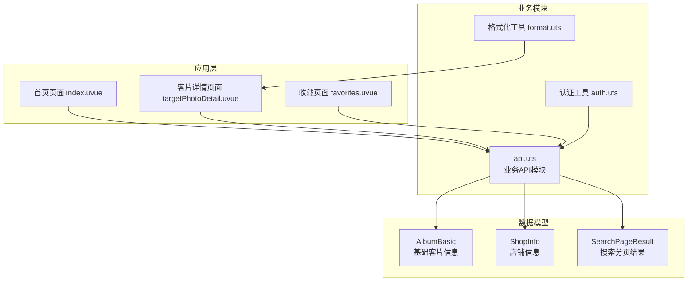
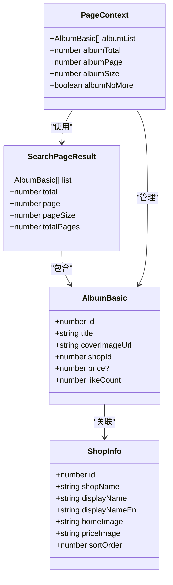
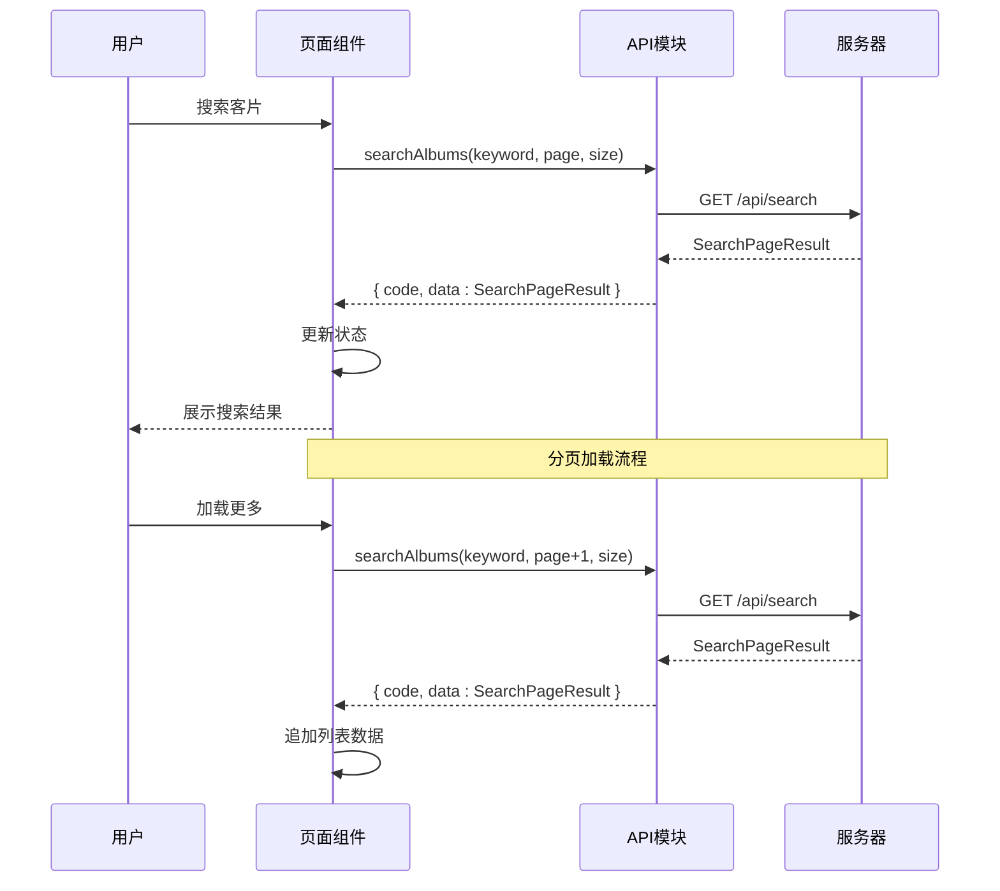
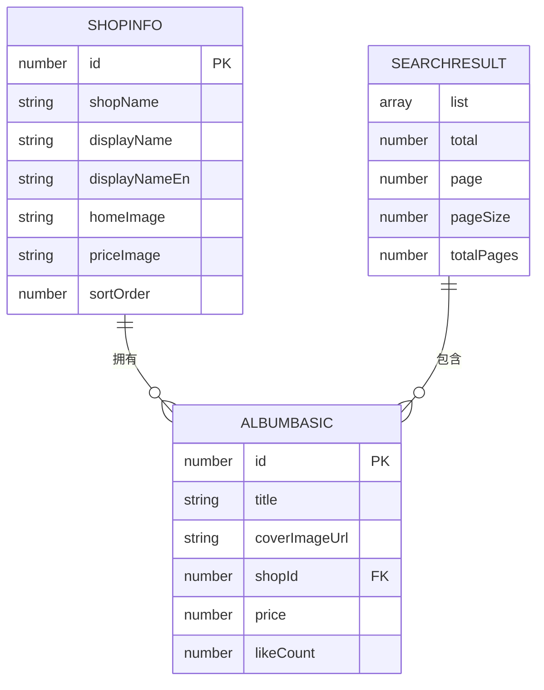
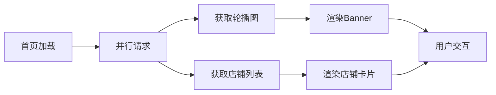
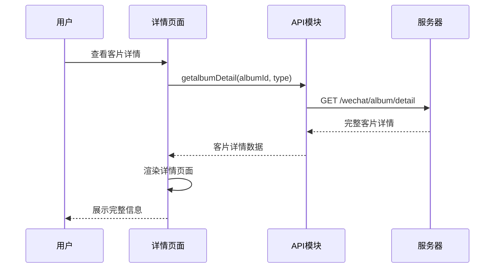
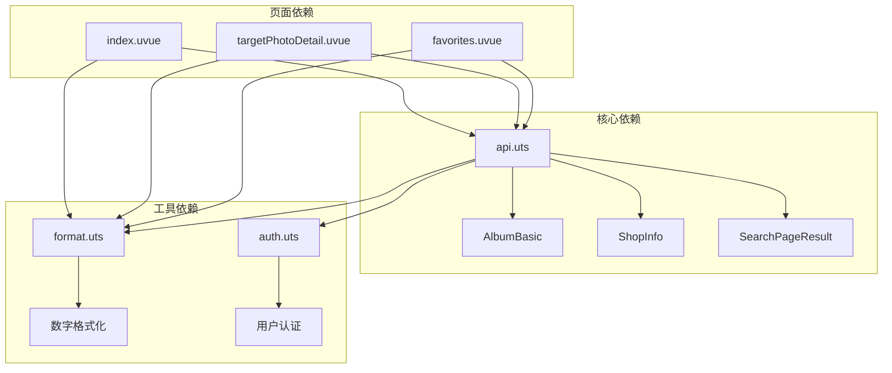
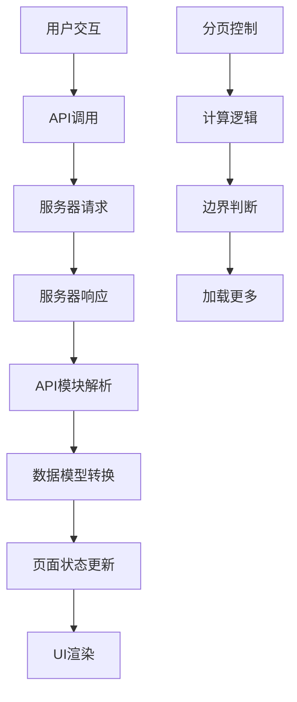

# 客片数据模型

<cite>
**本文档引用的文件**
- [api.uts](file://src/utils/api.uts)
- [api 规格说明](file://.specanchor/modules/src-utils-api.spec.md)
- [首页页面](file://src/pages/index/index.uvue)
- [客片详情页面](file://src/pages/targetPhotoDetail/index.uvue)
- [收藏页面](file://src/pages/favorites/index.uvue)
- [格式化工具](file://src/utils/format.uts)
- [认证工具](file://src/utils/auth.uts)
</cite>

## 目录
1. [简介](#简介)
2. [项目结构](#项目结构)
3. [核心组件](#核心组件)
4. [架构概览](#架构概览)
5. [详细组件分析](#详细组件分析)
6. [依赖分析](#依赖分析)
7. [性能考虑](#性能考虑)
8. [故障排除指南](#故障排除指南)
9. [结论](#结论)

## 简介

本文档为客片数据模型提供全面的技术文档，重点解释以下三个核心接口的数据结构和使用方式：

- **AlbumBasic 接口**：基础客片信息模型，包含客片的基本标识、标题、封面图、所属店铺、价格和点赞数等字段
- **ShopInfo 接口**：店铺信息模型，包含店铺标识、名称、展示名称、图片资源等字段
- **SearchPageResult 接口**：搜索分页结果模型，包含客片列表、总数、当前页码、每页数量等字段

文档将详细说明每个字段的作用和含义，解释数据模型之间的关联关系，提供验证规则和约束条件，并给出扩展指导和最佳实践。

## 项目结构

该项目采用基于功能模块的组织方式，数据模型主要位于 utils 目录下的 api.uts 文件中，通过专门的业务 API 模块进行统一管理。



**图表来源**
- [api.uts:1-312](file://src/utils/api.uts#L1-L312)
- [首页页面:1-359](file://src/pages/index/index.uvue#L1-L359)
- [客片详情页面:1-419](file://src/pages/targetPhotoDetail/index.uvue#L1-L419)

**章节来源**
- [api.uts:1-312](file://src/utils/api.uts#L1-L312)
- [首页页面:1-359](file://src/pages/index/index.uvue#L1-L359)

## 核心组件

### AlbumBasic 接口详解

AlbumBasic 是客片系统的核心数据模型，用于描述单个客片的基础信息。

| 字段名 | 类型 | 必填 | 描述 | 示例值 |
|--------|------|------|------|--------|
| id | number | 是 | 客片唯一标识符 | 12345 |
| title | string | 是 | 客片标题/名称 | "婚纱写真作品集" |
| coverImageUrl | string | 是 | 客片封面图片URL | "https://example.com/image.jpg" |
| shopId | number | 是 | 所属店铺标识符 | 1001 |
| price | number | 否 | 客片价格（可选字段） | 9999 |
| likeCount | number | 是 | 点赞数量统计 | 42 |

**字段详细说明：**

- **id**：数据库自增主键，确保每个客片的唯一性
- **title**：客片的展示名称，用于用户界面显示
- **coverImageUrl**：封面图片的完整URL地址，用于缩略图展示
- **shopId**：关联到 ShopInfo 的外键，建立客片与店铺的关联关系
- **price**：可选的价格字段，可能在某些客片类型中不适用
- **likeCount**：实时统计的点赞数量，用于社交互动展示

### ShopInfo 接口详解

ShopInfo 定义了店铺的基本信息结构，用于展示和管理店铺相关数据。

| 字段名 | 类型 | 必填 | 描述 | 示例值 |
|--------|------|------|------|--------|
| id | number | 是 | 店铺唯一标识符 | 1001 |
| shopName | string | 是 | 店铺内部名称 | "婚纱摄影店" |
| displayName | string | 是 | 店铺展示名称 | "XX婚纱摄影工作室" |
| displayNameEn | string | 是 | 店铺英文展示名称 | "XX Wedding Photography Studio" |
| homeImage | string | 是 | 店铺首页展示图片URL | "https://example.com/home.jpg" |
| priceImage | string | 是 | 价格表图片URL | "https://example.com/price.jpg" |
| sortOrder | number | 是 | 排序权重，用于确定显示顺序 | 1 |

**字段详细说明：**

- **id**：店铺的唯一标识符，与客片中的 shopId 字段关联
- **shopName**：系统内部使用的店铺名称，便于后台管理
- **displayName/displayNameEn**：面向客户的展示名称，支持中英文双语
- **homeImage/priceImage**：店铺的营销图片资源，用于不同场景展示
- **sortOrder**：排序字段，数值越大优先级越高

### SearchPageResult 接口详解

SearchPageResult 是搜索功能的分页数据模型，提供完整的分页信息。

| 字段名 | 类型 | 必填 | 描述 | 示例值 |
|--------|------|------|------|--------|
| list | AlbumBasic[] | 是 | 搜索结果列表 | [AlbumBasic, AlbumBasic, ...] |
| total | number | 是 | 搜索结果总数 | 120 |
| page | number | 是 | 当前页码 | 1 |
| pageSize | number | 是 | 每页记录数 | 10 |
| totalPages | number | 是 | 总页数 | 12 |

**分页计算逻辑：**

```mermaid
flowchart TD
A[开始搜索] --> B[获取搜索参数]
B --> C[调用搜索接口]
C --> D[接收SearchPageResult]
D --> E[计算总页数]
E --> F[totalPages = ceil(total / pageSize)]
F --> G{是否还有更多数据?}
G --> |是| H[page < totalPages]
G --> |否| I[noMore = true]
H --> J[page++]
I --> K[结束]
J --> L[继续加载]
L --> K
```

**图表来源**
- [api 规格说明:111-116](file://.specanchor/modules/src-utils-api.spec.md#L111-L116)

**章节来源**
- [api.uts:5-273](file://src/utils/api.uts#L5-L273)
- [api 规格说明:47-72](file://.specanchor/modules/src-utils-api.spec.md#L47-L72)

## 架构概览

客片数据模型在整个应用架构中扮演着核心角色，通过清晰的接口设计实现了数据的一致性和可维护性。



**图表来源**
- [api.uts:5-273](file://src/utils/api.uts#L5-L273)

### 数据流分析



**图表来源**
- [api.uts:267-283](file://src/utils/api.uts#L267-L283)
- [api 规格说明:111-116](file://.specanchor/modules/src-utils-api.spec.md#L111-L116)

**章节来源**
- [api.uts:1-312](file://src/utils/api.uts#L1-L312)
- [api 规格说明:1-193](file://.specanchor/modules/src-utils-api.spec.md#L1-L193)

## 详细组件分析

### 数据模型关联关系

客片数据模型之间存在明确的关联关系，通过外键约束实现数据一致性。



**关联关系说明：**

1. **一对一关联**：ShopInfo 与 AlbumBasic 通过 shopId 字段建立关联
2. **一对多关系**：一个店铺可以拥有多个客片
3. **分页聚合**：SearchPageResult 聚合多个 AlbumBasic 实例

### 字段验证规则和约束条件

#### 类型约束
- **数值类型**：id、shopId、price、likeCount、total、page、pageSize、totalPages 均为 number 类型
- **字符串类型**：title、coverImageUrl、shopName、displayName 等均为 string 类型
- **可选字段**：price 字段标记为可选，表示并非所有客片都有价格信息

#### 必填性规则
- **强制必填**：id、title、coverImageUrl、shopId、likeCount
- **条件必填**：price 在某些业务场景下可能为空
- **分页必填**：total、page、pageSize、totalPages

#### 取值范围约束
- **id/ shopId**：必须为正整数
- **price**：非负数，可为空
- **likeCount**：非负整数
- **page/pageSize**：正整数
- **totalPages**：非负整数

### 使用场景和最佳实践

#### 首页集成
首页通过并行请求获取轮播图和店铺列表，展示店铺信息和客片概览。



**图表来源**
- [首页页面:124-142](file://src/pages/index/index.uvue#L124-L142)

#### 客片详情展示
客片详情页面展示完整的客片信息，包括价格、套餐描述和图片列表。



**图表来源**
- [api.uts:113-122](file://src/utils/api.uts#L113-L122)

**章节来源**
- [首页页面:1-359](file://src/pages/index/index.uvue#L1-L359)
- [客片详情页面:1-419](file://src/pages/targetPhotoDetail/index.uvue#L1-L419)

## 依赖分析

### 组件耦合度分析



**依赖关系特点：**
- **低耦合高内聚**：数据模型独立于具体页面实现
- **单向依赖**：页面依赖 API 模块，API 模块不依赖页面
- **工具模块支持**：格式化和认证工具为数据展示提供辅助功能

### 数据流转路径



**图表来源**
- [api.uts:267-283](file://src/utils/api.uts#L267-L283)

**章节来源**
- [api.uts:1-312](file://src/utils/api.uts#L1-L312)
- [格式化工具:1-16](file://src/utils/format.uts#L1-L16)

## 性能考虑

### 分页优化策略

1. **懒加载机制**：仅在需要时加载下一页数据
2. **图片预加载**：首屏图片优先加载，提升用户体验
3. **状态缓存**：合理缓存页面状态，避免重复请求

### 内存管理

- **数据截断**：大量数据时采用分页截断策略
- **状态清理**：离开页面时清理不必要的状态数据
- **图片缓存**：利用 uni-app 的图片缓存机制

## 故障排除指南

### 常见问题诊断

#### 数据为空问题
- **症状**：页面显示空白或加载失败
- **原因**：网络请求失败或数据格式错误
- **解决方案**：检查 API 响应状态码，验证数据结构

#### 分页异常
- **症状**：加载更多按钮无效或重复加载
- **原因**：totalPages 计算错误或 page 状态不一致
- **解决方案**：重新计算总页数，同步页面状态

#### 图片加载失败
- **症状**：缩略图显示为占位符
- **原因**：图片URL无效或网络问题
- **解决方案**：检查图片URL有效性，添加错误处理

**章节来源**
- [api 规格说明:124-134](file://.specanchor/modules/src-utils-api.spec.md#L124-L134)

## 结论

客片数据模型通过精心设计的接口定义和严格的类型约束，为整个应用提供了稳定可靠的数据基础。AlbumBasic、ShopInfo 和 SearchPageResult 三个核心接口相互配合，形成了完整的客片管理系统。

### 设计优势

1. **清晰的层次结构**：从基础数据模型到复杂业务场景的渐进式设计
2. **强类型约束**：通过 TypeScript 提供编译时类型检查
3. **灵活的扩展性**：预留可选字段和扩展点
4. **良好的性能特性**：分页加载和图片优化策略

### 最佳实践建议

1. **严格遵守数据模型**：在所有业务场景中遵循既定的数据结构
2. **合理使用分页**：根据业务需求调整分页大小和加载策略
3. **关注性能优化**：持续优化数据加载和渲染性能
4. **完善错误处理**：为各种异常情况提供优雅的降级处理

通过遵循本文档的设计原则和最佳实践，可以确保客片数据模型在实际应用中发挥最大的价值，为用户提供优质的浏览和交互体验。
