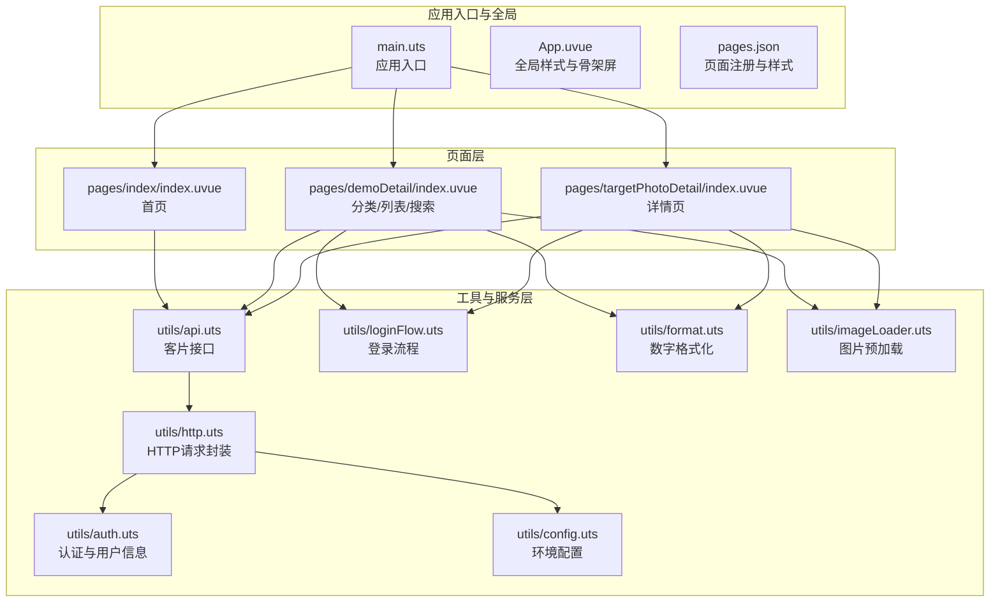
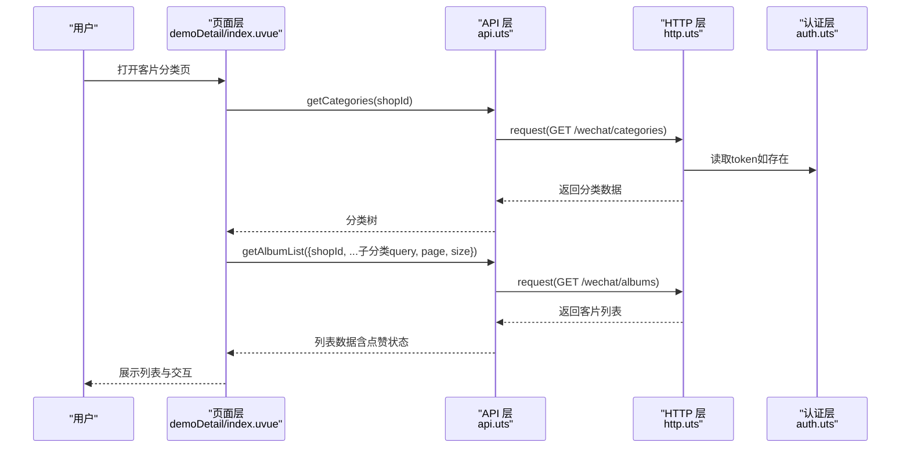
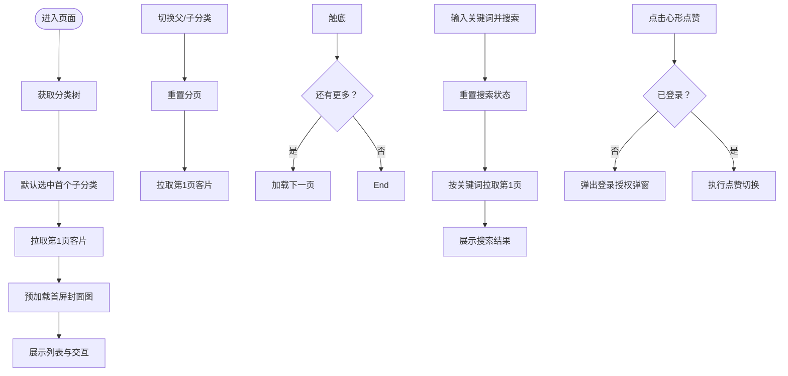
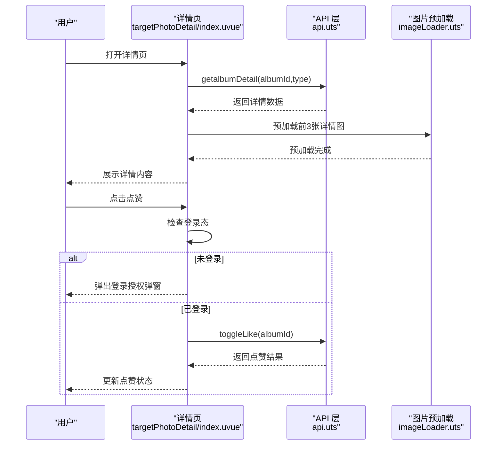
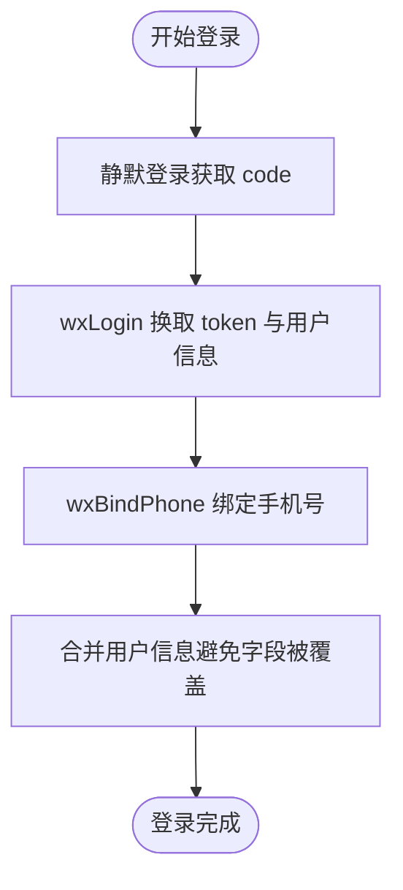
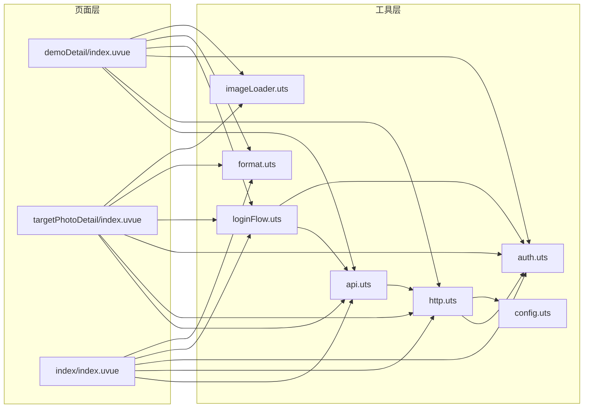

# 客片管理系统

<cite>
**本文引用的文件**
- [src/main.uts](file://src/main.uts)
- [src/App.uvue](file://src/App.uvue)
- [src/pages.json](file://src/pages.json)
- [src/pages/index/index.uvue](file://src/pages/index/index.uvue)
- [src/pages/demoDetail/index.uvue](file://src/pages/demoDetail/index.uvue)
- [src/pages/targetPhotoDetail/index.uvue](file://src/pages/targetPhotoDetail/index.uvue)
- [src/utils/api.uts](file://src/utils/api.uts)
- [src/utils/http.uts](file://src/utils/http.uts)
- [src/utils/auth.uts](file://src/utils/auth.uts)
- [src/utils/format.uts](file://src/utils/format.uts)
- [src/utils/imageLoader.uts](file://src/utils/imageLoader.uts)
- [src/utils/loginFlow.uts](file://src/utils/loginFlow.uts)
- [src/utils/config.uts](file://src/utils/config.uts)
</cite>

## 目录
1. [简介](#简介)
2. [项目结构](#项目结构)
3. [核心组件](#核心组件)
4. [架构总览](#架构总览)
5. [详细组件分析](#详细组件分析)
6. [依赖关系分析](#依赖关系分析)
7. [性能考量](#性能考量)
8. [故障排查指南](#故障排查指南)
9. [结论](#结论)
10. [附录](#附录)

## 简介
本文件面向“蓝莓小程序”的客片管理系统，围绕客片分类获取、客片列表展示、客片详情页面三大核心功能进行系统化说明。文档深入解释客片数据模型、分类体系、图片加载优化等技术实现，梳理从分类选择到详情查看的完整业务流程，并给出缓存策略、懒加载机制、图片压缩优化等性能建议，以及扩展指导（新增分类、自定义筛选条件等）。

## 项目结构
- 应用入口与全局样式
  - 应用入口与运行时：[src/main.uts](file://src/main.unts)、[src/App.uvue](file://src/App.uvue)
  - 页面注册与全局样式：[src/pages.json](file://src/pages.json)
- 客片相关页面
  - 首页（含轮播图与入口）：[src/pages/index/index.uvue](file://src/pages/index/index.uvue)
  - 客片分类与列表（含搜索、分页、点赞）：[src/pages/demoDetail/index.uvue](file://src/pages/demoDetail/index.uvue)
  - 客片详情（骨架屏、点赞、图片预加载）：[src/pages/targetPhotoDetail/index.uvue](file://src/pages/targetPhotoDetail/index.uvue)
- 工具与服务层
  - API 定义与客片接口：[src/utils/api.uts](file://src/utils/api.uts)
  - HTTP 请求封装与鉴权：[src/utils/http.uts](file://src/utils/http.uts)
  - 认证与用户信息：[src/utils/auth.uts](file://src/utils/auth.uts)
  - 登录流程封装：[src/utils/loginFlow.uts](file://src/utils/loginFlow.uts)
  - 数字格式化：[src/utils/format.uts](file://src/utils/format.uts)
  - 图片预加载工具：[src/utils/imageLoader.uts](file://src/utils/imageLoader.uts)
  - 环境配置：[src/utils/config.uts](file://src/utils/config.uts)

**图表来源**
- [src/main.uts:1-9](file://src/main.uts#L1-L9)
- [src/App.uvue:1-335](file://src/App.uvue#L1-L335)
- [src/pages.json:1-90](file://src/pages.json#L1-L90)
- [src/pages/index/index.uvue:1-359](file://src/pages/index/index.uvue#L1-L359)
- [src/pages/demoDetail/index.uvue:1-800](file://src/pages/demoDetail/index.uvue#L1-L800)
- [src/pages/targetPhotoDetail/index.uvue:1-419](file://src/pages/targetPhotoDetail/index.uvue#L1-L419)
- [src/utils/api.uts:1-312](file://src/utils/api.uts#L1-L312)
- [src/utils/http.uts:1-82](file://src/utils/http.uts#L1-L82)
- [src/utils/auth.uts:1-149](file://src/utils/auth.uts#L1-L149)
- [src/utils/loginFlow.uts:1-71](file://src/utils/loginFlow.uts#L1-L71)
- [src/utils/format.uts:1-16](file://src/utils/format.uts#L1-L16)
- [src/utils/imageLoader.uts:1-28](file://src/utils/imageLoader.uts#L1-L28)
- [src/utils/config.uts:1-12](file://src/utils/config.uts#L1-L12)

**章节来源**
- [src/main.uts:1-9](file://src/main.uts#L1-L9)
- [src/App.uvue:1-335](file://src/App.uvue#L1-L335)
- [src/pages.json:1-90](file://src/pages.json#L1-L90)

## 核心组件
- 客片数据模型
  - 分类与子分类：父级名称、排序、子分类数组（含查询参数）
  - 客片列表项：封面图、标题、价格、套餐描述、点赞数、是否已点赞
  - 客片详情：标题、价格、套餐内容、图片数组
- 分类体系
  - 通过“父分类 + 子分类”两级组织，子分类携带查询参数透传到列表接口
- 接口能力
  - 获取分类、获取客片列表（分页/搜索）、获取客片详情、点赞/取消点赞、批量查询点赞状态、获取店铺列表、搜索相册等

**章节来源**
- [src/utils/api.uts:6-122](file://src/utils/api.uts#L6-L122)
- [src/pages/demoDetail/index.uvue:344-386](file://src/pages/demoDetail/index.uvue#L344-L386)
- [src/pages/targetPhotoDetail/index.uvue:149-174](file://src/pages/targetPhotoDetail/index.uvue#L149-L174)

## 架构总览
客片系统采用“页面层 + 工具与服务层”的分层设计：
- 页面层负责视图渲染、交互与生命周期控制
- 工具与服务层负责网络请求、认证、登录流程、格式化与图片预加载
- 数据流从页面发起请求，经 HTTP 层统一注入鉴权头，调用 API 层，最终返回数据驱动页面渲染

**图表来源**
- [src/pages/demoDetail/index.uvue:304-343](file://src/pages/demoDetail/index.uvue#L304-L343)
- [src/utils/api.uts:55-111](file://src/utils/api.uts#L55-L111)
- [src/utils/http.uts:20-73](file://src/utils/http.uts#L20-L73)
- [src/utils/auth.uts:21-29](file://src/utils/auth.uts#L21-L29)

## 详细组件分析

### 客片分类与列表页（demoDetail）
- 功能要点
  - 初始化：获取分类树，选中首个子分类，拉取第一页客片
  - 切换分类：重置分页并重新加载
  - 搜索：在当前分类下按关键词搜索，支持分页
  - 加载更多：触底事件触发分页加载
  - 点赞：未登录弹出授权弹窗，登录后执行点赞切换
  - 预加载：首屏封面图预加载，提升首屏体验
- 数据模型
  - 分类树：父分类包含子分类数组，子分类携带查询参数
  - 列表项：包含封面图、标题、价格、套餐描述、点赞数、是否已点赞
- 交互与状态
  - loading/skeleton 屏蔽首屏空白
  - 搜索模式与分类模式互斥
  - 登录态变化时刷新点赞状态

**图表来源**
- [src/pages/demoDetail/index.uvue:304-343](file://src/pages/demoDetail/index.uvue#L304-L343)
- [src/pages/demoDetail/index.uvue:344-386](file://src/pages/demoDetail/index.uvue#L344-L386)
- [src/pages/demoDetail/index.uvue:387-460](file://src/pages/demoDetail/index.uvue#L387-L460)
- [src/pages/demoDetail/index.uvue:500-518](file://src/pages/demoDetail/index.uvue#L500-L518)
- [src/pages/demoDetail/index.uvue:519-542](file://src/pages/demoDetail/index.uvue#L519-L542)

**章节来源**
- [src/pages/demoDetail/index.uvue:1-800](file://src/pages/demoDetail/index.uvue#L1-L800)
- [src/utils/api.uts:55-111](file://src/utils/api.uts#L55-L111)

### 客片详情页（targetPhotoDetail）
- 功能要点
  - 骨架屏与图片预加载：先预加载前几张详情图，图片缓存就绪后再隐藏骨架屏
  - 点赞：未登录弹出授权弹窗，登录后执行点赞切换
  - 登录流程：手机号授权 -> 三步登录流程封装 -> 完善头像/昵称（如需要）
- 数据模型
  - 详情包含标题、价格、套餐内容、图片数组
- 性能与体验
  - 使用预加载工具避免图片切换时白屏
  - 数字格式化统一展示点赞数

**图表来源**
- [src/pages/targetPhotoDetail/index.uvue:149-174](file://src/pages/targetPhotoDetail/index.uvue#L149-L174)
- [src/pages/targetPhotoDetail/index.uvue:186-207](file://src/pages/targetPhotoDetail/index.uvue#L186-L207)
- [src/utils/api.uts:114-122](file://src/utils/api.uts#L114-L122)
- [src/utils/imageLoader.uts:8-27](file://src/utils/imageLoader.uts#L8-L27)

**章节来源**
- [src/pages/targetPhotoDetail/index.uvue:1-419](file://src/pages/targetPhotoDetail/index.uvue#L1-L419)
- [src/utils/imageLoader.uts:1-28](file://src/utils/imageLoader.uts#L1-L28)
- [src/utils/format.uts:1-16](file://src/utils/format.uts#L1-L16)

### 登录与认证流程
- 登录流程封装（runPhoneLogin）
  - 步骤：静默登录获取 code -> wxLogin 换取 token 与用户信息 -> wxBindPhone 绑定手机号（可选完善头像/昵称）
  - 结果：返回是否成功与是否已具备完整资料
- 认证与用户信息
  - token 与用户信息存储于本地，HTTP 层自动注入 Authorization 头
  - 登录态变化时，页面可刷新点赞状态

**图表来源**
- [src/utils/loginFlow.uts:27-65](file://src/utils/loginFlow.uts#L27-L65)
- [src/utils/auth.uts:135-139](file://src/utils/auth.uts#L135-L139)

**章节来源**
- [src/utils/loginFlow.uts:1-71](file://src/utils/loginFlow.uts#L1-L71)
- [src/utils/auth.uts:1-149](file://src/utils/auth.uts#L1-L149)

## 依赖关系分析
- 页面到工具层
  - demoDetail 依赖 api、http、auth、loginFlow、format、imageLoader
  - targetPhotoDetail 依赖 api、http、auth、loginFlow、format、imageLoader
  - index 依赖 api、http、auth、loginFlow、format
- 工具层内部耦合
  - api 依赖 http
  - http 依赖 auth 与 config
  - loginFlow 依赖 api 与 auth

**图表来源**
- [src/pages/demoDetail/index.uvue:104-201](file://src/pages/demoDetail/index.uvue#L104-L201)
- [src/pages/targetPhotoDetail/index.uvue:104-114](file://src/pages/targetPhotoDetail/index.uvue#L104-L114)
- [src/pages/index/index.uvue:97-106](file://src/pages/index/index.uvue#L97-L106)
- [src/utils/api.uts:1-312](file://src/utils/api.uts#L1-L312)
- [src/utils/http.uts:1-82](file://src/utils/http.uts#L1-L82)
- [src/utils/auth.uts:1-149](file://src/utils/auth.uts#L1-L149)
- [src/utils/loginFlow.uts:1-71](file://src/utils/loginFlow.uts#L1-L71)
- [src/utils/format.uts:1-16](file://src/utils/format.uts#L1-L16)
- [src/utils/imageLoader.uts:1-28](file://src/utils/imageLoader.uts#L1-L28)
- [src/utils/config.uts:1-12](file://src/utils/config.uts#L1-L12)

**章节来源**
- [src/pages/demoDetail/index.uvue:104-201](file://src/pages/demoDetail/index.uvue#L104-L201)
- [src/pages/targetPhotoDetail/index.uvue:104-114](file://src/pages/targetPhotoDetail/index.uvue#L104-L114)
- [src/pages/index/index.uvue:97-106](file://src/pages/index/index.uvue#L97-L106)
- [src/utils/api.uts:1-312](file://src/utils/api.uts#L1-L312)
- [src/utils/http.uts:1-82](file://src/utils/http.uts#L1-L82)
- [src/utils/auth.uts:1-149](file://src/utils/auth.uts#L1-L149)
- [src/utils/loginFlow.uts:1-71](file://src/utils/loginFlow.uts#L1-L71)
- [src/utils/format.uts:1-16](file://src/utils/format.uts#L1-L16)
- [src/utils/imageLoader.uts:1-28](file://src/utils/imageLoader.uts#L1-L28)
- [src/utils/config.uts:1-12](file://src/utils/config.uts#L1-L12)

## 性能考量
- 图片加载优化
  - 预加载策略：列表页预加载首屏封面图，详情页预加载前几张详情图，减少切换白屏时间
  - 超时保护：预加载集合使用 Promise.race 控制超时，避免长时间等待阻塞
  - 模式选择：详情页使用宽度自适应模式，适配不同屏幕
- 骨架屏与首屏体验
  - 页面在数据加载期间展示骨架屏，提升感知速度
- 网络与鉴权
  - HTTP 层统一注入 Authorization 头，401 自动清理认证信息并提示重新登录
  - 超时与加载提示统一管理
- 数字展示
  - 大数格式化为“万”单位，提升可读性

**章节来源**
- [src/utils/imageLoader.uts:8-27](file://src/utils/imageLoader.uts#L8-L27)
- [src/pages/demoDetail/index.uvue:331-336](file://src/pages/demoDetail/index.uvue#L331-L336)
- [src/pages/targetPhotoDetail/index.uvue:163-168](file://src/pages/targetPhotoDetail/index.uvue#L163-L168)
- [src/utils/http.uts:50-61](file://src/utils/http.uts#L50-L61)
- [src/utils/format.uts:10-15](file://src/utils/format.uts#L10-L15)

## 故障排查指南
- 登录失败
  - 现象：手机号授权失败、静默登录失败、wxLogin 失败
  - 排查：检查登录流程封装返回的错误类型与消息，确认微信认证状态与网络状况
- 点赞失败
  - 现象：点赞状态未更新、提示操作失败
  - 排查：确认登录态、网络状态；检查批量查询点赞状态接口返回
- 图片加载问题
  - 现象：详情页切换出现白屏、图片加载缓慢
  - 排查：确认预加载集合是否超时、图片 URL 是否有效；适当调整预加载数量与超时时间
- 401 未授权
  - 现象：页面提示登录已过期
  - 排查：确认 token 是否存在且未过期，必要时重新登录

**章节来源**
- [src/utils/loginFlow.uts:13-18](file://src/utils/loginFlow.uts#L13-L18)
- [src/pages/demoDetail/index.uvue:531-542](file://src/pages/demoDetail/index.uvue#L531-L542)
- [src/pages/targetPhotoDetail/index.uvue:196-207](file://src/pages/targetPhotoDetail/index.uvue#L196-L207)
- [src/utils/http.uts:50-61](file://src/utils/http.uts#L50-L61)

## 结论
客片管理系统通过清晰的分层设计与完善的工具链，实现了从分类选择到详情查看的流畅体验。借助预加载、骨架屏、统一鉴权与登录流程封装，系统在性能与用户体验上取得良好平衡。后续可在分类体系扩展、筛选条件定制、缓存策略优化等方面持续演进。

## 附录
- 扩展指导
  - 新增分类
    - 在后端新增子分类并配置查询参数，前端无需改动即可透传到列表接口
  - 自定义筛选条件
    - 在子分类 query 中增加字段，前端在调用列表接口时直接透传
  - 缓存策略
    - 列表页：按 shopId + 分类 + 关键词 + 页码组合缓存，命中则直接渲染，未命中再请求
    - 图片：结合 uni.getImageInfo 的本地缓存特性，减少重复下载
  - 图片压缩优化
    - 建议后端提供多规格图片，前端根据设备像素比与容器尺寸选择合适规格
  - 错误与重试
    - 对网络异常与 5xx 错误增加指数退避重试，避免雪崩效应