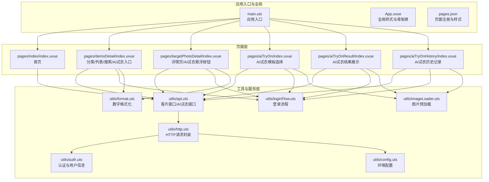
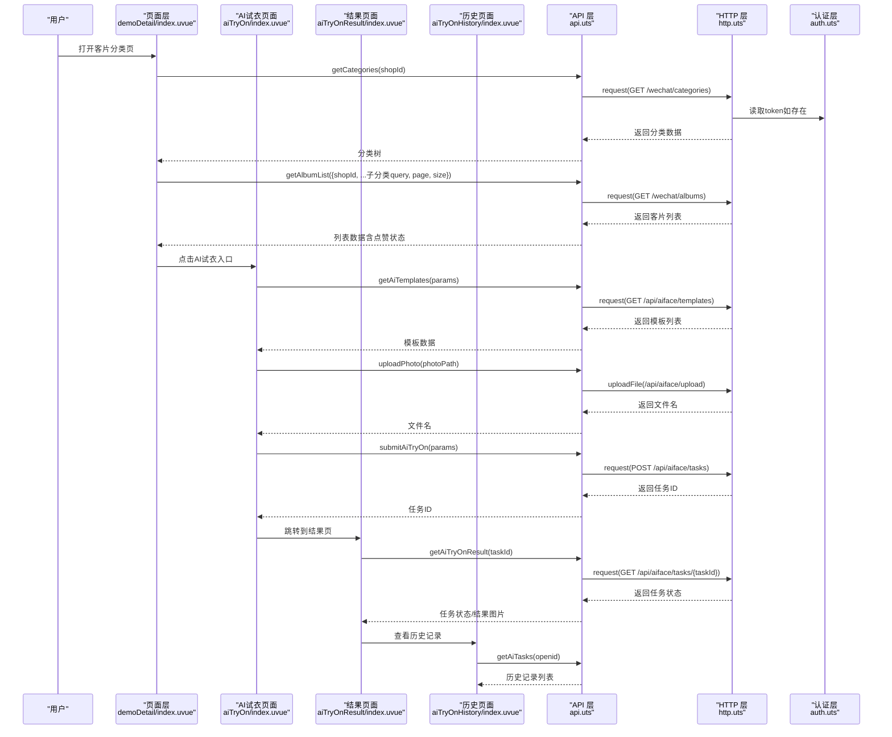
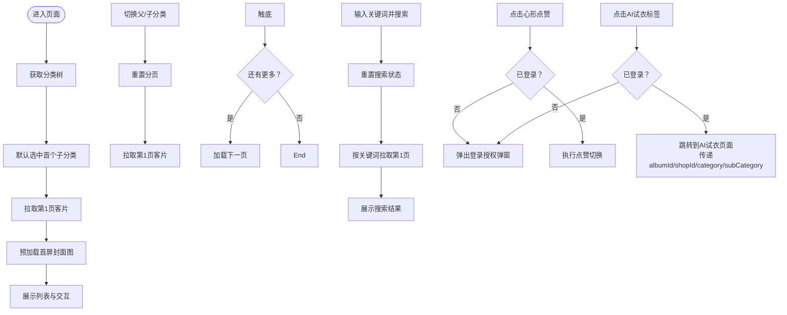
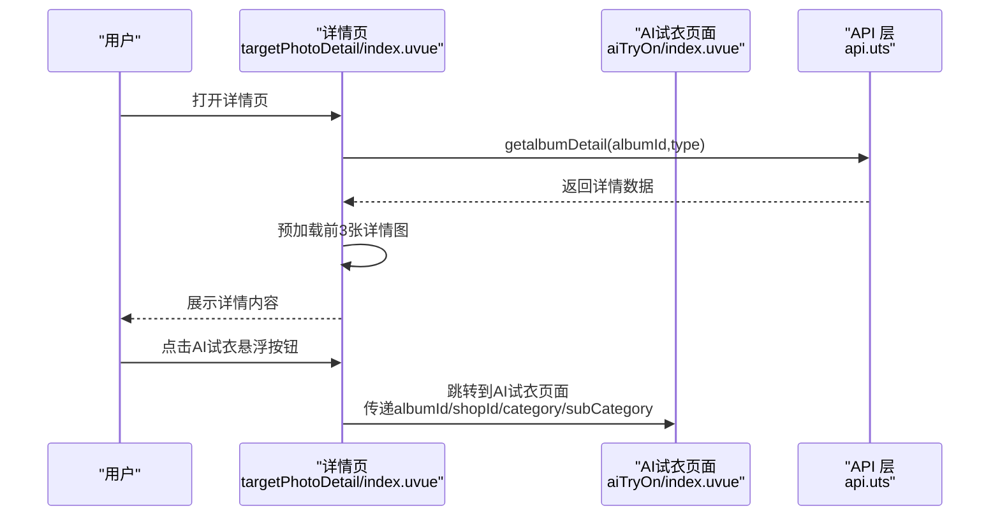
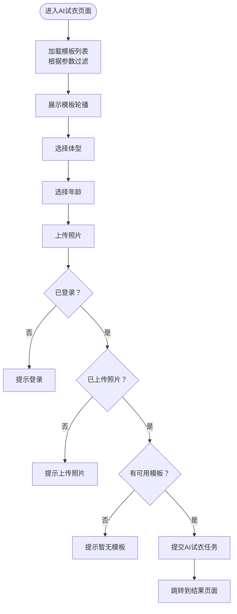
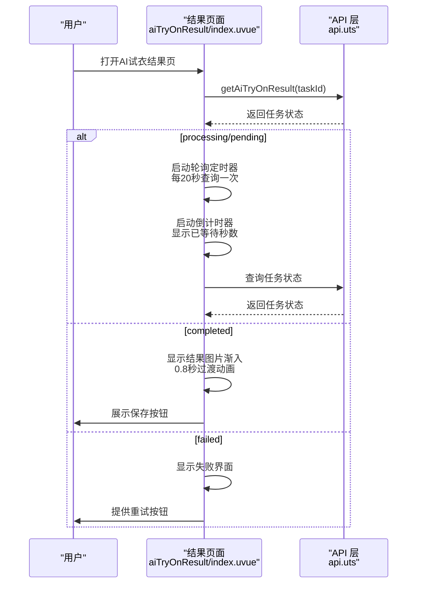
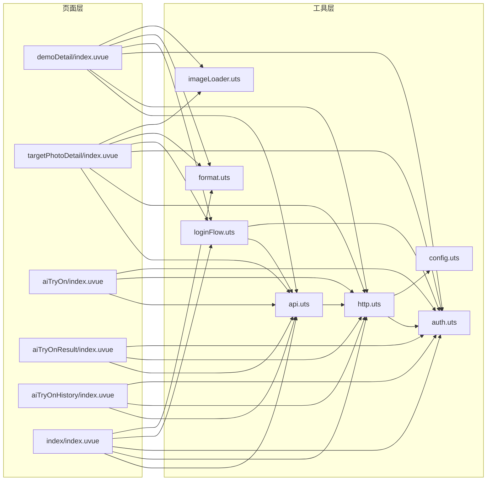

# 客片管理系统

<cite>
**本文引用的文件**
- [src/main.uts](file://src/main.uts)
- [src/App.uvue](file://src/App.uvue)
- [src/pages.json](file://src/pages.json)
- [src/pages/index/index.uvue](file://src/pages/index/index.uvue)
- [src/pages/demoDetail/index.uvue](file://src/pages/demoDetail/index.uvue)
- [src/pages/targetPhotoDetail/index.uvue](file://src/pages/targetPhotoDetail/index.uvue)
- [src/pages/aiTryOn/index.uvue](file://src/pages/aiTryOn/index.uvue)
- [src/pages/aiTryOnResult/index.uvue](file://src/pages/aiTryOnResult/index.uvue)
- [src/pages/aiTryOnHistory/index.uvue](file://src/pages/aiTryOnHistory/index.uvue)
- [src/utils/api.uts](file://src/utils/api.uts)
- [src/utils/http.uts](file://src/utils/http.uts)
- [src/utils/auth.uts](file://src/utils/auth.uts)
- [src/utils/format.uts](file://src/utils/format.uts)
- [src/utils/imageLoader.uts](file://src/utils/imageLoader.uts)
- [src/utils/loginFlow.uts](file://src/utils/loginFlow.uts)
- [src/utils/config.uts](file://src/utils/config.uts)
</cite>

## 目录
1. [简介](#简介)
2. [项目结构](#项目结构)
3. [核心组件](#核心组件)
4. [架构总览](#架构总览)
5. [详细组件分析](#详细组件分析)
6. [AI试衣功能集成](#ai试衣功能集成)
7. [依赖关系分析](#依赖关系分析)
8. [性能考量](#性能考量)
9. [故障排查指南](#故障排查指南)
10. [结论](#结论)
11. [附录](#附录)

## 简介
本文件面向"蓝莓小程序"的客片管理系统，围绕客片分类获取、客片列表展示、客片详情页面三大核心功能进行系统化说明。文档深入解释客片数据模型、分类体系、图片加载优化等技术实现，梳理从分类选择到详情查看的完整业务流程，并给出缓存策略、懒加载机制、图片压缩优化等性能建议，以及扩展指导（新增分类、自定义筛选条件等）。

**更新** 本版本新增了AI试衣功能的完整集成，包括AI试衣模板选择、用户照片上传、任务提交与结果轮询等全流程功能。AI试衣结果页面经过重大UI样式改进，采用暗色主题设计、半透明背景效果和阴影增强等视觉优化，提升了整体用户体验。

## 项目结构
- 应用入口与全局样式
  - 应用入口与运行时：[src/main.uts](file://src/main.uts)、[src/App.uvue](file://src/App.uvue)
  - 页面注册与全局样式：[src/pages.json](file://src/pages.json)
- 客片相关页面
  - 首页（含轮播图与入口）：[src/pages/index/index.uvue](file://src/pages/index/index.uvue)
  - 客片分类与列表（含搜索、分页、点赞、AI试衣入口）：[src/pages/demoDetail/index.uvue](file://src/pages/demoDetail/index.uvue)
  - 客片详情（骨架屏、点赞、图片预加载、AI试衣悬浮按钮）：[src/pages/targetPhotoDetail/index.uvue](file://src/pages/targetPhotoDetail/index.uvue)
  - AI试衣模板选择与生成：[src/pages/aiTryOn/index.uvue](file://src/pages/aiTryOn/index.uvue)
  - AI试衣结果展示与保存：[src/pages/aiTryOnResult/index.uvue](file://src/pages/aiTryOnResult/index.uvue)
  - AI试衣历史记录管理：[src/pages/aiTryOnHistory/index.uvue](file://src/pages/aiTryOnHistory/index.uvue)
- 工具与服务层
  - API 定义与客片接口：[src/utils/api.uts](file://src/utils/api.uts)
  - HTTP 请求封装与鉴权：[src/utils/http.uts](file://src/utils/http.uts)
  - 认证与用户信息：[src/utils/auth.uts](file://src/utils/auth.uts)
  - 登录流程封装：[src/utils/loginFlow.uts](file://src/utils/loginFlow.uts)
  - 数字格式化：[src/utils/format.uts](file://src/utils/format.uts)
  - 图片预加载工具：[src/utils/imageLoader.uts](file://src/utils/imageLoader.uts)
  - 环境配置：[src/utils/config.uts](file://src/utils/config.uts)

**图表来源**
- [src/main.uts:1-9](file://src/main.uts#L1-L9)
- [src/App.uvue:1-335](file://src/App.uvue#L1-L335)
- [src/pages.json:1-90](file://src/pages.json#L1-L90)
- [src/pages/index/index.uvue:1-359](file://src/pages/index/index.uvue#L1-L359)
- [src/pages/demoDetail/index.uvue:1-941](file://src/pages/demoDetail/index.uvue#L1-L941)
- [src/pages/targetPhotoDetail/index.uvue:1-448](file://src/pages/targetPhotoDetail/index.uvue#L1-L448)
- [src/pages/aiTryOn/index.uvue:1-726](file://src/pages/aiTryOn/index.uvue#L1-L726)
- [src/pages/aiTryOnResult/index.uvue:1-383](file://src/pages/aiTryOnResult/index.uvue#L1-L383)
- [src/pages/aiTryOnHistory/index.uvue:1-382](file://src/pages/aiTryOnHistory/index.uvue#L1-L382)
- [src/utils/api.uts:1-503](file://src/utils/api.uts#L1-L503)
- [src/utils/http.uts:1-82](file://src/utils/http.uts#L1-L82)
- [src/utils/auth.uts:1-149](file://src/utils/auth.uts#L1-L149)
- [src/utils/loginFlow.uts:1-71](file://src/utils/loginFlow.uts#L1-L71)
- [src/utils/format.uts:1-16](file://src/utils/format.uts#L1-L16)
- [src/utils/imageLoader.uts:1-28](file://src/utils/imageLoader.uts#L1-L28)
- [src/utils/config.uts:1-12](file://src/utils/config.uts#L1-L12)

**章节来源**
- [src/main.uts:1-9](file://src/main.uts#L1-L9)
- [src/App.uvue:1-335](file://src/App.uvue#L1-L335)
- [src/pages.json:1-90](file://src/pages.json#L1-L90)

## 核心组件
- 客片数据模型
  - 分类与子分类：父级名称、排序、子分类数组（含查询参数）
  - 客片列表项：封面图、标题、价格、套餐描述、点赞数、是否已点赞
  - 客片详情：标题、价格、套餐内容、图片数组
  - AI试衣模板：ID、风格名称、类别、套餐类型、子类别、性别、图片URL、场景提示、是否激活
  - AI试衣任务：ID、用户OpenID、模板ID、状态、结果图片URL、错误信息等
- 分类体系
  - 通过"父分类 + 子分类"两级组织，子分类携带查询参数透传到列表接口
- 接口能力
  - 获取分类、获取客片列表（分页/搜索）、获取客片详情、点赞/取消点赞、批量查询点赞状态、获取店铺列表、搜索相册
  - **新增** AI试衣相关接口：获取模板列表、获取风格分组、上传用户照片、创建试衣任务、查询任务状态、获取历史记录、删除历史记录、AI推荐模板

**章节来源**
- [src/utils/api.uts:6-122](file://src/utils/api.uts#L6-L122)
- [src/utils/api.uts:316-326](file://src/utils/api.uts#L316-L326)
- [src/pages/demoDetail/index.uvue:344-386](file://src/pages/demoDetail/index.uvue#L344-L386)
- [src/pages/targetPhotoDetail/index.uvue:149-174](file://src/pages/targetPhotoDetail/index.uvue#L149-L174)

## 架构总览
客片系统采用"页面层 + 工具与服务层"的分层设计：
- 页面层负责视图渲染、交互与生命周期控制，包含AI试衣功能的完整页面栈
- 工具与服务层负责网络请求、认证、登录流程、格式化与图片预加载，新增AI试衣专用接口
- 数据流从页面发起请求，经 HTTP 层统一注入鉴权头，调用 API 层，最终返回数据驱动页面渲染

**图表来源**
- [src/pages/demoDetail/index.uvue:584-586](file://src/pages/demoDetail/index.uvue#L584-L586)
- [src/pages/aiTryOn/index.uvue:135-142](file://src/pages/aiTryOn/index.uvue#L135-L142)
- [src/pages/aiTryOn/index.uvue:208-231](file://src/pages/aiTryOn/index.uvue#L208-L231)
- [src/pages/aiTryOnResult/index.uvue:110-130](file://src/pages/aiTryOnResult/index.uvue#L110-L130)
- [src/pages/aiTryOnHistory/index.uvue:150-164](file://src/pages/aiTryOnHistory/index.uvue#L150-164)
- [src/utils/api.uts:332-347](file://src/utils/api.uts#L332-L347)
- [src/utils/api.uts:387-406](file://src/utils/api.uts#L387-L406)
- [src/utils/api.uts:412-428](file://src/utils/api.uts#L412-L428)
- [src/utils/api.uts:434-458](file://src/utils/api.uts#L434-L458)

## 详细组件分析

### 客片分类与列表页（demoDetail）
- 功能要点
  - 初始化：获取分类树，选中首个子分类，拉取第一页客片
  - 切换分类：重置分页并重新加载
  - 搜索：在当前分类下按关键词搜索，支持分页
  - 加载更多：触底事件触发分页加载
  - 点赞：未登录弹出授权弹窗，登录后执行点赞切换
  - 预加载：首屏封面图预加载，提升首屏体验
  - **新增** AI试衣入口：在每个客片卡片右上角添加AI试衣标签，点击后跳转到AI试衣页面
- 数据模型
  - 分类树：父分类包含子分类数组，子分类携带查询参数
  - 列表项：包含封面图、标题、价格、套餐描述、点赞数、是否已点赞、**AI试衣标签**
- 交互与状态
  - loading/skeleton 屏蔽首屏空白
  - 搜索模式与分类模式互斥
  - 登录态变化时刷新点赞状态
  - **新增** AI试衣标签点击事件，传递albumId、shopId、category、subCategory参数

**图表来源**
- [src/pages/demoDetail/index.uvue:62-63](file://src/pages/demoDetail/index.uvue#L62-L63)
- [src/pages/demoDetail/index.uvue:120-127](file://src/pages/demoDetail/index.uvue#L120-L127)
- [src/pages/demoDetail/index.uvue:584-586](file://src/pages/demoDetail/index.uvue#L584-L586)

**章节来源**
- [src/pages/demoDetail/index.uvue:1-941](file://src/pages/demoDetail/index.uvue#L1-L941)
- [src/utils/api.uts:55-111](file://src/utils/api.uts#L55-L111)

### 客片详情页（targetPhotoDetail）
- 功能要点
  - 骨架屏与图片预加载：先预加载前几张详情图，图片缓存就绪后再隐藏骨架屏
  - 点赞：未登录弹出授权弹窗，登录后执行点赞切换
  - 登录流程：手机号授权 -> 三步登录流程封装 -> 完善头像/昵称（如需要）
  - **新增** AI试衣悬浮按钮：在详情页底部添加AI试衣悬浮按钮，点击后跳转到AI试衣页面
- 数据模型
  - 详情包含标题、价格、套餐内容、图片数组
- 性能与体验
  - 使用预加载工具避免图片切换时白屏
  - 数字格式化统一展示点赞数
  - **新增** 悬浮按钮采用固定定位，确保在滚动过程中始终可见

**图表来源**
- [src/pages/targetPhotoDetail/index.uvue:51-52](file://src/pages/targetPhotoDetail/index.uvue#L51-L52)
- [src/pages/targetPhotoDetail/index.uvue:347-352](file://src/pages/targetPhotoDetail/index.uvue#L347-L352)

**章节来源**
- [src/pages/targetPhotoDetail/index.uvue:1-448](file://src/pages/targetPhotoDetail/index.uvue#L1-L448)
- [src/utils/imageLoader.uts:1-28](file://src/utils/imageLoader.uts#L1-L28)
- [src/utils/format.uts:1-16](file://src/utils/format.uts#L1-L16)

### 登录与认证流程
- 登录流程封装（runPhoneLogin）
  - 步骤：静默登录获取 code -> wxLogin 换取 token 与用户信息 -> wxBindPhone 绑定手机号（可选完善头像/昵称）
  - 结果：返回是否成功与是否已具备完整资料
- 认证与用户信息
  - token 与用户信息存储于本地，HTTP 层自动注入 Authorization 头
  - 登录态变化时，页面可刷新点赞状态

**图表来源**
- [src/utils/loginFlow.uts:27-65](file://src/utils/loginFlow.uts#L27-L65)
- [src/utils/auth.uts:135-139](file://src/utils/auth.uts#L135-L139)

**章节来源**
- [src/utils/loginFlow.uts:1-71](file://src/utils/loginFlow.uts#L1-L71)
- [src/utils/auth.uts:1-149](file://src/utils/auth.uts#L1-L149)

## AI试衣功能集成

### AI试衣页面（aiTryOn）
- 功能要点
  - 模板轮播：展示AI试衣模板，支持左右滑动切换
  - 体型选择：提供瘦、微胖、胖三种体型选项
  - 年龄选择：支持10岁及以下到60岁以上的年龄范围选择
  - 照片上传：支持从相册或相机选择照片，限制10MB以内
  - 任务提交：登录后可提交AI试衣任务，跳转到结果页面
- 数据模型
  - AI模板：包含ID、风格名称、类别、套餐类型、子类别、性别、图片URL、场景提示、是否激活
- 交互与状态
  - 模板加载：根据shopId、category、subCategory参数动态加载模板
  - 照片预览：上传后显示照片预览，支持重新选择
  - 提交流程：包含登录检查、照片检查、模板检查、任务创建等步骤

**图表来源**
- [src/pages/aiTryOn/index.uvue:129-142](file://src/pages/aiTryOn/index.uvue#L129-L142)
- [src/pages/aiTryOn/index.uvue:158-174](file://src/pages/aiTryOn/index.uvue#L158-L174)
- [src/pages/aiTryOn/index.uvue:176-239](file://src/pages/aiTryOn/index.uvue#L176-L239)

**章节来源**
- [src/pages/aiTryOn/index.uvue:1-726](file://src/pages/aiTryOn/index.uvue#L1-L726)
- [src/utils/api.uts:316-326](file://src/utils/api.uts#L316-L326)

### AI试衣结果页面（aiTryOnResult）
**更新** AI试衣结果页面经过重大UI样式改进，采用了全新的视觉设计方案：

- **暗色主题设计**：整个页面采用纯黑色背景（`background: #000`），提供更好的视觉对比度和沉浸式体验
- **半透明背景效果**：大量使用 `rgba()` 函数创建半透明效果，如按钮背景 `rgba(255, 255, 255, 0.1)`、文字颜色 `rgba(255, 255, 255, 0.7)` 等
- **阴影增强**：关键元素使用 `box-shadow` 实现立体感，如保存按钮具有 `0px 6px 20px 0px rgba(0, 0, 0, 0.16)` 的阴影效果
- **加载状态优化**：提供了更长的预计等待时间（约3分钟）和更准确的状态显示，包括已等待秒数显示
- **渐入动画**：结果图片采用渐入动画（`opacity: 0` 到 `opacity: 1` 的0.8秒过渡），避免图片闪烁
- **响应式布局**：采用Flex布局，适配不同屏幕尺寸

- 功能要点
  - 任务轮询：定时查询AI试衣任务状态，支持超时控制
  - 结果展示：成功后展示AI试衣效果图片，支持渐入动画
  - 保存功能：支持将结果图片保存到手机相册
  - 重试机制：失败时提供重试按钮，最多重试3次
- 数据模型
  - 任务状态：pending（等待）、processing（处理中）、completed（完成）、failed（失败）
  - 结果数据：包含任务ID、用户OpenID、模板ID、状态、结果图片URL、错误信息等
- 性能与体验
  - 轮询机制：每20秒查询一次任务状态，超时180秒（3分钟）自动失败
  - 渐入动画：图片加载完成后渐显，提升视觉体验
  - 权限处理：保存到相册时处理用户拒绝授权的情况

**图表来源**
- [src/pages/aiTryOnResult/index.uvue:85-130](file://src/pages/aiTryOnResult/index.uvue#L85-L130)
- [src/pages/aiTryOnResult/index.uvue:159-223](file://src/pages/aiTryOnResult/index.uvue#L159-L223)

**章节来源**
- [src/pages/aiTryOnResult/index.uvue:1-383](file://src/pages/aiTryOnResult/index.uvue#L1-L383)
- [src/utils/api.uts:434-458](file://src/utils/api.uts#L434-L458)

### AI试衣历史记录页面（aiTryOnHistory）
- 功能要点
  - 历史记录展示：以网格形式展示所有AI试衣记录
  - 状态标识：使用半透明遮罩显示生成中/失败状态
  - 交互功能：点击已完成的记录跳转到结果页面，进行中的记录继续轮询
- 数据模型
  - 任务列表：包含任务ID、状态、结果图片URL、模板图片URL、风格名称、创建时间等
- UI设计
  - 采用暗色主题，与AI试衣结果页面保持一致
  - 半透明遮罩用于状态标识，增强视觉层次
  - 渐变蒙版提供更好的文字可读性

**章节来源**
- [src/pages/aiTryOnHistory/index.uvue:1-382](file://src/pages/aiTryOnHistory/index.uvue#L1-L382)

### AI试衣API接口
- 模板相关接口
  - getAiTemplates：获取AI试衣模板列表，支持按风格、关键词、类别、套餐类型、子类别、店铺ID、性别等参数过滤
  - getAiStyles：获取AI试衣风格分组，返回风格名称、数量、封面URL
  - getAiTemplateDetail：获取单个模板详情
- 照片与任务接口
  - uploadPhoto：上传用户照片，返回文件URL和文件名
  - submitAiTryOn：创建AI试衣任务，返回任务ID
  - getAiTryOnResult：查询任务状态，返回任务详情
- 历史记录接口
  - getAiTasks：获取历史记录列表
  - deleteAiTask：删除历史记录
  - getAiRecommend：AI推荐模板

**章节来源**
- [src/utils/api.uts:314-503](file://src/utils/api.uts#L314-L503)

## 依赖关系分析
- 页面到工具层
  - demoDetail 依赖 api、http、auth、loginFlow、format、imageLoader，**新增** AI试衣相关方法
  - targetPhotoDetail 依赖 api、http、auth、loginFlow、format、imageLoader，**新增** AI试衣悬浮按钮方法
  - aiTryOn 依赖 api、http、auth，**新增** AI试衣页面专用逻辑
  - aiTryOnResult 依赖 api、http、auth，**新增** AI试衣结果页面专用逻辑
  - aiTryOnHistory 依赖 api、http、auth，**新增** AI试衣历史页面专用逻辑
  - index 依赖 api、http、auth、loginFlow、format
- 工具层内部耦合
  - api 依赖 http
  - http 依赖 auth 与 config
  - loginFlow 依赖 api 与 auth

**图表来源**
- [src/pages/demoDetail/index.uvue:104-201](file://src/pages/demoDetail/index.uvue#L104-L201)
- [src/pages/targetPhotoDetail/index.uvue:104-114](file://src/pages/targetPhotoDetail/index.uvue#L104-L114)
- [src/pages/aiTryOn/index.uvue:94-95](file://src/pages/aiTryOn/index.uvue#L94-L95)
- [src/pages/aiTryOnResult/index.uvue:58](file://src/pages/aiTryOnResult/index.uvue#L58)
- [src/pages/aiTryOnHistory/index.uvue:76](file://src/pages/aiTryOnHistory/index.uvue#L76)
- [src/pages/index/index.uvue:97-106](file://src/pages/index/index.uvue#L97-L106)
- [src/utils/api.uts:1-503](file://src/utils/api.uts#L1-L503)
- [src/utils/http.uts:1-82](file://src/utils/http.uts#L1-L82)
- [src/utils/auth.uts:1-149](file://src/utils/auth.uts#L1-L149)
- [src/utils/loginFlow.uts:1-71](file://src/utils/loginFlow.uts#L1-L71)
- [src/utils/format.uts:1-16](file://src/utils/format.uts#L1-L16)
- [src/utils/imageLoader.uts:1-28](file://src/utils/imageLoader.uts#L1-L28)
- [src/utils/config.uts:1-12](file://src/utils/config.uts#L1-L12)

**章节来源**
- [src/pages/demoDetail/index.uvue:104-201](file://src/pages/demoDetail/index.uvue#L104-L201)
- [src/pages/targetPhotoDetail/index.uvue:104-114](file://src/pages/targetPhotoDetail/index.uvue#L104-L114)
- [src/pages/aiTryOn/index.uvue:94-95](file://src/pages/aiTryOn/index.uvue#L94-L95)
- [src/pages/aiTryOnResult/index.uvue:58](file://src/pages/aiTryOnResult/index.uvue#L58)
- [src/pages/aiTryOnHistory/index.uvue:76](file://src/pages/aiTryOnHistory/index.uvue#L76)
- [src/pages/index/index.uvue:97-106](file://src/pages/index/index.uvue#L97-L106)
- [src/utils/api.uts:1-503](file://src/utils/api.uts#L1-L503)
- [src/utils/http.uts:1-82](file://src/utils/http.uts#L1-L82)
- [src/utils/auth.uts:1-149](file://src/utils/auth.uts#L1-L149)
- [src/utils/loginFlow.uts:1-71](file://src/utils/loginFlow.uts#L1-L71)
- [src/utils/format.uts:1-16](file://src/utils/format.uts#L1-L16)
- [src/utils/imageLoader.uts:1-28](file://src/utils/imageLoader.uts#L1-L28)
- [src/utils/config.uts:1-12](file://src/utils/config.uts#L1-L12)

## 性能考量
- 图片加载优化
  - 预加载策略：列表页预加载首屏封面图，详情页预加载前几张详情图，**新增** AI试衣页面预加载模板图片
  - 超时保护：预加载集合使用 Promise.race 控制超时，避免长时间等待阻塞
  - 模式选择：详情页使用宽度自适应模式，适配不同屏幕
  - **新增** AI试衣结果页面采用渐入动画，避免图片闪烁
- 骨架屏与首屏体验
  - 页面在数据加载期间展示骨架屏，提升感知速度
  - **新增** AI试衣页面采用深色背景，突出模板展示效果
- 网络与鉴权
  - HTTP 层统一注入 Authorization 头，401 自动清理认证信息并提示重新登录
  - 超时与加载提示统一管理
  - **新增** AI试衣任务轮询机制，每20秒查询一次，避免频繁请求
- 数字展示
  - 大数格式化为"万"单位，提升可读性
- **新增** AI试衣结果页面性能优化
  - 采用暗色主题减少屏幕亮度，降低功耗
  - 半透明效果使用硬件加速优化，提升动画流畅度
  - 加载状态显示更准确，提供3分钟预计等待时间

**章节来源**
- [src/utils/imageLoader.uts:8-27](file://src/utils/imageLoader.uts#L8-L27)
- [src/pages/demoDetail/index.uvue:331-336](file://src/pages/demoDetail/index.uvue#L331-L336)
- [src/pages/targetPhotoDetail/index.uvue:163-168](file://src/pages/targetPhotoDetail/index.uvue#L163-L168)
- [src/pages/aiTryOn/index.uvue:270-277](file://src/pages/aiTryOn/index.uvue#L270-L277)
- [src/pages/aiTryOnResult/index.uvue:315-321](file://src/pages/aiTryOnResult/index.uvue#L315-L321)
- [src/utils/http.uts:50-61](file://src/utils/http.uts#L50-L61)
- [src/utils/format.uts:10-15](file://src/utils/format.uts#L10-L15)

## 故障排查指南
- 登录失败
  - 现象：手机号授权失败、静默登录失败、wxLogin 失败
  - 排查：检查登录流程封装返回的错误类型与消息，确认微信认证状态与网络状况
- 点赞失败
  - 现象：点赞状态未更新、提示操作失败
  - 排查：确认登录态、网络状态；检查批量查询点赞状态接口返回
- 图片加载问题
  - 现象：详情页切换出现白屏、图片加载缓慢
  - 排查：确认预加载集合是否超时、图片 URL 是否有效；适当调整预加载数量与超时时间
- 401 未授权
  - 现象：页面提示登录已过期
  - 排查：确认 token 是否存在且未过期，必要时重新登录
- **新增** AI试衣功能故障排查
  - 现象：AI试衣页面无法加载模板、提交任务失败、结果页面无法轮询
  - 排查：检查AI试衣接口返回状态码（aiface接口code===0表示成功）、网络连接、用户登录状态、照片大小限制（10MB）
  - **新增** AI试衣结果页面故障排查
    - 现象：结果页面显示异常、加载时间过长
    - 排查：检查轮询间隔设置（20秒）、超时时间（180秒）、半透明背景渲染问题、阴影效果兼容性

**章节来源**
- [src/utils/loginFlow.uts:13-18](file://src/utils/loginFlow.uts#L13-L18)
- [src/pages/demoDetail/index.uvue:531-542](file://src/pages/demoDetail/index.uvue#L531-L542)
- [src/pages/targetPhotoDetail/index.uvue:196-207](file://src/pages/targetPhotoDetail/index.uvue#L196-L207)
- [src/utils/http.uts:50-61](file://src/utils/http.uts#L50-L61)
- [src/pages/aiTryOn/index.uvue:165-169](file://src/pages/aiTryOn/index.uvue#L165-L169)
- [src/pages/aiTryOn/index.uvue:208-231](file://src/pages/aiTryOn/index.uvue#L208-L231)
- [src/pages/aiTryOnResult/index.uvue:110-130](file://src/pages/aiTryOnResult/index.uvue#L110-L130)

## 结论
客片管理系统通过清晰的分层设计与完善的工具链，实现了从分类选择到详情查看的流畅体验。借助预加载、骨架屏、统一鉴权与登录流程封装，系统在性能与用户体验上取得良好平衡。

**更新** 新增的AI试衣功能进一步丰富了客片展示体验，通过模板轮播、用户照片上传、智能试衣等环节，为用户提供了更加沉浸式的购物体验。AI试衣功能采用独立的页面栈，与主客片系统无缝集成，既保持了功能的完整性，又不影响原有客片浏览流程。

AI试衣结果页面的重大UI样式改进，包括暗色主题设计、半透明背景效果、阴影增强等视觉优化，显著提升了用户的视觉体验和沉浸感。新的视觉设计方案不仅美观，还考虑了性能优化，如渐入动画和硬件加速支持。

后续可在分类体系扩展、筛选条件定制、缓存策略优化、AI试衣模板管理等方面持续演进。

## 附录
- 扩展指导
  - 新增分类
    - 在后端新增子分类并配置查询参数，前端无需改动即可透传到列表接口
  - 自定义筛选条件
    - 在子分类 query 中增加字段，前端在调用列表接口时直接透传
  - 缓存策略
    - 列表页：按 shopId + 分类 + 关键词 + 页码组合缓存，命中则直接渲染，未命中再请求
    - 图片：结合 uni.getImageInfo 的本地缓存特性，减少重复下载
    - **新增** AI试衣模板：按shopId、category、subCategory、gender等参数组合缓存
  - 图片压缩优化
    - 建议后端提供多规格图片，前端根据设备像素比与容器尺寸选择合适规格
  - 错误与重试
    - 对网络异常与 5xx 错误增加指数退避重试，避免雪崩效应
    - **新增** AI试衣任务：每20秒轮询一次，最多重试3次，超时180秒自动失败
  - **新增** AI试衣功能扩展
    - 模板管理：支持按风格、性别、年龄段等维度管理AI试衣模板
    - 历史记录：提供AI试衣历史记录管理，支持删除和重新生成
    - 推荐系统：基于用户照片和偏好提供个性化模板推荐
    - 配额管理：支持按用户等级或套餐类型设置AI试衣使用配额
    - **新增** UI样式扩展：可参考AI试衣结果页面的暗色主题设计，为其他页面提供一致的视觉体验
