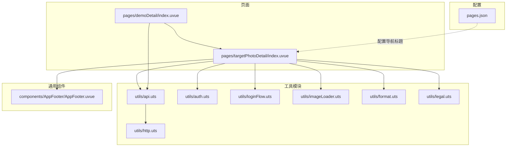
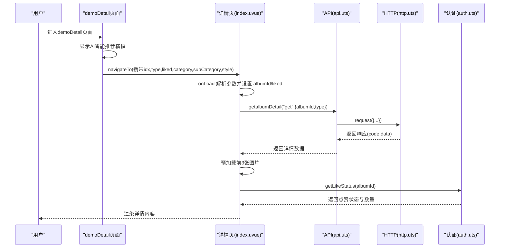
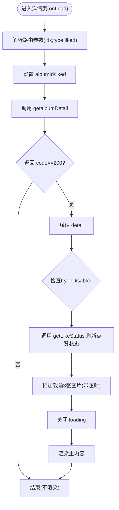
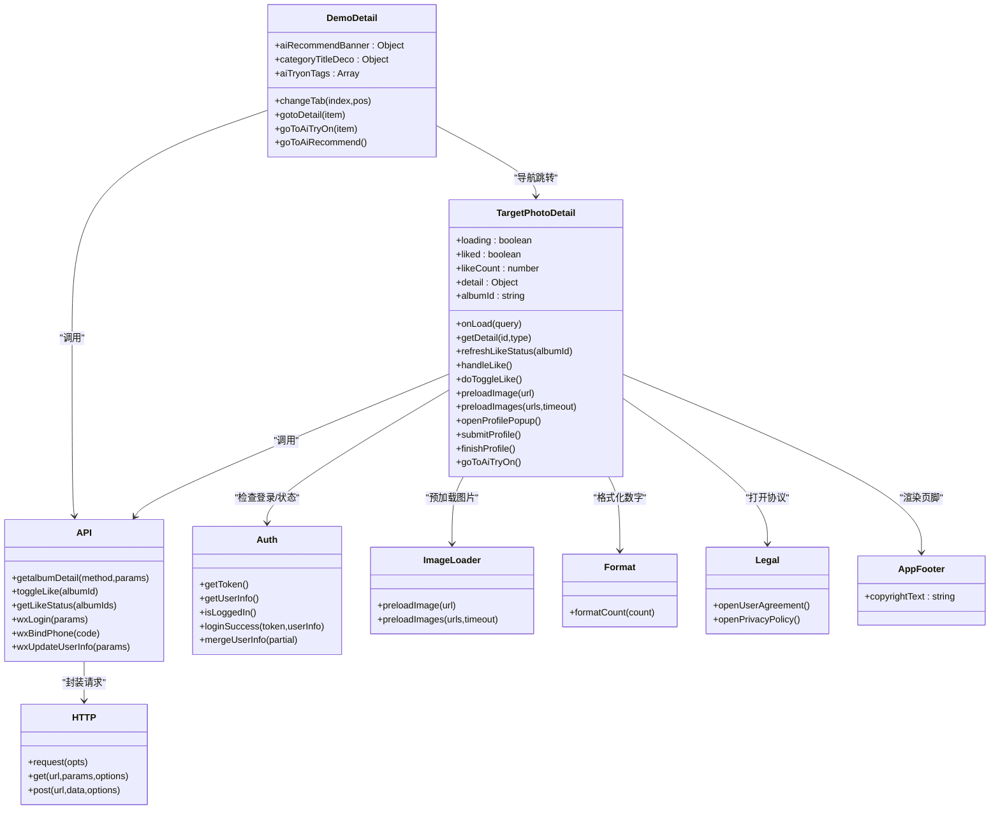
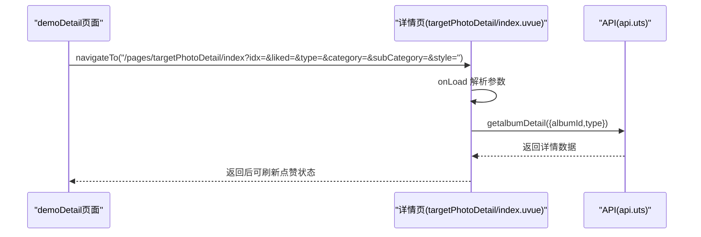
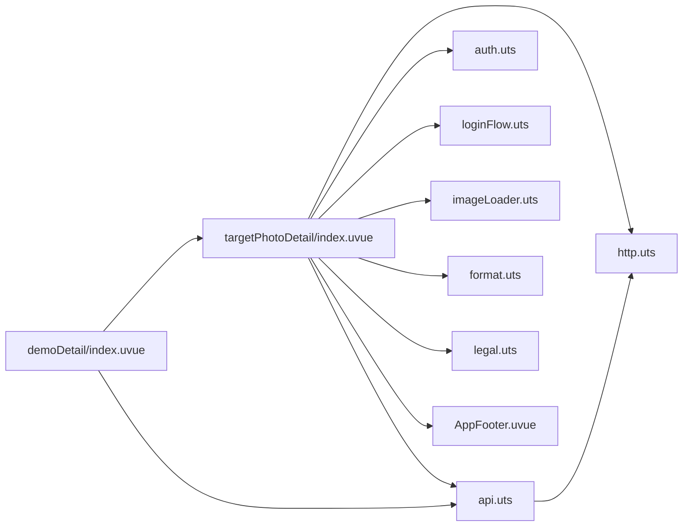

# 客片详情页面

<cite>
**本文引用的文件**
- [src/pages/targetPhotoDetail/index.uvue](file://src/pages/targetPhotoDetail/index.uvue)
- [src/pages/demoDetail/index.uvue](file://src/pages/demoDetail/index.uvue)
- [src/utils/api.uts](file://src/utils/api.uts)
- [src/utils/http.uts](file://src/utils/http.uts)
- [src/utils/auth.uts](file://src/utils/auth.uts)
- [src/utils/loginFlow.uts](file://src/utils/loginFlow.uts)
- [src/utils/imageLoader.uts](file://src/utils/imageLoader.uts)
- [src/utils/format.uts](file://src/utils/format.uts)
- [src/utils/legal.uts](file://src/utils/legal.uts)
- [src/components/AppFooter/AppFooter.uvue](file://src/components/AppFooter/AppFooter.uvue)
- [src/pages.json](file://src/pages.json)
- [src/pages/index/index.uvue](file://src/pages/index/index.uvue)
- [src/pages/favorites/index.uvue](file://src/pages/favorites/index.uvue)
- [.specanchor/modules/src-pages-album.spec.md](file://.specanchor/modules/src-pages-album.spec.md)
</cite>

## 更新摘要
**所做更改**
- 更新了demoDetail页面的重大UI重构内容，包括AI智能推荐横幅、分类区域装饰性头部、改进的标签按钮样式等
- 新增了AI试衣功能的集成说明
- 更新了页面间的导航关系和数据传递机制
- 增强了视觉设计和用户体验相关的描述

## 目录
1. [简介](#简介)
2. [项目结构](#项目结构)
3. [核心组件](#核心组件)
4. [架构总览](#架构总览)
5. [详细组件分析](#详细组件分析)
6. [依赖分析](#依赖分析)
7. [性能考虑](#性能考虑)
8. [故障排查指南](#故障排查指南)
9. [结论](#结论)
10. [附录](#附录)

## 简介
本文件面向"客片详情页面"功能，围绕 getalbumDetail 接口的实现原理与数据结构展开，系统阐述详情页的完整业务流程（页面初始化、数据加载、图片展示、交互功能）、UI 组件设计（图片轮播、信息展示、操作按钮等）、与列表页面的导航关系与数据传递机制，并提供性能优化策略（图片预加载、缓存管理、内存优化）、交互功能（点赞、收藏、分享、联系客服等）实现说明，以及功能扩展建议（评论系统、相关推荐、多语言支持等）。

**更新** 随着demoDetail页面的重大UI重构，客片详情页面现在集成了AI智能推荐功能和AI试衣功能，提供了更加丰富的用户交互体验。

## 项目结构
客片详情页面位于 pages/targetPhotoDetail/index.uvue，采用 Vue 单文件组件形式，结合 utils 下的 API、HTTP、认证、登录流程、图片预加载、格式化与法律条款等工具模块，完成从网络请求到 UI 渲染、从用户交互到状态管理的全链路实现。页面注册信息在 pages.json 中配置，导航标题为"客片欣赏"。

**图表来源**
- [src/pages/targetPhotoDetail/index.uvue:104-114](file://src/pages/targetPhotoDetail/index.uvue#L104-L114)
- [src/pages/demoDetail/index.uvue:209-222](file://src/pages/demoDetail/index.uvue#L209-L222)
- [src/utils/api.uts:114-122](file://src/utils/api.uts#L114-L122)
- [src/utils/http.uts:20-73](file://src/utils/http.uts#L20-L73)
- [src/utils/auth.uts:125-139](file://src/utils/auth.uts#L125-L139)
- [src/utils/loginFlow.uts:27-65](file://src/utils/loginFlow.uts#L27-L65)
- [src/utils/imageLoader.uts:8-27](file://src/utils/imageLoader.uts#L8-L27)
- [src/utils/format.uts:10-15](file://src/utils/format.uts#L10-L15)
- [src/utils/legal.uts:5-15](file://src/utils/legal.uts#L5-L15)
- [src/components/AppFooter/AppFooter.uvue:10-24](file://src/components/AppFooter/AppFooter.uvue#L10-L24)
- [src/pages.json:17-21](file://src/pages.json#L17-L21)

**章节来源**
- [src/pages/targetPhotoDetail/index.uvue:104-114](file://src/pages/targetPhotoDetail/index.uvue#L104-L114)
- [src/pages.json:17-21](file://src/pages.json#L17-L21)

## 核心组件
- 客片详情页面（targetPhotoDetail）
  - 负责页面生命周期处理、详情数据加载、点赞状态刷新、登录授权弹窗、头像昵称补全、图片预加载与展示。
- demoDetail页面（demoDetail）
  - **新增** 提供AI智能推荐入口、分类区域装饰性头部、改进的标签按钮样式、照片卡片布局优化等功能。
- AI智能推荐横幅
  - **新增** 位于demoDetail页面顶部，提供AI智能推荐服务入口，包含背景图片和文案展示。
- AI试衣功能
  - **新增** 在demoDetail页面卡片和targetPhotoDetail详情页中集成AI试衣功能，支持用户上传照片进行AI换装。
- API 工具模块（api.uts）
  - 提供 getalbumDetail、toggleLike、getLikeStatus、wxLogin、wxBindPhone、wxUpdateUserInfo 等接口封装。
- HTTP 工具模块（http.uts）
  - 统一封装请求、鉴权头注入、401 处理、超时控制与加载态控制。
- 认证工具模块（auth.uts）
  - 管理 token、用户信息存储与合并写入、登录状态判断。
- 登录流程封装（loginFlow.uts）
  - 封装"静默登录 -> 微信登录 -> 绑定手机号"的三步流程，输出标准化结果。
- 图片预加载（imageLoader.uts）
  - 提供单张/批量图片预加载与超时保护，避免详情切换时白屏。
- 数字格式化（format.uts）
  - 统一点赞/收藏/浏览数展示格式（如"55.9万"）。
- 法律条款（legal.uts）
  - 提供用户协议与隐私政策打开能力。
- 页脚组件（AppFooter.uvue）
  - 提供版权文本渲染，作为详情页底部展示。

**章节来源**
- [src/pages/targetPhotoDetail/index.uvue:116-133](file://src/pages/targetPhotoDetail/index.uvue#L116-L133)
- [src/pages/demoDetail/index.uvue:80-148](file://src/pages/demoDetail/index.uvue#L80-L148)
- [src/utils/api.uts:114-218](file://src/utils/api.uts#L114-L218)
- [src/utils/http.uts:20-73](file://src/utils/http.uts#L20-L73)
- [src/utils/auth.uts:17-139](file://src/utils/auth.uts#L17-L139)
- [src/utils/loginFlow.uts:27-65](file://src/utils/loginFlow.uts#L27-L65)
- [src/utils/imageLoader.uts:8-27](file://src/utils/imageLoader.uts#L8-L27)
- [src/utils/format.uts:10-15](file://src/utils/format.uts#L10-L15)
- [src/utils/legal.uts:5-15](file://src/utils/legal.uts#L5-L15)
- [src/components/AppFooter/AppFooter.uvue:10-24](file://src/components/AppFooter/AppFooter.uvue#L10-L24)

## 架构总览
客片详情页面的前端架构遵循"页面组件 + 工具模块"的分层设计：
- 页面组件负责视图渲染与用户交互，调用工具模块完成数据请求与状态管理。
- 工具模块之间职责清晰：API 封装业务接口；HTTP 统一网络层；认证与登录流程模块化；图片预加载与格式化提供通用能力。
- 详情页与列表页通过路由参数传递 albumId、type、liked 等关键信息，确保详情接口正确鉴权与渲染。

**更新** 现在demoDetail页面作为主要入口，集成了AI智能推荐和AI试衣功能，为用户提供更丰富的交互体验。

**图表来源**
- [src/pages/demoDetail/index.uvue:603-611](file://src/pages/demoDetail/index.uvue#L603-L611)
- [src/pages/targetPhotoDetail/index.uvue:142-152](file://src/pages/targetPhotoDetail/index.uvue#L142-L152)
- [src/utils/api.uts:114-122](file://src/utils/api.uts#L114-L122)
- [src/utils/http.uts:20-73](file://src/utils/http.uts#L20-L73)
- [src/utils/auth.uts:21-29](file://src/utils/auth.uts#L21-L29)

## 详细组件分析

### getalbumDetail 接口实现与数据结构
- 接口定义
  - 方法：GET
  - 路径：/wechat/album/detail
  - 请求参数：albumId（客片 ID）、type（门店标识，必填）
  - 返回：包含详情数据的对象，包含标题、价格、套餐描述、图片数组等字段。
- 实现要点
  - 通过 utils/api.uts 的 getalbumDetail 封装调用，内部委托 utils/http.uts 的 request 发起请求。
  - HTTP 层自动注入 Authorization 头（若存在 token），并处理 401 未授权场景。
- 数据结构要点
  - 详情对象包含 images 数组，每项包含图片地址等字段；页面通过 v-for 渲染图片。
  - 详情对象包含 price、packageDesc、title 等字段，用于标题与价格展示。
  - **新增** 详情对象包含 tryonDisabled 字段，用于控制AI试衣功能的显示。
- 错误处理
  - 当返回 code 非 200 时，页面不做渲染；加载态结束，保持骨架屏或错误提示。

**章节来源**
- [src/utils/api.uts:114-122](file://src/utils/api.uts#L114-L122)
- [src/utils/http.uts:20-73](file://src/utils/http.uts#L20-L73)
- [src/pages/targetPhotoDetail/index.uvue:175-200](file://src/pages/targetPhotoDetail/index.uvue#L175-L200)

### demoDetail页面UI重构特性

#### AI智能推荐横幅
- **新增** 位于页面顶部的AI智能推荐入口，使用背景图片 ai-recommend-banner.png
- 包含主标题"AI智能推荐·拍照选服饰"和副标题"上传照片，AI为您推荐最合适的服饰风格"
- 点击后跳转到AI智能推荐页面，传递shopId参数

#### 分类区域装饰性头部
- **新增** 分类标题区域增加了装饰性线条元素 category-title-line.png
- 标题文字"套系与子系分类"配合装饰线条，提升视觉层次感
- 使用flex布局实现标题与装饰元素的自适应排列

#### 改进的标签按钮样式
- **新增** 分类标签采用胶囊形设计，具有更好的视觉效果
- 选中状态使用金色背景 #F3D9AC 和深色文字，未选中状态使用半透明背景
- 支持水平滚动，适应不同屏幕尺寸

#### 照片卡片布局优化
- **新增** 每张照片卡片右下角添加了"AI试衣"标签按钮
- 卡片采用双列网格布局，间距为16rpx
- 图片使用aspectFill模式，保证填充效果
- 底部遮罩渐变效果，提升文字可读性

#### AI试衣功能简化
- **新增** 在demoDetail页面卡片和targetPhotoDetail详情页中集成AI试衣功能
- 支持条件显示：当 item.tryonDisabled !== true 时显示AI试衣标签
- 点击后跳转到AI试衣页面，传递albumId、shopId、category、subCategory、style等参数

**章节来源**
- [src/pages/demoDetail/index.uvue:80-148](file://src/pages/demoDetail/index.uvue#L80-L148)
- [src/pages/demoDetail/index.uvue:992-1041](file://src/pages/demoDetail/index.uvue#L992-L1041)
- [src/pages/targetPhotoDetail/index.uvue:51-52](file://src/pages/targetPhotoDetail/index.uvue#L51-L52)

### 页面初始化与数据加载流程
- 生命周期
  - onLoad：解析路由参数 idx、type、liked，设置 albumId 与初始点赞状态，随后调用 getDetail。
- 数据加载
  - getDetail：发起 getalbumDetail 请求，成功后赋值 detail；随后调用 getLikeStatus 刷新点赞状态与数量。
  - 图片预加载：提取 detail.images 前 3 张图片地址，调用 utils/imageLoader.uts 的 preloadImages 并设置超时，待缓存就绪后关闭加载态。
- 加载态与骨架屏
  - loading 控制骨架屏显示；加载完成后隐藏骨架屏并渲染主内容。

**图表来源**
- [src/pages/targetPhotoDetail/index.uvue:142-200](file://src/pages/targetPhotoDetail/index.uvue#L142-L200)
- [src/utils/imageLoader.uts:22-27](file://src/utils/imageLoader.uts#L22-L27)

**章节来源**
- [src/pages/targetPhotoDetail/index.uvue:142-200](file://src/pages/targetPhotoDetail/index.uvue#L142-L200)

### UI 组件设计与交互
- 标题与价格区域
  - 左侧展示标题与服务价格；右侧展示点赞按钮与点赞数，点赞数通过 formatCount 统一格式化。
- 套餐描述
  - 展示 packageDesc，用于说明套餐内容。
- 图片展示
  - 使用 v-for 遍历 detail.images，mode="widthFix" 保证图片自适应宽度，逐张渲染。
- 页脚
  - 使用 AppFooter 组件渲染版权信息，置于页面底部。
- AI试衣悬浮按钮
  - **新增** 详情页底部固定位置显示AI试衣按钮，使用渐变背景色，支持条件显示
- 登录弹窗与头像昵称补全
  - 未登录时点击点赞弹出登录弹窗；授权手机号后弹出头像昵称补全弹窗；提交后自动执行点赞操作。

**图表来源**
- [src/pages/targetPhotoDetail/index.uvue:120-200](file://src/pages/targetPhotoDetail/index.uvue#L120-L200)
- [src/pages/demoDetail/index.uvue:223-773](file://src/pages/demoDetail/index.uvue#L223-L773)
- [src/utils/api.uts:114-218](file://src/utils/api.uts#L114-L218)
- [src/utils/http.uts:20-73](file://src/utils/http.uts#L20-L73)
- [src/utils/auth.uts:17-139](file://src/utils/auth.uts#L17-L139)
- [src/utils/imageLoader.uts:8-27](file://src/utils/imageLoader.uts#L8-L27)
- [src/utils/format.uts:10-15](file://src/utils/format.uts#L10-L15)
- [src/utils/legal.uts:5-15](file://src/utils/legal.uts#L5-L15)
- [src/components/AppFooter/AppFooter.uvue:10-24](file://src/components/AppFooter/AppFooter.uvue#L10-L24)

**章节来源**
- [src/pages/targetPhotoDetail/index.uvue:19-49](file://src/pages/targetPhotoDetail/index.uvue#L19-L49)
- [src/pages/targetPhotoDetail/index.uvue:104-114](file://src/pages/targetPhotoDetail/index.uvue#L104-L114)

### 详情页与列表页的导航关系与数据传递
- 详情页入口
  - 从 demoDetail 或 favorites 跳转，路由参数包含 idx（albumId）、liked（初始点赞状态）、type（shopId）、category（父分类ID）、subCategory（子分类ID）、style（客片标题）。
- 路由约束
  - 详情页必须携带 type（shopId），否则详情接口会返回 400。
- 页面注册
  - pages.json 中配置详情页 navigationBarTitleText 为"客片欣赏"。

**更新** 现在demoDetail页面作为主要入口，传递更多上下文信息给详情页，包括分类信息和客片标题。

**图表来源**
- [src/pages/demoDetail/index.uvue:603-611](file://src/pages/demoDetail/index.uvue#L603-L611)
- [src/pages/targetPhotoDetail/index.uvue:142-152](file://src/pages/targetPhotoDetail/index.uvue#L142-L152)
- [src/utils/api.uts:114-122](file://src/utils/api.uts#L114-L122)
- [src/pages.json:17-21](file://src/pages.json#L17-L21)

**章节来源**
- [src/pages/demoDetail/index.uvue:603-611](file://src/pages/demoDetail/index.uvue#L603-L611)
- [src/pages/targetPhotoDetail/index.uvue:142-152](file://src/pages/targetPhotoDetail/index.uvue#L142-L152)
- [src/pages.json:17-21](file://src/pages.json#L17-L21)

### 交互功能实现
- 点赞/取消点赞
  - 未登录时弹出登录弹窗；登录成功后执行 doToggleLike，调用 toggleLike 并更新 UI。
- 收藏/取消收藏
  - 详情页当前未直接实现收藏按钮，但 API 工具模块提供 toggleFavorite 与 getFavoriteStatus，可在后续扩展。
- 分享
  - 页面未内置分享按钮，可结合小程序原生分享能力在页面中新增分享入口。
- 联系客服
  - 页面未内置客服入口，可在详情页底部或导航栏增加"联系客服"按钮，跳转至客服页面或拨打电话。
- **新增** AI试衣功能
  - 在demoDetail页面卡片和targetPhotoDetail详情页中提供AI试衣入口
  - 支持条件显示和参数传递，包括albumId、shopId、category、subCategory、style等信息

**章节来源**
- [src/pages/targetPhotoDetail/index.uvue:186-207](file://src/pages/targetPhotoDetail/index.uvue#L186-L207)
- [src/pages/demoDetail/index.uvue:612-627](file://src/pages/demoDetail/index.uvue#L612-L627)
- [src/utils/api.uts:197-218](file://src/utils/api.uts#L197-L218)

## 依赖分析
- 组件耦合
  - 详情页与 API、HTTP、认证、登录流程、图片预加载、格式化、法律条款模块松耦合，通过函数调用解耦。
- 外部依赖
  - 详情页依赖 pages.json 的路由配置；依赖 AppFooter 组件提供版权信息。
- 循环依赖
  - 未发现循环依赖迹象，模块职责清晰。

**更新** demoDetail页面现在作为主要入口，与targetPhotoDetail页面形成清晰的导航关系。

**图表来源**
- [src/pages/targetPhotoDetail/index.uvue:104-114](file://src/pages/targetPhotoDetail/index.uvue#L104-L114)
- [src/pages/demoDetail/index.uvue:209-222](file://src/pages/demoDetail/index.uvue#L209-L222)
- [src/utils/api.uts:114-122](file://src/utils/api.uts#L114-L122)
- [src/utils/http.uts:20-73](file://src/utils/http.uts#L20-L73)
- [src/utils/auth.uts:125-139](file://src/utils/auth.uts#L125-L139)
- [src/utils/loginFlow.uts:27-65](file://src/utils/loginFlow.uts#L27-L65)
- [src/utils/imageLoader.uts:8-27](file://src/utils/imageLoader.uts#L8-L27)
- [src/utils/format.uts:10-15](file://src/utils/format.uts#L10-L15)
- [src/utils/legal.uts:5-15](file://src/utils/legal.uts#L5-L15)
- [src/components/AppFooter/AppFooter.uvue:10-24](file://src/components/AppFooter/AppFooter.uvue#L10-L24)

**章节来源**
- [src/pages/targetPhotoDetail/index.uvue:104-114](file://src/pages/targetPhotoDetail/index.uvue#L104-L114)

## 性能考虑
- 图片预加载
  - 在详情数据返回后，仅预加载前 3 张图片，并设置超时保护，避免长时间等待导致页面卡顿。
- 缓存管理
  - 详情页未实现本地缓存；可考虑在 getDetail 成功后将 detail 写入本地缓存，下次进入时优先读取缓存并异步刷新。
- 内存优化
  - 图片使用 widthFix 模式自适应，减少不必要的缩放计算；避免一次性渲染过多图片，当前已限制预加载数量。
- 网络优化
  - HTTP 层统一注入 Authorization 头，减少重复逻辑；401 自动清理认证信息并提示重新登录。

**更新** demoDetail页面现在预加载前6张封面图，提供更好的首屏体验。

**章节来源**
- [src/pages/targetPhotoDetail/index.uvue:189-194](file://src/pages/targetPhotoDetail/index.uvue#L189-L194)
- [src/pages/demoDetail/index.uvue:375-380](file://src/pages/demoDetail/index.uvue#L375-L380)
- [src/utils/imageLoader.uts:22-27](file://src/utils/imageLoader.uts#L22-L27)
- [src/utils/http.uts:20-73](file://src/utils/http.uts#L20-L73)

## 故障排查指南
- 详情页空白或一直加载
  - 检查路由参数 idx 与 type 是否正确传递；type 缺失会导致接口 400。
  - 检查 getalbumDetail 返回 code 是否为 200。
- 点赞失败
  - 确认用户已登录；查看 doToggleLike 的错误日志与 toast 提示。
- 登录弹窗无法关闭或头像昵称补全失败
  - 检查 onGetPhoneNumber 回调与 runPhoneLogin 的返回结果；确认 wxBindPhone 是否成功合并用户信息。
- 401 未授权
  - HTTP 层会自动清理 token 与用户信息并提示重新登录；检查后端鉴权配置。
- **新增** AI试衣功能问题
  - 检查 tryonDisabled 字段是否正确控制AI试衣功能的显示
  - 验证AI试衣页面跳转参数是否正确传递
  - 确认AI试衣相关资源文件是否存在

**章节来源**
- [src/pages/targetPhotoDetail/index.uvue:175-200](file://src/pages/targetPhotoDetail/index.uvue#L175-L200)
- [src/utils/api.uts:197-218](file://src/utils/api.uts#L197-L218)
- [src/utils/loginFlow.uts:27-65](file://src/utils/loginFlow.uts#L27-L65)
- [src/utils/http.uts:50-61](file://src/utils/http.uts#L50-L61)

## 结论
客片详情页面通过清晰的模块化设计与完善的工具链，实现了从数据加载、图片预加载到用户交互的完整闭环。getalbumDetail 接口与数据结构简洁明确，配合统一的鉴权与错误处理机制，保障了良好的用户体验。**随着demoDetail页面的重大UI重构，现在集成了AI智能推荐和AI试衣功能，为用户提供了更加丰富和智能化的交互体验。** 后续可在收藏、分享、评论、相关推荐等方面进行扩展，同时持续优化缓存与网络层性能。

## 附录
- 功能扩展建议
  - 评论系统：引入评论列表与发布组件，调用后端评论接口，支持分页与排序。
  - 相关推荐：根据当前客片类型与标签，调用推荐接口返回相似客片列表。
  - 多语言支持：将文案抽离为 i18n 资源，按用户语言动态切换。
  - 分享能力：在详情页增加分享按钮，调用小程序分享 API，支持分享标题、图片与路径。
  - 联系客服：在详情页底部增加"联系客服"入口，支持跳转至客服页面或拨打电话。
- 业务规则参考
  - 详情页必须携带 type（shopId），否则接口 400。
  - 列表页返回后 onShow 需刷新点赞状态。
  - **新增** AI试衣功能受 tryonDisabled 字段控制，支持条件显示。
  - **新增** demoDetail页面作为主要入口，传递更多上下文信息给详情页。

**章节来源**
- [.specanchor/modules/src-pages-album.spec.md:45-74](file://.specanchor/modules/src-pages-album.spec.md#L45-L74)
- [.specanchor/modules/src-pages-album.spec.md:144-174](file://.specanchor/modules/src-pages-album.spec.md#L144-L174)