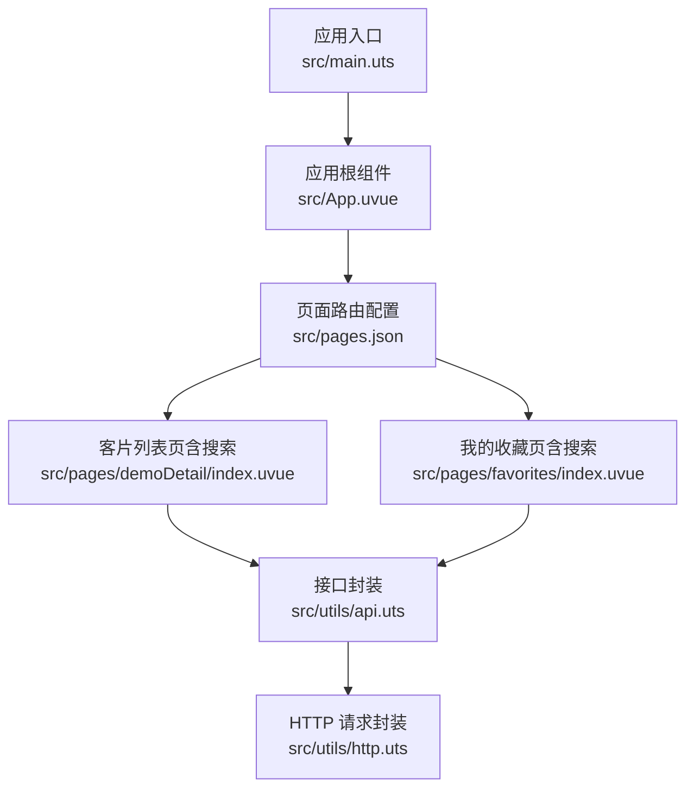
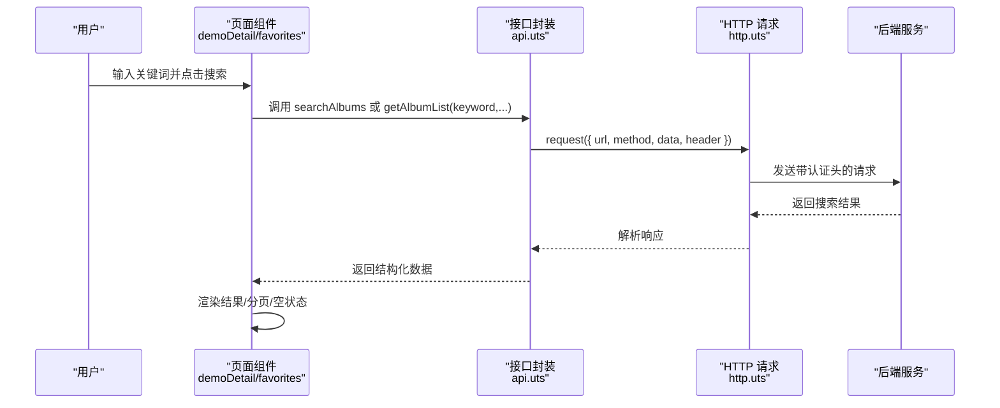
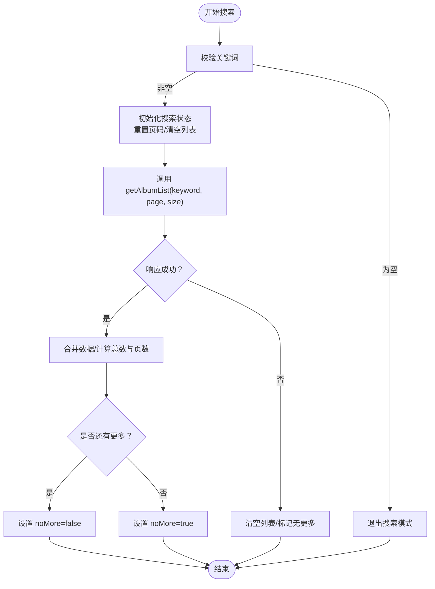
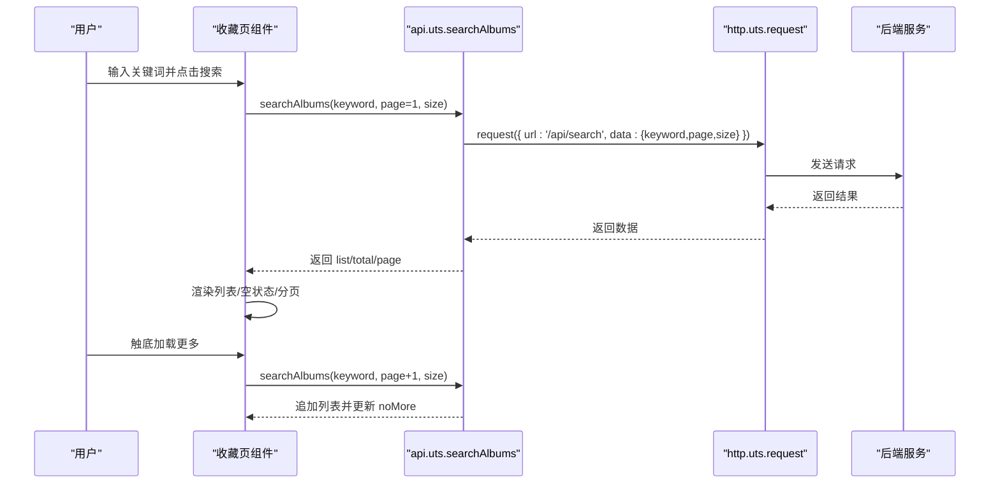
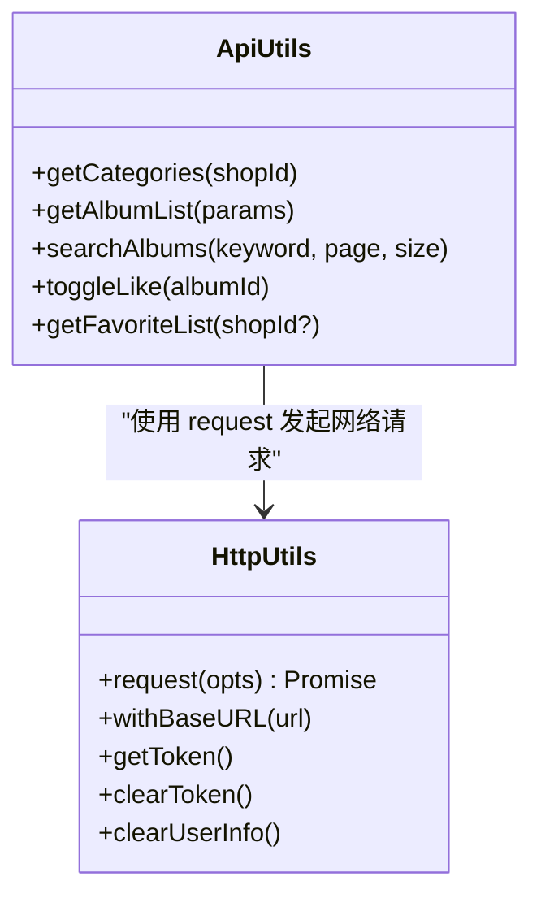
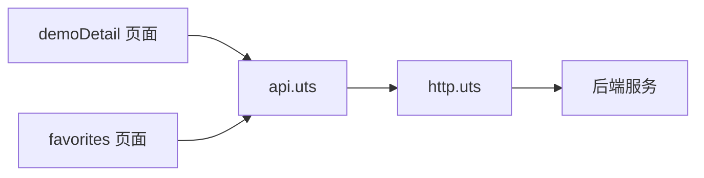

# 搜索系统

<cite>
**本文引用的文件**
- [README.md](file://README.md)
- [src/main.uts](file://src/main.uts)
- [src/App.uvue](file://src/App.uvue)
- [src/pages.json](file://src/pages.json)
- [src/pages/demoDetail/index.uvue](file://src/pages/demoDetail/index.uvue)
- [src/pages/favorites/index.uvue](file://src/pages/favorites/index.uvue)
- [src/utils/api.uts](file://src/utils/api.uts)
- [src/utils/http.uts](file://src/utils/http.uts)
</cite>

## 目录
1. [简介](#简介)
2. [项目结构](#项目结构)
3. [核心组件](#核心组件)
4. [架构总览](#架构总览)
5. [详细组件分析](#详细组件分析)
6. [依赖关系分析](#依赖关系分析)
7. [性能考量](#性能考量)
8. [故障排查指南](#故障排查指南)
9. [结论](#结论)
10. [附录](#附录)

## 简介
本文件面向“蓝莓小程序”的搜索系统，围绕模糊搜索实现、搜索结果展示、搜索历史管理等核心功能进行系统化说明。文档重点解释搜索算法、关键词匹配、结果排序等技术实现，并给出性能优化策略（如搜索索引、防抖处理、结果缓存）与体验优化方案（搜索建议、热门搜索、搜索历史）。最后提供扩展指导，帮助在现有基础上增强搜索范围与高级筛选能力。

## 项目结构
蓝莓小程序采用 uni-app x + Vue 3 + UTS 的技术栈，页面与工具模块集中在 src 目录。搜索系统主要涉及以下文件：
- 页面：客片列表页（搜索入口）、我的收藏页（搜索入口）
- 工具模块：接口封装（api.uts）、HTTP 请求（http.uts）
- 应用配置：页面路由与全局样式（pages.json）

图表来源
- [src/main.uts:1-9](file://src/main.uts#L1-L9)
- [src/App.uvue:1-335](file://src/App.uvue#L1-L335)
- [src/pages.json:1-90](file://src/pages.json#L1-L90)
- [src/pages/demoDetail/index.uvue:1-800](file://src/pages/demoDetail/index.uvue#L1-L800)
- [src/pages/favorites/index.uvue:1-229](file://src/pages/favorites/index.uvue#L1-L229)
- [src/utils/api.uts:1-312](file://src/utils/api.uts#L1-L312)
- [src/utils/http.uts:20-73](file://src/utils/http.uts#L20-L73)

章节来源
- [README.md:85-133](file://README.md#L85-L133)
- [src/pages.json:1-90](file://src/pages.json#L1-L90)

## 核心组件
- 搜索入口与交互
  - 客片列表页：自定义导航栏内嵌搜索输入框，支持键盘搜索按钮触发搜索。
  - 我的收藏页：自定义导航栏内嵌搜索输入框，支持对收藏内容进行搜索。
- 搜索接口
  - 模糊搜索接口：统一通过 api.uts 的 searchAlbums 方法发起请求。
  - 列表搜索：demoDetail 页面通过 getAlbumList 透传 keyword 实现搜索。
- 结果展示与分页
  - 搜索结果以网格卡片形式展示，支持触底加载更多。
  - 空结果状态与“已经到底了”提示。
- 认证与鉴权
  - HTTP 层自动附加 Authorization 与 X-App-Code 请求头，401 自动登出清理。

章节来源
- [src/pages/demoDetail/index.uvue:7-21](file://src/pages/demoDetail/index.uvue#L7-L21)
- [src/pages/demoDetail/index.uvue:38-73](file://src/pages/demoDetail/index.uvue#L38-L73)
- [src/pages/favorites/index.uvue:3-23](file://src/pages/favorites/index.uvue#L3-L23)
- [src/pages/favorites/index.uvue:157-191](file://src/pages/favorites/index.uvue#L157-L191)
- [src/utils/api.uts:261-283](file://src/utils/api.uts#L261-L283)
- [src/utils/api.uts:86-111](file://src/utils/api.uts#L86-L111)
- [src/utils/http.uts:20-73](file://src/utils/http.uts#L20-L73)

## 架构总览
搜索系统整体采用“页面 -> 接口封装 -> HTTP 请求”的分层设计。页面负责用户交互与状态管理，接口封装负责参数拼装与响应解析，HTTP 层负责网络请求与认证头注入。

图表来源
- [src/pages/demoDetail/index.uvue:388-460](file://src/pages/demoDetail/index.uvue#L388-L460)
- [src/pages/favorites/index.uvue:157-191](file://src/pages/favorites/index.uvue#L157-L191)
- [src/utils/api.uts:275-283](file://src/utils/api.uts#L275-L283)
- [src/utils/api.uts:86-111](file://src/utils/api.uts#L86-L111)
- [src/utils/http.uts:20-73](file://src/utils/http.uts#L20-L73)

## 详细组件分析

### 客片列表页搜索（demoDetail）
- 搜索触发与状态管理
  - 输入框绑定 searchKeyword，键盘搜索按钮触发 handleSearch。
  - 切换 isSearching 状态，清空/重置搜索分页参数，调用 doSearch 执行搜索。
- 搜索执行与分页
  - doSearch 通过 getAlbumList 透传 keyword、page、size 参数。
  - 根据 total 与 size 计算 totalPages 并更新 noMore 状态。
- 结果展示与加载更多
  - 搜索结果以网格卡片展示；空结果时显示“暂无搜索结果”提示。
  - onReachBottom 根据 isSearching 判断走 loadMoreSearch 或 loadMoreAlbum。

图表来源
- [src/pages/demoDetail/index.uvue:388-460](file://src/pages/demoDetail/index.uvue#L388-L460)
- [src/utils/api.uts:86-111](file://src/utils/api.uts#L86-L111)

章节来源
- [src/pages/demoDetail/index.uvue:222-230](file://src/pages/demoDetail/index.uvue#L222-L230)
- [src/pages/demoDetail/index.uvue:388-460](file://src/pages/demoDetail/index.uvue#L388-L460)
- [src/pages/demoDetail/index.uvue:267-275](file://src/pages/demoDetail/index.uvue#L267-L275)
- [src/pages/demoDetail/index.uvue:37-73](file://src/pages/demoDetail/index.uvue#L37-L73)

### 我的收藏页搜索（favorites）
- 搜索入口与生命周期
  - onShow 中根据 isSearching 决定是否重新搜索或刷新收藏列表。
  - handleSearch 支持清空关键词回退到收藏列表。
- 搜索执行
  - 调用 searchAlbums(keyword, page, size)，解析 data.list 作为展示数据。
  - 通过 getSearchItems/getSearchTotal 处理不同响应结构。
- 加载更多
  - loadMore 仅在 isSearching 且未到达末尾时触发，拼接结果并更新页码与 noMore。

图表来源
- [src/pages/favorites/index.uvue:157-191](file://src/pages/favorites/index.uvue#L157-L191)
- [src/pages/favorites/index.uvue:193-218](file://src/pages/favorites/index.uvue#L193-L218)
- [src/utils/api.uts:275-283](file://src/utils/api.uts#L275-L283)
- [src/utils/http.uts:20-73](file://src/utils/http.uts#L20-L73)

章节来源
- [src/pages/favorites/index.uvue:82-99](file://src/pages/favorites/index.uvue#L82-L99)
- [src/pages/favorites/index.uvue:107-119](file://src/pages/favorites/index.uvue#L107-L119)
- [src/pages/favorites/index.uvue:157-191](file://src/pages/favorites/index.uvue#L157-L191)
- [src/pages/favorites/index.uvue:193-218](file://src/pages/favorites/index.uvue#L193-L218)

### 接口封装与 HTTP 层
- 接口封装（api.uts）
  - searchAlbums：统一调用 /api/search，返回 SearchPageResult 结构。
  - getAlbumList：统一调用 /wechat/albums，支持 keyword、page、size 等参数。
- HTTP 层（http.uts）
  - request：自动拼接 baseURL、注入 Authorization/X-App-Code、处理 401 清理并提示。
  - 超时控制与 loading 控制，便于页面侧统一管理。

图表来源
- [src/utils/api.uts:1-312](file://src/utils/api.uts#L1-L312)
- [src/utils/http.uts:20-73](file://src/utils/http.uts#L20-L73)

章节来源
- [src/utils/api.uts:261-283](file://src/utils/api.uts#L261-L283)
- [src/utils/api.uts:86-111](file://src/utils/api.uts#L86-L111)
- [src/utils/http.uts:20-73](file://src/utils/http.uts#L20-L73)

## 依赖关系分析
- 页面依赖接口封装，接口封装依赖 HTTP 层。
- demoDetail 与 favorites 两个页面共享相同的搜索行为与接口契约。
- HTTP 层统一处理认证头与错误处理，降低页面复杂度。

图表来源
- [src/pages/demoDetail/index.uvue:190-201](file://src/pages/demoDetail/index.uvue#L190-L201)
- [src/pages/favorites/index.uvue:1-229](file://src/pages/favorites/index.uvue#L1-L229)
- [src/utils/api.uts:1-312](file://src/utils/api.uts#L1-L312)
- [src/utils/http.uts:20-73](file://src/utils/http.uts#L20-L73)

章节来源
- [src/pages/demoDetail/index.uvue:190-201](file://src/pages/demoDetail/index.uvue#L190-L201)
- [src/pages/favorites/index.uvue:1-229](file://src/pages/favorites/index.uvue#L1-L229)
- [src/utils/api.uts:1-312](file://src/utils/api.uts#L1-L312)
- [src/utils/http.uts:20-73](file://src/utils/http.uts#L20-L73)

## 性能考量
- 搜索索引与关键词匹配
  - 建议后端实现关键词分词与权重排序，前端按需展示高亮与摘要。
- 防抖处理
  - 在输入事件上增加防抖（例如 300ms），减少频繁请求。
- 结果缓存
  - 对相同关键词与相同筛选条件的结果进行内存缓存，命中则直接渲染。
- 分页与懒加载
  - 已实现分页与触底加载，建议结合虚拟列表优化长列表渲染性能。
- 网络与错误处理
  - HTTP 层已处理 401 自动登出，页面侧应避免重复请求与并发冲突。

[本节为通用性能建议，不直接分析具体文件]

## 故障排查指南
- 搜索无结果
  - 检查关键词是否为空；确认接口返回码与数据结构。
  - 查看页面空状态渲染逻辑与 total/page 计算。
- 加载更多无效
  - 确认 noMore 与 loading 状态判断；检查 totalPages 与 size 的计算。
- 登录态失效
  - HTTP 层 401 会清理 token 与用户信息并提示，请引导用户重新登录。
- 请求头缺失
  - 确认 X-App-Code 与 Authorization 是否正确注入。

章节来源
- [src/pages/demoDetail/index.uvue:417-456](file://src/pages/demoDetail/index.uvue#L417-L456)
- [src/pages/favorites/index.uvue:193-218](file://src/pages/favorites/index.uvue#L193-L218)
- [src/utils/http.uts:20-73](file://src/utils/http.uts#L20-L73)

## 结论
蓝莓小程序的搜索系统以清晰的分层设计实现了“页面 -> 接口封装 -> HTTP 层”的解耦，demoDetail 与 favorites 两个页面共享一致的搜索行为与接口契约。当前实现具备基础的模糊搜索、分页与空状态处理，建议后续引入防抖、缓存、关键词高亮与后端索引优化，以进一步提升性能与用户体验。

[本节为总结性内容，不直接分析具体文件]

## 附录
- 搜索体验优化建议
  - 搜索建议：结合热门搜索与历史搜索，提供下拉建议列表。
  - 热门搜索：后端返回热门词，前端展示“大家都在搜”。
  - 搜索历史：本地持久化历史记录，支持清除与去重。
- 扩展方向
  - 搜索范围定制：在 demoDetail 中增加“全部/仅收藏”等范围开关。
  - 高级筛选：在现有 keyword 基础上增加价格区间、时间范围、标签等筛选条件。
  - 结果排序：支持按时间、热度、相关度排序，后端返回排序字段供前端切换。

[本节为概念性内容，不直接分析具体文件]
