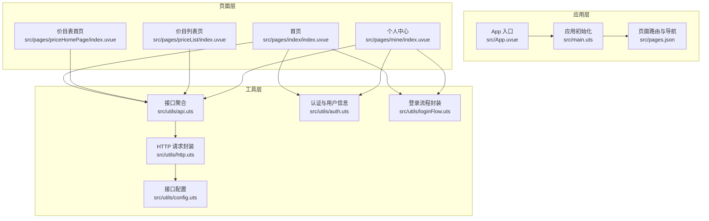
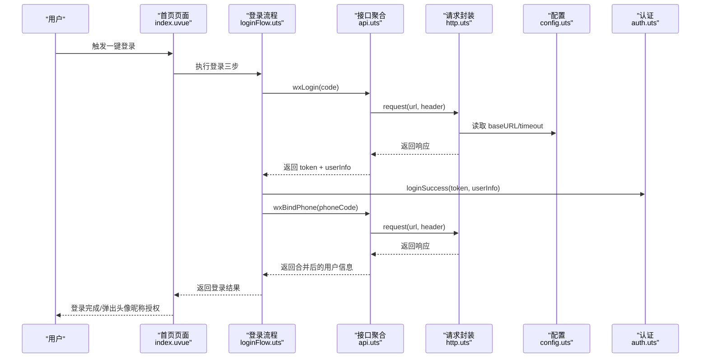
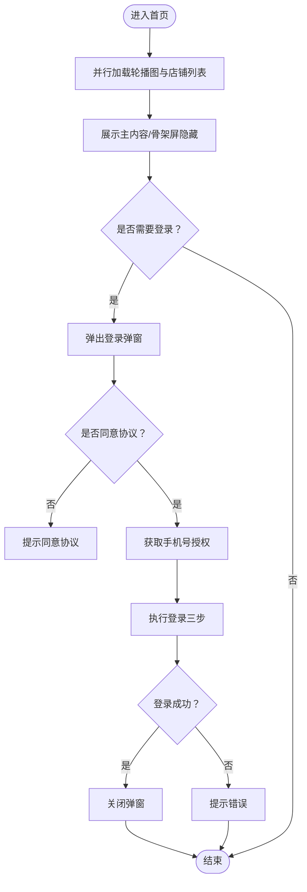
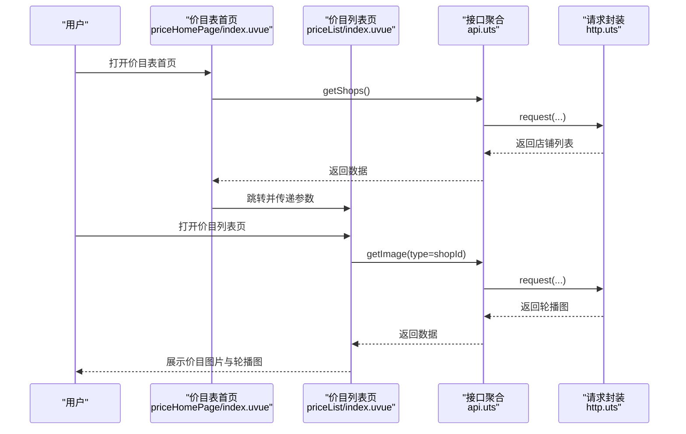
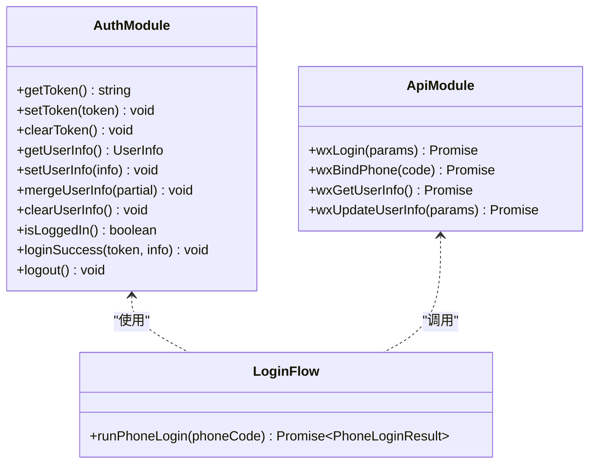
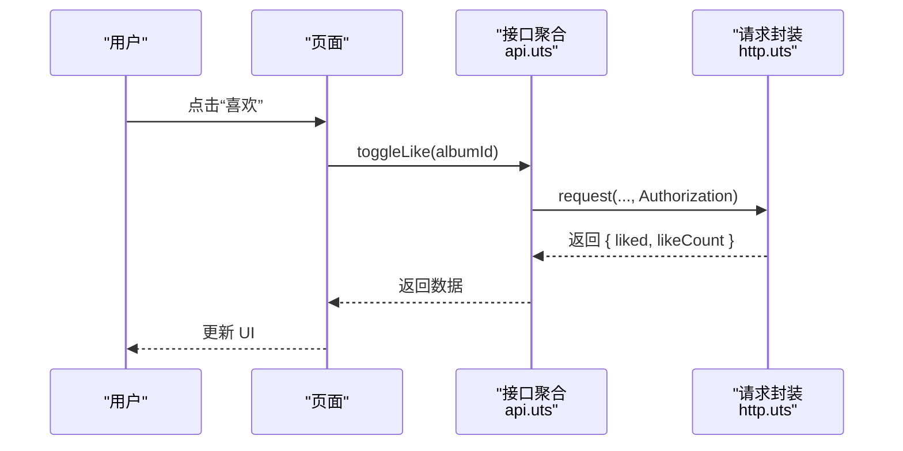
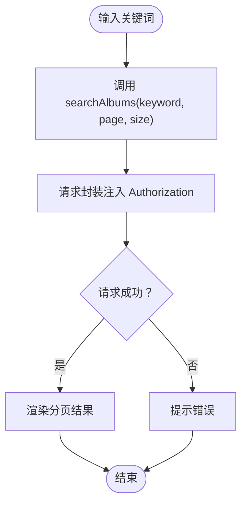
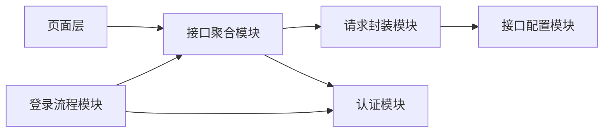

# 核心功能模块

<cite>
**本文引用的文件**
- [README.md](file://README.md)
- [src/main.uts](file://src/main.uts)
- [src/App.uvue](file://src/App.uvue)
- [src/pages.json](file://src/pages.json)
- [src/utils/api.uts](file://src/utils/api.uts)
- [src/utils/auth.uts](file://src/utils/auth.uts)
- [src/utils/http.uts](file://src/utils/http.uts)
- [src/utils/config.uts](file://src/utils/config.uts)
- [src/utils/loginFlow.uts](file://src/utils/loginFlow.uts)
- [src/pages/index/index.uvue](file://src/pages/index/index.uvue)
- [src/pages/priceHomePage/index.uvue](file://src/pages/priceHomePage/index.uvue)
- [src/pages/priceList/index.uvue](file://src/pages/priceList/index.uvue)
- [src/pages/mine/index.uvue](file://src/pages/mine/index.uvue)
</cite>

## 目录
1. [简介](#简介)
2. [项目结构](#项目结构)
3. [核心组件](#核心组件)
4. [架构总览](#架构总览)
5. [详细组件分析](#详细组件分析)
6. [依赖分析](#依赖分析)
7. [性能考虑](#性能考虑)
8. [故障排查指南](#故障排查指南)
9. [结论](#结论)
10. [附录](#附录)

## 简介
本项目是基于 uni-app x（Vue 3 + TypeScript/UTS）的微信小程序模板，提供“一套源码、多端复用”的能力，并内置 Profile 多项目配置机制与一键构建/校验/发布脚本。本文聚焦核心功能模块，包括首页展示系统、客片浏览系统、价格展示系统、用户认证系统、社交互动系统（点赞/收藏）、搜索系统、以及合规页面与登录弹窗等，解释各模块的业务价值、技术实现、模块间依赖与数据流转，并给出扩展与定制建议，帮助产品经理与开发者快速定位与修改功能。

## 项目结构
- 源码入口与应用初始化
  - 应用入口与全局样式：[src/App.uvue](file://src/App.uvue)
  - 应用初始化：[src/main.uts](file://src/main.uts)
  - 页面路由与全局导航：[src/pages.json](file://src/pages.json)
- 工具模块（统一请求、认证、配置、登录流程）
  - 请求封装与拦截：[src/utils/http.uts](file://src/utils/http.uts)
  - 接口配置：[src/utils/config.uts](file://src/utils/config.uts)
  - 接口聚合：[src/utils/api.uts](file://src/utils/api.uts)
  - 认证状态与用户信息：[src/utils/auth.uts](file://src/utils/auth.uts)
  - 登录三步流程：[src/utils/loginFlow.uts](file://src/utils/loginFlow.uts)
- 页面模块
  - 首页：[src/pages/index/index.uvue](file://src/pages/index/index.uvue)
  - 价目表首页：[src/pages/priceHomePage/index.uvue](file://src/pages/priceHomePage/index.uvue)
  - 价目列表页：[src/pages/priceList/index.uvue](file://src/pages/priceList/index.uvue)
  - 个人中心：[src/pages/mine/index.uvue](file://src/pages/mine/index.uvue)

图表来源
- [src/App.uvue:1-335](file://src/App.uvue#L1-L335)
- [src/main.uts:1-9](file://src/main.uts#L1-L9)
- [src/pages.json:1-90](file://src/pages.json#L1-L90)
- [src/utils/http.uts:1-82](file://src/utils/http.uts#L1-L82)
- [src/utils/config.uts:1-12](file://src/utils/config.uts#L1-L12)
- [src/utils/api.uts:1-312](file://src/utils/api.uts#L1-L312)
- [src/utils/auth.uts:1-149](file://src/utils/auth.uts#L1-L149)
- [src/utils/loginFlow.uts:1-71](file://src/utils/loginFlow.uts#L1-L71)
- [src/pages/index/index.uvue:1-432](file://src/pages/index/index.uvue#L1-L432)
- [src/pages/priceHomePage/index.uvue:1-168](file://src/pages/priceHomePage/index.uvue#L1-L168)
- [src/pages/priceList/index.uvue:1-113](file://src/pages/priceList/index.uvue#L1-L113)
- [src/pages/mine/index.uvue:1-604](file://src/pages/mine/index.uvue#L1-L604)

章节来源
- [README.md:85-130](file://README.md#L85-L130)
- [src/pages.json:1-90](file://src/pages.json#L1-L90)

## 核心组件
- 首页展示系统
  - 职责：轮播图、客片欣赏入口、服务说明、联系方式、登录弹窗与头像昵称授权弹窗。
  - 关键接口：轮播图、店铺列表。
  - 关键交互：一键登录、手机号授权、头像昵称补全。
- 价目表系统
  - 价目表首页：展示可用店铺，进入价目列表页。
  - 价目列表页：根据店铺 ID 展示价目图片，支持轮播图兜底。
- 用户认证系统
  - 职责：Token 管理、用户信息持久化、登录状态检测、登出清理。
  - 关键流程：登录三步（静默登录 -> 微信登录 -> 绑定手机），头像昵称补全。
- 社交互动系统
  - 职责：点赞/取消点赞、收藏/取消收藏、批量状态查询、我的收藏列表。
- 搜索系统
  - 职责：相册模糊搜索，返回分页结果。
- 合规页面与骨架屏
  - 职责：内置用户协议与隐私政策页面；全局骨架屏样式与登录弹窗样式。

章节来源
- [src/pages/index/index.uvue:111-309](file://src/pages/index/index.uvue#L111-L309)
- [src/pages/priceHomePage/index.uvue:46-79](file://src/pages/priceHomePage/index.uvue#L46-L79)
- [src/pages/priceList/index.uvue:27-77](file://src/pages/priceList/index.uvue#L27-L77)
- [src/utils/auth.uts:1-149](file://src/utils/auth.uts#L1-L149)
- [src/utils/loginFlow.uts:1-71](file://src/utils/loginFlow.uts#L1-L71)
- [src/utils/api.uts:261-312](file://src/utils/api.uts#L261-L312)

## 架构总览
- 数据流向
  - 页面通过工具层接口聚合模块发起请求，工具层请求封装负责拼接 baseURL、注入 Authorization/X-App-Code、处理 401 自动登出。
  - 认证状态与用户信息通过本地存储进行持久化，登录流程封装统一处理登录三步与头像昵称补全。
- 控制流
  - 页面生命周期中并行加载关键数据，骨架屏提升首屏体验；登录弹窗与头像昵称弹窗在用户交互时触发。
- 依赖关系
  - 页面依赖接口聚合模块；接口聚合模块依赖请求封装与认证模块；请求封装依赖接口配置与认证模块。

图表来源
- [src/pages/index/index.uvue:182-234](file://src/pages/index/index.uvue#L182-L234)
- [src/utils/loginFlow.uts:27-70](file://src/utils/loginFlow.uts#L27-L70)
- [src/utils/api.uts:129-154](file://src/utils/api.uts#L129-L154)
- [src/utils/http.uts:20-73](file://src/utils/http.uts#L20-L73)
- [src/utils/config.uts:7-11](file://src/utils/config.uts#L7-L11)
- [src/utils/auth.uts:135-148](file://src/utils/auth.uts#L135-L148)

## 详细组件分析

### 首页展示系统
- 业务价值
  - 通过轮播图与客片欣赏入口吸引用户，提供服务说明与联系方式，降低转化门槛。
- 技术实现
  - 首屏并行加载轮播图与店铺列表，骨架屏优化体验。
  - 登录弹窗与头像昵称授权弹窗在用户交互时出现，支持协议跳转。
- 关键接口
  - 轮播图：getImage
  - 店铺列表：getShops
- 用户使用场景
  - 场景1：首次进入，看到轮播图与客片入口，点击“一键登录”完成授权。
  - 场景2：登录后未完善头像昵称，进入“完善个人资料”弹窗，提交后回到首页。
- 数据流转
  - 页面 onLoad 并行请求轮播图与店铺列表；登录成功后关闭弹窗并刷新状态。

图表来源
- [src/pages/index/index.uvue:139-157](file://src/pages/index/index.uvue#L139-L157)
- [src/pages/index/index.uvue:182-234](file://src/pages/index/index.uvue#L182-L234)
- [src/utils/api.uts:28-47](file://src/utils/api.uts#L28-L47)
- [src/utils/api.uts:290-297](file://src/utils/api.uts#L290-L297)

章节来源
- [src/pages/index/index.uvue:111-309](file://src/pages/index/index.uvue#L111-L309)
- [src/utils/api.uts:28-47](file://src/utils/api.uts#L28-L47)
- [src/utils/api.uts:290-297](file://src/utils/api.uts#L290-L297)

### 价目表系统
- 业务价值
  - 价目表首页提供店铺入口，价目列表页展示价目图片与轮播图，便于用户了解价格与服务。
- 技术实现
  - 价目表首页：获取可用店铺并展示；点击进入价目列表页。
  - 价目列表页：根据路由参数设置导航标题，加载轮播图与价目图片，支持兜底图片。
- 用户使用场景
  - 场景1：从价目表首页点击某个店铺，进入价目列表页查看该店铺价目。
  - 场景2：无店铺时，使用兜底图片与轮播图增强体验。
- 数据流转
  - 页面 onLoad 解析路由参数，设置导航标题；异步加载轮播图与价目图片。

图表来源
- [src/pages/priceHomePage/index.uvue:46-79](file://src/pages/priceHomePage/index.uvue#L46-L79)
- [src/pages/priceList/index.uvue:27-77](file://src/pages/priceList/index.uvue#L27-L77)
- [src/utils/api.uts:28-47](file://src/utils/api.uts#L28-L47)
- [src/utils/api.uts:290-297](file://src/utils/api.uts#L290-L297)

章节来源
- [src/pages/priceHomePage/index.uvue:46-79](file://src/pages/priceHomePage/index.uvue#L46-L79)
- [src/pages/priceList/index.uvue:27-77](file://src/pages/priceList/index.uvue#L27-L77)

### 用户认证系统
- 业务价值
  - 统一管理登录态与用户信息，确保敏感操作（点赞、收藏、我的收藏）的安全性。
- 技术实现
  - Token 管理：本地存储读写与清理。
  - 用户信息管理：合并写入，避免覆盖已有字段。
  - 登录状态检测：基于 Token 判断是否已登录。
  - 登录流程封装：静默登录 -> 微信登录 -> 绑定手机，支持头像昵称补全。
- 用户使用场景
  - 场景1：在个人中心点击“我的喜欢”，若未登录则弹出登录弹窗。
  - 场景2：登录后若缺少头像或昵称，弹出授权弹窗补齐。
- 数据流转
  - 登录成功后写入 Token 与用户信息；页面显示时刷新登录状态。

图表来源
- [src/utils/auth.uts:1-149](file://src/utils/auth.uts#L1-L149)
- [src/utils/loginFlow.uts:1-71](file://src/utils/loginFlow.uts#L1-L71)
- [src/utils/api.uts:129-190](file://src/utils/api.uts#L129-L190)

章节来源
- [src/utils/auth.uts:1-149](file://src/utils/auth.uts#L1-L149)
- [src/utils/loginFlow.uts:1-71](file://src/utils/loginFlow.uts#L1-L71)

### 社交互动系统（点赞/收藏）
- 业务价值
  - 提升用户参与度与内容传播，支持批量状态查询与我的收藏列表。
- 技术实现
  - 点赞/取消点赞：toggleLike；批量查询点赞状态：getLikeStatus。
  - 收藏/取消收藏：toggleFavorite；批量查询收藏状态：getFavoriteStatus；我的收藏列表：getFavoriteList。
- 用户使用场景
  - 场景1：在客片详情页点击“喜欢”，实时更新点赞数与状态。
  - 场景2：在我的收藏中查看与管理收藏的客片。
- 数据流转
  - 页面调用接口聚合模块发起请求，请求封装自动注入 Authorization。

图表来源
- [src/utils/api.uts:197-218](file://src/utils/api.uts#L197-L218)
- [src/utils/api.uts:225-259](file://src/utils/api.uts#L225-L259)
- [src/utils/http.uts:20-73](file://src/utils/http.uts#L20-L73)

章节来源
- [src/utils/api.uts:197-259](file://src/utils/api.uts#L197-L259)

### 搜索系统
- 业务价值
  - 提供相册模糊搜索能力，支持分页，提升用户查找效率。
- 技术实现
  - 接口：searchAlbums(keyword, page, size)，返回分页结果结构。
- 用户使用场景
  - 场景1：在首页或价目表首页输入关键词，进入搜索结果页。
- 数据流转
  - 页面调用接口聚合模块发起请求，请求封装自动注入 Authorization。

图表来源
- [src/utils/api.uts:275-283](file://src/utils/api.uts#L275-L283)
- [src/utils/http.uts:20-73](file://src/utils/http.uts#L20-L73)

章节来源
- [src/utils/api.uts:275-283](file://src/utils/api.uts#L275-L283)

### 合规页面与骨架屏
- 业务价值
  - 满足微信审核要求，提供用户协议与隐私政策；骨架屏提升首屏体验。
- 技术实现
  - 合规页面：pages/policies/user 与 pages/policies/privacy。
  - 骨架屏：全局样式与登录弹窗样式在 App 入口中定义。
- 用户使用场景
  - 场景1：在登录弹窗中点击协议链接，打开合规页面。
- 数据流转
  - 页面通过路由跳转打开合规页面。

章节来源
- [src/App.uvue:155-334](file://src/App.uvue#L155-L334)
- [src/pages.json:44-54](file://src/pages.json#L44-L54)

## 依赖分析
- 模块耦合与内聚
  - 页面层与工具层解耦：页面仅依赖接口聚合模块，接口聚合模块依赖请求封装与认证模块，职责清晰。
  - 认证模块独立：Token 与用户信息管理独立于业务页面，便于复用与测试。
- 外部依赖与集成点
  - 微信登录与手机号授权：通过 uni.login 与 open-type="getPhoneNumber" 实现。
  - 请求头注入：统一注入 Authorization 与 X-App-Code，401 自动登出。
- 潜在循环依赖
  - 当前模块间无循环依赖，接口聚合模块同时被页面与登录流程使用，属于正常依赖关系。

图表来源
- [src/utils/api.uts:1-312](file://src/utils/api.uts#L1-L312)
- [src/utils/http.uts:1-82](file://src/utils/http.uts#L1-L82)
- [src/utils/config.uts:1-12](file://src/utils/config.uts#L1-L12)
- [src/utils/auth.uts:1-149](file://src/utils/auth.uts#L1-L149)
- [src/utils/loginFlow.uts:1-71](file://src/utils/loginFlow.uts#L1-L71)

章节来源
- [src/utils/api.uts:1-312](file://src/utils/api.uts#L1-L312)
- [src/utils/http.uts:1-82](file://src/utils/http.uts#L1-L82)
- [src/utils/config.uts:1-12](file://src/utils/config.uts#L1-L12)
- [src/utils/auth.uts:1-149](file://src/utils/auth.uts#L1-L149)
- [src/utils/loginFlow.uts:1-71](file://src/utils/loginFlow.uts#L1-L71)

## 性能考虑
- 首屏优化
  - 使用骨架屏减少白屏时间，提升感知性能。
  - 首页与价目表首页采用并行加载关键数据，缩短首屏渲染时间。
- 网络请求
  - 统一请求封装注入 Authorization 与 X-App-Code，减少重复代码。
  - 401 自动登出避免无效请求，减少前端错误处理成本。
- 存储与状态
  - 认证信息与用户信息本地持久化，减少重复请求。
  - 个人中心页面在 onShow 时刷新登录状态，修复历史数据问题。

## 故障排查指南
- 登录失败
  - 现象：一键登录后提示失败或未授权。
  - 排查：检查登录弹窗是否同意协议；确认微信授权回调是否返回 code；查看控制台错误日志。
  - 相关实现参考：[src/pages/index/index.uvue:182-234](file://src/pages/index/index.uvue#L182-L234)、[src/utils/loginFlow.uts:27-70](file://src/utils/loginFlow.uts#L27-L70)。
- 401 未授权
  - 现象：页面出现“登录已过期，请重新登录”提示。
  - 排查：确认 Token 是否过期或被清理；检查请求头是否正确注入 Authorization。
  - 相关实现参考：[src/utils/http.uts:50-61](file://src/utils/http.uts#L50-L61)。
- 头像昵称未更新
  - 现象：提交头像昵称后页面未刷新。
  - 排查：确认合并写入逻辑是否生效；检查页面是否重新计算显示字段。
  - 相关实现参考：[src/utils/auth.uts:92-106](file://src/utils/auth.uts#L92-L106)、[src/pages/mine/index.uvue:172-185](file://src/pages/mine/index.uvue#L172-L185)。
- 搜索无结果
  - 现象：输入关键词后无返回。
  - 排查：确认关键词与分页参数是否正确；检查接口返回结构。
  - 相关实现参考：[src/utils/api.uts:275-283](file://src/utils/api.uts#L275-L283)。

章节来源
- [src/pages/index/index.uvue:182-234](file://src/pages/index/index.uvue#L182-L234)
- [src/utils/loginFlow.uts:27-70](file://src/utils/loginFlow.uts#L27-L70)
- [src/utils/http.uts:50-61](file://src/utils/http.uts#L50-L61)
- [src/utils/auth.uts:92-106](file://src/utils/auth.uts#L92-L106)
- [src/pages/mine/index.uvue:172-185](file://src/pages/mine/index.uvue#L172-L185)
- [src/utils/api.uts:275-283](file://src/utils/api.uts#L275-L283)

## 结论
本项目通过清晰的模块划分与统一的工具层设计，实现了首页展示、价目表、用户认证、社交互动、搜索等核心功能。页面层与工具层解耦，认证与请求封装独立，便于扩展与维护。建议在后续迭代中持续关注首屏性能、登录体验与数据一致性，结合 Profile 机制快速适配不同品牌的小程序需求。

## 附录
- 扩展与定制指导
  - 新增页面：在 pages.json 中注册路由，在 src/pages 下新增页面文件，按需引入工具模块。
  - 新增接口：在接口聚合模块中新增方法，遵循现有命名与参数规范。
  - 定制登录流程：可在登录流程模块中调整三步顺序或增加额外步骤。
  - 定制样式：在 App 入口中扩展全局样式，或在页面中引入局部样式。
- 参考文档
  - 项目 README：[README.md](file://README.md)