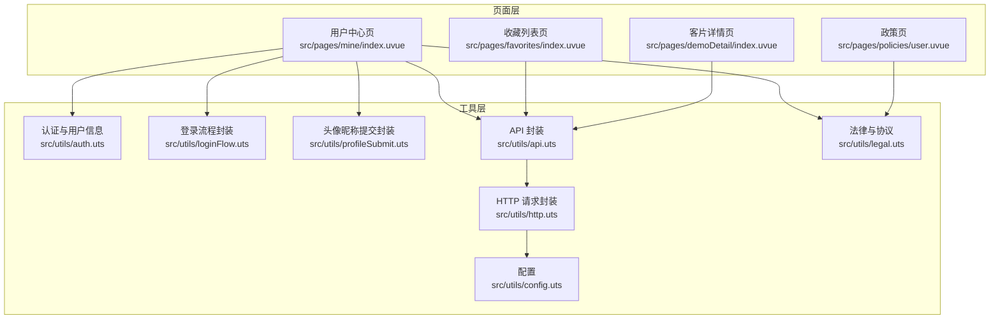
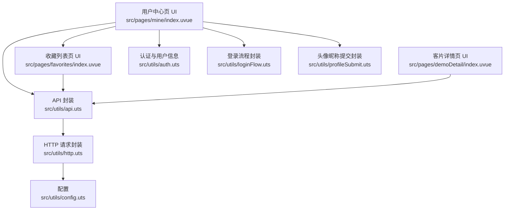
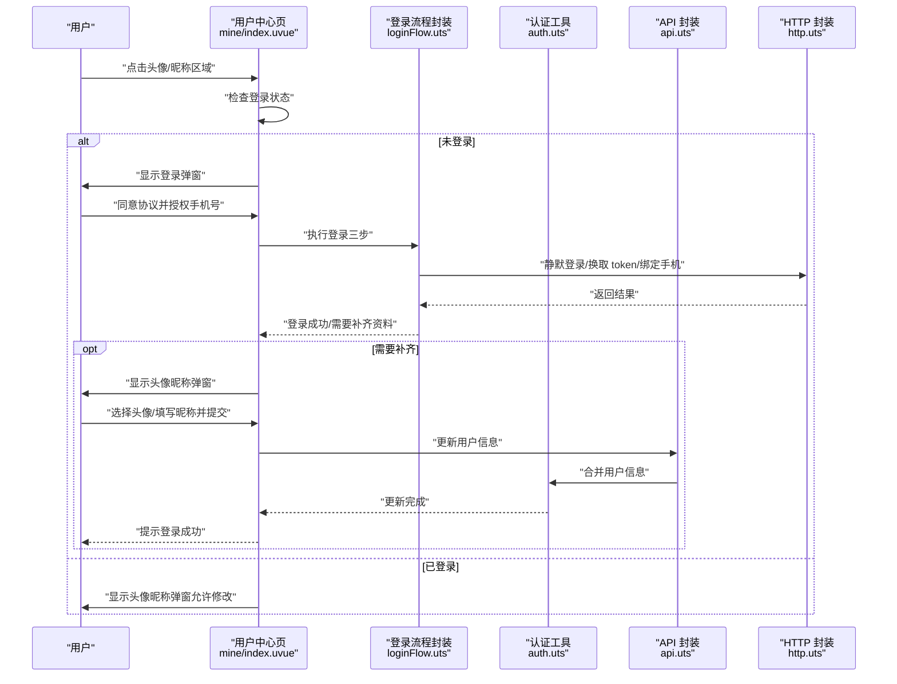
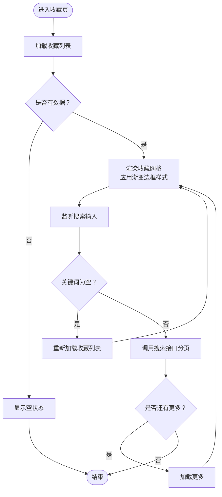
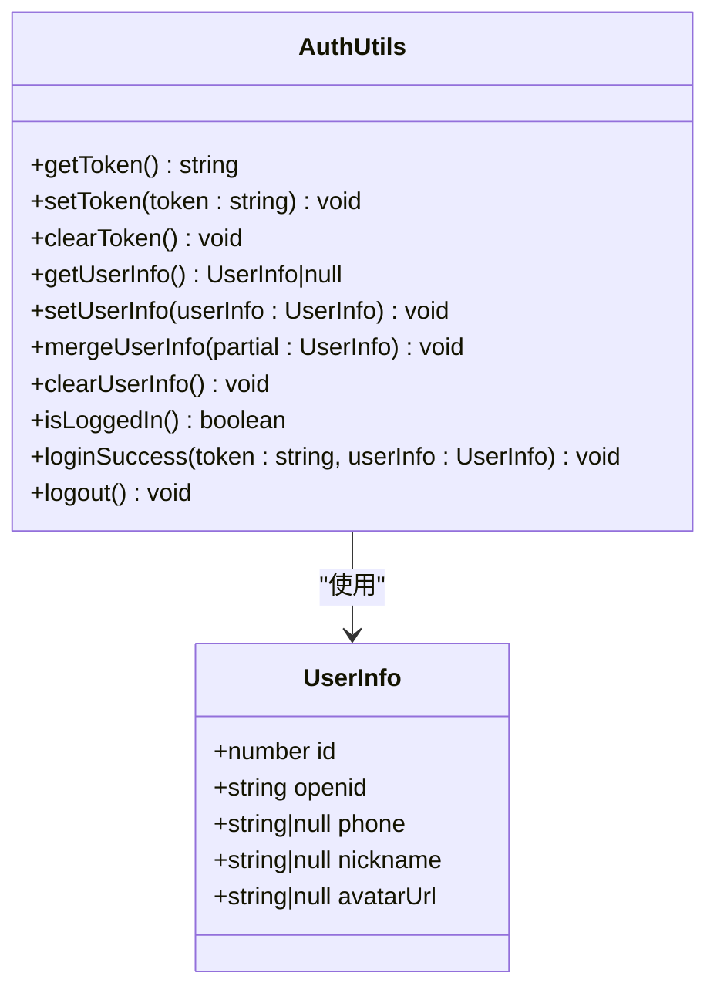
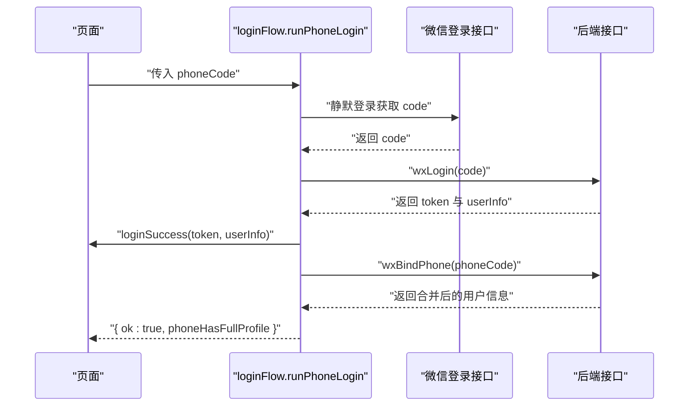
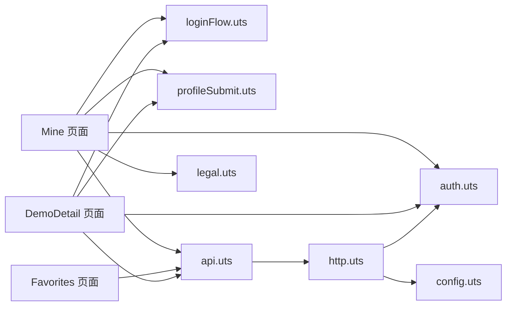

# 用户中心系统

<cite>
**本文档引用的文件**
- [src/pages/mine/index.uvue](file://src/pages/mine/index.uvue)
- [src/pages/favorites/index.uvue](file://src/pages/favorites/index.uvue)
- [src/pages/demoDetail/index.uvue](file://src/pages/demoDetail/index.uvue)
- [src/utils/auth.uts](file://src/utils/auth.uts)
- [src/utils/api.uts](file://src/utils/api.uts)
- [src/utils/loginFlow.uts](file://src/utils/loginFlow.uts)
- [src/utils/profileSubmit.uts](file://src/utils/profileSubmit.uts)
- [src/utils/http.uts](file://src/utils/http.uts)
- [src/utils/legal.uts](file://src/utils/legal.uts)
- [src/utils/config.uts](file://src/utils/config.uts)
- [src/pages.json](file://src/pages.json)
- [src/main.uts](file://src/main.uts)
- [src/pages/policies/user.uvue](file://src/pages/policies/user.uvue)
</cite>

## 更新摘要
**所做更改**
- 更新了收藏列表页（Favorites）的视觉样式，应用了与demoDetail相同的渐变边框系统
- 重构了搜索栏和照片网格的界面样式，采用一致的金色主题和渐变效果
- 保持了原有的搜索功能逻辑，仅对界面样式进行了完全重构
- 统一了用户中心系统的视觉设计规范

## 目录
1. [简介](#简介)
2. [项目结构](#项目结构)
3. [核心组件](#核心组件)
4. [架构概览](#架构概览)
5. [详细组件分析](#详细组件分析)
6. [依赖关系分析](#依赖关系分析)
7. [性能考量](#性能考量)
8. [故障排查指南](#故障排查指南)
9. [结论](#结论)
10. [附录](#附录)

## 简介
本文件为蓝莓小程序的用户中心系统综合文档，围绕"我的"页面（用户中心）、收藏列表、登录与退出登录流程展开，系统性阐述用户数据的存储与管理、个人信息编辑、收藏内容展示等技术实现，同时说明用户中心的业务逻辑（信息维护、个性化设置、账户安全），并给出安全保护、隐私设置与扩展建议。

**最新更新**：收藏列表页已应用与demoDetail相同的渐变边框系统，实现了统一的金色主题和视觉效果。

## 项目结构
用户中心相关的核心文件组织如下：
- 页面层
  - 用户中心页：src/pages/mine/index.uvue
  - 收藏列表页：src/pages/favorites/index.uvue
  - 客片详情页：src/pages/demoDetail/index.uvue
  - 政策页：src/pages/policies/user.uvue
- 工具层
  - 认证与用户信息：src/utils/auth.uts
  - 登录流程封装：src/utils/loginFlow.uts
  - 头像昵称提交封装：src/utils/profileSubmit.uts
  - API 封装：src/utils/api.uts
  - HTTP 请求封装：src/utils/http.uts
  - 法律与协议：src/utils/legal.uts
  - 配置：src/utils/config.uts
- 应用配置
  - 页面路由与 TabBar：src/pages.json
  - 应用入口：src/main.uts

**图表来源**
- [src/pages/mine/index.uvue:136-486](file://src/pages/mine/index.uvue#L136-L486)
- [src/pages/favorites/index.uvue:78-244](file://src/pages/favorites/index.uvue#L78-L244)
- [src/pages/demoDetail/index.uvue:218-784](file://src/pages/demoDetail/index.uvue#L218-L784)
- [src/utils/auth.uts:1-149](file://src/utils/auth.uts#L1-L149)
- [src/utils/loginFlow.uts:1-71](file://src/utils/loginFlow.uts#L1-L71)
- [src/utils/profileSubmit.uts:1-37](file://src/utils/profileSubmit.uts#L1-L37)
- [src/utils/api.uts:1-312](file://src/utils/api.uts#L1-L312)
- [src/utils/http.uts:1-82](file://src/utils/http.uts#L1-L82)
- [src/utils/legal.uts:1-16](file://src/utils/legal.uts#L1-L16)
- [src/utils/config.uts:1-12](file://src/utils/config.uts#L1-L12)

**章节来源**
- [src/pages.json:1-90](file://src/pages.json#L1-L90)
- [src/main.uts:1-9](file://src/main.uts#L1-L9)

## 核心组件
- 用户中心页（Mine）
  - 负责用户信息展示、登录/退出、头像昵称授权、菜单与横幅配置、跳转至收藏列表等。
  - 关键交互：登录弹窗、头像昵称弹窗、菜单点击、Banner 点击、退出登录确认。
- 收藏列表页（Favorites）
  - 展示用户收藏的客片，支持搜索与分页加载。
  - **更新**：已应用与demoDetail相同的渐变边框系统，包括搜索栏和照片网格的视觉统一。
  - 关键交互：搜索、加载更多、空状态提示、条目点击跳转详情。
- 客片详情页（DemoDetail）
  - 提供统一的渐变边框设计规范和金色主题效果。
  - 作为视觉设计参考标准，确保各页面风格一致性。
- 认证与用户信息（auth.uts）
  - 提供 token 与用户信息的持久化存储、合并写入、登录状态判断、登出清理。
- 登录流程封装（loginFlow.uts）
  - 封装微信静默登录、换取 token、绑定手机号三步流程，统一错误收敛。
- 头像昵称提交封装（profileSubmit.uts）
  - 封装更新头像/昵称并合并回本地用户信息。
- API 封装（api.uts）
  - 提供收藏、点赞、搜索、用户信息等接口封装。
- HTTP 请求封装（http.uts）
  - 统一注入 Authorization、处理 401、超时控制与加载提示开关。
- 法律与协议（legal.uts）
  - 提供用户协议与隐私政策名称及打开导航。
- 配置（config.uts）
  - 提供基础 URL 与超时时间配置。

**章节来源**
- [src/pages/mine/index.uvue:136-486](file://src/pages/mine/index.uvue#L136-L486)
- [src/pages/favorites/index.uvue:78-244](file://src/pages/favorites/index.uvue#L78-L244)
- [src/pages/demoDetail/index.uvue:218-784](file://src/pages/demoDetail/index.uvue#L218-L784)
- [src/utils/auth.uts:1-149](file://src/utils/auth.uts#L1-L149)
- [src/utils/loginFlow.uts:1-71](file://src/utils/loginFlow.uts#L1-L71)
- [src/utils/profileSubmit.uts:1-37](file://src/utils/profileSubmit.uts#L1-L37)
- [src/utils/api.uts:1-312](file://src/utils/api.uts#L1-L312)
- [src/utils/http.uts:1-82](file://src/utils/http.uts#L1-L82)
- [src/utils/legal.uts:1-16](file://src/utils/legal.uts#L1-L16)
- [src/utils/config.uts:1-12](file://src/utils/config.uts#L1-L12)

## 架构概览
用户中心系统采用"页面 + 工具层"的分层架构：
- 页面层负责用户交互与视图渲染；
- 工具层负责认证、网络请求、业务流程封装；
- API 层通过 http.uts 注入认证头并统一封装错误处理；
- 配置层集中管理基础 URL 与超时时间。

**更新**：收藏列表页现已与客片详情页共享相同的渐变边框系统和金色主题设计。

**图表来源**
- [src/pages/mine/index.uvue:136-486](file://src/pages/mine/index.uvue#L136-L486)
- [src/pages/favorites/index.uvue:78-244](file://src/pages/favorites/index.uvue#L78-L244)
- [src/pages/demoDetail/index.uvue:218-784](file://src/pages/demoDetail/index.uvue#L218-L784)
- [src/utils/auth.uts:1-149](file://src/utils/auth.uts#L1-L149)
- [src/utils/loginFlow.uts:1-71](file://src/utils/loginFlow.uts#L1-L71)
- [src/utils/profileSubmit.uts:1-37](file://src/utils/profileSubmit.uts#L1-L37)
- [src/utils/api.uts:1-312](file://src/utils/api.uts#L1-L312)
- [src/utils/http.uts:1-82](file://src/utils/http.uts#L1-L82)
- [src/utils/config.uts:1-12](file://src/utils/config.uts#L1-L12)

## 详细组件分析

### 用户中心页（Mine）分析
- 数据与状态
  - 使用扁平字段存储头像与昵称，避免深层路径依赖导致的响应式失效。
  - 登录状态与用户信息通过工具层读取与更新。
- 登录流程
  - 通过微信手机号授权触发登录三步：静默登录、换取 token、绑定手机号。
  - 登录成功后若缺少头像/昵称，弹出授权弹窗补齐。
- 头像昵称授权
  - 支持 chooseAvatar 与输入昵称两种方式；提交前进行乐观写入，提升即时反馈。
  - 提交后通过封装函数更新后端并合并回本地。
- 退出登录
  - 弹出确认对话框，清除本地认证信息并刷新 UI。
- 菜单与横幅
  - 从后端配置动态加载"金刚区"与"Banner"，支持外部链接跳转至 webview。

**图表来源**
- [src/pages/mine/index.uvue:258-441](file://src/pages/mine/index.uvue#L258-L441)
- [src/utils/loginFlow.uts:27-70](file://src/utils/loginFlow.uts#L27-L70)
- [src/utils/auth.uts:92-106](file://src/utils/auth.uts#L92-L106)
- [src/utils/api.uts:129-190](file://src/utils/api.uts#L129-L190)
- [src/utils/http.uts:20-73](file://src/utils/http.uts#L20-L73)

**章节来源**
- [src/pages/mine/index.uvue:136-486](file://src/pages/mine/index.uvue#L136-L486)
- [src/utils/auth.uts:56-117](file://src/utils/auth.uts#L56-L117)
- [src/utils/loginFlow.uts:27-70](file://src/utils/loginFlow.uts#L27-L70)
- [src/utils/profileSubmit.uts:18-36](file://src/utils/profileSubmit.uts#L18-L36)
- [src/utils/api.uts:129-190](file://src/utils/api.uts#L129-L190)
- [src/utils/http.uts:20-73](file://src/utils/http.uts#L20-L73)

### 收藏列表页（Favorites）分析
- 数据加载
  - 首次进入加载收藏列表；从详情页返回时刷新列表，确保收藏状态最新。
- 搜索与分页
  - 支持关键词搜索，按页加载；非搜索模式一次性返回全部收藏。
- 空状态与交互
  - 无内容时显示空状态；条目点击跳转详情页，携带必要参数。
- 错误处理
  - 请求失败时提示并标记空状态，避免 UI 异常。
- **更新**：已应用与demoDetail相同的渐变边框系统，包括：
  - 搜索栏采用外层渐变容器 + 内层内容容器的双层设计
  - 照片网格卡片使用相同的渐变边框效果
  - 统一的金色主题色彩方案（#F1CD91）
  - 一致的圆角和间距规范

**图表来源**
- [src/pages/favorites/index.uvue:132-218](file://src/pages/favorites/index.uvue#L132-L218)

**章节来源**
- [src/pages/favorites/index.uvue:78-244](file://src/pages/favorites/index.uvue#L78-L244)
- [src/utils/api.uts:249-283](file://src/utils/api.uts#L249-L283)

### 客片详情页（DemoDetail）分析
- 渐变边框系统设计
  - 采用外层渐变容器 + 内层内容容器的双层结构设计
  - 搜索栏：search-bar-wrap 外层渐变 + search-bar-nav 内层不透明背景
  - 照片卡片：photoItem-wrap 外层渐变 + photoItem 内层图片
  - 分类标签：tab-wrap 外层渐变 + tab 内层内容
- 金色主题规范
  - 主色调：#F1CD91（金色）
  - 背景色：#160F04（深棕色）
  - 渐变角度：268.28deg、252.59deg、260.97deg 等
  - 透明度层次：0.2、0.7 等
- 视觉统一性
  - 所有元素保持一致的圆角半径（14rpx、32rpx、64rpx）
  - 统一的间距和布局规范
  - 一致的阴影和遮罩效果

**章节来源**
- [src/pages/demoDetail/index.uvue:787-1066](file://src/pages/demoDetail/index.uvue#L787-L1066)

### 认证与用户信息（auth.uts）分析
- 数据结构
  - 用户信息包含 id、openid、phone、nickname、avatarUrl。
- 存储与合并
  - 提供 setUserInfo、getUserInfo、mergeUserInfo，避免部分字段覆盖导致历史信息丢失。
- 登录状态
  - 通过 token 判断登录状态；登录成功保存 token 与用户信息；登出清理 token 与用户信息。

**图表来源**
- [src/utils/auth.uts:6-148](file://src/utils/auth.uts#L6-L148)

**章节来源**
- [src/utils/auth.uts:6-148](file://src/utils/auth.uts#L6-L148)

### 登录流程封装（loginFlow.uts）分析
- 流程
  - 静默登录获取 wx code → wxLogin 换取 token 与用户信息 → wxBindPhone 绑定手机号。
- 错误收敛
  - 统一返回结构，任何异常收敛为 { ok:false, errorKind }，phone 接口失败不视为整体失败。
- 与页面协作
  - 页面负责 UX 控制（loading、弹窗、提示），流程封装专注业务逻辑。

**图表来源**
- [src/utils/loginFlow.uts:27-70](file://src/utils/loginFlow.uts#L27-L70)
- [src/utils/api.uts:129-154](file://src/utils/api.uts#L129-L154)
- [src/utils/auth.uts:135-139](file://src/utils/auth.uts#L135-L139)

**章节来源**
- [src/utils/loginFlow.uts:1-71](file://src/utils/loginFlow.uts#L1-L71)
- [src/utils/api.uts:129-154](file://src/utils/api.uts#L129-L154)
- [src/utils/auth.uts:135-139](file://src/utils/auth.uts#L135-L139)

### 头像昵称提交封装（profileSubmit.uts）分析
- 职责
  - 调用更新用户信息接口并合并回本地用户信息。
- 错误处理
  - 失败收敛为 { ok:false }，不抛错，由调用方决定 UX。

**章节来源**
- [src/utils/profileSubmit.uts:1-37](file://src/utils/profileSubmit.uts#L1-L37)
- [src/utils/api.uts:175-190](file://src/utils/api.uts#L175-L190)
- [src/utils/auth.uts:92-106](file://src/utils/auth.uts#L92-L106)

### API 封装（api.uts）分析
- 接口分类
  - 微信登录模块：wxLogin、wxBindPhone、wxGetUserInfo、wxUpdateUserInfo。
  - 收藏模块：toggleFavorite、getFavoriteStatus、getFavoriteList。
  - 搜索模块：searchAlbums。
  - 其他：导航、分类、列表、点赞等。
- 统一处理
  - 所有接口基于 http.uts 发起请求，自动注入 Authorization。

**章节来源**
- [src/utils/api.uts:1-312](file://src/utils/api.uts#L1-L312)
- [src/utils/http.uts:20-73](file://src/utils/http.uts#L20-L73)

### HTTP 请求封装（http.uts）分析
- 统一注入
  - 自动拼接 baseURL，注入 Content-Type 与 X-App-Code，存在 token 时注入 Authorization。
- 错误处理
  - 401 未授权时清理本地 token 与用户信息，并提示重新登录。
- 超时与加载
  - 读取配置超时时间；支持 showLoading 开关。

**章节来源**
- [src/utils/http.uts:1-82](file://src/utils/http.uts#L1-L82)
- [src/utils/config.uts:7-11](file://src/utils/config.uts#L7-L11)

### 法律与协议（legal.uts）分析
- 名称与导航
  - 提供用户协议与隐私政策名称，以及打开对应页面的方法。

**章节来源**
- [src/utils/legal.uts:1-16](file://src/utils/legal.uts#L1-L16)
- [src/pages/policies/user.uvue:1-153](file://src/pages/policies/user.uvue#L1-L153)

## 依赖关系分析
- 页面对工具层的依赖
  - Mine 依赖 auth、loginFlow、profileSubmit、api、legal。
  - Favorites 依赖 api。
  - DemoDetail 依赖 api、auth、loginFlow、profileSubmit、legal。
- 工具层之间的耦合
  - loginFlow 与 profileSubmit 分别依赖 api 与 auth。
  - api 依赖 http。
  - http 依赖 config 与 auth。
- 路由与 TabBar
  - pages.json 定义页面与 TabBar，Mine 与 Favorites 均为独立页面。

**更新**：收藏列表页现在与客片详情页共享相同的视觉设计规范和渐变边框系统。

**图表来源**
- [src/pages/mine/index.uvue:136-146](file://src/pages/mine/index.uvue#L136-L146)
- [src/pages/favorites/index.uvue:78-80](file://src/pages/favorites/index.uvue#L78-L80)
- [src/pages/demoDetail/index.uvue:218-232](file://src/pages/demoDetail/index.uvue#L218-L232)
- [src/utils/api.uts:1-2](file://src/utils/api.uts#L1-L2)
- [src/utils/http.uts:1-2](file://src/utils/http.uts#L1-L2)
- [src/utils/config.uts:7-11](file://src/utils/config.uts#L7-L11)
- [src/utils/auth.uts:21-52](file://src/utils/auth.uts#L21-L52)

**章节来源**
- [src/pages.json:26-54](file://src/pages.json#L26-L54)

## 性能考量
- 响应式优化
  - Mine 使用扁平字段避免深层路径依赖导致的响应式失效，减少不必要的重渲染。
- 请求与缓存
  - 通过 http.uts 统一注入 Authorization，减少重复代码；401 自动清理本地状态，避免无效请求。
- UI 加载
  - Mine 与 Favorites 均提供骨架屏与空状态，改善弱网与首次加载体验。
- 分页与搜索
  - Favorites 在搜索场景启用分页加载，降低一次性数据量。
- **更新**：渐变边框系统优化
  - 采用 CSS 渐变而非图片资源，减少网络请求
  - 使用伪类和嵌套结构优化渲染性能
  - 统一的样式变量提高复用性和维护性

[本节为通用性能建议，不直接分析具体文件，故无"章节来源"]

## 故障排查指南
- 登录失败
  - 检查微信授权是否同意协议与手机号授权；查看登录三步返回的错误类型与提示。
  - 若绑定手机号失败，确认后端返回与前端错误收敛逻辑。
- 退出登录后仍显示登录态
  - 确认 http.uts 的 401 处理是否触发清理；检查 auth.uts 的 clearToken/clearUserInfo 是否执行。
- 头像/昵称更新不生效
  - 检查 profileSubmit 的返回与 mergeUserInfo 是否执行；确认 wxUpdateUserInfo 的请求体字段是否正确。
- 收藏列表为空
  - 确认 getFavoriteList 返回状态与数据；检查 Favorites 的空状态渲染逻辑。
- **更新**：渐变边框显示问题
  - 检查外层渐变容器和内层内容容器的层级关系
  - 确认内层背景是否为不透明，避免透出外层渐变
  - 验证渐变角度和颜色值是否符合设计规范

**章节来源**
- [src/utils/loginFlow.uts:27-70](file://src/utils/loginFlow.uts#L27-L70)
- [src/utils/http.uts:50-61](file://src/utils/http.uts#L50-L61)
- [src/utils/auth.uts:144-148](file://src/utils/auth.uts#L144-L148)
- [src/utils/profileSubmit.uts:22-36](file://src/utils/profileSubmit.uts#L22-L36)
- [src/pages/favorites/index.uvue:132-155](file://src/pages/favorites/index.uvue#L132-L155)

## 结论
用户中心系统通过清晰的分层设计实现了登录、个人信息管理、收藏展示与退出登录等核心功能。认证与网络层的封装提升了可维护性与一致性，页面层专注于用户体验与交互。**最新更新**：收藏列表页已成功应用与demoDetail相同的渐变边框系统，实现了统一的金色主题和视觉效果，提升了整体的视觉一致性和用户体验。建议后续在安全与扩展方面持续完善。

[本节为总结性内容，不直接分析具体文件，故无"章节来源"]

## 附录

### 用户中心业务逻辑与数据流
- 个人信息维护
  - 登录态通过 token 与用户信息判断；头像/昵称通过 wxUpdateUserInfo 更新并合并回本地。
- 个性化设置
  - 通过 chooseAvatar 与输入框设置头像/昵称；支持随时修改。
- 账户安全
  - 401 自动清理本地状态；登录流程三步统一错误收敛；协议与隐私政策引导用户知情同意。

**章节来源**
- [src/utils/auth.uts:125-148](file://src/utils/auth.uts#L125-L148)
- [src/utils/http.uts:50-61](file://src/utils/http.uts#L50-L61)
- [src/utils/api.uts:175-190](file://src/utils/api.uts#L175-L190)
- [src/utils/legal.uts:5-15](file://src/utils/legal.uts#L5-L15)

### 用户数据安全与隐私
- 安全保护
  - 统一注入 Authorization，401 自动清理；敏感操作（登录、退出）均在页面层进行二次确认。
- 隐私设置
  - 用户协议与隐私政策页面提供查阅入口，明确数据使用范围与责任。
- 数据备份
  - 当前实现以本地存储为主，未见服务端备份逻辑；建议在业务需要时引入服务端备份与恢复机制。

**章节来源**
- [src/utils/http.uts:33-36](file://src/utils/http.uts#L33-L36)
- [src/pages/policies/user.uvue:1-153](file://src/pages/policies/user.uvue#L1-L153)

### 扩展指导
- 更多个人功能
  - 新增"收货地址"、"偏好设置"等页面，复用现有认证与网络层。
- 账户设置
  - 新增"修改密码"、"解绑手机"等流程，注意与登录流程解耦。
- 消息通知
  - 引入推送或站内信模块，结合 TabBar 增加"消息"入口；注意权限与隐私合规。
- **更新**：视觉设计扩展
  - 新页面应遵循统一的渐变边框系统和金色主题规范
  - 保持与demoDetail和favorites相同的视觉设计语言
  - 使用标准化的渐变角度、颜色和圆角规范

[本节为概念性扩展建议，不直接分析具体文件，故无"章节来源"]

### 渐变边框系统设计规范
- **双层结构设计**
  - 外层容器：负责渐变边框效果，padding: 1rpx
  - 内层容器：负责实际内容，使用不透明背景
- **金色主题规范**
  - 主色调：#F1CD91（金色）
  - 背景色：#160F04（深棕色）
  - 渐变透明度：0.2（淡金）、0.7（浓金）
- **统一样式参数**
  - 圆角半径：14rpx（卡片）、32rpx（搜索栏）、64rpx（标签）
  - 渐变角度：268.28deg、252.59deg、260.97deg
  - 间距规范：统一的 padding 和 margin 值

**章节来源**
- [src/pages/favorites/index.uvue:292-357](file://src/pages/favorites/index.uvue#L292-L357)
- [src/pages/demoDetail/index.uvue:824-954](file://src/pages/demoDetail/index.uvue#L824-L954)