# 用户认证系统

<cite>
**本文档引用的文件**
- [src/utils/auth.uts](file://src/utils/auth.uts)
- [src/utils/api.uts](file://src/utils/api.uts)
- [src/utils/loginFlow.uts](file://src/utils/loginFlow.uts)
- [src/utils/http.uts](file://src/utils/http.uts)
- [src/utils/profileSubmit.uts](file://src/utils/profileSubmit.uts)
- [src/utils/legal.uts](file://src/utils/legal.uts)
- [src/utils/config.uts](file://src/utils/config.uts)
- [src/pages/mine/index.uvue](file://src/pages/mine/index.uvue)
- [src/App.uvue](file://src/App.uvue)
- [src/pages/favorites/index.uvue](file://src/pages/favorites/index.uvue)
- [src/pages/aiTryOn/index.uvue](file://src/pages/aiTryOn/index.uvue)
- [src/pages/targetPhotoDetail/index.uvue](file://src/pages/targetPhotoDetail/index.uvue)
- [src/pages/aiTryOnResult/index.uvue](file://src/pages/aiTryOnResult/index.uvue)
- [src/pages/aiTryOnHistory/index.uvue](file://src/pages/aiTryOnHistory/index.uvue)
- [src/pages/aiRecommend/index.uvue](file://src/pages/aiRecommend/index.uvue)
- [src/pages/aiRecommendLoading/index.uvue](file://src/pages/aiRecommendLoading/index.uvue)
- [src/pages/aiRecommendResult/index.uvue](file://src/pages/aiRecommendResult/index.uvue)
</cite>

## 更新摘要
**所做更改**
- 新增AI推荐功能认证集成章节，详细说明AI推荐页面的登录状态管理和协议检查机制
- 扩展AI推荐流程的认证集成，包括照片上传前的登录检查和手机号授权流程
- 完善AI推荐加载和结果页面的认证状态继承机制
- 增强AI推荐场景下的错误处理和用户体验优化
- 更新依赖关系分析，包含AI推荐相关页面的认证集成

## 目录
1. [简介](#简介)
2. [项目结构](#项目结构)
3. [核心组件](#核心组件)
4. [架构总览](#架构总览)
5. [详细组件分析](#详细组件分析)
6. [登录过期状态管理](#登录过期状态管理)
7. [401错误请求挂起队列](#401错误请求挂起队列)
8. [AI试衣页面认证集成](#ai试衣页面认证集成)
9. [AI推荐功能认证集成](#ai推荐功能认证集成)
10. [跨页面统一认证体验](#跨页面统一认证体验)
11. [依赖关系分析](#依赖关系分析)
12. [性能考量](#性能考量)
13. [故障排查指南](#故障排查指南)
14. [结论](#结论)
15. [附录](#附录)

## 简介
本文件面向蓝莓小程序的用户认证系统，围绕微信登录、手机号绑定、用户信息完善与管理等核心能力，系统化阐述认证状态管理、Token处理机制、登录状态检查与错误处理策略。文档同时提供从微信授权到用户信息完善的完整业务流程图示，以及针对开发者扩展与定制的指导建议。本次更新重点反映了增强的认证系统与AI推荐功能的深度集成，包括AI推荐场景的登录状态管理、协议检查机制，以及支持微信手机号授权和用户资料完善流程。

## 项目结构
认证相关代码主要分布在以下模块：
- 工具层：认证状态与用户信息管理、HTTP请求封装、登录流程编排、头像昵称提交、法律文案工具、环境配置
- 页面层：我的页面承载登录弹窗、头像昵称授权弹窗、登录状态展示与退出登录操作；AI试衣页面集成登录弹窗与认证流程；目标图片详情页提供AI试衣悬浮按钮；AI试衣历史与结果页面继承认证状态；**新增** AI推荐页面实现完整的认证流程和用户资料完善
- API层：与后端交互的微信登录、手机号绑定、用户信息获取与更新等接口，**新增** AI推荐相关API接口

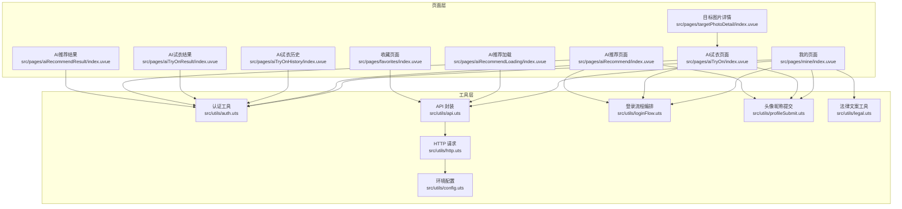

**图表来源**
- [src/pages/mine/index.uvue:136-486](file://src/pages/mine/index.uvue#L136-L486)
- [src/pages/aiTryOn/index.uvue:313-408](file://src/pages/aiTryOn/index.uvue#L313-L408)
- [src/pages/targetPhotoDetail/index.uvue:51-80](file://src/pages/targetPhotoDetail/index.uvue#L51-80)
- [src/pages/aiTryOnHistory/index.uvue:1-200](file://src/pages/aiTryOnHistory/index.uvue#L1-L200)
- [src/pages/aiTryOnResult/index.uvue:1-200](file://src/pages/aiTryOnResult/index.uvue#L1-L200)
- [src/pages/aiRecommend/index.uvue:1-452](file://src/pages/aiRecommend/index.uvue#L1-L452)
- [src/pages/aiRecommendLoading/index.uvue:1-235](file://src/pages/aiRecommendLoading/index.uvue#L1-L235)
- [src/pages/aiRecommendResult/index.uvue:1-275](file://src/pages/aiRecommendResult/index.uvue#L1-L275)
- [src/utils/auth.uts:1-171](file://src/utils/auth.uts#L1-L171)
- [src/utils/api.uts:1-607](file://src/utils/api.uts#L1-L607)
- [src/utils/http.uts:1-172](file://src/utils/http.uts#L1-L172)
- [src/utils/loginFlow.uts:1-75](file://src/utils/loginFlow.uts#L1-L75)
- [src/utils/profileSubmit.uts:1-37](file://src/utils/profileSubmit.uts#L1-L37)
- [src/utils/legal.uts:1-16](file://src/utils/legal.uts#L1-L16)
- [src/utils/config.uts:1-13](file://src/utils/config.uts#L1-L13)

**章节来源**
- [src/pages/mine/index.uvue:1-630](file://src/pages/mine/index.uvue#L1-L630)
- [src/pages/aiTryOn/index.uvue:1-749](file://src/pages/aiTryOn/index.uvue#L1-L749)
- [src/pages/targetPhotoDetail/index.uvue:1-120](file://src/pages/targetPhotoDetail/index.uvue#L1-L120)
- [src/pages/aiTryOnHistory/index.uvue:1-200](file://src/pages/aiTryOnHistory/index.uvue#L1-L200)
- [src/pages/aiTryOnResult/index.uvue:1-200](file://src/pages/aiTryOnResult/index.uvue#L1-L200)
- [src/pages/aiRecommend/index.uvue:1-452](file://src/pages/aiRecommend/index.uvue#L1-L452)
- [src/pages/aiRecommendLoading/index.uvue:1-235](file://src/pages/aiRecommendLoading/index.uvue#L1-L235)
- [src/pages/aiRecommendResult/index.uvue:1-275](file://src/pages/aiRecommendResult/index.uvue#L1-L275)
- [src/utils/auth.uts:1-171](file://src/utils/auth.uts#L1-L171)
- [src/utils/api.uts:1-607](file://src/utils/api.uts#L1-L607)
- [src/utils/http.uts:1-172](file://src/utils/http.uts#L1-L172)
- [src/utils/loginFlow.uts:1-75](file://src/utils/loginFlow.uts#L1-L75)
- [src/utils/profileSubmit.uts:1-37](file://src/utils/profileSubmit.uts#L1-L37)
- [src/utils/legal.uts:1-16](file://src/utils/legal.uts#L1-L16)
- [src/utils/config.uts:1-13](file://src/utils/config.uts#L1-L13)

## 核心组件
- 认证状态与用户信息管理
  - Token 的获取、设置、清除与登录态判断
  - 用户信息的持久化存储、合并写入与清理
  - **新增** 登录过期状态标记与消费机制
- 登录流程编排
  - 三步登录流程：静默登录取微信 code → 交换 token → 绑定手机号并合并用户信息
  - **新增** 登录成功后自动重试挂起的请求和上传任务
- HTTP 请求封装
  - 自动注入 Authorization 头、统一 401 处理、超时控制与加载提示开关
  - **新增** 401错误请求挂起队列机制，支持登录后自动重试
- 上传接口增强
  - **新增** 独立的上传请求挂起队列，支持文件上传的401处理
- 头像昵称完善
  - 上传头像与昵称至后端并合并本地用户信息
- 法律与页面集成
  - 用户协议与隐私政策打开、页面登录弹窗与授权流程
- **新增** AI推荐认证集成
  - AI推荐页面的完整认证流程，包括照片上传前登录检查、手机号授权、用户资料完善

**章节来源**
- [src/utils/auth.uts:15-171](file://src/utils/auth.uts#L15-L171)
- [src/utils/loginFlow.uts:28-75](file://src/utils/loginFlow.uts#L28-L75)
- [src/utils/api.uts:184-245](file://src/utils/api.uts#L184-L245)
- [src/utils/http.uts:14-172](file://src/utils/http.uts#L14-L172)
- [src/utils/profileSubmit.uts:18-36](file://src/utils/profileSubmit.uts#L18-L36)
- [src/utils/legal.uts:1-16](file://src/utils/legal.uts#L1-L16)
- [src/pages/aiRecommend/index.uvue:158-344](file://src/pages/aiRecommend/index.uvue#L158-L344)

## 架构总览
认证系统采用"页面层 + 工具层 + API 层"的分层设计，页面负责交互与状态展示，工具层负责业务编排与数据持久化，API 层负责与后端通信，HTTP 层统一处理请求与鉴权。AI试衣页面和AI推荐页面的集成使得认证流程可以在小程序的任意页面中统一执行，提升了用户体验的一致性。新增的登录过期状态管理和401错误请求挂起队列机制进一步增强了系统的健壮性和用户体验。

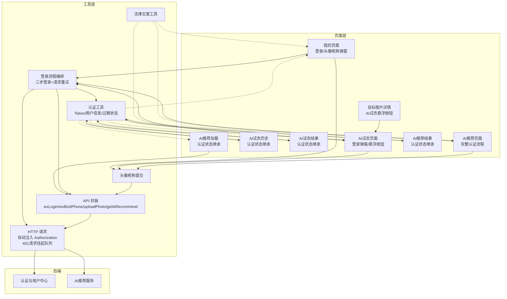

**图表来源**
- [src/pages/mine/index.uvue:136-486](file://src/pages/mine/index.uvue#L136-L486)
- [src/pages/aiTryOn/index.uvue:313-408](file://src/pages/aiTryOn/index.uvue#L313-L408)
- [src/pages/targetPhotoDetail/index.uvue:51-80](file://src/pages/targetPhotoDetail/index.uvue#L51-80)
- [src/pages/aiTryOnHistory/index.uvue:1-200](file://src/pages/aiTryOnHistory/index.uvue#L1-L200)
- [src/pages/aiTryOnResult/index.uvue:1-200](file://src/pages/aiTryOnResult/index.uvue#L1-L200)
- [src/pages/aiRecommend/index.uvue:1-452](file://src/pages/aiRecommend/index.uvue#L1-L452)
- [src/pages/aiRecommendLoading/index.uvue:1-235](file://src/pages/aiRecommendLoading/index.uvue#L1-L235)
- [src/pages/aiRecommendResult/index.uvue:1-275](file://src/pages/aiRecommendResult/index.uvue#L1-L275)
- [src/utils/auth.uts:1-171](file://src/utils/auth.uts#L1-L171)
- [src/utils/loginFlow.uts:1-75](file://src/utils/loginFlow.uts#L1-L75)
- [src/utils/api.uts:184-245](file://src/utils/api.uts#L184-L245)
- [src/utils/http.uts:14-172](file://src/utils/http.uts#L14-L172)
- [src/utils/profileSubmit.uts:1-37](file://src/utils/profileSubmit.uts#L1-L37)
- [src/utils/legal.uts:1-16](file://src/utils/legal.uts#L1-L16)

## 详细组件分析

### 认证状态与用户信息管理
- Token 管理
  - 获取：从本地存储读取 token，异常时返回空字符串
  - 设置：将 token 写入本地存储
  - 清除：移除本地 token
  - 登录态判断：token 非空且非特殊字符串即视为已登录
- 用户信息管理
  - 获取/设置/清除：基于本地存储的 UserInfo 结构
  - 合并写入：仅在传入字段非空时覆盖，避免 step2 已写入的头像/昵称被 step3 的空值覆盖
- 登录成功与登出
  - 登录成功：同时保存 token 与用户信息
  - 登出：清除 token 与用户信息
- **新增** 登录过期状态管理
  - 标记登录过期：由 http 层在检测到 401 时调用
  - 消费登录过期标志：由页面 onShow 时调用，触发登录弹窗显示

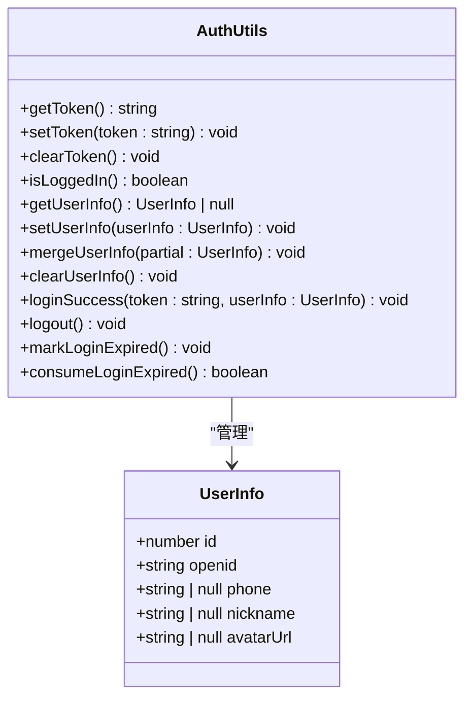

**图表来源**
- [src/utils/auth.uts:6-171](file://src/utils/auth.uts#L6-L171)

**章节来源**
- [src/utils/auth.uts:15-171](file://src/utils/auth.uts#L15-L171)

### 登录流程编排（三步登录）
- 流程步骤
  - 步骤1：静默登录获取微信 code
  - 步骤2：使用 code 调用后端 wxLogin 获取 token 与用户信息，成功后保存
  - 步骤3：使用 phoneCode 调用 wxBindPhone 绑定手机号，合并返回的用户信息；即使此步失败也不视为整体失败
- 错误收敛
  - 任一步骤异常均收敛为结果对象，包含 ok、phoneHasFullProfile 与 errorKind/errorMsg
- **新增** 登录成功后自动重试
  - 自动调用 flushPendingRequests 重试所有因401挂起的HTTP请求
  - 自动调用 flushPendingUploads 重试所有因401挂起的上传任务

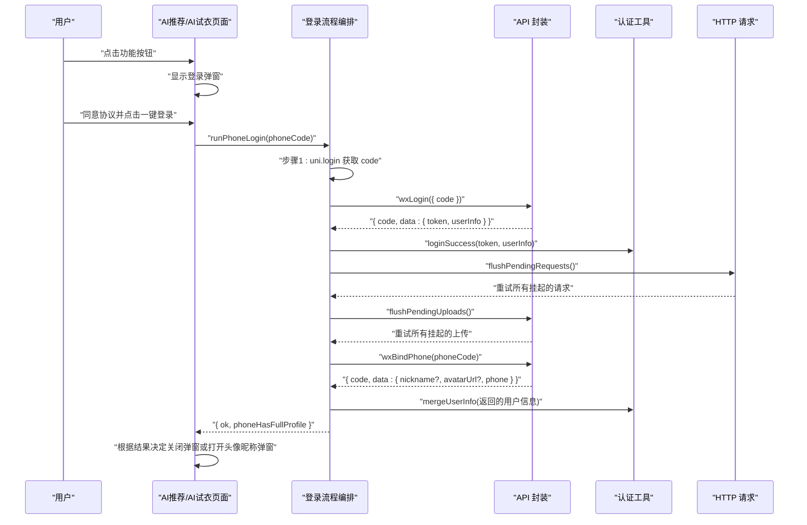

**图表来源**
- [src/utils/loginFlow.uts:28-75](file://src/utils/loginFlow.uts#L28-L75)
- [src/utils/api.uts:184-209](file://src/utils/api.uts#L184-L209)
- [src/utils/auth.uts:157-171](file://src/utils/auth.uts#L157-L171)
- [src/pages/aiRecommend/index.uvue:257-285](file://src/pages/aiRecommend/index.uvue#L257-L285)

**章节来源**
- [src/utils/loginFlow.uts:1-75](file://src/utils/loginFlow.uts#L1-L75)
- [src/utils/api.uts:184-209](file://src/utils/api.uts#L184-L209)
- [src/utils/auth.uts:157-171](file://src/utils/auth.uts#L157-L171)
- [src/pages/aiRecommend/index.uvue:257-285](file://src/pages/aiRecommend/index.uvue#L257-L285)

### 头像昵称完善与提交
- 页面交互
  - 通过 chooseAvatar 选择头像，输入昵称，提交后先乐观写入本地，再调用后端更新
- 提交流程
  - 调用 wxUpdateUserInfo 更新后端用户信息
  - 成功后合并返回的用户信息到本地存储

**图表来源**
- [src/pages/mine/index.uvue:354-408](file://src/pages/mine/index.uvue#L354-L408)
- [src/utils/profileSubmit.uts:18-36](file://src/utils/profileSubmit.uts#L18-L36)
- [src/utils/api.uts:230-245](file://src/utils/api.uts#L230-L245)
- [src/utils/auth.uts:92-106](file://src/utils/auth.uts#L92-L106)

**章节来源**
- [src/pages/mine/index.uvue:354-408](file://src/pages/mine/index.uvue#L354-L408)
- [src/utils/profileSubmit.uts:1-37](file://src/utils/profileSubmit.uts#L1-L37)
- [src/utils/api.uts:230-245](file://src/utils/api.uts#L230-L245)
- [src/utils/auth.uts:92-106](file://src/utils/auth.uts#L92-L106)

### HTTP 请求与 Token 注入
- 自动注入 Authorization 头
  - 当本地存在 token 时，在请求头中附加 Bearer token
- 统一 401 处理
  - 检测到 401 时清除本地 token 与用户信息，并提示重新登录
  - **新增** 将请求加入挂起队列，等待用户重新登录后自动重试
- 超时与加载控制
  - 通过配置项设置超时时间，支持按需显示加载提示

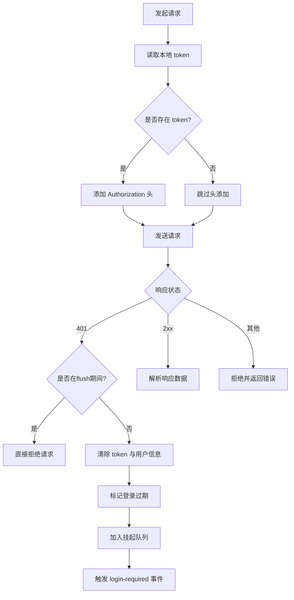

**图表来源**
- [src/utils/http.uts:14-172](file://src/utils/http.uts#L14-L172)
- [src/utils/auth.uts:21-52](file://src/utils/auth.uts#L21-L52)
- [src/utils/config.uts:7-11](file://src/utils/config.uts#L7-L11)

**章节来源**
- [src/utils/http.uts:1-172](file://src/utils/http.uts#L1-L172)
- [src/utils/auth.uts:15-52](file://src/utils/auth.uts#L15-L52)
- [src/utils/config.uts:1-13](file://src/utils/config.uts#L1-L13)

### 页面级登录与状态展示
- 登录弹窗
  - 展示用户协议与隐私政策勾选，同意后方可点击一键登录
  - 一键登录按钮绑定 getPhoneNumber 回调，触发三步登录流程
- 头像昵称弹窗
  - 选择头像与输入昵称，提交后更新后端并刷新本地状态
- 登录状态展示
  - 未登录显示"点击立即登录"，已登录显示头像与昵称
  - 页面显示时若本地头像为空，尝试从后端拉取最新用户信息
- **新增** 401事件监听
  - 页面onShow时监听 login-required 事件，自动拉起登录弹窗
  - 消费登录过期标志，确保其他页面触发401后导航回来时能正确显示登录弹窗

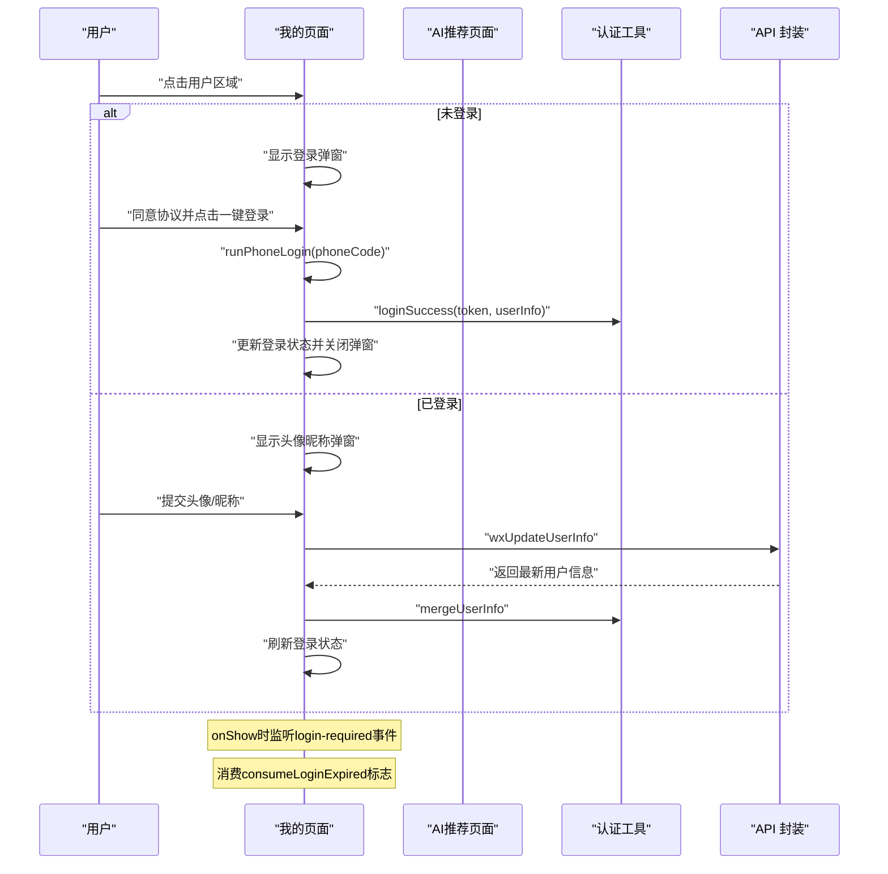

**图表来源**
- [src/pages/mine/index.uvue:136-486](file://src/pages/mine/index.uvue#L136-486)
- [src/utils/auth.uts:157-171](file://src/utils/auth.uts#L157-L171)
- [src/utils/api.uts:184-245](file://src/utils/api.uts#L184-L245)

**章节来源**
- [src/pages/mine/index.uvue:136-486](file://src/pages/mine/index.uvue#L136-486)
- [src/utils/auth.uts:157-171](file://src/utils/auth.uts#L157-L171)
- [src/utils/api.uts:184-245](file://src/utils/api.uts#L184-L245)

## 登录过期状态管理

### 登录过期标志机制
认证系统实现了完整的登录过期状态管理机制，通过全局标志位来协调多个页面间的登录状态同步。该机制解决了传统认证系统中常见的竞态条件和重复弹窗问题。

**核心实现**：
- `_loginExpiredPending`：全局布尔变量，标记是否有待处理的登录过期事件
- `markLoginExpired()`：由http层在检测到401时调用，设置过期标志
- `consumeLoginExpired()`：由页面onShow时调用，消费过期标志并返回true/false

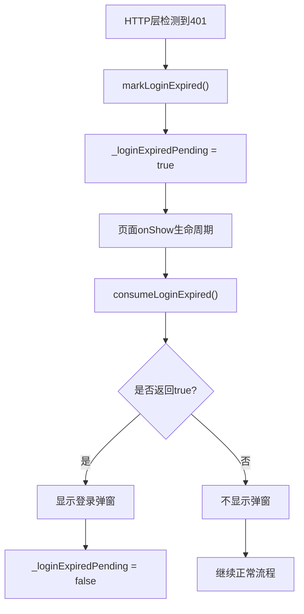

**图表来源**
- [src/utils/auth.uts:121-141](file://src/utils/auth.uts#L121-L141)
- [src/pages/mine/index.uvue:192-201](file://src/pages/mine/index.uvue#L192-201)

**章节来源**
- [src/utils/auth.uts:121-141](file://src/utils/auth.uts#L121-L141)
- [src/pages/mine/index.uvue:192-201](file://src/pages/mine/index.uvue#L192-201)

### 全局事件监听机制
系统通过uni.$emit和uni.$on实现跨页面的事件通信，确保任何页面触发401错误时都能正确通知当前活跃页面。

**事件流程**：
1. HTTP层检测到401错误时，触发 `uni.$emit('login-required')`
2. 当前活跃页面监听该事件，自动显示登录弹窗
3. 页面销毁时及时移除事件监听，避免内存泄漏

**章节来源**
- [src/utils/http.uts:145-149](file://src/utils/http.uts#L145-L149)
- [src/pages/mine/index.uvue:192-221](file://src/pages/mine/index.uvue#L192-221)

## 401错误请求挂起队列

### HTTP请求挂起队列机制
系统实现了智能的请求挂起队列机制，当检测到401错误时，不会立即失败，而是将请求挂起等待用户重新登录后自动重试。这大大提升了用户体验，避免了用户需要重复操作的困扰。

**核心数据结构**：
- `PendingRequest`：定义挂起请求的接口，包含URL、方法、数据、头部信息等
- `_pendingQueue`：存储所有挂起请求的数组
- `_waitingForLogin`：防止多请求并发弹出多个登录弹窗的标志位
- `_isFlushing`：防止重试期间的死循环保护标志

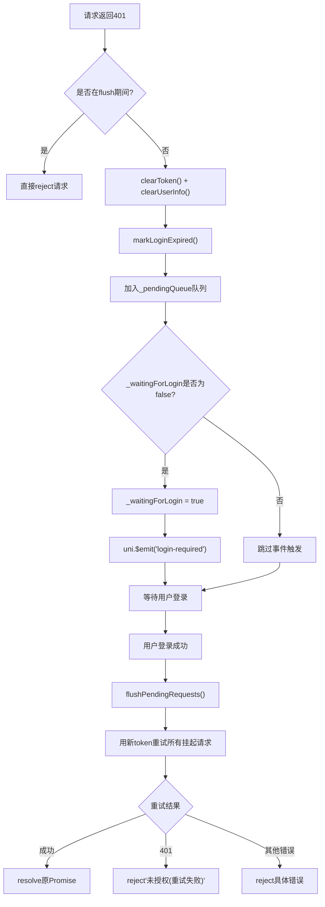

**图表来源**
- [src/utils/http.uts:14-172](file://src/utils/http.uts#L14-L172)

**章节来源**
- [src/utils/http.uts:14-172](file://src/utils/http.uts#L14-L172)

### 上传请求挂起队列机制
除了HTTP请求外，系统还实现了上传文件的401挂起队列，确保上传任务也能在用户重新登录后自动重试。

**上传队列特点**：
- 独立的队列管理，与HTTP请求队列分离
- 支持批量重试，提高重试效率
- 防重入保护，避免并发重试导致的资源浪费

**章节来源**
- [src/utils/api.uts:5-57](file://src/utils/api.uts#L5-57)
- [src/utils/api.uts:441-480](file://src/utils/api.uts#L441-L480)

### 登录成功后的自动重试
当用户成功登录后，系统会自动触发所有挂起请求的重试机制，无需用户手动操作。

**重试流程**：
1. 登录成功后调用 `flushPendingRequests()`
2. 遍历所有挂起的HTTP请求，使用新的token重新发起
3. 遍历所有挂起的上传请求，使用新的token重新上传
4. 处理重试结果，resolve成功的请求，reject失败的请求

**章节来源**
- [src/utils/loginFlow.uts:40-42](file://src/utils/loginFlow.uts#L40-L42)
- [src/utils/http.uts:42-78](file://src/utils/http.uts#L42-L78)
- [src/utils/api.uts:19-47](file://src/utils/api.uts#L19-47)

## AI试衣页面认证集成

### AI试衣页面登录状态检查机制
AI试衣页面实现了完整的登录状态检查机制，确保用户在进行AI试衣操作前必须登录。该机制在两个关键时机执行：

1. **照片上传前检查**：当用户点击上传照片按钮时，页面会首先检查登录状态
2. **生成AI试衣效果前检查**：当用户点击生成按钮时，页面会再次检查登录状态

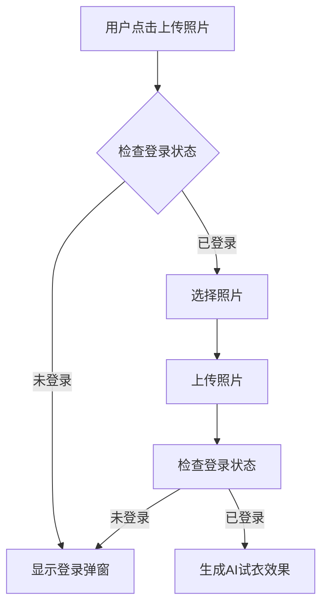

**图表来源**
- [src/pages/aiTryOn/index.uvue:235-259](file://src/pages/aiTryOn/index.uvue#L235-259)
- [src/pages/aiTryOn/index.uvue:284-360](file://src/pages/aiTryOn/index.uvue#L284-360)

**章节来源**
- [src/pages/aiTryOn/index.uvue:235-259](file://src/pages/aiTryOn/index.uvue#L235-259)
- [src/pages/aiTryOn/index.uvue:284-360](file://src/pages/aiTryOn/index.uvue#L284-360)

### AI试衣悬浮按钮实现
AI试衣页面在目标图片详情的基础上增加了AI试衣悬浮按钮，用户可以直接从图片详情页进入AI试衣功能。当用户点击AI试衣按钮时，会触发登录弹窗验证用户身份。

**章节来源**
- [src/pages/targetPhotoDetail/index.uvue:51-80](file://src/pages/targetPhotoDetail/index.uvue#L51-80)

### 登录弹窗与认证流程
AI试衣页面实现了完整的微信认证流程，包括：
- 用户协议与隐私政策勾选确认
- 微信一键登录按钮
- 手机号授权回调处理
- 登录状态检查与错误处理

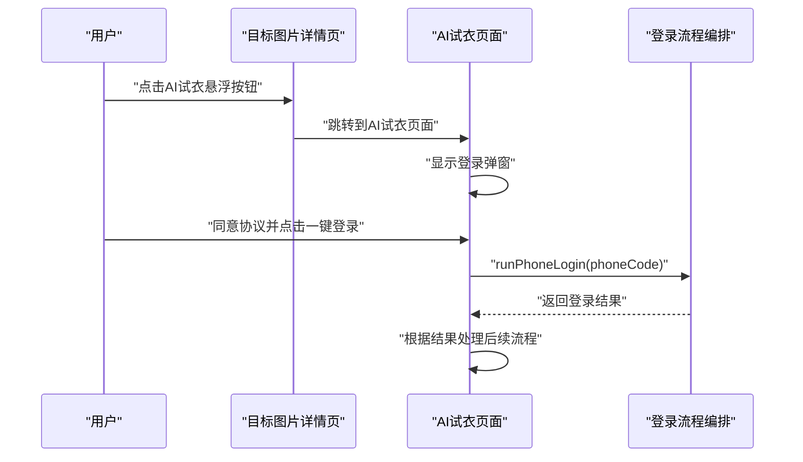

**图表来源**
- [src/pages/targetPhotoDetail/index.uvue:51-80](file://src/pages/targetPhotoDetail/index.uvue#L51-80)
- [src/pages/aiTryOn/index.uvue:313-408](file://src/pages/aiTryOn/index.uvue#L313-408)
- [src/utils/loginFlow.uts:28-75](file://src/utils/loginFlow.uts#L28-75)

**章节来源**
- [src/pages/aiTryOn/index.uvue:313-408](file://src/pages/aiTryOn/index.uvue#L313-408)
- [src/pages/targetPhotoDetail/index.uvue:51-80](file://src/pages/targetPhotoDetail/index.uvue#L51-80)

### 头像昵称完善流程
AI试衣页面继承了完整的头像昵称完善流程，用户在登录后如果缺少头像或昵称信息，会自动弹出头像昵称授权弹窗进行完善。

**章节来源**
- [src/pages/aiTryOn/index.uvue:396-408](file://src/pages/aiTryOn/index.uvue#L396-408)
- [src/utils/profileSubmit.uts:18-36](file://src/utils/profileSubmit.uts#L18-36)

### AI试衣历史与结果页面的认证集成
AI试衣历史与结果页面继承了完整的认证状态，确保用户在浏览历史记录和查看试衣结果时能够保持一致的登录状态体验。

**章节来源**
- [src/pages/aiTryOnHistory/index.uvue:1-200](file://src/pages/aiTryOnHistory/index.uvue#L1-200)
- [src/pages/aiTryOnResult/index.uvue:1-200](file://src/pages/aiTryOnResult/index.uvue#L1-200)

## AI推荐功能认证集成

### AI推荐页面认证流程
AI推荐页面实现了完整的认证系统集成，为用户提供无缝的AI推荐体验。该页面集成了登录状态检查、协议确认、手机号授权和用户资料完善等完整流程。

**核心特性**：
- 照片上传前登录状态检查，未登录自动弹出登录弹窗
- 用户协议与隐私政策勾选确认机制
- 微信手机号授权回调处理
- 登录成功后自动跳转AI推荐加载页面
- 用户资料不完善时自动弹出资料完善弹窗

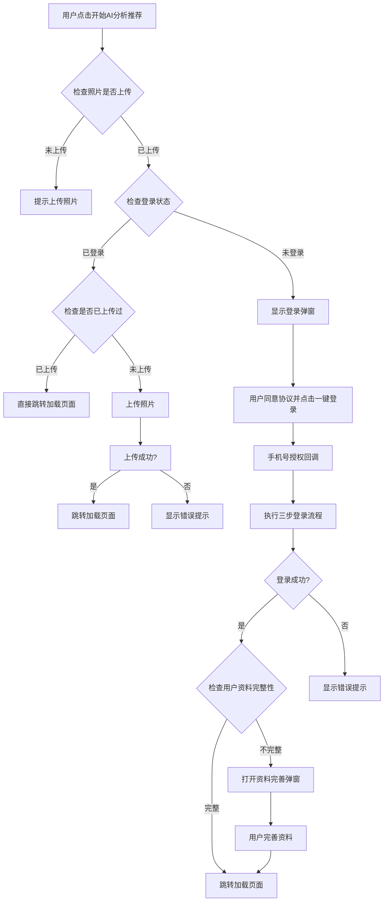

**图表来源**
- [src/pages/aiRecommend/index.uvue:158-344](file://src/pages/aiRecommend/index.uvue#L158-L344)

**章节来源**
- [src/pages/aiRecommend/index.uvue:158-344](file://src/pages/aiRecommend/index.uvue#L158-L344)

### AI推荐加载页面认证集成
AI推荐加载页面继承认证状态，负责轮询AI推荐结果。该页面在加载过程中保持认证状态的有效性，确保长时间轮询过程中的用户会话稳定。

**认证特性**：
- 继承父页面的认证状态
- 轮询过程中的认证状态维护
- 网络错误时的认证状态恢复
- 超时处理与认证状态清理

**章节来源**
- [src/pages/aiRecommendLoading/index.uvue:1-235](file://src/pages/aiRecommendLoading/index.uvue#L1-235)

### AI推荐结果页面认证集成
AI推荐结果页面继承认证状态，展示AI分析结果和推荐内容。该页面确保用户在查看推荐结果时能够保持一致的认证体验。

**认证特性**：
- 继承认证状态用于个性化展示
- 支持从结果页跳转到AI试衣功能
- 认证状态与推荐内容的关联展示

**章节来源**
- [src/pages/aiRecommendResult/index.uvue:1-275](file://src/pages/aiRecommendResult/index.uvue#L1-275)

### AI推荐API认证集成
AI推荐相关的API接口集成了完整的认证机制，确保只有登录用户才能访问AI推荐功能。

**API认证特性**：
- 自动注入Authorization头
- 401错误自动处理与请求挂起
- 登录成功后自动重试AI推荐请求
- 错误状态码的统一处理

**章节来源**
- [src/utils/api.uts:589-608](file://src/utils/api.uts#L589-L608)

### AI推荐场景的错误处理
AI推荐场景实现了专门化的错误处理机制，针对不同阶段的错误提供相应的用户反馈和恢复策略。

**错误处理特性**：
- 照片上传前的登录状态检查
- 上传过程中的网络错误处理
- 登录授权失败的友好提示
- 用户取消登录时的请求清理
- 401错误的自动重试机制

**章节来源**
- [src/pages/aiRecommend/index.uvue:188-195](file://src/pages/aiRecommend/index.uvue#L188-L195)
- [src/pages/aiRecommend/index.uvue:237-247](file://src/pages/aiRecommend/index.uvue#L237-L247)

## 跨页面统一认证体验

### 认证状态共享机制
AI推荐页面的集成实现了跨页面的统一认证体验，所有页面共享相同的认证状态和用户信息。无论用户从哪个页面进入小程序，都可以获得一致的认证流程体验。新增的登录过期状态管理和401错误请求挂起队列机制进一步增强了认证状态的全链路一致性。

### 页面间导航与认证检查
- 目标图片详情页提供AI试衣入口
- AI试衣页面独立处理认证流程
- AI推荐页面实现完整的认证流程
- 认证状态在页面间自动同步
- 历史与结果页面继承认证状态
- **新增** 全局事件驱动的认证状态同步

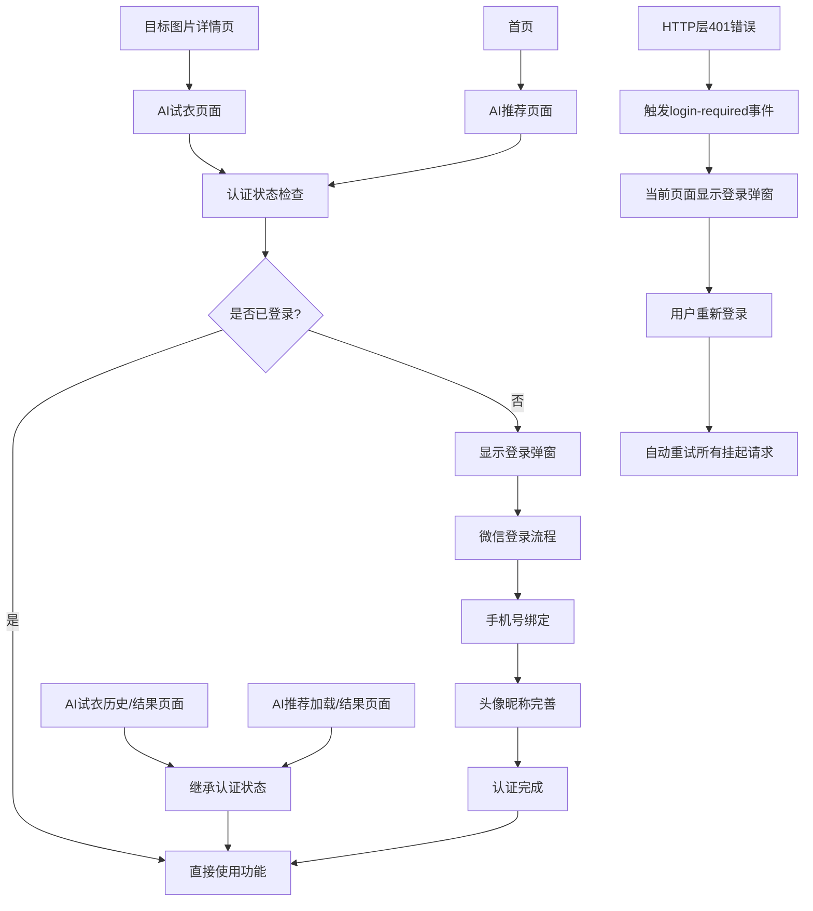

**图表来源**
- [src/pages/targetPhotoDetail/index.uvue:51-80](file://src/pages/targetPhotoDetail/index.uvue#L51-80)
- [src/pages/aiTryOn/index.uvue:313-408](file://src/pages/aiTryOn/index.uvue#L313-408)
- [src/pages/aiRecommend/index.uvue:158-344](file://src/pages/aiRecommend/index.uvue#L158-L344)
- [src/pages/aiTryOnHistory/index.uvue:1-200](file://src/pages/aiTryOnHistory/index.uvue#L1-L200)
- [src/pages/aiTryOnResult/index.uvue:1-200](file://src/pages/aiTryOnResult/index.uvue#L1-L200)
- [src/pages/aiRecommendLoading/index.uvue:1-235](file://src/pages/aiRecommendLoading/index.uvue#L1-L235)
- [src/pages/aiRecommendResult/index.uvue:1-275](file://src/pages/aiRecommendResult/index.uvue#L1-L275)
- [src/utils/http.uts:145-149](file://src/utils/http.uts#L145-L149)

**章节来源**
- [src/pages/targetPhotoDetail/index.uvue:51-80](file://src/pages/targetPhotoDetail/index.uvue#L51-80)
- [src/pages/aiTryOn/index.uvue:313-408](file://src/pages/aiTryOn/index.uvue#L313-408)
- [src/pages/aiRecommend/index.uvue:158-344](file://src/pages/aiRecommend/index.uvue#L158-L344)
- [src/pages/aiTryOnHistory/index.uvue:1-200](file://src/pages/aiTryOnHistory/index.uvue#L1-L200)
- [src/pages/aiTryOnResult/index.uvue:1-200](file://src/pages/aiTryOnResult/index.uvue#L1-L200)
- [src/pages/aiRecommendLoading/index.uvue:1-235](file://src/pages/aiRecommendLoading/index.uvue#L1-L235)
- [src/pages/aiRecommendResult/index.uvue:1-275](file://src/pages/aiRecommendResult/index.uvue#L1-L275)
- [src/utils/http.uts:145-149](file://src/utils/http.uts#L145-L149)

## 依赖关系分析
- 页面层依赖工具层
  - 我的页面依赖认证工具、API 封装、登录流程编排、头像昵称提交、法律文案工具
  - AI试衣页面依赖登录流程编排、头像昵称提交、认证工具
  - 目标图片详情页依赖AI试衣页面
  - AI试衣历史与结果页面依赖认证工具
  - **新增** AI推荐页面依赖登录流程编排、头像昵称提交、认证工具
  - **新增** AI推荐加载页面依赖API封装
  - **新增** AI推荐结果页面依赖认证工具
- 工具层之间的耦合
  - 登录流程编排依赖 API 封装与认证工具
  - 头像昵称提交依赖 API 封装与认证工具
  - API 封装依赖 HTTP 请求封装
  - HTTP 请求封装依赖认证工具与配置工具
- 页面间登录态联动
  - 收藏页面等需要登录的功能在跳转前检查登录态，未登录时引导至登录弹窗
  - AI试衣历史与结果页面自动继承认证状态
  - **新增** AI推荐相关页面继承认证状态
  - **新增** 全局事件驱动的认证状态同步机制

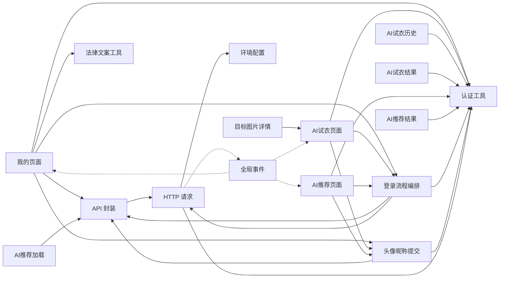

**图表来源**
- [src/pages/mine/index.uvue:136-486](file://src/pages/mine/index.uvue#L136-486)
- [src/pages/aiTryOn/index.uvue:313-408](file://src/pages/aiTryOn/index.uvue#L313-408)
- [src/pages/targetPhotoDetail/index.uvue:51-80](file://src/pages/targetPhotoDetail/index.uvue#L51-80)
- [src/pages/aiTryOnHistory/index.uvue:1-200](file://src/pages/aiTryOnHistory/index.uvue#L1-L200)
- [src/pages/aiTryOnResult/index.uvue:1-200](file://src/pages/aiTryOnResult/index.uvue#L1-L200)
- [src/pages/aiRecommend/index.uvue:1-452](file://src/pages/aiRecommend/index.uvue#L1-L452)
- [src/pages/aiRecommendLoading/index.uvue:1-235](file://src/pages/aiRecommendLoading/index.uvue#L1-L235)
- [src/pages/aiRecommendResult/index.uvue:1-275](file://src/pages/aiRecommendResult/index.uvue#L1-L275)
- [src/utils/loginFlow.uts:8-10](file://src/utils/loginFlow.uts#L8-L10)
- [src/utils/profileSubmit.uts:5-6](file://src/utils/profileSubmit.uts#L5-L6)
- [src/utils/api.uts:1-3](file://src/utils/api.uts#L1-L3)
- [src/utils/http.uts:1-3](file://src/utils/http.uts#L1-L3)
- [src/utils/auth.uts:1-4](file://src/utils/auth.uts#L1-L4)
- [src/utils/config.uts:1-5](file://src/utils/config.uts#L1-L5)

**章节来源**
- [src/pages/mine/index.uvue:136-486](file://src/pages/mine/index.uvue#L136-486)
- [src/pages/aiTryOn/index.uvue:313-408](file://src/pages/aiTryOn/index.uvue#L313-408)
- [src/pages/targetPhotoDetail/index.uvue:51-80](file://src/pages/targetPhotoDetail/index.uvue#L51-80)
- [src/pages/aiTryOnHistory/index.uvue:1-200](file://src/pages/aiTryOnHistory/index.uvue#L1-L200)
- [src/pages/aiTryOnResult/index.uvue:1-200](file://src/pages/aiTryOnResult/index.uvue#L1-L200)
- [src/pages/aiRecommend/index.uvue:1-452](file://src/pages/aiRecommend/index.uvue#L1-L452)
- [src/pages/aiRecommendLoading/index.uvue:1-235](file://src/pages/aiRecommendLoading/index.uvue#L1-L235)
- [src/pages/aiRecommendResult/index.uvue:1-275](file://src/pages/aiRecommendResult/index.uvue#L1-L275)
- [src/utils/loginFlow.uts:1-10](file://src/utils/loginFlow.uts#L1-L10)
- [src/utils/profileSubmit.uts:1-7](file://src/utils/profileSubmit.uts#L1-L7)
- [src/utils/api.uts:1-3](file://src/utils/api.uts#L1-L3)
- [src/utils/http.uts:1-3](file://src/utils/http.uts#L1-L3)
- [src/utils/auth.uts:1-4](file://src/utils/auth.uts#L1-L4)
- [src/utils/config.uts:1-13](file://src/utils/config.uts#L1-L13)

## 性能考量
- 本地存储访问
  - Token 与用户信息均通过本地存储读写，避免频繁网络请求
- 请求头注入
  - 仅在存在 token 时添加 Authorization，减少无效头部开销
- 加载提示
  - 通过 showLoading 控制器粒度，避免过度 UI 闪烁
- 数据合并
  - 合并写入避免覆盖已有字段，减少不必要的后端往返
- 跨页面状态共享
  - 认证状态在页面间共享，避免重复登录检查
- 页面状态继承
  - AI试衣历史与结果页面直接继承认证状态，减少额外的认证检查开销
- AI试衣页面登录检查优化
  - 在照片上传和生成AI试衣效果前进行登录检查，避免无效操作
- **新增** AI推荐页面登录检查优化
  - 在照片上传和分析前进行登录检查，避免无效操作
  - 优化AI推荐加载页面的轮询性能
- **新增** 请求挂起队列优化
  - 避免重复的网络请求和资源消耗
  - 批量重试机制提高重试效率
  - 防重入保护避免并发重试导致的资源浪费
- **新增** 全局事件优化
  - 事件监听器的及时注册和注销，避免内存泄漏
  - 登录过期标志的消费机制，避免重复弹窗

## 故障排查指南
- 获取登录凭证失败
  - 现象：步骤1 uni.login 返回 code 为空
  - 处理：提示用户重试或检查小程序认证状态
- 微信登录失败
  - 现象：wxLogin 返回非 200 或无数据
  - 处理：记录错误消息并提示用户重试
- 绑定手机号失败
  - 现象：wxBindPhone 异常或返回非 200
  - 处理：记录警告并继续补齐头像昵称流程
- 401 未授权
  - 现象：后端返回 401
  - 处理：自动清除本地 token 与用户信息，提示重新登录
  - **新增** 请求会被挂起，等待用户重新登录后自动重试
- 头像昵称更新失败
  - 现象：wxUpdateUserInfo 返回非 200
  - 处理：显示错误提示并允许用户重试
- AI试衣页面登录异常
  - 现象：AI试衣悬浮按钮无法正常工作
  - 处理：检查页面导航逻辑和登录弹窗显示状态
- 页面状态继承问题
  - 现象：AI试衣历史/结果页面认证状态异常
  - 处理：检查认证工具的状态读取与页面初始化逻辑
- AI试衣页面登录检查问题
  - 现象：用户点击上传照片或生成按钮时没有弹出登录弹窗
  - 处理：检查 isLoggedIn() 函数调用和页面状态变量更新逻辑
- **新增** AI推荐页面登录检查问题
  - 现象：用户点击开始AI分析推荐时没有弹出登录弹窗
  - 处理：检查 handleStartAnalysis 方法中的登录状态检查逻辑
- **新增** AI推荐上传失败问题
  - 现象：AI推荐照片上传失败但显示登录成功
  - 处理：检查 uploadPhoto 函数的错误处理和状态更新逻辑
- **新增** AI推荐加载超时问题
  - 现象：AI推荐加载页面长时间无响应
  - 处理：检查轮询机制和超时处理逻辑
- **新增** 401请求挂起队列问题
  - 现象：用户重新登录后挂起的请求没有自动重试
  - 处理：检查 flushPendingRequests() 调用和队列状态
- **新增** 登录过期标志问题
  - 现象：页面切换时登录弹窗重复显示或不显示
  - 处理：检查 consumeLoginExpired() 调用和标志位状态
- **新增** 全局事件监听问题
  - 现象：401错误触发后当前页面没有显示登录弹窗
  - 处理：检查 uni.$on('login-required') 监听器是否正确注册
- **新增** 上传请求挂起队列问题
  - 现象：文件上传时遇到401错误但没有正确处理
  - 处理：检查 uploadPhoto 函数的401处理和挂起队列逻辑

**章节来源**
- [src/utils/loginFlow.uts:28-75](file://src/utils/loginFlow.uts#L28-L75)
- [src/utils/http.uts:124-151](file://src/utils/http.uts#L124-L151)
- [src/pages/mine/index.uvue:320-351](file://src/pages/mine/index.uvue#L320-L351)
- [src/pages/aiTryOn/index.uvue:369-394](file://src/pages/aiTryOn/index.uvue#L369-394)
- [src/pages/aiRecommend/index.uvue:158-344](file://src/pages/aiRecommend/index.uvue#L158-L344)
- [src/utils/auth.uts:121-141](file://src/utils/auth.uts#L121-L141)
- [src/utils/http.uts:42-78](file://src/utils/http.uts#L42-L78)
- [src/utils/api.uts:441-480](file://src/utils/api.uts#L441-L480)

## 结论
蓝莓小程序的认证系统通过清晰的分层设计与稳健的错误处理，实现了从微信授权到用户信息完善的完整闭环。增强的登录过期状态管理、401错误请求挂起队列机制和全局事件驱动的统一认证体验，进一步提升了系统的健壮性和用户体验。AI试衣页面和AI推荐页面的集成完善了认证系统在小程序各个功能页面中的深度集成，确保用户在小程序的各个功能页面中都能获得一致且流畅的认证体验。

**关键改进**：
- 实现了完整的登录过期状态管理机制，解决竞态条件问题
- 引入401错误请求挂起队列，提升用户体验和系统健壮性
- 建立全局事件驱动的认证状态同步机制
- 优化了多页面间的认证状态管理和错误处理
- 增强了上传接口的401处理能力
- **新增** AI推荐功能的完整认证集成，支持照片上传、手机号授权和用户资料完善
- **新增** AI推荐场景的专门化错误处理和用户体验优化

Token 管理与本地存储结合、登录流程三步编排、HTTP 层统一注入与 401 处理、请求挂起队列机制，共同构成了可扩展、易维护的认证基础设施。开发者可在现有基础上扩展第三方登录、完善权限体系与增强安全策略，同时可以借鉴现有的认证状态共享机制来实现更多页面的统一认证体验。

## 附录

### 开发者扩展与定制指导
- 第三方登录集成
  - 在登录流程编排中新增第三方登录步骤，返回与微信登录一致的数据结构，随后调用登录成功流程
  - 在页面层增加第三方登录入口与授权回调处理
- 权限与拦截
  - 在 HTTP 层增加更细粒度的权限校验与路由拦截
  - 在页面层对需要特定权限的页面增加前置校验
- 安全增强
  - Token 刷新与续期策略
  - 用户信息脱敏与最小化采集
  - 请求签名与防重放机制（如需）
- 跨页面认证优化
  - 实现认证状态的全局缓存机制
  - 优化页面间的认证状态传递
  - 增加认证状态的实时同步机制
  - 参考AI试衣历史与结果页面的认证状态继承模式
  - **新增** 参考AI推荐页面的认证集成模式
  - **新增** 利用全局事件机制实现更灵活的认证状态同步
- 页面扩展集成
  - 新增页面时遵循统一的认证状态检查与错误处理模式
  - 使用现有的登录弹窗组件确保用户体验一致性
  - 集成头像昵称完善流程以提升用户信息完整性
  - **新增** 在页面onShow中消费登录过期标志，确保认证状态的正确性
  - **新增** 参考AI推荐页面的登录检查时机和错误处理策略
- **新增** AI推荐功能扩展指导
  - 在AI推荐场景中实现类似的登录状态检查机制
  - 集成用户协议与隐私政策的确认流程
  - 实现手机号授权和用户资料完善的完整流程
  - 优化AI推荐加载和结果页面的认证状态继承
- **新增** 401错误处理优化
  - 在关键操作前增加登录状态检查，提升用户体验
  - 统一登录弹窗样式和交互逻辑
  - 优化登录失败后的错误提示和重试机制
  - 利用请求挂起队列机制避免用户重复操作
  - 实现用户取消登录时的请求清理机制
  - 扩展上传接口的401处理能力
  - **新增** 针对AI推荐场景的专门化错误处理策略