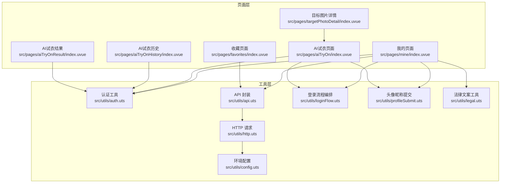
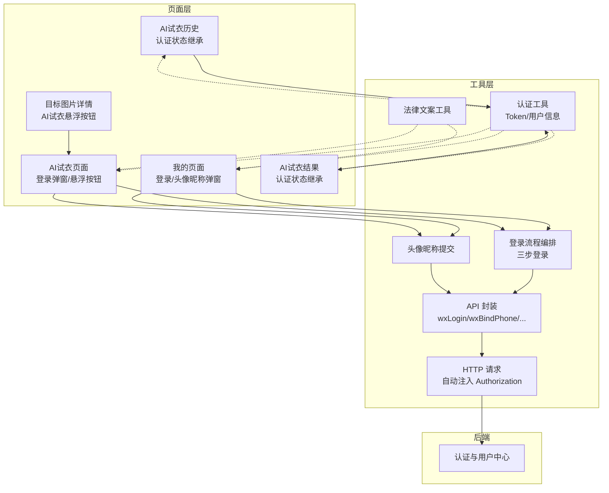
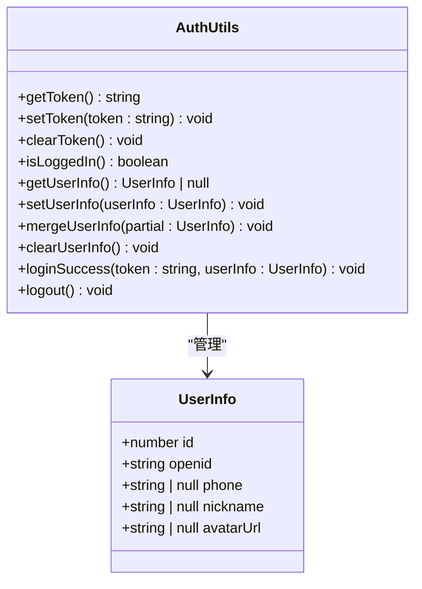
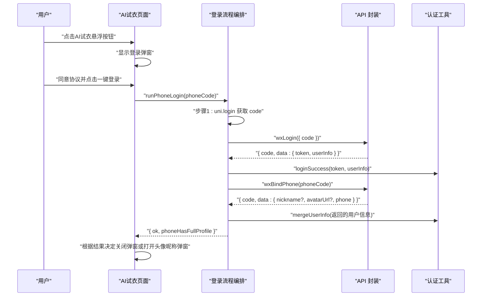
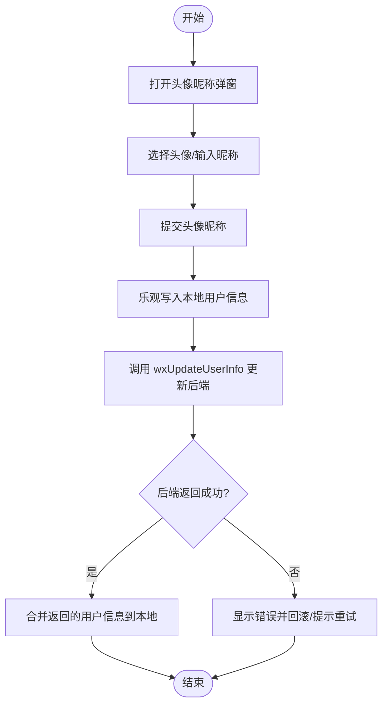
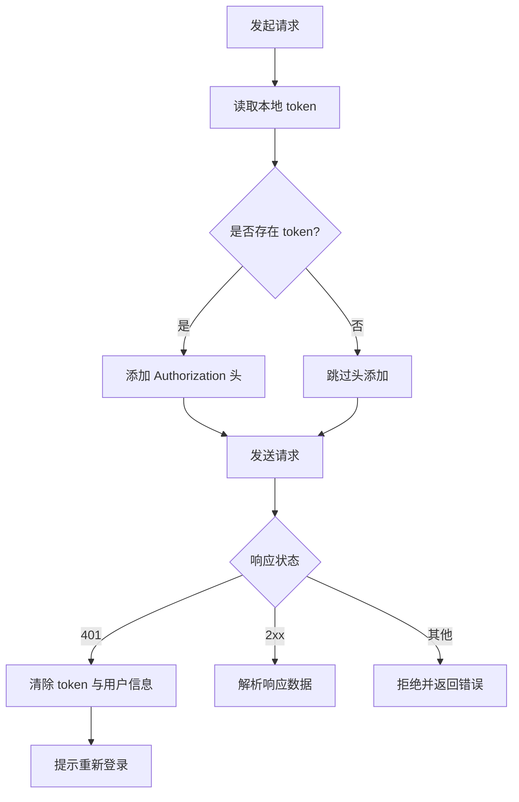
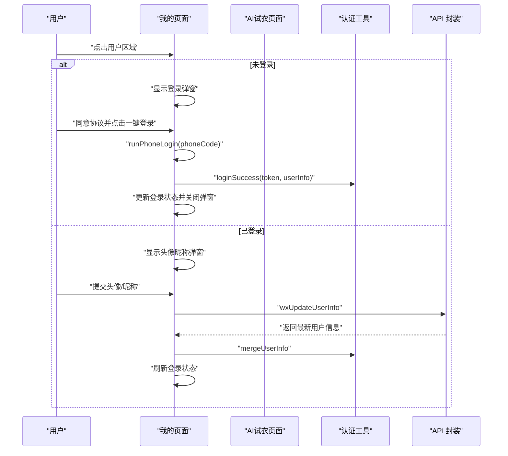
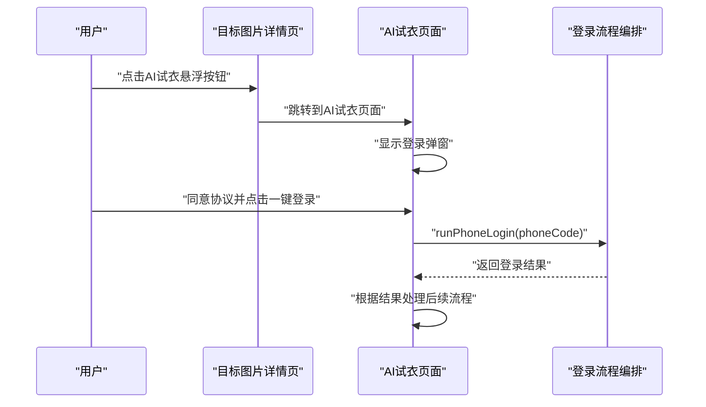
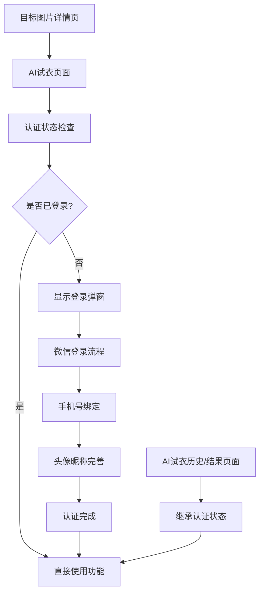
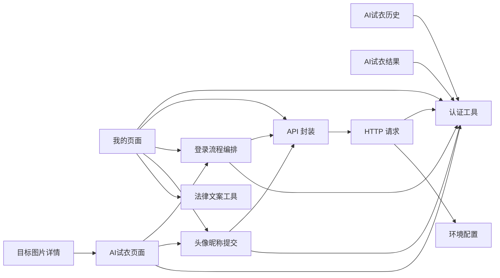

# 用户认证系统

<cite>
**本文档引用的文件**
- [src/utils/auth.uts](file://src/utils/auth.uts)
- [src/utils/api.uts](file://src/utils/api.uts)
- [src/utils/loginFlow.uts](file://src/utils/loginFlow.uts)
- [src/utils/http.uts](file://src/utils/http.uts)
- [src/utils/profileSubmit.uts](file://src/utils/profileSubmit.uts)
- [src/utils/legal.uts](file://src/utils/legal.uts)
- [src/utils/config.uts](file://src/utils/config.uts)
- [src/pages/mine/index.uvue](file://src/pages/mine/index.uvue)
- [src/App.uvue](file://src/App.uvue)
- [src/pages/favorites/index.uvue](file://src/pages/favorites/index.uvue)
- [src/pages/aiTryOn/index.uvue](file://src/pages/aiTryOn/index.uvue)
- [src/pages/targetPhotoDetail/index.uvue](file://src/pages/targetPhotoDetail/index.uvue)
- [src/pages/aiTryOnResult/index.uvue](file://src/pages/aiTryOnResult/index.uvue)
- [src/pages/aiTryOnHistory/index.uvue](file://src/pages/aiTryOnHistory/index.uvue)
</cite>

## 更新摘要
**所做更改**
- 新增AI试衣页面认证流程集成章节
- 更新跨页面统一认证体验说明
- 增加AI试衣悬浮按钮与登录弹窗实现细节
- 扩展认证系统页面覆盖范围分析
- 新增AI试衣历史与结果页面的认证集成说明
- 完善登录弹窗交互逻辑与错误处理机制

## 目录
1. [简介](#简介)
2. [项目结构](#项目结构)
3. [核心组件](#核心组件)
4. [架构总览](#架构总览)
5. [详细组件分析](#详细组件分析)
6. [AI试衣页面认证集成](#ai试衣页面认证集成)
7. [跨页面统一认证体验](#跨页面统一认证体验)
8. [依赖关系分析](#依赖关系分析)
9. [性能考量](#性能考量)
10. [故障排查指南](#故障排查指南)
11. [结论](#结论)
12. [附录](#附录)

## 简介
本文件面向蓝莓小程序的用户认证系统，围绕微信登录、手机号绑定、用户信息完善与管理等核心能力，系统化阐述认证状态管理、Token处理机制、登录状态检查与错误处理策略。文档同时提供从微信授权到用户信息完善的完整业务流程图示，以及针对开发者扩展与定制的指导建议。本次更新重点反映了AI试衣页面集成了完整的微信认证流程，实现了跨页面的统一认证体验，并扩展了认证系统在小程序各个功能页面中的深度集成。

## 项目结构
认证相关代码主要分布在以下模块：
- 工具层：认证状态与用户信息管理、HTTP请求封装、登录流程编排、头像昵称提交、法律文案工具、环境配置
- 页面层：我的页面承载登录弹窗、头像昵称授权弹窗、登录状态展示与退出登录操作；AI试衣页面集成登录弹窗与认证流程；目标图片详情页提供AI试衣悬浮按钮；AI试衣历史与结果页面继承认证状态
- API层：与后端交互的微信登录、手机号绑定、用户信息获取与更新等接口

**图表来源**
- [src/pages/mine/index.uvue:136-486](file://src/pages/mine/index.uvue#L136-L486)
- [src/pages/aiTryOn/index.uvue:313-408](file://src/pages/aiTryOn/index.uvue#L313-L408)
- [src/pages/targetPhotoDetail/index.uvue:51-80](file://src/pages/targetPhotoDetail/index.uvue#L51-L80)
- [src/pages/aiTryOnHistory/index.uvue:1-200](file://src/pages/aiTryOnHistory/index.uvue#L1-L200)
- [src/pages/aiTryOnResult/index.uvue:1-200](file://src/pages/aiTryOnResult/index.uvue#L1-L200)
- [src/utils/auth.uts:1-149](file://src/utils/auth.uts#L1-L149)
- [src/utils/api.uts:1-312](file://src/utils/api.uts#L1-L312)
- [src/utils/http.uts:1-82](file://src/utils/http.uts#L1-L82)
- [src/utils/loginFlow.uts:1-71](file://src/utils/loginFlow.uts#L1-L71)
- [src/utils/profileSubmit.uts:1-37](file://src/utils/profileSubmit.uts#L1-L37)
- [src/utils/legal.uts:1-16](file://src/utils/legal.uts#L1-L16)
- [src/utils/config.uts:1-12](file://src/utils/config.uts#L1-L12)

**章节来源**
- [src/pages/mine/index.uvue:1-604](file://src/pages/mine/index.uvue#L1-L604)
- [src/pages/aiTryOn/index.uvue:1-450](file://src/pages/aiTryOn/index.uvue#L1-L450)
- [src/pages/targetPhotoDetail/index.uvue:1-120](file://src/pages/targetPhotoDetail/index.uvue#L1-L120)
- [src/pages/aiTryOnHistory/index.uvue:1-200](file://src/pages/aiTryOnHistory/index.uvue#L1-L200)
- [src/pages/aiTryOnResult/index.uvue:1-200](file://src/pages/aiTryOnResult/index.uvue#L1-L200)
- [src/utils/auth.uts:1-149](file://src/utils/auth.uts#L1-L149)
- [src/utils/api.uts:1-312](file://src/utils/api.uts#L1-L312)
- [src/utils/http.uts:1-82](file://src/utils/http.uts#L1-L82)
- [src/utils/loginFlow.uts:1-71](file://src/utils/loginFlow.uts#L1-L71)
- [src/utils/profileSubmit.uts:1-37](file://src/utils/profileSubmit.uts#L1-L37)
- [src/utils/legal.uts:1-16](file://src/utils/legal.uts#L1-L16)
- [src/utils/config.uts:1-12](file://src/utils/config.uts#L1-L12)

## 核心组件
- 认证状态与用户信息管理
  - Token 的获取、设置、清除与登录态判断
  - 用户信息的持久化存储、合并写入与清理
- 登录流程编排
  - 三步登录流程：静默登录取微信 code → 交换 token → 绑定手机号并合并用户信息
- HTTP 请求封装
  - 自动注入 Authorization 头、统一 401 处理、超时控制与加载提示开关
- 头像昵称完善
  - 上传头像与昵称至后端并合并本地用户信息
- 法律与页面集成
  - 用户协议与隐私政策打开、页面登录弹窗与授权流程

**章节来源**
- [src/utils/auth.uts:15-149](file://src/utils/auth.uts#L15-L149)
- [src/utils/loginFlow.uts:27-71](file://src/utils/loginFlow.uts#L27-L71)
- [src/utils/api.uts:129-190](file://src/utils/api.uts#L129-L190)
- [src/utils/http.uts:20-73](file://src/utils/http.uts#L20-L73)
- [src/utils/profileSubmit.uts:18-36](file://src/utils/profileSubmit.uts#L18-L36)
- [src/utils/legal.uts:1-16](file://src/utils/legal.uts#L1-L16)

## 架构总览
认证系统采用"页面层 + 工具层 + API 层"的分层设计，页面负责交互与状态展示，工具层负责业务编排与数据持久化，API 层负责与后端通信，HTTP 层统一处理请求与鉴权。AI试衣页面的集成使得认证流程可以在小程序的任意页面中统一执行，提升了用户体验的一致性。新增的AI试衣历史与结果页面进一步完善了认证系统的全链路覆盖。

**图表来源**
- [src/pages/mine/index.uvue:136-486](file://src/pages/mine/index.uvue#L136-L486)
- [src/pages/aiTryOn/index.uvue:313-408](file://src/pages/aiTryOn/index.uvue#L313-L408)
- [src/pages/targetPhotoDetail/index.uvue:51-80](file://src/pages/targetPhotoDetail/index.uvue#L51-L80)
- [src/pages/aiTryOnHistory/index.uvue:1-200](file://src/pages/aiTryOnHistory/index.uvue#L1-L200)
- [src/pages/aiTryOnResult/index.uvue:1-200](file://src/pages/aiTryOnResult/index.uvue#L1-L200)
- [src/utils/auth.uts:1-149](file://src/utils/auth.uts#L1-L149)
- [src/utils/loginFlow.uts:1-71](file://src/utils/loginFlow.uts#L1-L71)
- [src/utils/api.uts:129-190](file://src/utils/api.uts#L129-L190)
- [src/utils/http.uts:20-73](file://src/utils/http.uts#L20-L73)
- [src/utils/profileSubmit.uts:1-37](file://src/utils/profileSubmit.uts#L1-L37)
- [src/utils/legal.uts:1-16](file://src/utils/legal.uts#L1-L16)

## 详细组件分析

### 认证状态与用户信息管理
- Token 管理
  - 获取：从本地存储读取 token，异常时返回空字符串
  - 设置：将 token 写入本地存储
  - 清除：移除本地 token
  - 登录态判断：token 非空且非特殊字符串即视为已登录
- 用户信息管理
  - 获取/设置/清除：基于本地存储的 UserInfo 结构
  - 合并写入：仅在传入字段非空时覆盖，避免 step2 已写入的头像/昵称被 step3 的空值覆盖
- 登录成功与登出
  - 登录成功：同时保存 token 与用户信息
  - 登出：清除 token 与用户信息

**图表来源**
- [src/utils/auth.uts:6-149](file://src/utils/auth.uts#L6-L149)

**章节来源**
- [src/utils/auth.uts:15-149](file://src/utils/auth.uts#L15-L149)

### 登录流程编排（三步登录）
- 流程步骤
  - 步骤1：静默登录获取微信 code
  - 步骤2：使用 code 调用后端 wxLogin 获取 token 与用户信息，成功后保存
  - 步骤3：使用 phoneCode 调用 wxBindPhone 绑定手机号，合并返回的用户信息；即使此步失败也不视为整体失败
- 错误收敛
  - 任一步骤异常均收敛为结果对象，包含 ok、phoneHasFullProfile 与 errorKind/errorMsg

**图表来源**
- [src/utils/loginFlow.uts:27-71](file://src/utils/loginFlow.uts#L27-L71)
- [src/utils/api.uts:129-154](file://src/utils/api.uts#L129-L154)
- [src/utils/auth.uts:135-148](file://src/utils/auth.uts#L135-L148)
- [src/pages/aiTryOn/index.uvue:369-394](file://src/pages/aiTryOn/index.uvue#L369-L394)

**章节来源**
- [src/utils/loginFlow.uts:1-71](file://src/utils/loginFlow.uts#L1-L71)
- [src/utils/api.uts:129-154](file://src/utils/api.uts#L129-L154)
- [src/utils/auth.uts:135-148](file://src/utils/auth.uts#L135-L148)
- [src/pages/aiTryOn/index.uvue:369-394](file://src/pages/aiTryOn/index.uvue#L369-L394)

### 头像昵称完善与提交
- 页面交互
  - 通过 chooseAvatar 选择头像，输入昵称，提交后先乐观写入本地，再调用后端更新
- 提交流程
  - 调用 wxUpdateUserInfo 更新后端用户信息
  - 成功后合并返回的用户信息到本地存储

**图表来源**
- [src/pages/mine/index.uvue:354-408](file://src/pages/mine/index.uvue#L354-L408)
- [src/utils/profileSubmit.uts:18-36](file://src/utils/profileSubmit.uts#L18-L36)
- [src/utils/api.uts:175-190](file://src/utils/api.uts#L175-L190)
- [src/utils/auth.uts:92-106](file://src/utils/auth.uts#L92-L106)

**章节来源**
- [src/pages/mine/index.uvue:354-408](file://src/pages/mine/index.uvue#L354-L408)
- [src/utils/profileSubmit.uts:1-37](file://src/utils/profileSubmit.uts#L1-L37)
- [src/utils/api.uts:175-190](file://src/utils/api.uts#L175-L190)
- [src/utils/auth.uts:92-106](file://src/utils/auth.uts#L92-L106)

### HTTP 请求与 Token 注入
- 自动注入 Authorization 头
  - 当本地存在 token 时，在请求头中附加 Bearer token
- 统一 401 处理
  - 检测到 401 时清除本地 token 与用户信息，并提示重新登录
- 超时与加载控制
  - 通过配置项设置超时时间，支持按需显示加载提示

**图表来源**
- [src/utils/http.uts:20-73](file://src/utils/http.uts#L20-L73)
- [src/utils/auth.uts:21-52](file://src/utils/auth.uts#L21-L52)
- [src/utils/config.uts:7-11](file://src/utils/config.uts#L7-L11)

**章节来源**
- [src/utils/http.uts:1-82](file://src/utils/http.uts#L1-L82)
- [src/utils/auth.uts:15-52](file://src/utils/auth.uts#L15-L52)
- [src/utils/config.uts:1-12](file://src/utils/config.uts#L1-L12)

### 页面级登录与状态展示
- 登录弹窗
  - 展示用户协议与隐私政策勾选，同意后方可点击一键登录
  - 一键登录按钮绑定 getPhoneNumber 回调，触发三步登录流程
- 头像昵称弹窗
  - 选择头像与输入昵称，提交后更新后端并刷新本地状态
- 登录状态展示
  - 未登录显示"点击立即登录"，已登录显示头像与昵称
  - 页面显示时若本地头像为空，尝试从后端拉取最新用户信息

**图表来源**
- [src/pages/mine/index.uvue:136-486](file://src/pages/mine/index.uvue#L136-L486)
- [src/utils/auth.uts:135-148](file://src/utils/auth.uts#L135-L148)
- [src/utils/api.uts:129-190](file://src/utils/api.uts#L129-L190)

**章节来源**
- [src/pages/mine/index.uvue:136-486](file://src/pages/mine/index.uvue#L136-L486)
- [src/utils/auth.uts:119-149](file://src/utils/auth.uts#L119-L149)
- [src/utils/api.uts:129-190](file://src/utils/api.uts#L129-L190)

## AI试衣页面认证集成

### AI试衣悬浮按钮实现
AI试衣页面在目标图片详情的基础上增加了AI试衣悬浮按钮，用户可以直接从图片详情页进入AI试衣功能。当用户点击AI试衣按钮时，会触发登录弹窗验证用户身份。

**章节来源**
- [src/pages/targetPhotoDetail/index.uvue:51-80](file://src/pages/targetPhotoDetail/index.uvue#L51-L80)

### 登录弹窗与认证流程
AI试衣页面实现了完整的微信认证流程，包括：
- 用户协议与隐私政策勾选确认
- 微信一键登录按钮
- 手机号授权回调处理
- 登录状态检查与错误处理

**图表来源**
- [src/pages/targetPhotoDetail/index.uvue:51-80](file://src/pages/targetPhotoDetail/index.uvue#L51-L80)
- [src/pages/aiTryOn/index.uvue:313-408](file://src/pages/aiTryOn/index.uvue#L313-L408)
- [src/utils/loginFlow.uts:27-71](file://src/utils/loginFlow.uts#L27-L71)

**章节来源**
- [src/pages/aiTryOn/index.uvue:313-408](file://src/pages/aiTryOn/index.uvue#L313-L408)
- [src/pages/targetPhotoDetail/index.uvue:51-80](file://src/pages/targetPhotoDetail/index.uvue#L51-L80)

### 头像昵称完善流程
AI试衣页面继承了完整的头像昵称完善流程，用户在登录后如果缺少头像或昵称信息，会自动弹出头像昵称授权弹窗进行完善。

**章节来源**
- [src/pages/aiTryOn/index.uvue:396-408](file://src/pages/aiTryOn/index.uvue#L396-L408)
- [src/utils/profileSubmit.uts:18-36](file://src/utils/profileSubmit.uts#L18-L36)

### AI试衣历史与结果页面的认证集成
AI试衣历史与结果页面继承了完整的认证状态，确保用户在浏览历史记录和查看试衣结果时能够保持一致的登录状态体验。

**章节来源**
- [src/pages/aiTryOnHistory/index.uvue:1-200](file://src/pages/aiTryOnHistory/index.uvue#L1-L200)
- [src/pages/aiTryOnResult/index.uvue:1-200](file://src/pages/aiTryOnResult/index.uvue#L1-L200)

## 跨页面统一认证体验

### 认证状态共享机制
AI试衣页面的集成实现了跨页面的统一认证体验，所有页面共享相同的认证状态和用户信息。无论用户从哪个页面进入小程序，都可以获得一致的认证流程体验。新增的AI试衣历史与结果页面进一步完善了认证状态的全链路继承。

### 页面间导航与认证检查
- 目标图片详情页提供AI试衣入口
- AI试衣页面独立处理认证流程
- 认证状态在页面间自动同步
- 历史与结果页面继承认证状态

**图表来源**
- [src/pages/targetPhotoDetail/index.uvue:51-80](file://src/pages/targetPhotoDetail/index.uvue#L51-L80)
- [src/pages/aiTryOn/index.uvue:313-408](file://src/pages/aiTryOn/index.uvue#L313-L408)
- [src/pages/aiTryOnHistory/index.uvue:1-200](file://src/pages/aiTryOnHistory/index.uvue#L1-L200)
- [src/pages/aiTryOnResult/index.uvue:1-200](file://src/pages/aiTryOnResult/index.uvue#L1-L200)

**章节来源**
- [src/pages/targetPhotoDetail/index.uvue:51-80](file://src/pages/targetPhotoDetail/index.uvue#L51-L80)
- [src/pages/aiTryOn/index.uvue:313-408](file://src/pages/aiTryOn/index.uvue#L313-L408)
- [src/pages/aiTryOnHistory/index.uvue:1-200](file://src/pages/aiTryOnHistory/index.uvue#L1-L200)
- [src/pages/aiTryOnResult/index.uvue:1-200](file://src/pages/aiTryOnResult/index.uvue#L1-L200)

## 依赖关系分析
- 页面层依赖工具层
  - 我的页面依赖认证工具、API 封装、登录流程编排、头像昵称提交、法律文案工具
  - AI试衣页面依赖登录流程编排、头像昵称提交、认证工具
  - 目标图片详情页依赖AI试衣页面
  - AI试衣历史与结果页面依赖认证工具
- 工具层之间的耦合
  - 登录流程编排依赖 API 封装与认证工具
  - 头像昵称提交依赖 API 封装与认证工具
  - API 封装依赖 HTTP 请求封装
  - HTTP 请求封装依赖认证工具与配置工具
- 页面间登录态联动
  - 收藏页面等需要登录的功能在跳转前检查登录态，未登录时引导至登录弹窗
  - AI试衣历史与结果页面自动继承认证状态

**图表来源**
- [src/pages/mine/index.uvue:136-486](file://src/pages/mine/index.uvue#L136-L486)
- [src/pages/aiTryOn/index.uvue:313-408](file://src/pages/aiTryOn/index.uvue#L313-L408)
- [src/pages/targetPhotoDetail/index.uvue:51-80](file://src/pages/targetPhotoDetail/index.uvue#L51-L80)
- [src/pages/aiTryOnHistory/index.uvue:1-200](file://src/pages/aiTryOnHistory/index.uvue#L1-L200)
- [src/pages/aiTryOnResult/index.uvue:1-200](file://src/pages/aiTryOnResult/index.uvue#L1-L200)
- [src/utils/loginFlow.uts:8-9](file://src/utils/loginFlow.uts#L8-L9)
- [src/utils/profileSubmit.uts:5-6](file://src/utils/profileSubmit.uts#L5-L6)
- [src/utils/api.uts:1-2](file://src/utils/api.uts#L1-L2)
- [src/utils/http.uts:1-2](file://src/utils/http.uts#L1-L2)
- [src/utils/auth.uts:1-4](file://src/utils/auth.uts#L1-L4)
- [src/utils/config.uts:1-5](file://src/utils/config.uts#L1-L5)

**章节来源**
- [src/pages/mine/index.uvue:136-486](file://src/pages/mine/index.uvue#L136-L486)
- [src/pages/aiTryOn/index.uvue:313-408](file://src/pages/aiTryOn/index.uvue#L313-L408)
- [src/pages/targetPhotoDetail/index.uvue:51-80](file://src/pages/targetPhotoDetail/index.uvue#L51-L80)
- [src/pages/aiTryOnHistory/index.uvue:1-200](file://src/pages/aiTryOnHistory/index.uvue#L1-L200)
- [src/pages/aiTryOnResult/index.uvue:1-200](file://src/pages/aiTryOnResult/index.uvue#L1-L200)
- [src/utils/loginFlow.uts:1-10](file://src/utils/loginFlow.uts#L1-L10)
- [src/utils/profileSubmit.uts:1-7](file://src/utils/profileSubmit.uts#L1-L7)
- [src/utils/api.uts:1-3](file://src/utils/api.uts#L1-L3)
- [src/utils/http.uts:1-3](file://src/utils/http.uts#L1-L3)
- [src/utils/auth.uts:1-4](file://src/utils/auth.uts#L1-L4)
- [src/utils/config.uts:1-12](file://src/utils/config.uts#L1-L12)

## 性能考量
- 本地存储访问
  - Token 与用户信息均通过本地存储读写，避免频繁网络请求
- 请求头注入
  - 仅在存在 token 时添加 Authorization，减少无效头部开销
- 加载提示
  - 通过 showLoading 控制器粒度，避免过度 UI 闪烁
- 数据合并
  - 合并写入避免覆盖已有字段，减少不必要的后端往返
- 跨页面状态共享
  - 认证状态在页面间共享，避免重复登录检查
- 页面状态继承
  - AI试衣历史与结果页面直接继承认证状态，减少额外的认证检查开销

## 故障排查指南
- 获取登录凭证失败
  - 现象：步骤1 uni.login 返回 code 为空
  - 处理：提示用户重试或检查小程序认证状态
- 微信登录失败
  - 现象：wxLogin 返回非 200 或无数据
  - 处理：记录错误消息并提示用户重试
- 绑定手机号失败
  - 现象：wxBindPhone 异常或返回非 200
  - 处理：记录警告并继续补齐头像昵称流程
- 401 未授权
  - 现象：后端返回 401
  - 处理：自动清除本地 token 与用户信息，提示重新登录
- 头像昵称更新失败
  - 现象：wxUpdateUserInfo 返回非 200
  - 处理：显示错误提示并允许用户重试
- AI试衣页面登录异常
  - 现象：AI试衣悬浮按钮无法正常工作
  - 处理：检查页面导航逻辑和登录弹窗显示状态
- 页面状态继承问题
  - 现象：AI试衣历史/结果页面认证状态异常
  - 处理：检查认证工具的状态读取与页面初始化逻辑

**章节来源**
- [src/utils/loginFlow.uts:27-71](file://src/utils/loginFlow.uts#L27-L71)
- [src/utils/http.uts:50-61](file://src/utils/http.uts#L50-L61)
- [src/pages/mine/index.uvue:320-351](file://src/pages/mine/index.uvue#L320-L351)
- [src/pages/aiTryOn/index.uvue:369-394](file://src/pages/aiTryOn/index.uvue#L369-L394)

## 结论
蓝莓小程序的认证系统通过清晰的分层设计与稳健的错误处理，实现了从微信授权到用户信息完善的完整闭环。AI试衣页面的集成进一步增强了系统的实用性，实现了跨页面的统一认证体验。新增的AI试衣历史与结果页面完善了认证系统的全链路覆盖，确保用户在小程序的各个功能页面中都能获得一致的认证体验。

Token 管理与本地存储结合、登录流程三步编排、HTTP 层统一注入与 401 处理，共同构成了可扩展、易维护的认证基础设施。开发者可在现有基础上扩展第三方登录、完善权限体系与增强安全策略，同时可以借鉴现有的认证状态共享机制来实现更多页面的统一认证体验。

## 附录

### 开发者扩展与定制指导
- 第三方登录集成
  - 在登录流程编排中新增第三方登录步骤，返回与微信登录一致的数据结构，随后调用登录成功流程
  - 在页面层增加第三方登录入口与授权回调处理
- 权限与拦截
  - 在 HTTP 层增加更细粒度的权限校验与路由拦截
  - 在页面层对需要特定权限的页面增加前置校验
- 安全增强
  - Token 刷新与续期策略
  - 用户信息脱敏与最小化采集
  - 请求签名与防重放机制（如需）
- 跨页面认证优化
  - 实现认证状态的全局缓存机制
  - 优化页面间的认证状态传递
  - 增加认证状态的实时同步机制
  - 参考AI试衣历史与结果页面的认证状态继承模式
- 页面扩展集成
  - 新增页面时遵循统一的认证状态检查与错误处理模式
  - 使用现有的登录弹窗组件确保用户体验一致性
  - 集成头像昵称完善流程以提升用户信息完整性