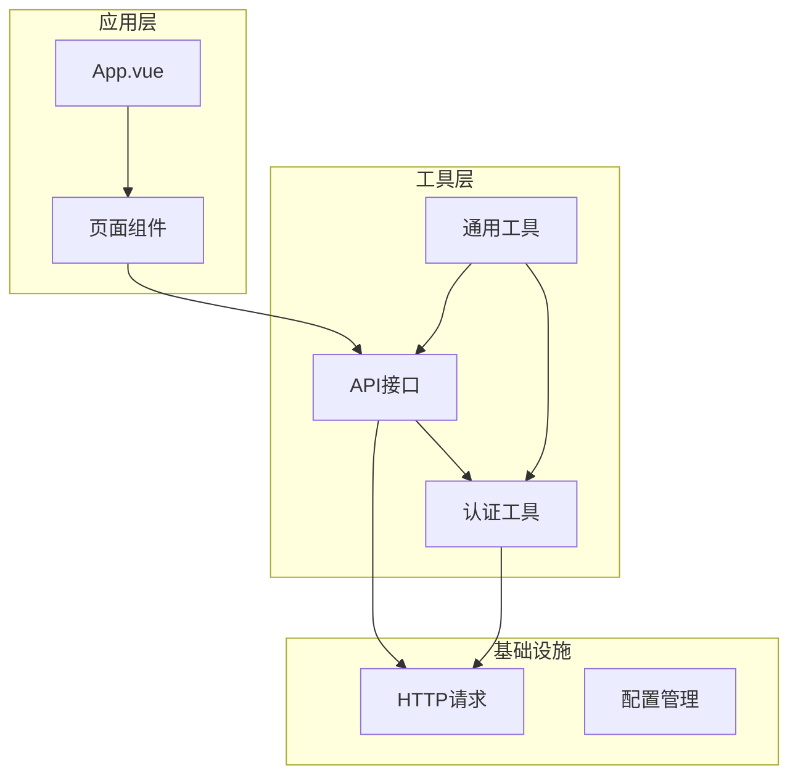
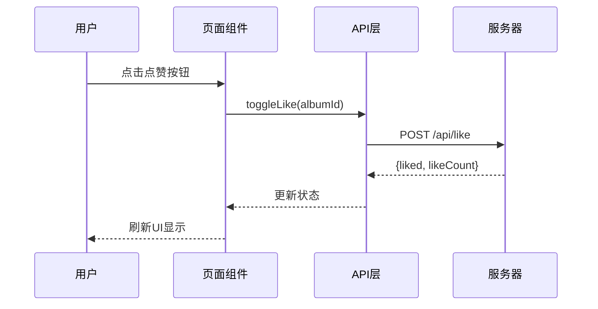
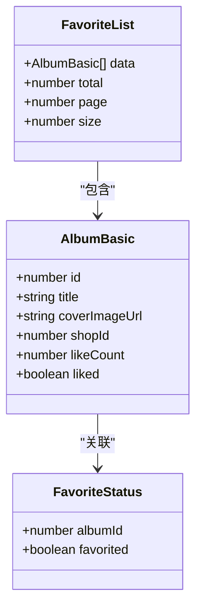
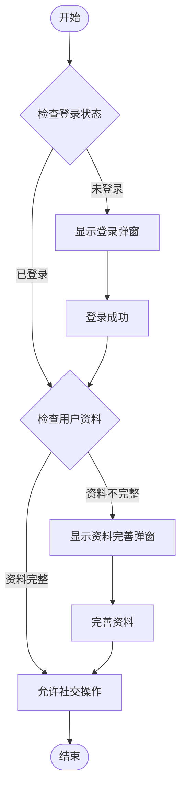
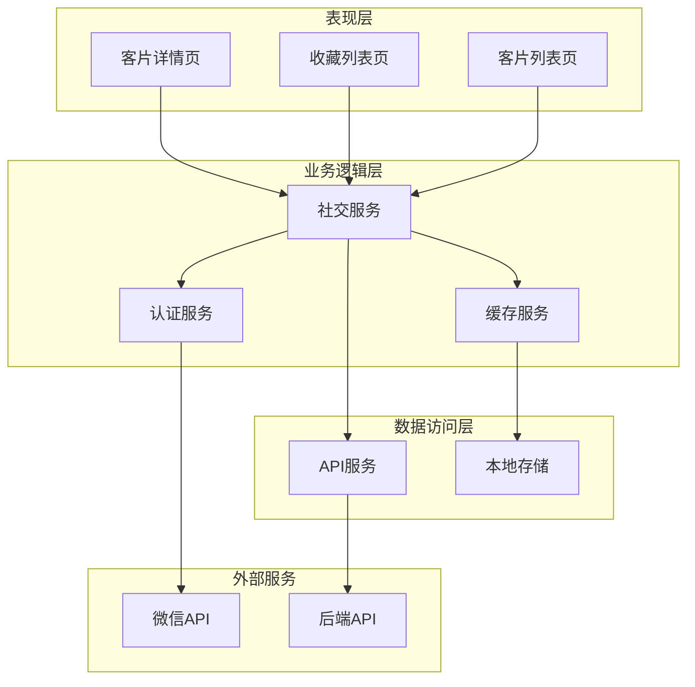
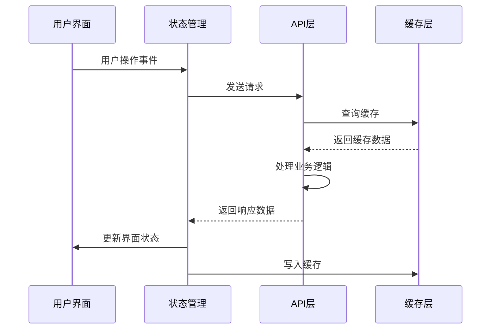
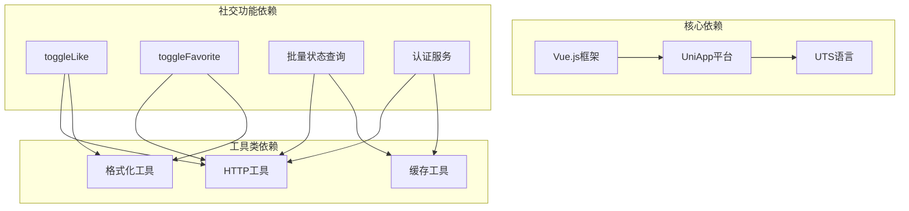
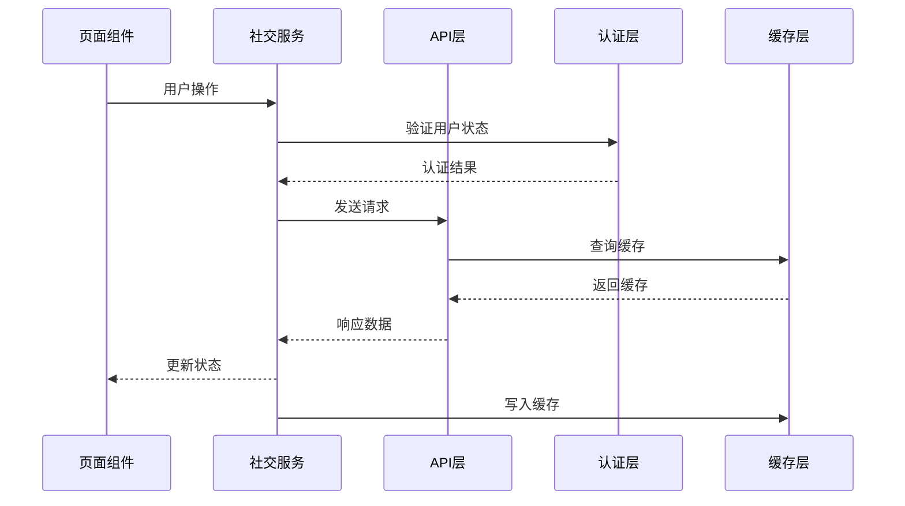

# 社交互动系统

<cite>
**本文档引用的文件**
- [src/main.uts](file://src/main.uts)
- [src/App.uvue](file://src/App.uvue)
- [src/utils/api.uts](file://src/utils/api.uts)
- [src/utils/auth.uts](file://src/utils/auth.uts)
- [src/utils/http.uts](file://src/utils/http.uts)
- [src/utils/format.uts](file://src/utils/format.uts)
- [src/utils/loginFlow.uts](file://src/utils/loginFlow.uts)
- [src/utils/profileSubmit.uts](file://src/utils/profileSubmit.uts)
- [src/pages/demoDetail/index.uvue](file://src/pages/demoDetail/index.uvue)
- [src/pages/favorites/index.uvue](file://src/pages/favorites/index.uvue)
- [src/pages/targetPhotoDetail/index.uvue](file://src/pages/targetPhotoDetail/index.uvue)
</cite>

## 目录
1. [简介](#简介)
2. [项目结构](#项目结构)
3. [核心组件](#核心组件)
4. [架构概览](#架构概览)
5. [详细组件分析](#详细组件分析)
6. [依赖关系分析](#依赖关系分析)
7. [性能考虑](#性能考虑)
8. [故障排除指南](#故障排除指南)
9. [结论](#结论)
10. [附录](#附录)

## 简介

蓝莓小程序的社交互动系统是一个完整的用户社交功能解决方案，主要包含点赞和收藏两大核心功能。该系统采用模块化设计，通过清晰的接口抽象和状态管理机制，为用户提供流畅的社交互动体验。

系统的核心特点包括：
- **双模式社交**：支持点赞（公开）和收藏（登录）两种不同的社交行为
- **批量状态查询**：通过批量API减少网络请求次数，提升性能
- **实时状态同步**：确保用户操作与服务器状态保持一致
- **完整的用户认证**：集成微信登录和手机号绑定机制
- **优雅的用户体验**：包含骨架屏、加载状态和错误处理

## 项目结构

蓝莓小程序采用Vue.js + UTS语言的混合开发架构，社交功能分布在多个层次中：

**图表来源**
- [src/main.uts:1-9](file://src/main.uts#L1-L9)
- [src/App.uvue:1-40](file://src/App.uvue#L1-L40)

**章节来源**
- [src/main.uts:1-9](file://src/main.uts#L1-L9)
- [src/App.uvue:1-40](file://src/App.uvue#L1-L40)

## 核心组件

### 点赞功能模块

点赞功能是社交互动系统的核心组件，提供用户对客片内容的即时反馈能力。

**功能特性**：
- 即时点赞/取消点赞切换
- 实时点赞数更新
- 批量状态查询优化
- 登录状态验证

**数据流**：

**图表来源**
- [src/utils/api.uts:192-205](file://src/utils/api.uts#L192-L205)
- [src/pages/demoDetail/index.uvue:519-542](file://src/pages/demoDetail/index.uvue#L519-L542)

### 收藏功能模块

收藏功能为登录用户提供内容管理能力，支持内容的长期保存和快速访问。

**功能特性**：
- 登录用户专属功能
- 收藏列表管理
- 批量收藏状态查询
- 门店筛选支持

**数据模型**：

**图表来源**
- [src/utils/api.uts:6-23](file://src/utils/api.uts#L6-L23)
- [src/utils/api.uts:248-259](file://src/utils/api.uts#L248-L259)

### 认证与状态管理

系统采用多层认证机制，确保用户身份的安全性和数据的准确性。

**认证流程**：

**图表来源**
- [src/utils/auth.uts:125-128](file://src/utils/auth.uts#L125-L128)
- [src/utils/loginFlow.uts:27-65](file://src/utils/loginFlow.uts#L27-L65)

**章节来源**
- [src/utils/api.uts:192-259](file://src/utils/api.uts#L192-L259)
- [src/utils/auth.uts:1-149](file://src/utils/auth.uts#L1-L149)
- [src/utils/loginFlow.uts:1-71](file://src/utils/loginFlow.uts#L1-L71)

## 架构概览

社交互动系统采用分层架构设计，确保各组件职责清晰、耦合度低。

**图表来源**
- [src/pages/demoDetail/index.uvue:1-800](file://src/pages/demoDetail/index.uvue#L1-L800)
- [src/pages/favorites/index.uvue:1-406](file://src/pages/favorites/index.uvue#L1-L406)
- [src/pages/targetPhotoDetail/index.uvue:1-419](file://src/pages/targetPhotoDetail/index.uvue#L1-L419)

### 数据流架构

系统采用事件驱动的数据流模式，确保状态变更的可预测性和一致性。

**图表来源**
- [src/utils/api.uts:207-218](file://src/utils/api.uts#L207-L218)
- [src/utils/auth.uts:1-149](file://src/utils/auth.uts#L1-L149)

## 详细组件分析

### 点赞功能实现

点赞功能通过简洁的API接口实现，支持单个和批量操作。

**核心实现要点**：
- 使用toggle模式实现点赞/取消点赞的双向切换
- 批量查询接口减少网络请求开销
- 实时状态同步确保UI与服务器状态一致

**代码实现路径**：
- [点赞切换接口:197-205](file://src/utils/api.uts#L197-L205)
- [批量状态查询:210-218](file://src/utils/api.uts#L210-L218)
- [页面交互逻辑:519-542](file://src/pages/demoDetail/index.uvue#L519-L542)

### 收藏功能实现

收藏功能提供完整的用户内容管理能力，支持列表管理和状态查询。

**核心实现要点**：
- 登录用户专属功能，确保数据安全性
- 支持按门店筛选的收藏列表
- 批量状态查询优化用户体验

**代码实现路径**：
- [收藏切换接口:225-233](file://src/utils/api.uts#L225-L233)
- [批量收藏状态查询:238-246](file://src/utils/api.uts#L238-L246)
- [收藏列表获取:251-259](file://src/utils/api.uts#L251-L259)
- [收藏页面逻辑:132-155](file://src/pages/favorites/index.uvue#L132-L155)

### 用户认证系统

系统采用多阶段认证机制，确保用户身份的安全性和完整性。

**认证流程**：
1. **微信登录**：获取用户授权
2. **手机号绑定**：完善用户信息
3. **资料完善**：设置头像和昵称

**代码实现路径**：
- [登录流程封装:27-65](file://src/utils/loginFlow.uts#L27-L65)
- [用户信息管理:15-149](file://src/utils/auth.uts#L15-L149)
- [资料提交逻辑:18-36](file://src/utils/profileSubmit.uts#L18-L36)

### 状态管理与缓存

系统采用多层次缓存策略，优化性能和用户体验。

**缓存策略**：
- **内存缓存**：页面内状态缓存
- **本地存储**：持久化用户信息
- **批量查询**：减少网络请求

**代码实现路径**：
- [HTTP请求封装:20-73](file://src/utils/http.uts#L20-L73)
- [批量状态查询:478-499](file://src/pages/demoDetail/index.uvue#L478-L499)

**章节来源**
- [src/utils/api.uts:192-259](file://src/utils/api.uts#L192-L259)
- [src/pages/demoDetail/index.uvue:478-542](file://src/pages/demoDetail/index.uvue#L478-L542)
- [src/pages/favorites/index.uvue:132-155](file://src/pages/favorites/index.uvue#L132-L155)
- [src/utils/auth.uts:1-149](file://src/utils/auth.uts#L1-L149)
- [src/utils/loginFlow.uts:1-71](file://src/utils/loginFlow.uts#L1-L71)
- [src/utils/profileSubmit.uts:1-37](file://src/utils/profileSubmit.uts#L1-L37)

## 依赖关系分析

社交互动系统的依赖关系清晰明确，各模块职责分离。

**图表来源**
- [src/utils/api.uts:1-312](file://src/utils/api.uts#L1-L312)
- [src/utils/http.uts:1-82](file://src/utils/http.uts#L1-L82)
- [src/utils/format.uts:1-16](file://src/utils/format.uts#L1-L16)

### 组件间交互

系统组件间的交互遵循单一职责原则，通过清晰的接口进行通信。

**图表来源**
- [src/pages/demoDetail/index.uvue:519-542](file://src/pages/demoDetail/index.uvue#L519-L542)
- [src/utils/api.uts:207-218](file://src/utils/api.uts#L207-L218)

**章节来源**
- [src/utils/api.uts:1-312](file://src/utils/api.uts#L1-L312)
- [src/utils/http.uts:1-82](file://src/utils/http.uts#L1-L82)
- [src/pages/demoDetail/index.uvue:1-800](file://src/pages/demoDetail/index.uvue#L1-L800)

## 性能考虑

### 批量操作优化

系统通过批量API显著减少了网络请求次数，提升了整体性能。

**优化策略**：
- **批量状态查询**：单次请求获取多个内容的状态
- **批量点赞操作**：减少频繁的网络往返
- **智能缓存**：避免重复请求相同数据

### 实时更新机制

系统采用多种机制确保状态的实时性和一致性。

**更新策略**：
- **页面可见性监听**：用户返回页面时自动刷新状态
- **增量更新**：只更新发生变化的数据
- **乐观更新**：立即更新UI，等待服务器确认

### 内存管理

系统通过合理的内存管理策略，避免内存泄漏和性能问题。

**管理策略**：
- **及时清理**：页面卸载时清理事件监听器
- **状态重置**：离开页面时重置加载状态
- **资源释放**：及时释放图片和网络资源

## 故障排除指南

### 常见问题及解决方案

**登录状态异常**：
- 检查token是否正确存储和传递
- 验证401错误处理机制
- 确认用户信息的完整性和有效性

**点赞功能失效**：
- 验证批量状态查询接口的正确性
- 检查网络请求的超时设置
- 确认UI状态更新的时机

**收藏列表为空**：
- 验证用户登录状态
- 检查收藏列表接口的参数传递
- 确认数据格式的兼容性

### 调试技巧

**开发调试**：
- 使用浏览器开发者工具监控网络请求
- 在控制台输出关键状态变化
- 利用断点调试异步操作

**生产环境监控**：
- 监控API响应时间和成功率
- 跟踪用户操作日志
- 收集错误报告和用户反馈

**章节来源**
- [src/utils/http.uts:50-61](file://src/utils/http.uts#L50-L61)
- [src/utils/auth.uts:125-128](file://src/utils/auth.uts#L125-L128)
- [src/pages/demoDetail/index.uvue:478-499](file://src/pages/demoDetail/index.uvue#L478-L499)

## 结论

蓝莓小程序的社交互动系统通过精心设计的架构和实现，为用户提供了流畅、可靠的社交体验。系统的主要优势包括：

1. **模块化设计**：清晰的职责分离和接口抽象
2. **性能优化**：批量操作和智能缓存策略
3. **用户体验**：完整的错误处理和状态管理
4. **扩展性**：易于添加新的社交功能和互动类型

该系统为后续的功能扩展奠定了良好的基础，可以轻松地添加新的互动类型、社交排行榜等功能。

## 附录

### 扩展指导

**新增互动类型**：
- 基于现有API接口模式创建新的交互功能
- 实现相应的状态管理和缓存策略
- 确保与现有认证系统的兼容性

**社交排行榜**：
- 设计数据收集和统计机制
- 实现排行榜数据的实时更新
- 考虑性能优化和数据一致性

**通知系统**：
- 集成微信模板消息推送
- 设计用户偏好设置
- 实现消息队列和去重机制

### 最佳实践

**代码规范**：
- 保持接口命名的一致性
- 确保错误处理的完整性
- 注释和文档的及时更新

**性能优化**：
- 持续监控和优化关键路径
- 定期审查和重构代码
- 建立性能测试和监控体系
