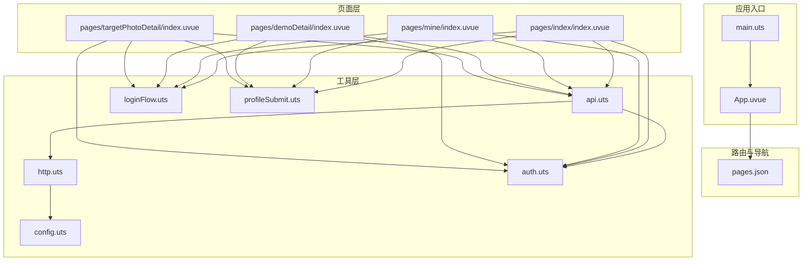
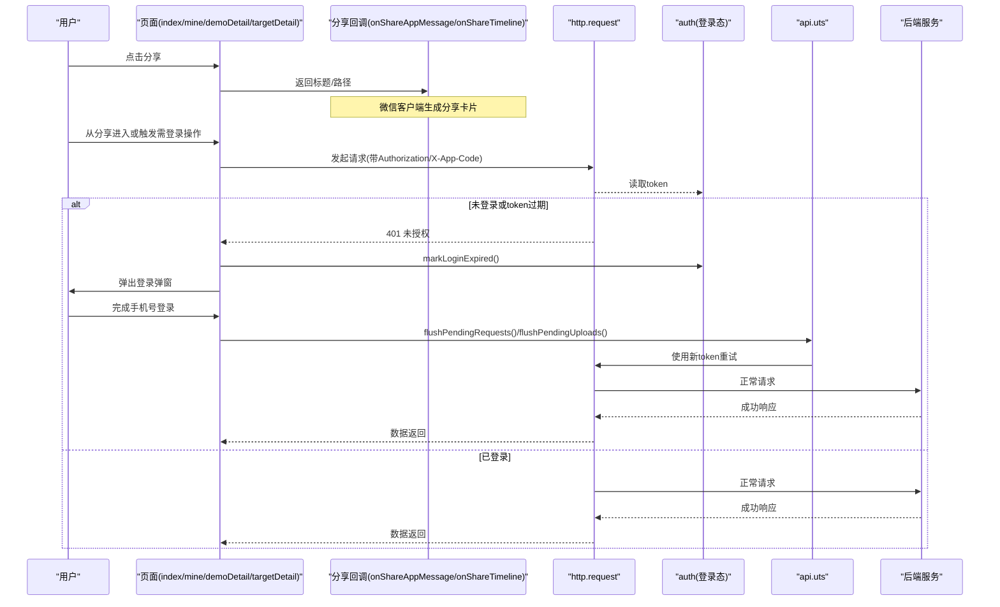
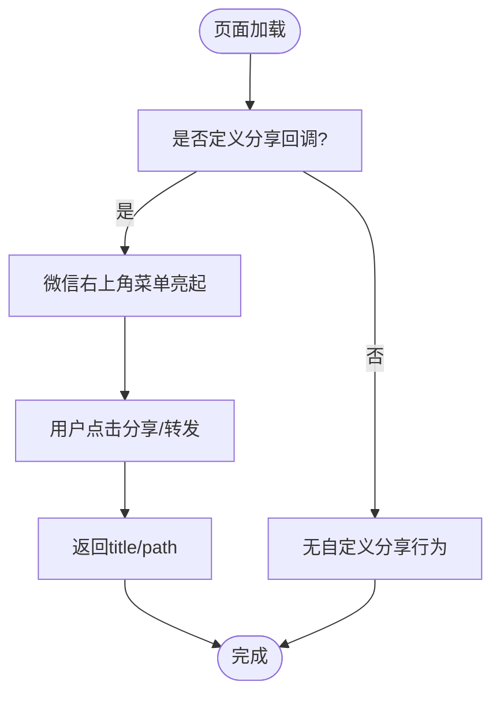
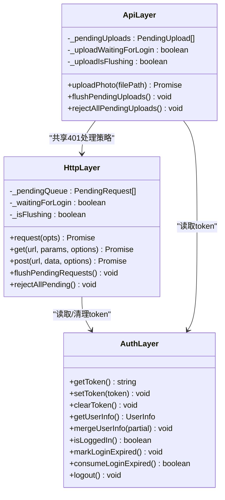
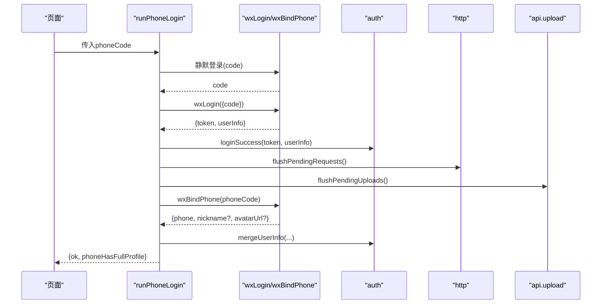
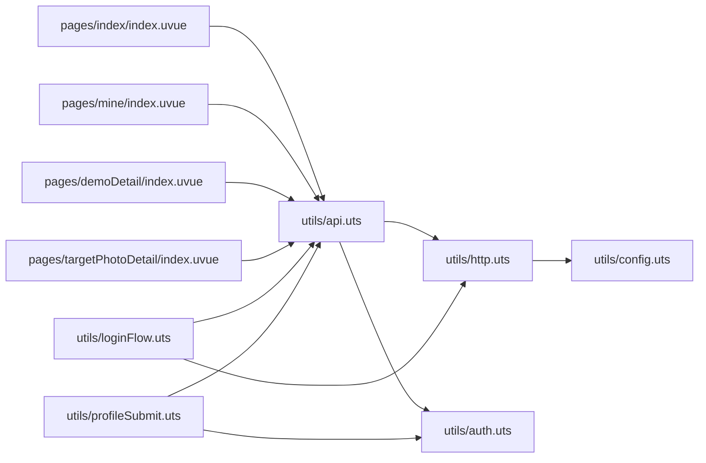

# 社交分享功能

<cite>
**本文引用的文件**   
- [README.md](file://README.md)
- [package.json](file://package.json)
- [src/main.uts](file://src/main.uts)
- [src/App.uvue](file://src/App.uvue)
- [src/pages.json](file://src/pages.json)
- [src/utils/config.uts](file://src/utils/config.uts)
- [src/utils/http.uts](file://src/utils/http.uts)
- [src/utils/auth.uts](file://src/utils/auth.uts)
- [src/utils/api.uts](file://src/utils/api.uts)
- [src/utils/loginFlow.uts](file://src/utils/loginFlow.uts)
- [src/utils/profileSubmit.uts](file://src/utils/profileSubmit.uts)
- [src/pages/index/index.uvue](file://src/pages/index/index.uvue)
- [src/pages/mine/index.uvue](file://src/pages/mine/index.uvue)
- [src/pages/demoDetail/index.uvue](file://src/pages/demoDetail/index.uvue)
- [src/pages/targetPhotoDetail/index.uvue](file://src/pages/targetPhotoDetail/index.uvue)
</cite>

## 目录
1. [简介](#简介)
2. [项目结构](#项目结构)
3. [核心组件](#核心组件)
4. [架构总览](#架构总览)
5. [详细组件分析](#详细组件分析)
6. [依赖关系分析](#依赖关系分析)
7. [性能考量](#性能考量)
8. [故障排查指南](#故障排查指南)
9. [结论](#结论)
10. [附录](#附录)

## 简介
本仓库为基于 uni-app x（Vue 3 + UTS/TypeScript）的微信小程序模板，内置多项目 Profile 机制与一键构建/校验/发布脚本。针对“社交分享”能力，项目在关键页面实现了微信「转发」与「分享到朋友圈」的标准生命周期回调，并通过统一的登录态、请求封装与错误处理，保障分享链路在授权过期时的稳定体验。

## 项目结构
- 源码集中于 src 目录，包含应用入口、页面、组件与工具模块。
- 工具层提供 HTTP 封装、认证管理、API 接口、协议跳转等通用能力。
- 页面层实现业务逻辑与用户交互，包括首页、个人中心、客片详情等。
- 配置文件与脚本负责多项目配置、构建与产物校验。

图表来源
- [src/main.uts:1-9](file://src/main.uts#L1-L9)
- [src/App.uvue:1-335](file://src/App.uvue#L1-L335)
- [src/pages.json:1-126](file://src/pages.json#L1-L126)
- [src/utils/config.uts:1-13](file://src/utils/config.uts#L1-L13)
- [src/utils/http.uts:1-172](file://src/utils/http.uts#L1-L172)
- [src/utils/auth.uts:1-171](file://src/utils/auth.uts#L1-L171)
- [src/utils/api.uts:1-700](file://src/utils/api.uts#L1-L700)
- [src/utils/loginFlow.uts:1-75](file://src/utils/loginFlow.uts#L1-L75)
- [src/utils/profileSubmit.uts:1-37](file://src/utils/profileSubmit.uts#L1-L37)
- [src/pages/index/index.uvue:1-390](file://src/pages/index/index.uvue#L1-L390)
- [src/pages/mine/index.uvue:1-630](file://src/pages/mine/index.uvue#L1-L630)
- [src/pages/demoDetail/index.uvue:1-800](file://src/pages/demoDetail/index.uvue#L1-L800)
- [src/pages/targetPhotoDetail/index.uvue:1-469](file://src/pages/targetPhotoDetail/index.uvue#L1-L469)

章节来源
- [README.md:85-130](file://README.md#L85-L130)
- [package.json:1-48](file://package.json#L1-L48)

## 核心组件
- 社交分享入口：在需要分享的页面实现 onShareAppMessage 与 onShareTimeline 生命周期，返回标题与路径，使右上角胶囊菜单自动亮起并支持转发与朋友圈分享。
- 统一网络层：http.uts 提供 request/get/post，统一注入 Authorization、X-App-Code，处理 401 挂起与重试。
- 认证管理：auth.uts 管理 token、用户信息、登录状态与过期标志。
- API 封装：api.uts 集中后端接口，含上传、点赞、收藏、搜索、AI 试衣与推荐等。
- 登录流程：loginFlow.uts 封装手机号登录三步骤，并在成功后触发挂起请求与上传的重试。
- 资料提交：profileSubmit.uts 封装头像昵称更新，合并写入本地用户信息。

章节来源
- [src/pages/index/index.uvue:158-170](file://src/pages/index/index.uvue#L158-L170)
- [src/utils/http.uts:93-163](file://src/utils/http.uts#L93-L163)
- [src/utils/auth.uts:147-171](file://src/utils/auth.uts#L147-L171)
- [src/utils/api.uts:1-700](file://src/utils/api.uts#L1-L700)
- [src/utils/loginFlow.uts:28-74](file://src/utils/loginFlow.uts#L28-L74)
- [src/utils/profileSubmit.uts:18-36](file://src/utils/profileSubmit.uts#L18-L36)

## 架构总览
社交分享功能由页面层触发，结合统一网络层与认证管理，形成“分享 → 鉴权 → 请求 → 重试”的闭环。当接口返回 401 时，请求被挂起，等待用户重新登录后自动重试；上传任务同样具备 401 挂起与重试队列。

图表来源
- [src/pages/index/index.uvue:158-170](file://src/pages/index/index.uvue#L158-L170)
- [src/utils/http.uts:42-78](file://src/utils/http.uts#L42-L78)
- [src/utils/http.uts:93-163](file://src/utils/http.uts#L93-L163)
- [src/utils/api.uts:19-47](file://src/utils/api.uts#L19-L47)
- [src/utils/loginFlow.uts:28-74](file://src/utils/loginFlow.uts#L28-L74)

## 详细组件分析

### 分享生命周期与页面行为
- 首页（index）：实现 onShareAppMessage 与 onShareTimeline，设置分享标题与路径，使右上角胶囊菜单自动亮起。
- 其他页面（mine、demoDetail、targetDetail）：虽未显式实现分享回调，但通过统一登录态与 401 处理保证分享后进入的业务流程顺畅。

图表来源
- [src/pages/index/index.uvue:158-170](file://src/pages/index/index.uvue#L158-L170)

章节来源
- [src/pages/index/index.uvue:158-170](file://src/pages/index/index.uvue#L158-L170)

### 统一网络层与 401 挂起重试
- http.uts：request/get/post 统一封装，动态附加 Authorization 与 X-App-Code；遇到 401 将请求入队挂起，首次触发登录弹窗，避免重复弹窗。
- api.uts：upload 相关接口独立维护挂起队列，登录成功后统一重试。
- loginFlow.uts：手机号登录成功后调用 flushPendingRequests 与 flushPendingUploads，恢复被阻塞的请求与上传。

图表来源
- [src/utils/http.uts:14-91](file://src/utils/http.uts#L14-L91)
- [src/utils/http.uts:93-163](file://src/utils/http.uts#L93-L163)
- [src/utils/api.uts:5-57](file://src/utils/api.uts#L5-L57)
- [src/utils/auth.uts:147-171](file://src/utils/auth.uts#L147-L171)

章节来源
- [src/utils/http.uts:93-163](file://src/utils/http.uts#L93-L163)
- [src/utils/api.uts:19-47](file://src/utils/api.uts#L19-L47)
- [src/utils/loginFlow.uts:28-74](file://src/utils/loginFlow.uts#L28-L74)

### 登录流程与资料补齐
- runPhoneLogin：三步走（静默登录获取 code → wx code 换 token → 绑定手机号），失败不阻断整体登录，返回 phoneHasFullProfile 指示是否需要补齐头像昵称。
- submitUserProfile：调用后端更新接口，合并写入本地用户信息，避免覆盖已有字段。

图表来源
- [src/utils/loginFlow.uts:28-74](file://src/utils/loginFlow.uts#L28-L74)
- [src/utils/api.uts:186-247](file://src/utils/api.uts#L186-L247)
- [src/utils/auth.uts:157-171](file://src/utils/auth.uts#L157-L171)
- [src/utils/http.uts:42-78](file://src/utils/http.uts#L42-L78)
- [src/utils/api.uts:19-47](file://src/utils/api.uts#L19-L47)

章节来源
- [src/utils/loginFlow.uts:28-74](file://src/utils/loginFlow.uts#L28-L74)
- [src/utils/profileSubmit.uts:18-36](file://src/utils/profileSubmit.uts#L18-L36)

### 页面级分享与登录态联动
- 首页：onShareAppMessage/onShareTimeline 定义分享元信息；onShow 监听 401 事件拉起登录弹窗。
- 个人中心：展示用户信息与金刚区，登录态变化驱动 UI 刷新；必要时拉取最新用户信息修复头像缺失。
- 客片详情：点赞等操作在未登录时保存待执行项，登录后自动执行。

章节来源
- [src/pages/index/index.uvue:158-170](file://src/pages/index/index.uvue#L158-L170)
- [src/pages/mine/index.uvue:192-216](file://src/pages/mine/index.uvue#L192-L216)
- [src/pages/demoDetail/index.uvue:558-581](file://src/pages/demoDetail/index.uvue#L558-L581)
- [src/pages/targetPhotoDetail/index.uvue:270-305](file://src/pages/targetPhotoDetail/index.uvue#L270-L305)

## 依赖关系分析
- 页面依赖 utils 层：api、http、auth、loginFlow、profileSubmit。
- http 依赖 config（baseURL/timeout）与 auth（token）。
- api 依赖 http 与 auth，并维护上传挂起队列。
- loginFlow 依赖 api 与 http，协调登录成功后的重试。
- 页面间通过 uni.$emit('login-required') 与 consumeLoginExpired 协同处理 401。

图表来源
- [src/pages/index/index.uvue:97-108](file://src/pages/index/index.uvue#L97-L108)
- [src/pages/mine/index.uvue:137-147](file://src/pages/mine/index.uvue#L137-L147)
- [src/pages/demoDetail/index.uvue:204-216](file://src/pages/demoDetail/index.uvue#L204-L216)
- [src/pages/targetPhotoDetail/index.uvue:270-305](file://src/pages/targetPhotoDetail/index.uvue#L270-L305)
- [src/utils/api.uts:1-47](file://src/utils/api.uts#L1-L47)
- [src/utils/http.uts:1-37](file://src/utils/http.uts#L1-L37)
- [src/utils/auth.uts:1-30](file://src/utils/auth.uts#L1-L30)
- [src/utils/config.uts:1-13](file://src/utils/config.uts#L1-L13)
- [src/utils/loginFlow.uts:1-11](file://src/utils/loginFlow.uts#L1-L11)
- [src/utils/profileSubmit.uts:1-7](file://src/utils/profileSubmit.uts#L1-L7)

章节来源
- [src/utils/api.uts:1-47](file://src/utils/api.uts#L1-L47)
- [src/utils/http.uts:1-37](file://src/utils/http.uts#L1-L37)
- [src/utils/auth.uts:1-30](file://src/utils/auth.uts#L1-L30)
- [src/utils/config.uts:1-13](file://src/utils/config.uts#L1-L13)
- [src/utils/loginFlow.uts:1-11](file://src/utils/loginFlow.uts#L1-L11)
- [src/utils/profileSubmit.uts:1-7](file://src/utils/profileSubmit.uts#L1-L7)

## 性能考量
- 图片预加载：详情页对首屏封面图进行预加载，提升视觉流畅度。
- 并发控制：401 挂起队列避免重复弹窗与死循环；flush 期间再次 401 直接 reject。
- 懒加载与分页：列表页采用分页与滚动加载更多，减少首屏压力。
- 骨架屏：全局骨架样式统一，提升感知性能。

章节来源
- [src/pages/demoDetail/index.uvue:370-382](file://src/pages/demoDetail/index.uvue#L370-L382)
- [src/utils/http.uts:42-78](file://src/utils/http.uts#L42-L78)
- [src/App.uvue:58-153](file://src/App.uvue#L58-L153)

## 故障排查指南
- 分享无效：确认页面是否实现 onShareAppMessage/onShareTimeline；检查返回的 title/path 是否正确。
- 401 频繁弹窗：检查 consumeLoginExpired 是否在 onShow 中消费；确认 flushPendingRequests/rejectAllPending 调用时机。
- 上传失败：查看 upload 挂起队列与 flushPendingUploads 是否被调用；确认 Authorization 头是否正确注入。
- 头像昵称未更新：确认 submitUserProfile 返回值与 mergeUserInfo 是否生效；检查后端返回字段是否完整。

章节来源
- [src/pages/index/index.uvue:158-170](file://src/pages/index/index.uvue#L158-L170)
- [src/utils/http.uts:93-163](file://src/utils/http.uts#L93-L163)
- [src/utils/api.uts:19-47](file://src/utils/api.uts#L19-L47)
- [src/utils/profileSubmit.uts:18-36](file://src/utils/profileSubmit.uts#L18-L36)

## 结论
本项目在页面层通过标准分享生命周期实现社交分享，配合统一网络层与认证管理，构建了健壮的“分享—鉴权—请求—重试”链路。401 挂起与重试机制确保用户体验一致，上传队列与登录流程协作完善。建议在新增页面时遵循现有模式，统一处理分享与登录态，保持代码一致性与可维护性。

## 附录
- 技术栈与环境要求参见 README。
- 构建与发布脚本、Profile 多项目配置详见 README 与 package.json scripts。

章节来源
- [README.md:44-54](file://README.md#L44-L54)
- [package.json:4-14](file://package.json#L4-L14)
