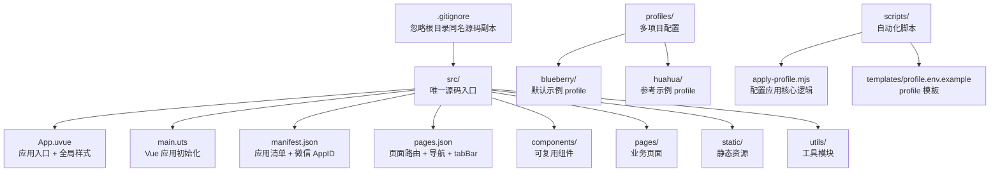
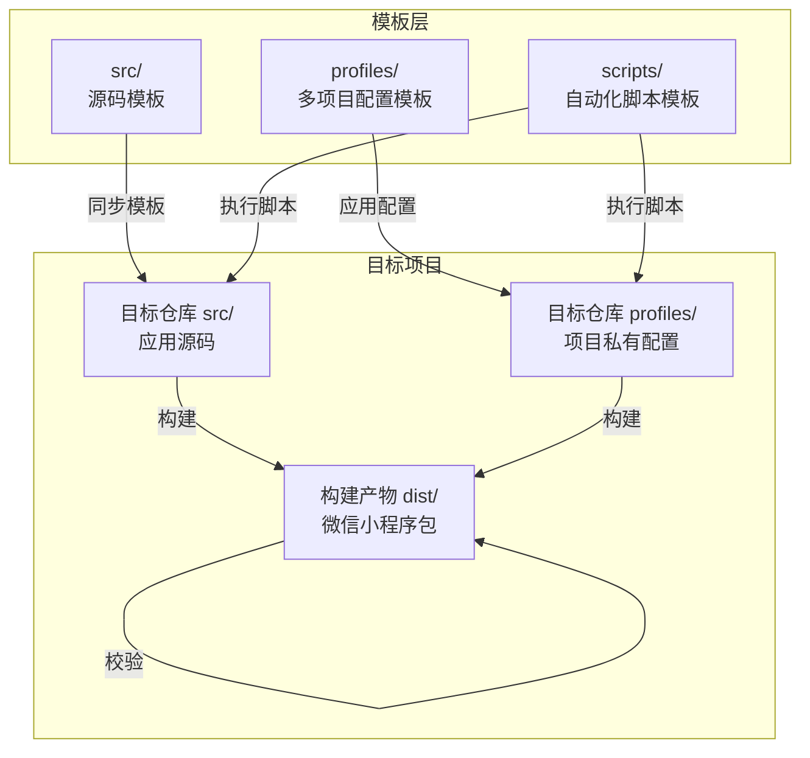
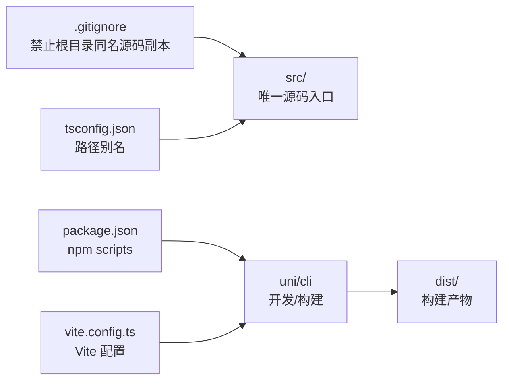

# 目录结构详解

<cite>
**本文引用的文件**
- [.gitignore](file://.gitignore)
- [README.md](file://README.md)
- [src/App.uvue](file://src/App.uvue)
- [src/main.uts](file://src/main.uts)
- [src/manifest.json](file://src/manifest.json)
- [src/pages.json](file://src/pages.json)
- [src/utils/config.uts](file://src/utils/config.uts)
- [src/utils/http.uts](file://src/utils/http.uts)
- [src/components/AppFooter/AppFooter.uvue](file://src/components/AppFooter/AppFooter.uvue)
- [src/pages/index/index.uvue](file://src/pages/index/index.uvue)
- [profiles/blueberry/project.env](file://profiles/blueberry/project.env)
- [profiles/huahua/project.env](file://profiles/huahua/project.env)
- [scripts/lib/apply-profile.mjs](file://scripts/lib/apply-profile.mjs)
- [scripts/templates/profile.env.example](file://scripts/templates/profile.env.example)
- [package.json](file://package.json)
- [vite.config.ts](file://vite.config.ts)
- [tsconfig.json](file://tsconfig.json)
</cite>

## 目录

1. [简介](#简介)
2. [项目结构](#项目结构)
3. [核心组件](#核心组件)
4. [架构总览](#架构总览)
5. [详细组件分析](#详细组件分析)
6. [依赖关系分析](#依赖关系分析)
7. [性能考量](#性能考量)
8. [故障排查指南](#故障排查指南)
9. [结论](#结论)
10. [附录](#附录)

## 简介

本项目是基于 uni-app x（Vue 3 + TypeScript/UTS）的微信小程序模板仓库，提供“一套模板、多端复用”的能力。其核心设计理念是以 src 为唯一源码入口，配合 profiles 多项目配置与脚本化的构建/发布流水线，实现模板与多项目的解耦与高效复用。

- 为什么根目录的 pages、static、utils 等被 .gitignore 忽略：为避免与 src/ 内容产生源码漂移，确保所有业务代码集中在 src/，便于统一管理与同步。
- src 目录下的核心文件职责：
  - App.uvue：应用入口与全局样式（骨架屏、登录弹窗等）
  - main.uts：Vue 应用初始化
  - manifest.json：uni-app 应用清单与微信 AppID
  - pages.json：页面路由、全局导航与 tabBar
- profiles 目录：多项目私有配置，通过 project.env 字段驱动模板渲染与产物注入
- scripts 目录：自动化脚本，覆盖创建 profile、应用配置、同步模板、构建、校验、发布等全流程

## 项目结构

整体采用“模板 + 多项目配置 + 自动化脚本”的分层组织方式：

- 根目录
  - src：唯一源码入口（根目录同名文件/目录被 .gitignore 忽略）
  - profiles：多项目配置集合
  - scripts：构建/发布/校验/同步等自动化脚本
  - 其他配置：package.json、vite.config.ts、tsconfig.json、project.config.json 等
- src 子目录
  - components：可复用组件（如 AppFooter）
  - pages：业务页面（含 demoDetail、favorites、index、mine、policies、priceHomePage、priceList、targetPhotoDetail、webview）
  - static：静态资源（图标、二维码、兜底图等）
  - utils：工具模块（api、auth、config、format、http、imageLoader、legal、loginFlow、profileSubmit）

图表来源
- [.gitignore:34-42](file://.gitignore#L34-L42)
- [README.md:85-130](file://README.md#L85-L130)
- [src/App.uvue:1-335](file://src/App.uvue#L1-L335)
- [src/main.uts:1-9](file://src/main.uts#L1-L9)
- [src/manifest.json:1-73](file://src/manifest.json#L1-L73)
- [src/pages.json:1-90](file://src/pages.json#L1-L90)
- [profiles/blueberry/project.env:1-23](file://profiles/blueberry/project.env#L1-L23)
- [profiles/huahua/project.env:1-24](file://profiles/huahua/project.env#L1-L24)
- [scripts/lib/apply-profile.mjs:1-190](file://scripts/lib/apply-profile.mjs#L1-L190)
- [scripts/templates/profile.env.example:1-25](file://scripts/templates/profile.env.example#L1-L25)

章节来源
- [.gitignore:34-42](file://.gitignore#L34-L42)
- [README.md:85-130](file://README.md#L85-L130)

## 核心组件

- App.uvue
  - 职责：应用生命周期钩子、全局样式（骨架屏动画、登录弹窗样式等）
  - 关键点：定义了统一的骨架屏动画与登录弹窗样式，便于多项目复用
- main.uts
  - 职责：创建 SSR 应用实例，作为 uni-app 的应用入口
- manifest.json
  - 职责：uni-app 应用清单，包含各平台配置与微信 AppID
- pages.json
  - 职责：页面路由、全局导航样式、tabBar 配置，以及合规页面（用户协议、隐私政策）路由
- utils
  - config.uts：集中管理 baseURL 与超时时间（由 profile 注入）
  - http.uts：统一请求封装、自动附加 Authorization/X-App-Code、401 自动登出
  - legal.uts：导出 MINI_APP_NAME、用户协议/隐私政策名称及跳转函数
  - 其他：api、auth、format、imageLoader、loginFlow、profileSubmit 等

章节来源
- [src/App.uvue:1-335](file://src/App.uvue#L1-L335)
- [src/main.uts:1-9](file://src/main.uts#L1-L9)
- [src/manifest.json:1-73](file://src/manifest.json#L1-L73)
- [src/pages.json:1-90](file://src/pages.json#L1-L90)
- [src/utils/config.uts:1-12](file://src/utils/config.uts#L1-L12)
- [src/utils/http.uts:1-82](file://src/utils/http.uts#L1-L82)

## 架构总览

整体架构围绕“模板 + 多项目配置 + 自动化脚本”展开，通过 profiles 与 scripts 实现模板与项目的解耦与高效复用。

图表来源
- [README.md:242-286](file://README.md#L242-L286)
- [scripts/lib/apply-profile.mjs:1-190](file://scripts/lib/apply-profile.mjs#L1-L190)

## 详细组件分析

### App.uvue（应用入口与全局样式）

- 结构要点
  - 生命周期钩子：onLaunch/onShow/onHide/onExit
  - 平台特定处理：Android 返回键双击退出
  - 全局样式：隐藏滚动条、骨架屏动画、登录弹窗样式
- 设计意义
  - 将骨架屏与登录弹窗样式集中管理，避免在各页面重复定义
  - 通过统一入口控制应用行为，提升一致性与可维护性

章节来源
- [src/App.uvue:1-335](file://src/App.uvue#L1-L335)

### main.uts（Vue 应用初始化）

- 结构要点
  - 导入 App.uvue
  - 使用 createSSRApp 创建应用实例
- 设计意义
  - 作为 uni-app 的应用初始化入口，保持与框架约定的一致性

章节来源
- [src/main.uts:1-9](file://src/main.uts#L1-L9)

### manifest.json（应用清单与微信 AppID）

- 结构要点
  - 应用基础信息：name、description、版本等
  - 平台配置：mp-weixin、mp-alipay、mp-baidu、mp-toutiao 等
  - uni-app 特定配置：uni-app-x、vueVersion、app 分发配置等
- 设计意义
  - 通过 profile 注入微信 AppID，确保开发者工具与构建产物一致

章节来源
- [src/manifest.json:1-73](file://src/manifest.json#L1-L73)

### pages.json（页面路由、全局导航与 tabBar）

- 结构要点
  - pages：页面路径与自定义导航样式
  - globalStyle：导航栏文字颜色、背景色、标题文本
  - tabBar：TabBar 颜色、图标、文字
  - 合规页面：自动注入用户协议与隐私政策路由
- 设计意义
  - 统一导航风格与 TabBar 布局，保障用户体验一致性

章节来源
- [src/pages.json:1-90](file://src/pages.json#L1-L90)

### utils（工具模块）

- config.uts
  - 职责：集中管理 baseURL 与超时时间
  - 关键点：由 profile 注入 API_BASE_URL
- http.uts
  - 职责：统一请求封装、自动附加 Authorization/X-App-Code、401 自动登出
  - 关键点：动态拼接 baseURL、支持 GET/POST 等方法
- legal.uts
  - 职责：导出 MINI_APP_NAME、用户协议/隐私政策名称及跳转函数
- 其他模块：api、auth、format、imageLoader、loginFlow、profileSubmit 等

章节来源
- [src/utils/config.uts:1-12](file://src/utils/config.uts#L1-L12)
- [src/utils/http.uts:1-82](file://src/utils/http.uts#L1-L82)

### components（可复用组件）

- AppFooter
  - 职责：全局页脚 Copyright 文本提供者
  - 设计目标：将多页面硬编码的版权字符串收敛到组件的 default props，由 profile 注入脚本统一替换
- 其他组件：EmptyState、LoadMoreIndicator、LoginDialog、PhotoGrid、SearchNavBar 等

章节来源
- [src/components/AppFooter/AppFooter.uvue:1-25](file://src/components/AppFooter/AppFooter.uvue#L1-L25)

### pages（业务页面）

- 页面清单（部分）
  - index、demoDetail、favorites、mine、policies/user、policies/privacy、priceHomePage、priceList、targetPhotoDetail、webview
- 设计意义
  - 通过 pages.json 统一管理路由与导航，合规页面自动注入

章节来源
- [src/pages.json:1-90](file://src/pages.json#L1-L90)

### static（静态资源）

- 作用：存放图标、二维码、兜底图等静态资源
- 设计意义：与 profile 的 static 目录配合，实现素材的项目级定制

章节来源
- [README.md:109-110](file://README.md#L109-L110)

### profiles（多项目配置管理）

- 结构
  - profiles/<project-key>/project.env：必填项目私有变量
  - profiles/<project-key>/static/：可选静态资源（会被复制到 src/static/）
- 字段说明（节选）
  - 必填：PROJECT_KEY、PACKAGE_NAME、MANIFEST_NAME、DESCRIPTION、MP_WEIXIN_APPID、NAVIGATION_TITLE、BRAND_NAME、COPYRIGHT_TEXT、CONTACT_PHONE_TEXT、CONTACT_QR_SRC、PRICE_FALLBACK_TITLE、API_BASE_URL、APP_CODE、MINI_APP_NAME
  - 可选：RESIDUAL_SEARCH_REGEX（构建后残留字符串扫描）
- 应用映射
  - PACKAGE_NAME → package.json.name
  - MP_WEIXIN_APPID → project.config.json 与 src/manifest.json
  - MANIFEST_NAME/DESCRIPTION → src/manifest.json
  - NAVIGATION_TITLE → src/pages.json.globalStyle.navigationBarTitleText
  - API_BASE_URL → src/utils/config.uts
  - APP_CODE → src/utils/http.uts 中 X-App-Code（为空则移除）
  - MINI_APP_NAME → src/utils/legal.uts
  - CONTACT_QR_SRC/CONTACT_PHONE_TEXT/COPYRIGHT_TEXT → pages/index、pages/priceHomePage 等页面
  - PRICE_FALLBACK_TITLE → src/pages/priceList/index.uvue
  - profiles/<key>/static/* → 复制到目标仓库 src/static/

章节来源
- [README.md:169-240](file://README.md#L169-L240)
- [profiles/blueberry/project.env:1-23](file://profiles/blueberry/project.env#L1-L23)
- [profiles/huahua/project.env:1-24](file://profiles/huahua/project.env#L1-L24)

### scripts（自动化脚本）

- 脚本概览
  - create-profile.sh：基于模板生成新 profile
  - apply-profile.sh：把 profile 应用到目标仓库
  - sync-template.sh：把模板源码同步到目标仓库（覆盖 pages/ 等公共代码）
  - build-miniapp.sh：一键同步 + 应用 + 编译 + 校验
  - verify-miniapp.sh：校验构建产物
  - release-miniapp.sh：发布前构建（build 的包装）
  - new-miniapp-project.sh：孵化全新小程序项目目录
  - build-all-profiles.sh：批量构建所有 profile
- 核心逻辑（apply-profile.mjs）
  - 校验必填字段
  - 更新 package.json、project.config.json、src/manifest.json、src/pages.json
  - 注入 API_BASE_URL、X-App-Code、MINI_APP_NAME
  - 替换 AppFooter、联系页面、价目表兜底标题等
- 模板文件
  - templates/profile.env.example：profile 模板

章节来源
- [README.md:242-286](file://README.md#L242-L286)
- [scripts/lib/apply-profile.mjs:1-190](file://scripts/lib/apply-profile.mjs#L1-L190)
- [scripts/templates/profile.env.example:1-25](file://scripts/templates/profile.env.example#L1-L25)

## 依赖关系分析

- 源码组织
  - .gitignore 明确禁止在根目录维护 pages、static、utils、App.uvue、main.uts、manifest.json、pages.json、uni.scss 等，确保所有源码集中在 src/
- 构建与运行
  - package.json 提供开发与构建脚本，调用 uni/cli
  - vite.config.ts 配置 uni 插件
  - tsconfig.json 设置路径别名 @/* → src/*

图表来源
- [.gitignore:34-42](file://.gitignore#L34-L42)
- [package.json:1-48](file://package.json#L1-L48)
- [vite.config.ts:1-9](file://vite.config.ts#L1-L9)
- [tsconfig.json:1-33](file://tsconfig.json#L1-L33)

章节来源
- [.gitignore:34-42](file://.gitignore#L34-L42)
- [package.json:1-48](file://package.json#L1-L48)
- [vite.config.ts:1-9](file://vite.config.ts#L1-L9)
- [tsconfig.json:1-33](file://tsconfig.json#L1-L33)

## 性能考量

- 统一骨架屏：减少首屏白屏时间，提升感知性能
- 并行加载：首页数据通过 Promise.all 并行请求，缩短等待时间
- 请求封装：统一超时与头部处理，减少重复代码与潜在错误
- 路由与导航：集中管理 pages.json，避免重复配置带来的维护成本

## 故障排查指南

- AppID 不一致导致校验失败
  - 现象：verify-miniapp.sh 校验失败
  - 原因：开发者工具 AppID 与 profile 不一致
  - 解决：通过 apply-profile 脚本同时写入 project.config.json 与 src/manifest.json 的 AppID，并由 verify-miniapp.sh 校验一致性
- 协议页面缺失导致校验失败
  - 现象：verify-miniapp.sh 校验失败
  - 解决：执行 build-miniapp.sh 时加上 --sync-template，将模板的 pages/policies/* 同步到目标仓库
- 只保留 Profile 不维护完整目标仓库
  - 说明：只要目标仓库具备基本的 src/ 与 package.json，模板通过 sync-template + apply-profile 即可覆盖为最新版本

章节来源
- [README.md:390-398](file://README.md#L390-L398)

## 结论

本项目通过“src 唯一源码入口 + profiles 多项目配置 + scripts 自动化脚本”的组合，实现了模板与多项目的解耦与高效复用。开发者只需维护 profiles 下的项目私有配置，即可一键完成模板同步、配置应用、构建与校验，显著降低重复劳动并提升交付质量。

## 附录

- 常用命令
  - 开发：npm run dev:mp-weixin
  - 构建：npm run build:mp-weixin
  - 新建项目：npm run profile:new
  - 应用配置：npm run profile:apply
  - 完整构建：npm run profile:build
  - 发布前构建：npm run profile:release
  - 校验产物：npm run profile:verify
  - 批量构建：npm run profiles:build-all
- 产物导入路径
  - 开发：dist/dev/mp-weixin
  - 生产：dist/build/mp-weixin

章节来源
- [README.md:244-270](file://README.md#L244-L270)