# 项目概述

<cite>
**本文档引用的文件**
- [README.md](file://README.md)
- [package.json](file://package.json)
- [src/main.uts](file://src/main.uts)
- [src/App.uvue](file://src/App.uvue)
- [src/manifest.json](file://src/manifest.json)
- [src/pages.json](file://src/pages.json)
- [src/utils/api.uts](file://src/utils/api.uts)
- [src/utils/auth.uts](file://src/utils/auth.uts)
- [src/pages/index/index.uvue](file://src/pages/index/index.uvue)
- [src/pages/priceHomePage/index.uvue](file://src/pages/priceHomePage/index.uvue)
- [src/pages/mine/index.uvue](file://src/pages/mine/index.uvue)
- [profiles/blueberry/project.env](file://profiles/blueberry/project.env)
- [scripts/build-miniapp.sh](file://scripts/build-miniapp.sh)
- [scripts/lib/apply-profile.mjs](file://scripts/lib/apply-profile.mjs)
</cite>

## 目录
1. [引言](#引言)
2. [项目结构](#项目结构)
3. [核心组件](#核心组件)
4. [架构概览](#架构概览)
5. [详细组件分析](#详细组件分析)
6. [依赖关系分析](#依赖关系分析)
7. [性能考虑](#性能考虑)
8. [故障排除指南](#故障排除指南)
9. [结论](#结论)

## 引言

blueBerry 是一个基于 uni-app x（Vue 3 + TypeScript/UTS）的微信小程序模板仓库，专为旗袍、汉服、民族服装体验馆设计。该项目的核心价值在于提供了一套完整的数字化展示解决方案，通过多项目 Profile 机制实现了"一套模板，多个小程序"的高效复用模式。

### 核心价值主张

**统一的数字化展示平台**：为旗袍、汉服、民族服装体验馆提供专业的线上展示空间，包括作品展示、价格体系、预约咨询等功能模块。

**高效的多项目孵化能力**：通过 Profile 机制，可以在24小时内快速孵化多个相似的小程序项目，支持品牌矩阵的快速扩张。

**合规化的用户体验**：内置微信登录授权、用户协议、隐私政策等合规功能，确保符合微信小程序审核要求。

### 技术特色

**uni-app x 跨平台架构**：基于 Vue 3 + TypeScript/UTS 技术栈，支持一套代码多端复用。

**智能 Profile 管理**：通过环境变量驱动的配置系统，实现项目配置与代码分离。

**自动化构建流水线**：提供完整的开发、构建、校验、发布的自动化脚本。

**专业化的业务场景适配**：针对旗袍、汉服体验馆的特殊需求进行了深度优化。

## 项目结构

blueBerry 采用模块化的项目结构，将业务逻辑、配置管理和工具脚本清晰分离：

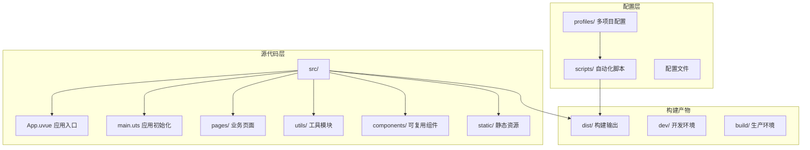

**图表来源**
- [README.md:85-130](file://README.md#L85-L130)
- [package.json:1-48](file://package.json#L1-L48)

### 目录结构详解

**src/ 目录**：唯一源码入口，包含所有业务逻辑代码
- `App.uvue`：应用入口文件，负责全局初始化和样式配置
- `main.uts`：Vue 应用初始化，创建 SSR 应用实例
- `pages/`：业务页面集合，包含首页、价目表、个人中心等核心页面
- `utils/`：工具模块，提供 API 封装、认证管理、HTTP 请求等功能
- `components/`：可复用组件，如底部导航、骨架屏等

**profiles/ 目录**：多项目配置管理
- 每个项目对应一个 Profile 目录，包含项目特定的配置文件
- 支持品牌定制、接口配置、样式调整等个性化需求

**scripts/ 目录**：自动化工具脚本
- 提供完整的开发、构建、发布流水线
- 支持一键孵化新项目、批量构建等高级功能

**Section sources**
- [README.md:85-130](file://README.md#L85-L130)
- [package.json:1-48](file://package.json#L1-L48)

## 核心组件

### 应用入口组件

应用入口组件负责整体应用的初始化和全局配置：

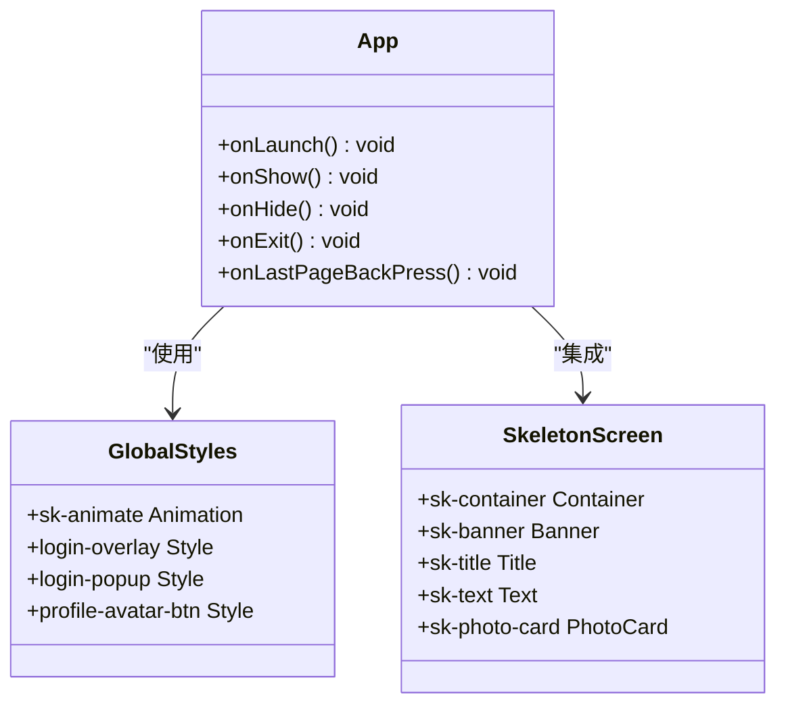

**图表来源**
- [src/App.uvue:6-39](file://src/App.uvue#L6-L39)
- [src/App.uvue:58-154](file://src/App.uvue#L58-L154)
- [src/App.uvue:155-334](file://src/App.uvue#L155-L334)

### 页面路由系统

系统采用统一的路由配置，支持 TabBar 导航和自定义页面：

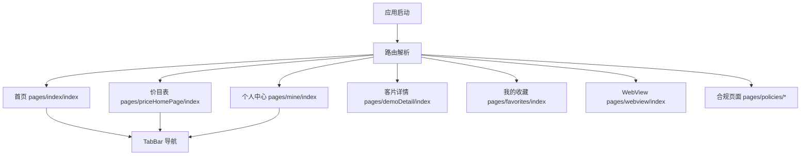

**图表来源**
- [src/pages.json:2-55](file://src/pages.json#L2-L55)
- [src/pages.json:62-87](file://src/pages.json#L62-L87)

### 工具模块体系

系统提供完善的工具模块，支撑完整的业务功能：

**API 接口封装**：提供完整的后端接口调用能力，包括图片轮播、客片展示、用户认证、收藏管理等功能。

**认证管理系统**：实现微信登录授权、Token 管理、用户信息存储等核心认证功能。

**HTTP 请求模块**：统一处理请求头、错误处理、自动登录等功能。

**Section sources**
- [src/utils/api.uts:1-312](file://src/utils/api.uts#L1-L312)
- [src/utils/auth.uts:1-149](file://src/utils/auth.uts#L1-L149)
- [src/utils/http.uts:1-200](file://src/utils/http.uts#L1-L200)

## 架构概览

blueBerry 采用分层架构设计，将业务逻辑、数据访问、用户界面清晰分离：

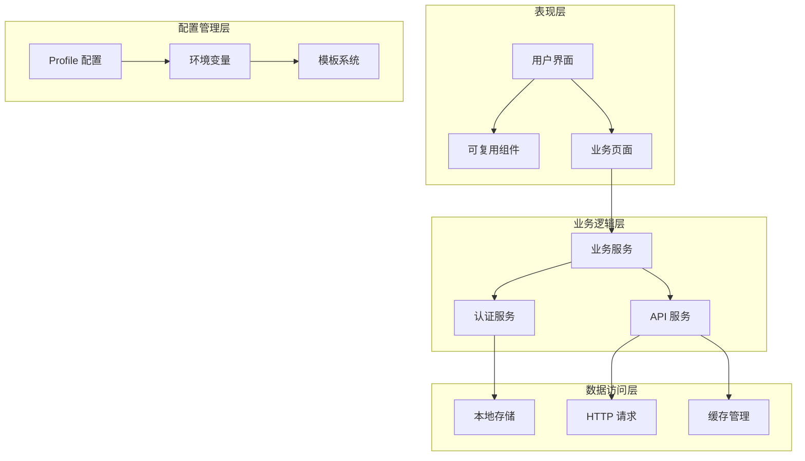

**图表来源**
- [src/main.uts:1-9](file://src/main.uts#L1-L9)
- [src/App.uvue:1-40](file://src/App.uvue#L1-L40)
- [scripts/lib/apply-profile.mjs:1-190](file://scripts/lib/apply-profile.mjs#L1-L190)

### Profile 多项目配置机制

这是 blueBerry 的核心技术特色，通过环境变量驱动的配置系统实现项目间的差异化配置：

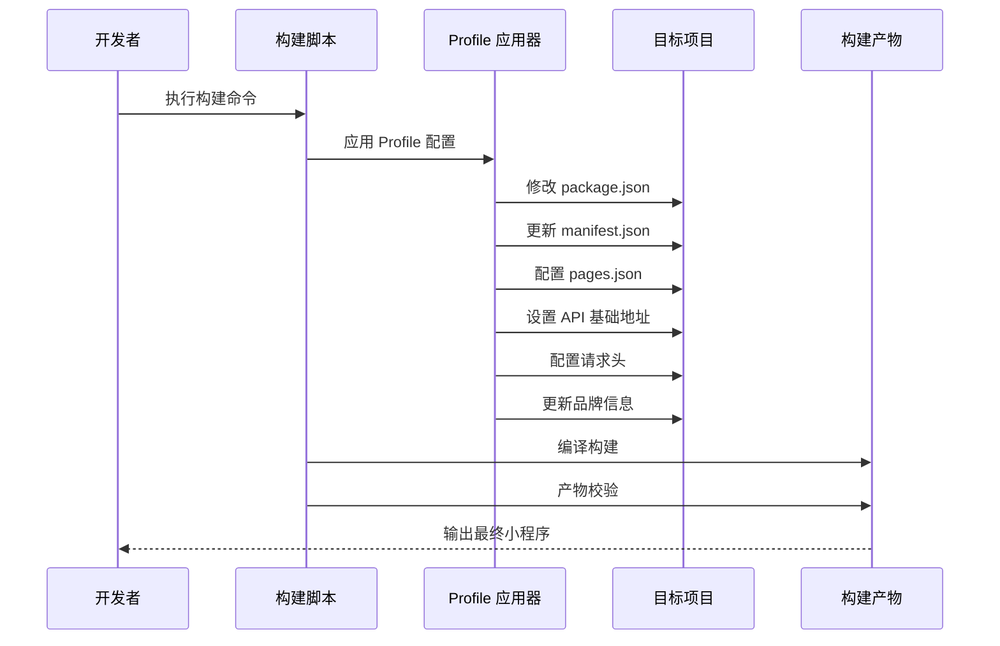

**图表来源**
- [scripts/build-miniapp.sh:1-106](file://scripts/build-miniapp.sh#L1-L106)
- [scripts/lib/apply-profile.mjs:73-190](file://scripts/lib/apply-profile.mjs#L73-L190)

**Section sources**
- [README.md:169-240](file://README.md#L169-L240)
- [profiles/blueberry/project.env:1-23](file://profiles/blueberry/project.env#L1-L23)

## 详细组件分析

### 首页展示系统

首页是体验馆小程序的核心展示窗口，集成了多种营销元素：

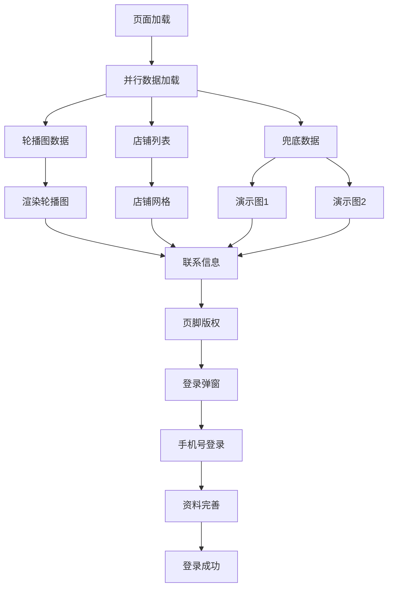

**图表来源**
- [src/pages/index/index.uvue:139-157](file://src/pages/index/index.uvue#L139-L157)
- [src/pages/index/index.uvue:182-234](file://src/pages/index/index.uvue#L182-L234)

首页设计充分考虑了旗袍、汉服体验馆的特点：

- **轮播图展示**：突出展示精美作品和品牌文化
- **店铺网格**：直观展示不同风格的作品分类
- **服务说明**：详细介绍旗袍、汉服拍摄的专业服务
- **联系方式**：提供便捷的预约咨询渠道
- **登录引导**：通过骨架屏和登录弹窗提升用户体验

### 价目表系统

价目表系统为用户提供清晰的价格信息和服务内容：

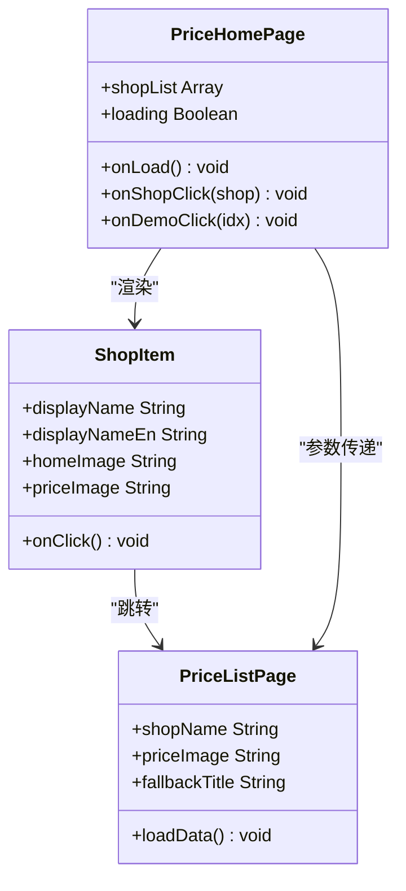

**图表来源**
- [src/pages/priceHomePage/index.uvue:46-79](file://src/pages/priceHomePage/index.uvue#L46-L79)
- [src/pages/priceList/index.uvue:1-200](file://src/pages/priceList/index.uvue#L1-L200)

### 个人中心系统

个人中心提供用户管理、收藏功能和账户安全：

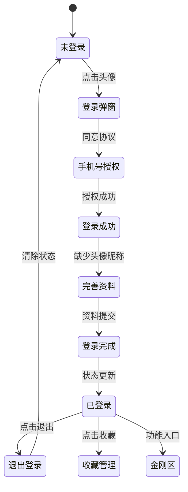

**图表来源**
- [src/pages/mine/index.uvue:148-485](file://src/pages/mine/index.uvue#L148-L485)

**Section sources**
- [src/pages/index/index.uvue:1-432](file://src/pages/index/index.uvue#L1-L432)
- [src/pages/priceHomePage/index.uvue:1-168](file://src/pages/priceHomePage/index.uvue#L1-L168)
- [src/pages/mine/index.uvue:1-604](file://src/pages/mine/index.uvue#L1-L604)

### 认证与授权系统

系统实现了完整的微信登录授权流程：

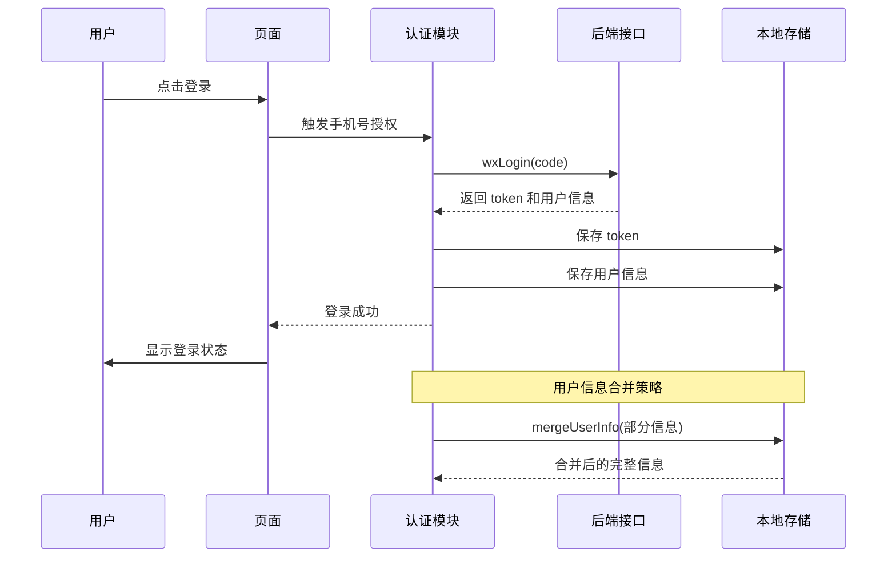

**图表来源**
- [src/utils/auth.uts:15-149](file://src/utils/auth.uts#L15-L149)
- [src/utils/api.uts:124-191](file://src/utils/api.uts#L124-L191)

**Section sources**
- [src/utils/auth.uts:1-149](file://src/utils/auth.uts#L1-L149)
- [src/utils/api.uts:1-312](file://src/utils/api.uts#L1-L312)

## 依赖关系分析

### 技术栈依赖

blueBerry 采用了现代化的技术栈组合，确保项目的稳定性和可维护性：

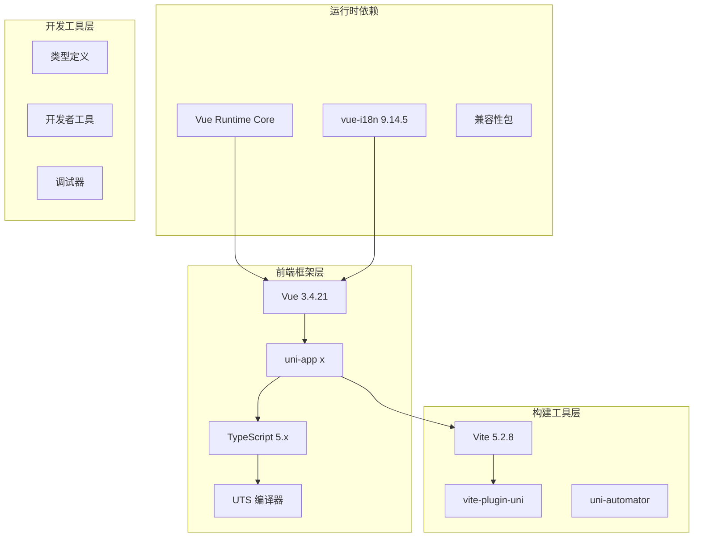

**图表来源**
- [package.json:15-46](file://package.json#L15-L46)

### 模块间依赖关系

系统模块之间遵循清晰的依赖层次：

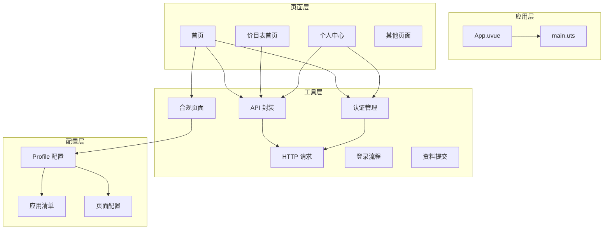

**图表来源**
- [src/App.uvue:1-40](file://src/App.uvue#L1-L40)
- [src/main.uts:1-9](file://src/main.uts#L1-L9)
- [src/utils/api.uts:1-312](file://src/utils/api.uts#L1-L312)

**Section sources**
- [package.json:15-46](file://package.json#L15-L46)

## 性能考虑

### 骨架屏优化

系统实现了完整的骨架屏加载体验，提升用户感知性能：

- **统一的骨架屏样式**：通过 CSS 动画实现呼吸效果
- **按需显示**：根据数据加载状态动态切换骨架屏和真实内容
- **响应式布局**：适配不同屏幕尺寸的骨架屏布局

### 并行数据加载

首页采用并行数据加载策略，减少首屏等待时间：

- **Promise.all 并行请求**：同时获取轮播图和店铺列表数据
- **错误隔离**：单个接口失败不影响其他数据加载
- **降级处理**：数据加载失败时使用兜底方案

### 缓存策略

系统实现了多层次的缓存机制：

- **本地存储缓存**：Token 和用户信息持久化存储
- **页面状态缓存**：避免重复的数据请求
- **静态资源缓存**：图片和静态文件的浏览器缓存

## 故障排除指南

### 常见问题诊断

**Profile 应用失败**
- 检查 Profile 文件中的必需字段是否完整
- 确认 TARGET_REPO 环境变量设置正确
- 验证目标项目的 package.json 结构

**构建产物校验失败**
- 检查 AppID 是否与 Profile 配置一致
- 确认 API 基础地址配置正确
- 验证 X-App-Code 请求头是否正确设置

**登录授权异常**
- 检查微信开发者工具的 AppID 配置
- 确认后端接口的域名白名单设置
- 验证手机号授权的权限配置

### 调试建议

**开发环境调试**
- 使用微信开发者工具的真机调试功能
- 启用控制台日志输出
- 利用断点调试验证数据流向

**生产环境监控**
- 监控 API 请求成功率
- 跟踪用户行为数据
- 收集错误报告和崩溃日志

**Section sources**
- [README.md:388-402](file://README.md#L388-L402)

## 结论

blueBerry 小程序模板为旗袍、汉服、民族服装体验馆提供了完整的数字化解决方案。通过 uni-app x 跨平台技术和多项目 Profile 机制，实现了高效的产品复用和快速的项目孵化。

### 核心优势总结

**技术层面**
- 基于 Vue 3 + TypeScript/UTS 的现代技术栈
- 完整的自动化构建和发布流水线
- 专业的业务场景适配和用户体验优化

**业务层面**
- 针对旗袍、汉服体验馆的深度定制
- 完善的营销展示功能和用户转化路径
- 合规化的用户体验和数据安全保障

**运营层面**
- 支持多品牌、多项目的快速扩展
- 降低开发成本和维护复杂度
- 提供标准化的上线和运维流程

### 应用场景建议

**旗袍体验馆**
- 展示传统旗袍制作工艺和精美作品
- 提供预约试穿和拍摄服务
- 建立品牌文化和历史传承的传播平台

**汉服文化推广**
- 展示汉服的历史演变和文化内涵
- 提供汉服租赁和摄影服务
- 建立汉服爱好者社区和文化交流平台

**民族服装定制**
- 展示各民族传统服装的特色和工艺
- 提供个性化定制和量身服务
- 推广民族文化多样性和传统手工艺

blueBerry 不仅是一个技术模板，更是连接传统工艺与现代科技的桥梁，为传统文化的数字化传承提供了强有力的技术支撑。